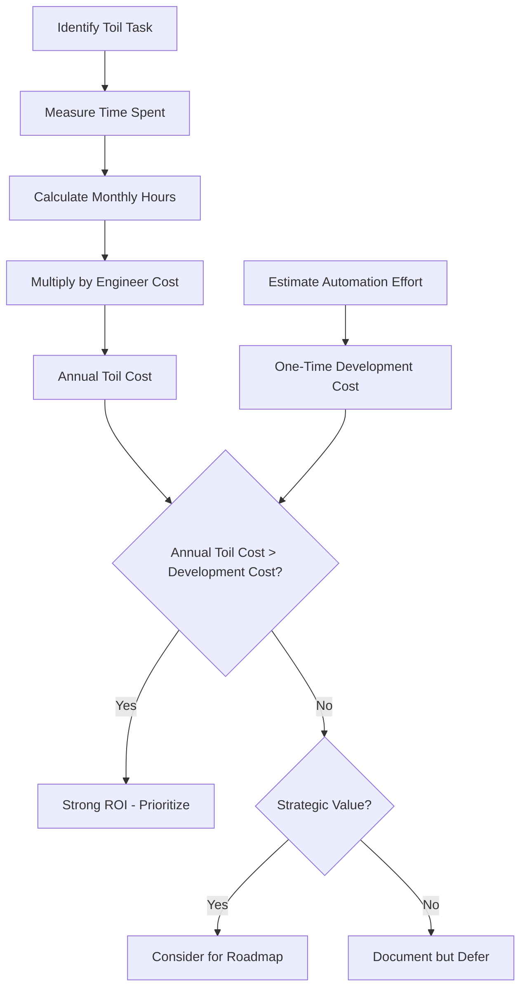
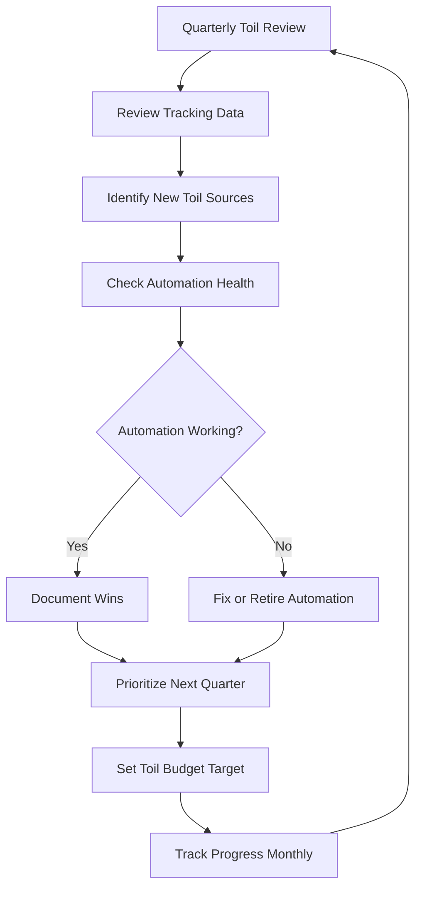

# How to Fix Toil Reduction Issues

Author: [nawazdhandala](https://www.github.com/nawazdhandala)

Tags: Site Reliability Engineering, SRE, Toil, Automation, Operational Excellence, Productivity, Engineering Efficiency

Description: Practical strategies for identifying, measuring, and eliminating toil that drains engineering productivity and prevents teams from focusing on meaningful work.

---

## What Makes Toil Reduction Fail

Every SRE team talks about reducing toil. Few actually succeed. The usual pattern goes like this: someone creates a spreadsheet of manual tasks, the team picks one to automate, and then nothing happens because other priorities take over.

Toil reduction fails for predictable reasons. Understanding these failure modes is the first step to fixing them.

## Problem 1: Toil Is Not Tracked

You cannot reduce what you do not measure. Most teams have a vague sense that certain tasks are tedious, but they lack concrete data on how much time these tasks actually consume.

The fix is systematic tracking. Create a simple logging system that engineers use to record toil as they encounter it:

```python
# toil_tracker.py
# Simple toil tracking system

from datetime import datetime, timedelta
from dataclasses import dataclass
from typing import Optional
import json

@dataclass
class ToilEntry:
    task_name: str
    duration_minutes: int
    engineer: str
    timestamp: datetime
    category: str  # 'manual_deploy', 'permission_request', 'data_fix', etc.
    automatable: bool
    description: Optional[str] = None

    def to_dict(self):
        return {
            'task_name': self.task_name,
            'duration_minutes': self.duration_minutes,
            'engineer': self.engineer,
            'timestamp': self.timestamp.isoformat(),
            'category': self.category,
            'automatable': self.automatable,
            'description': self.description
        }

class ToilTracker:
    def __init__(self, storage_path='toil_log.json'):
        self.storage_path = storage_path
        self.entries = []
        self._load()

    def _load(self):
        try:
            with open(self.storage_path, 'r') as f:
                data = json.load(f)
                self.entries = data.get('entries', [])
        except FileNotFoundError:
            self.entries = []

    def _save(self):
        with open(self.storage_path, 'w') as f:
            json.dump({'entries': self.entries}, f, indent=2)

    def log_toil(self, entry: ToilEntry):
        """Record a toil entry."""
        self.entries.append(entry.to_dict())
        self._save()

    def get_summary(self, days=30):
        """Generate summary of toil over the past N days."""
        cutoff = datetime.now() - timedelta(days=days)

        recent = [
            e for e in self.entries
            if datetime.fromisoformat(e['timestamp']) > cutoff
        ]

        # Aggregate by category
        by_category = {}
        for entry in recent:
            cat = entry['category']
            if cat not in by_category:
                by_category[cat] = {
                    'total_minutes': 0,
                    'count': 0,
                    'automatable_minutes': 0
                }
            by_category[cat]['total_minutes'] += entry['duration_minutes']
            by_category[cat]['count'] += 1
            if entry['automatable']:
                by_category[cat]['automatable_minutes'] += entry['duration_minutes']

        return {
            'period_days': days,
            'total_entries': len(recent),
            'total_minutes': sum(e['duration_minutes'] for e in recent),
            'by_category': by_category
        }

    def get_automation_candidates(self, min_monthly_hours=4):
        """Identify high-impact automation candidates."""
        summary = self.get_summary(days=30)

        candidates = []
        for category, stats in summary['by_category'].items():
            monthly_hours = stats['automatable_minutes'] / 60
            if monthly_hours >= min_monthly_hours:
                candidates.append({
                    'category': category,
                    'monthly_hours': monthly_hours,
                    'occurrences': stats['count'],
                    'avg_duration_minutes': stats['total_minutes'] / stats['count']
                })

        # Sort by monthly hours descending
        candidates.sort(key=lambda x: x['monthly_hours'], reverse=True)
        return candidates


# CLI interface for quick logging
if __name__ == '__main__':
    import argparse

    parser = argparse.ArgumentParser(description='Log toil')
    parser.add_argument('task', help='Task name')
    parser.add_argument('minutes', type=int, help='Duration in minutes')
    parser.add_argument('--category', default='other', help='Task category')
    parser.add_argument('--automatable', action='store_true', help='Can be automated')

    args = parser.parse_args()

    tracker = ToilTracker()
    entry = ToilEntry(
        task_name=args.task,
        duration_minutes=args.minutes,
        engineer='cli_user',
        timestamp=datetime.now(),
        category=args.category,
        automatable=args.automatable
    )
    tracker.log_toil(entry)
    print(f"Logged: {args.task} ({args.minutes} minutes)")
```

## Problem 2: Automation Efforts Are Not Prioritized

When toil reduction competes with feature work, features usually win because they have clearer business justification.

The fix is to quantify the cost of toil in terms stakeholders understand:



Here is a template for building the business case:

```python
# toil_roi_calculator.py
# Calculate ROI for toil automation projects

def calculate_toil_roi(
    monthly_hours_spent: float,
    engineer_hourly_cost: float,
    automation_development_hours: float,
    maintenance_hours_per_month: float = 2,
    time_horizon_months: int = 12
):
    """
    Calculate ROI for automating a toil task.

    Returns:
        dict with ROI metrics
    """
    # Current cost of toil
    monthly_toil_cost = monthly_hours_spent * engineer_hourly_cost
    annual_toil_cost = monthly_toil_cost * 12

    # Cost to automate
    development_cost = automation_development_hours * engineer_hourly_cost
    annual_maintenance_cost = maintenance_hours_per_month * 12 * engineer_hourly_cost

    # Savings over time horizon
    total_toil_cost = monthly_toil_cost * time_horizon_months
    total_automation_cost = development_cost + (maintenance_hours_per_month * time_horizon_months * engineer_hourly_cost)

    net_savings = total_toil_cost - total_automation_cost
    roi_percentage = (net_savings / development_cost) * 100 if development_cost > 0 else float('inf')

    # Payback period
    monthly_savings = monthly_toil_cost - (maintenance_hours_per_month * engineer_hourly_cost)
    payback_months = development_cost / monthly_savings if monthly_savings > 0 else float('inf')

    return {
        'annual_toil_cost': annual_toil_cost,
        'development_cost': development_cost,
        'annual_maintenance_cost': annual_maintenance_cost,
        f'net_savings_{time_horizon_months}_months': net_savings,
        'roi_percentage': roi_percentage,
        'payback_months': payback_months,
        'recommendation': 'automate' if payback_months < 6 else 'evaluate' if payback_months < 12 else 'defer'
    }


# Example usage
if __name__ == '__main__':
    result = calculate_toil_roi(
        monthly_hours_spent=20,          # Team spends 20 hours/month on this task
        engineer_hourly_cost=100,        # Fully loaded cost
        automation_development_hours=80, # Estimated effort to automate
        maintenance_hours_per_month=2,   # Ongoing maintenance
        time_horizon_months=12
    )

    print("Toil Automation ROI Analysis")
    print("=" * 40)
    print(f"Annual toil cost:        ${result['annual_toil_cost']:,.0f}")
    print(f"Development cost:        ${result['development_cost']:,.0f}")
    print(f"Annual maintenance:      ${result['annual_maintenance_cost']:,.0f}")
    print(f"Net savings (12 mo):     ${result['net_savings_12_months']:,.0f}")
    print(f"ROI:                     {result['roi_percentage']:.0f}%")
    print(f"Payback period:          {result['payback_months']:.1f} months")
    print(f"Recommendation:          {result['recommendation'].upper()}")
```

## Problem 3: Automation Creates New Toil

A common trap is building automation that requires constant babysitting. You replace 10 hours of manual work with 8 hours of debugging your automation scripts.

The fix is to treat automation as a product with proper engineering practices:

```yaml
# automation-standards.yaml
# Standards for building maintainable automation

standards:
  code_quality:
    - "All automation code must be version controlled"
    - "Require code review before deployment"
    - "Include unit tests with >80% coverage"
    - "Document expected inputs, outputs, and failure modes"

  observability:
    - "Log all executions with structured logging"
    - "Export metrics: execution count, duration, success rate"
    - "Alert on failure rate exceeding 5%"
    - "Dashboard showing automation health"

  reliability:
    - "Implement idempotency where possible"
    - "Include retry logic with exponential backoff"
    - "Define rollback procedures"
    - "Test failure scenarios explicitly"

  maintenance:
    - "Assign an owner to each automation"
    - "Review and update quarterly"
    - "Track time spent maintaining automation"
    - "Sunset automation that costs more than it saves"
```

## Problem 4: Engineers Do Not Report Toil

If logging toil feels like more work, engineers will not do it. The tracking system itself becomes toil.

Make tracking frictionless by integrating it into existing workflows:

```python
# slack_toil_bot.py
# Slack bot for low-friction toil logging

from slack_bolt import App
from slack_bolt.adapter.socket_mode import SocketModeHandler
import os

app = App(token=os.environ["SLACK_BOT_TOKEN"])

# Quick toil logging via slash command
@app.command("/toil")
def log_toil_command(ack, say, command):
    """
    Usage: /toil 30 manual_deploy Fixed production config
    """
    ack()

    parts = command['text'].split(' ', 2)
    if len(parts) < 2:
        say("Usage: /toil <minutes> <category> [description]")
        return

    minutes = int(parts[0])
    category = parts[1]
    description = parts[2] if len(parts) > 2 else None

    # Log to tracking system
    # ... (integrate with ToilTracker from earlier)

    say(f"Logged {minutes} minutes of {category} toil. Thanks for tracking!")


# Weekly toil summary posted to channel
@app.event("app_mention")
def handle_mention(event, say):
    if "toil summary" in event['text'].lower():
        # Generate and post summary
        summary = generate_weekly_summary()
        say(blocks=format_summary_blocks(summary))


def generate_weekly_summary():
    """Generate weekly toil summary."""
    tracker = ToilTracker()
    summary = tracker.get_summary(days=7)
    candidates = tracker.get_automation_candidates(min_monthly_hours=2)

    return {
        'total_hours': summary['total_minutes'] / 60,
        'top_categories': sorted(
            summary['by_category'].items(),
            key=lambda x: x[1]['total_minutes'],
            reverse=True
        )[:5],
        'automation_candidates': candidates[:3]
    }


def format_summary_blocks(summary):
    """Format summary as Slack blocks."""
    blocks = [
        {
            "type": "header",
            "text": {"type": "plain_text", "text": "Weekly Toil Summary"}
        },
        {
            "type": "section",
            "text": {
                "type": "mrkdwn",
                "text": f"*Total toil this week:* {summary['total_hours']:.1f} hours"
            }
        },
        {"type": "divider"},
        {
            "type": "section",
            "text": {"type": "mrkdwn", "text": "*Top categories:*"}
        }
    ]

    for category, stats in summary['top_categories']:
        hours = stats['total_minutes'] / 60
        blocks.append({
            "type": "section",
            "text": {
                "type": "mrkdwn",
                "text": f"- {category}: {hours:.1f} hours ({stats['count']} occurrences)"
            }
        })

    if summary['automation_candidates']:
        blocks.append({"type": "divider"})
        blocks.append({
            "type": "section",
            "text": {"type": "mrkdwn", "text": "*Top automation candidates:*"}
        })
        for candidate in summary['automation_candidates']:
            blocks.append({
                "type": "section",
                "text": {
                    "type": "mrkdwn",
                    "text": f"- {candidate['category']}: {candidate['monthly_hours']:.1f} hours/month potential savings"
                }
            })

    return blocks
```

## Problem 5: Toil Creeps Back

You automate a task, celebrate the win, and six months later the automation has broken and people are back to doing it manually.

The fix is to treat toil reduction as an ongoing practice, not a one-time project:



Set explicit targets for toil as a percentage of engineering time. Google's SRE book suggests keeping toil under 50% of an SRE's time. For product engineering teams, aim for under 20%.

## The Toil Elimination Checklist

When you identify a toil task, work through this checklist:

1. **Can we eliminate the need entirely?** Sometimes the best automation is removing the requirement that creates the toil.

2. **Can we delegate to self-service?** If users create toil by requesting things, give them tools to do it themselves.

3. **Can we batch the work?** Doing something once a week instead of five times daily reduces toil even without automation.

4. **Can we automate fully?** If the task is deterministic and low-risk, automate it completely.

5. **Can we automate partially?** Even automating the data-gathering portion of a task saves time.

6. **Can we make it faster?** Better tooling, templates, or documentation can reduce time spent without full automation.

## Getting Started

Start by tracking toil for two weeks without trying to fix anything. This baseline data tells you where to focus. Then pick one high-impact, low-complexity automation project and execute it properly with tests, monitoring, and documentation.

Celebrate the win publicly. Share the time saved with the broader team. This builds momentum for continued investment in toil reduction.

Toil never stops appearing, so toil reduction must become part of how your team operates, not a special initiative you run once a year.
