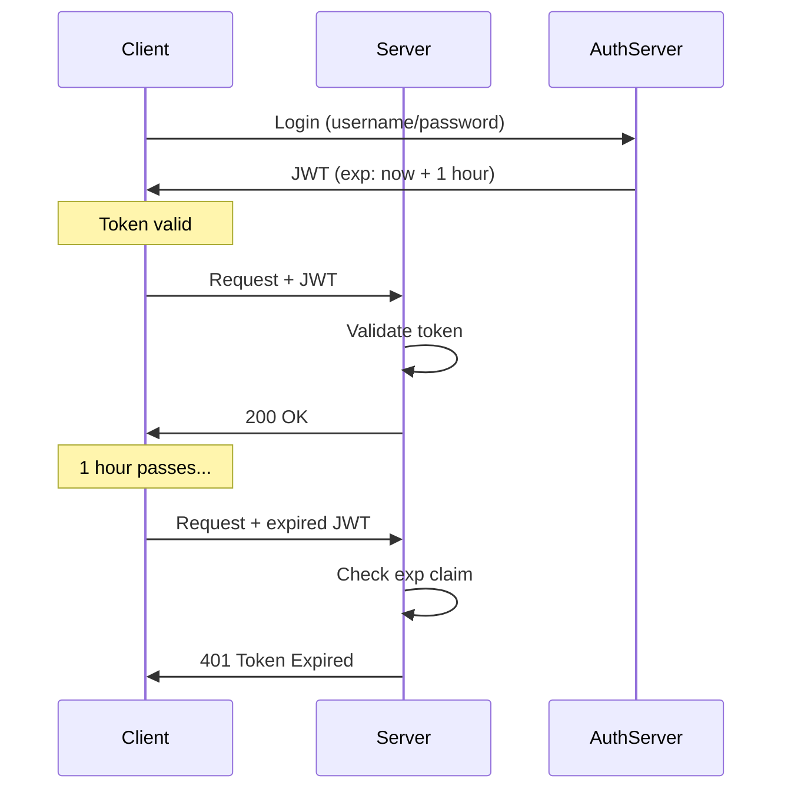
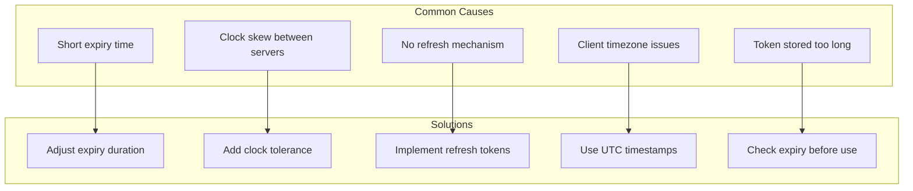
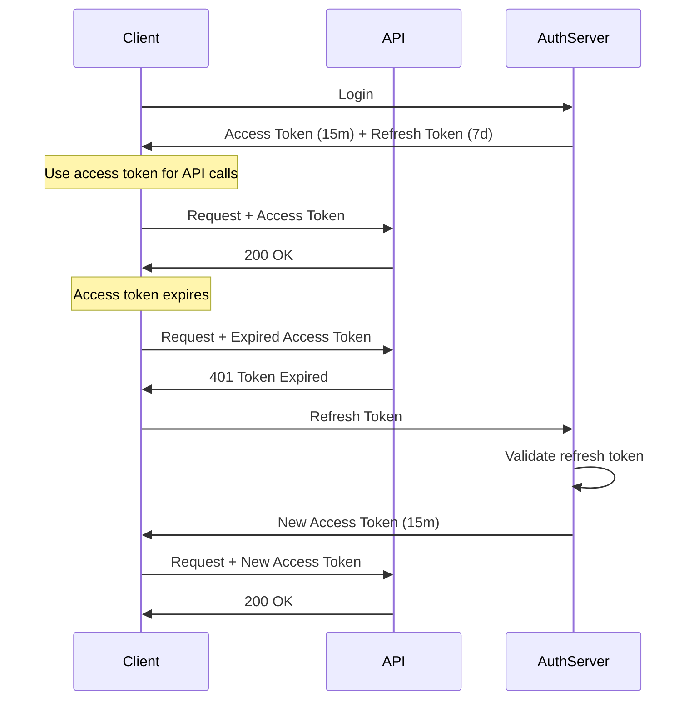

# How to Fix 'Token Expired' JWT Errors

Author: [nawazdhandala](https://www.github.com/nawazdhandala)

Tags: JWT, Authentication, Security, Token Management, Debugging

Description: A practical guide to diagnosing and fixing JWT token expiration errors with strategies for token refresh, proper expiry settings, and client-side handling.

---

The "Token Expired" error is one of the most common JWT issues developers encounter. This error occurs when a JWT's `exp` (expiration) claim indicates the token is no longer valid. This guide covers how to diagnose the issue, implement proper token refresh mechanisms, and prevent expiration-related disruptions in your applications.

## Understanding JWT Expiration

JWTs contain an `exp` claim that specifies when the token becomes invalid. The value is a Unix timestamp (seconds since January 1, 1970).



### Decoding an Expired Token

First, decode your JWT to see the expiration time.

```javascript
// Decode JWT payload (without verification)
function decodeJWT(token) {
    const parts = token.split('.');
    if (parts.length !== 3) {
        throw new Error('Invalid JWT format');
    }

    // Decode the payload (middle part)
    const payload = JSON.parse(
        Buffer.from(parts[1], 'base64url').toString('utf8')
    );

    return payload;
}

// Check if token is expired
function isTokenExpired(token) {
    const payload = decodeJWT(token);
    const now = Math.floor(Date.now() / 1000);

    console.log('Token expiration:', new Date(payload.exp * 1000));
    console.log('Current time:', new Date(now * 1000));
    console.log('Expired:', payload.exp < now);

    return payload.exp < now;
}

// Example usage
const token = 'eyJhbGciOiJIUzI1NiIsInR5cCI6IkpXVCJ9...';
if (isTokenExpired(token)) {
    console.log('Token has expired, need to refresh');
}
```

```python
# Python version
import jwt
import time
from datetime import datetime

def decode_jwt(token):
    """Decode JWT without verification to inspect claims."""
    # Use options to skip verification for debugging
    payload = jwt.decode(token, options={"verify_signature": False})
    return payload

def is_token_expired(token):
    """Check if token is expired."""
    payload = decode_jwt(token)
    exp = payload.get('exp', 0)
    now = int(time.time())

    print(f"Token expiration: {datetime.fromtimestamp(exp)}")
    print(f"Current time: {datetime.fromtimestamp(now)}")
    print(f"Expired: {exp < now}")

    return exp < now

# Example
token = "eyJhbGciOiJIUzI1NiIsInR5cCI6IkpXVCJ9..."
if is_token_expired(token):
    print("Token has expired, need to refresh")
```

## Common Causes of Token Expiration Errors



### Issue 1: Expiry Time Too Short

```javascript
// Problem: Token expires in 5 minutes
const shortLivedToken = jwt.sign(
    { userId: '123' },
    process.env.JWT_SECRET,
    { expiresIn: '5m' }  // Too short for most use cases
);

// Solution: Use appropriate expiry times
const accessToken = jwt.sign(
    { userId: '123' },
    process.env.JWT_SECRET,
    { expiresIn: '15m' }  // Access token: 15 minutes
);

const refreshToken = jwt.sign(
    { userId: '123', type: 'refresh' },
    process.env.REFRESH_SECRET,
    { expiresIn: '7d' }  // Refresh token: 7 days
);
```

### Issue 2: Clock Skew Between Systems

When your servers have different times, tokens may appear expired on one server but valid on another.

```javascript
// Add clock tolerance when verifying tokens
const jwt = require('jsonwebtoken');

function verifyToken(token) {
    try {
        const decoded = jwt.verify(token, process.env.JWT_SECRET, {
            // Allow 60 seconds of clock skew
            clockTolerance: 60
        });
        return { valid: true, payload: decoded };
    } catch (error) {
        return { valid: false, error: error.message };
    }
}
```

```python
# Python with clock tolerance
import jwt

def verify_token(token, secret):
    try:
        # leeway parameter adds clock tolerance
        payload = jwt.decode(
            token,
            secret,
            algorithms=["HS256"],
            leeway=60  # 60 seconds tolerance
        )
        return {"valid": True, "payload": payload}
    except jwt.ExpiredSignatureError:
        return {"valid": False, "error": "Token expired"}
    except jwt.InvalidTokenError as e:
        return {"valid": False, "error": str(e)}
```

## Implementing Token Refresh

The proper way to handle expiration is with a refresh token flow.



### Server-Side Refresh Endpoint

```javascript
const express = require('express');
const jwt = require('jsonwebtoken');

const app = express();

// Token configuration
const ACCESS_TOKEN_EXPIRY = '15m';
const REFRESH_TOKEN_EXPIRY = '7d';

// Generate tokens
function generateTokens(userId) {
    const accessToken = jwt.sign(
        { userId, type: 'access' },
        process.env.JWT_SECRET,
        { expiresIn: ACCESS_TOKEN_EXPIRY }
    );

    const refreshToken = jwt.sign(
        { userId, type: 'refresh' },
        process.env.REFRESH_SECRET,
        { expiresIn: REFRESH_TOKEN_EXPIRY }
    );

    return { accessToken, refreshToken };
}

// Login endpoint
app.post('/auth/login', async (req, res) => {
    const { email, password } = req.body;

    // Validate credentials (implement your own logic)
    const user = await validateCredentials(email, password);
    if (!user) {
        return res.status(401).json({ error: 'Invalid credentials' });
    }

    const tokens = generateTokens(user.id);

    // Store refresh token in database for revocation capability
    await storeRefreshToken(user.id, tokens.refreshToken);

    res.json({
        accessToken: tokens.accessToken,
        refreshToken: tokens.refreshToken,
        expiresIn: 900  // 15 minutes in seconds
    });
});

// Refresh endpoint
app.post('/auth/refresh', async (req, res) => {
    const { refreshToken } = req.body;

    if (!refreshToken) {
        return res.status(400).json({ error: 'Refresh token required' });
    }

    try {
        // Verify refresh token
        const decoded = jwt.verify(refreshToken, process.env.REFRESH_SECRET);

        if (decoded.type !== 'refresh') {
            return res.status(401).json({ error: 'Invalid token type' });
        }

        // Check if refresh token is still valid in database
        const isValid = await isRefreshTokenValid(decoded.userId, refreshToken);
        if (!isValid) {
            return res.status(401).json({ error: 'Refresh token revoked' });
        }

        // Generate new access token
        const accessToken = jwt.sign(
            { userId: decoded.userId, type: 'access' },
            process.env.JWT_SECRET,
            { expiresIn: ACCESS_TOKEN_EXPIRY }
        );

        res.json({
            accessToken,
            expiresIn: 900
        });
    } catch (error) {
        if (error.name === 'TokenExpiredError') {
            return res.status(401).json({ error: 'Refresh token expired, please login again' });
        }
        return res.status(401).json({ error: 'Invalid refresh token' });
    }
});
```

### Client-Side Token Management

```javascript
// Token manager for browser applications
class TokenManager {
    constructor() {
        this.accessToken = localStorage.getItem('accessToken');
        this.refreshToken = localStorage.getItem('refreshToken');
        this.expiresAt = parseInt(localStorage.getItem('expiresAt') || '0');
    }

    // Store tokens after login
    setTokens(accessToken, refreshToken, expiresIn) {
        this.accessToken = accessToken;
        this.refreshToken = refreshToken;
        this.expiresAt = Date.now() + (expiresIn * 1000);

        localStorage.setItem('accessToken', accessToken);
        localStorage.setItem('refreshToken', refreshToken);
        localStorage.setItem('expiresAt', this.expiresAt.toString());
    }

    // Check if access token is expired or about to expire
    isAccessTokenExpired() {
        // Consider token expired 30 seconds before actual expiry
        return Date.now() >= (this.expiresAt - 30000);
    }

    // Get valid access token, refreshing if necessary
    async getAccessToken() {
        if (!this.isAccessTokenExpired()) {
            return this.accessToken;
        }

        // Token expired, try to refresh
        if (!this.refreshToken) {
            throw new Error('No refresh token available');
        }

        try {
            const response = await fetch('/auth/refresh', {
                method: 'POST',
                headers: { 'Content-Type': 'application/json' },
                body: JSON.stringify({ refreshToken: this.refreshToken })
            });

            if (!response.ok) {
                throw new Error('Refresh failed');
            }

            const data = await response.json();
            this.setTokens(data.accessToken, this.refreshToken, data.expiresIn);
            return this.accessToken;
        } catch (error) {
            // Refresh failed, clear tokens and redirect to login
            this.clearTokens();
            throw error;
        }
    }

    clearTokens() {
        this.accessToken = null;
        this.refreshToken = null;
        this.expiresAt = 0;
        localStorage.removeItem('accessToken');
        localStorage.removeItem('refreshToken');
        localStorage.removeItem('expiresAt');
    }
}

// Usage with fetch wrapper
const tokenManager = new TokenManager();

async function authenticatedFetch(url, options = {}) {
    try {
        const token = await tokenManager.getAccessToken();

        const response = await fetch(url, {
            ...options,
            headers: {
                ...options.headers,
                'Authorization': `Bearer ${token}`
            }
        });

        // If still getting 401, token might have been revoked
        if (response.status === 401) {
            tokenManager.clearTokens();
            window.location.href = '/login';
            throw new Error('Session expired');
        }

        return response;
    } catch (error) {
        if (error.message === 'No refresh token available') {
            window.location.href = '/login';
        }
        throw error;
    }
}
```

## Axios Interceptor for Automatic Refresh

```javascript
import axios from 'axios';

const api = axios.create({
    baseURL: 'https://api.example.com'
});

let isRefreshing = false;
let refreshSubscribers = [];

// Subscribe to token refresh
function subscribeTokenRefresh(callback) {
    refreshSubscribers.push(callback);
}

// Notify all subscribers with new token
function onTokenRefreshed(token) {
    refreshSubscribers.forEach(callback => callback(token));
    refreshSubscribers = [];
}

// Request interceptor - add token to requests
api.interceptors.request.use(config => {
    const token = localStorage.getItem('accessToken');
    if (token) {
        config.headers.Authorization = `Bearer ${token}`;
    }
    return config;
});

// Response interceptor - handle 401 errors
api.interceptors.response.use(
    response => response,
    async error => {
        const originalRequest = error.config;

        // If error is not 401 or request already retried, reject
        if (error.response?.status !== 401 || originalRequest._retry) {
            return Promise.reject(error);
        }

        // If already refreshing, queue this request
        if (isRefreshing) {
            return new Promise(resolve => {
                subscribeTokenRefresh(token => {
                    originalRequest.headers.Authorization = `Bearer ${token}`;
                    resolve(api(originalRequest));
                });
            });
        }

        originalRequest._retry = true;
        isRefreshing = true;

        try {
            const refreshToken = localStorage.getItem('refreshToken');
            const response = await axios.post('/auth/refresh', { refreshToken });

            const { accessToken } = response.data;
            localStorage.setItem('accessToken', accessToken);

            // Notify queued requests
            onTokenRefreshed(accessToken);

            // Retry original request
            originalRequest.headers.Authorization = `Bearer ${accessToken}`;
            return api(originalRequest);
        } catch (refreshError) {
            // Refresh failed, logout user
            localStorage.removeItem('accessToken');
            localStorage.removeItem('refreshToken');
            window.location.href = '/login';
            return Promise.reject(refreshError);
        } finally {
            isRefreshing = false;
        }
    }
);

export default api;
```

## Server-Side Token Expiration Handling

```javascript
const jwt = require('jsonwebtoken');

// Middleware to verify JWT
function authenticateToken(req, res, next) {
    const authHeader = req.headers['authorization'];
    const token = authHeader && authHeader.split(' ')[1];

    if (!token) {
        return res.status(401).json({
            error: 'access_denied',
            message: 'No token provided'
        });
    }

    jwt.verify(token, process.env.JWT_SECRET, (err, decoded) => {
        if (err) {
            if (err.name === 'TokenExpiredError') {
                return res.status(401).json({
                    error: 'token_expired',
                    message: 'Access token has expired',
                    expiredAt: err.expiredAt
                });
            }

            if (err.name === 'JsonWebTokenError') {
                return res.status(401).json({
                    error: 'invalid_token',
                    message: 'Token is invalid'
                });
            }

            return res.status(401).json({
                error: 'authentication_failed',
                message: err.message
            });
        }

        req.user = decoded;
        next();
    });
}
```

## Proactive Token Refresh

Instead of waiting for a 401 error, refresh tokens before they expire.

```javascript
// Check token expiration and refresh proactively
class ProactiveTokenManager {
    constructor() {
        this.refreshTimer = null;
    }

    // Schedule refresh before token expires
    scheduleRefresh(expiresIn) {
        // Clear existing timer
        if (this.refreshTimer) {
            clearTimeout(this.refreshTimer);
        }

        // Refresh 60 seconds before expiry
        const refreshIn = (expiresIn - 60) * 1000;

        if (refreshIn > 0) {
            this.refreshTimer = setTimeout(() => {
                this.refreshToken();
            }, refreshIn);

            console.log(`Token refresh scheduled in ${refreshIn / 1000} seconds`);
        }
    }

    async refreshToken() {
        try {
            const refreshToken = localStorage.getItem('refreshToken');
            const response = await fetch('/auth/refresh', {
                method: 'POST',
                headers: { 'Content-Type': 'application/json' },
                body: JSON.stringify({ refreshToken })
            });

            if (response.ok) {
                const data = await response.json();
                localStorage.setItem('accessToken', data.accessToken);
                this.scheduleRefresh(data.expiresIn);
                console.log('Token refreshed successfully');
            } else {
                // Refresh failed, redirect to login
                window.location.href = '/login';
            }
        } catch (error) {
            console.error('Token refresh failed:', error);
        }
    }

    // Call after login
    onLogin(accessToken, refreshToken, expiresIn) {
        localStorage.setItem('accessToken', accessToken);
        localStorage.setItem('refreshToken', refreshToken);
        this.scheduleRefresh(expiresIn);
    }

    // Call on logout
    onLogout() {
        if (this.refreshTimer) {
            clearTimeout(this.refreshTimer);
        }
        localStorage.removeItem('accessToken');
        localStorage.removeItem('refreshToken');
    }
}
```

## Debugging Token Expiration Issues

```javascript
// Debug helper to analyze JWT issues
function debugToken(token) {
    console.log('=== JWT Debug Info ===');

    try {
        const parts = token.split('.');
        if (parts.length !== 3) {
            console.error('Invalid JWT format: expected 3 parts, got', parts.length);
            return;
        }

        // Decode header
        const header = JSON.parse(Buffer.from(parts[0], 'base64url').toString());
        console.log('Header:', header);

        // Decode payload
        const payload = JSON.parse(Buffer.from(parts[1], 'base64url').toString());
        console.log('Payload:', payload);

        // Check expiration
        if (payload.exp) {
            const expDate = new Date(payload.exp * 1000);
            const now = new Date();
            const diff = payload.exp - Math.floor(Date.now() / 1000);

            console.log('Expiration:', expDate.toISOString());
            console.log('Current time:', now.toISOString());

            if (diff > 0) {
                console.log(`Token expires in ${diff} seconds (${Math.floor(diff / 60)} minutes)`);
            } else {
                console.log(`Token expired ${Math.abs(diff)} seconds ago`);
            }
        } else {
            console.log('No expiration claim (exp) found');
        }

        // Check issued at
        if (payload.iat) {
            const iatDate = new Date(payload.iat * 1000);
            console.log('Issued at:', iatDate.toISOString());
        }

        // Check not before
        if (payload.nbf) {
            const nbfDate = new Date(payload.nbf * 1000);
            console.log('Not valid before:', nbfDate.toISOString());
        }
    } catch (error) {
        console.error('Failed to decode token:', error.message);
    }
}
```

## Best Practices Summary

| Practice | Recommendation |
|----------|----------------|
| Access token expiry | 15-30 minutes |
| Refresh token expiry | 7-30 days |
| Clock tolerance | 30-60 seconds |
| Token storage | HttpOnly cookies or secure storage |
| Refresh strategy | Proactive, before expiry |
| Error handling | Clear error codes for client |

## Token Expiration Checklist

- [ ] Set appropriate expiration times for access and refresh tokens
- [ ] Implement token refresh endpoint
- [ ] Add clock tolerance for verification
- [ ] Handle 401 errors gracefully on client
- [ ] Implement proactive token refresh
- [ ] Store refresh tokens securely
- [ ] Provide clear error messages to clients
- [ ] Log token expiration events for monitoring

---

Token expiration errors are a normal part of JWT authentication. The key is implementing a robust refresh mechanism that handles expiration transparently. Use short-lived access tokens for security, long-lived refresh tokens for convenience, and always add clock tolerance to handle minor time differences between systems.
