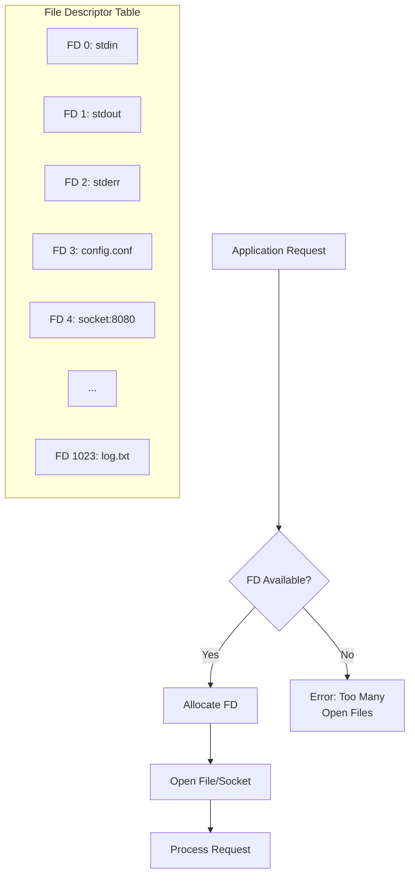
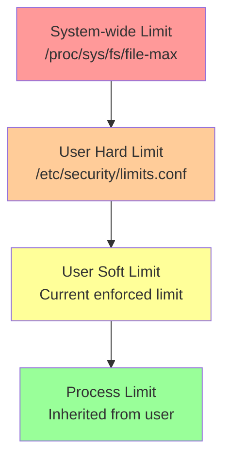
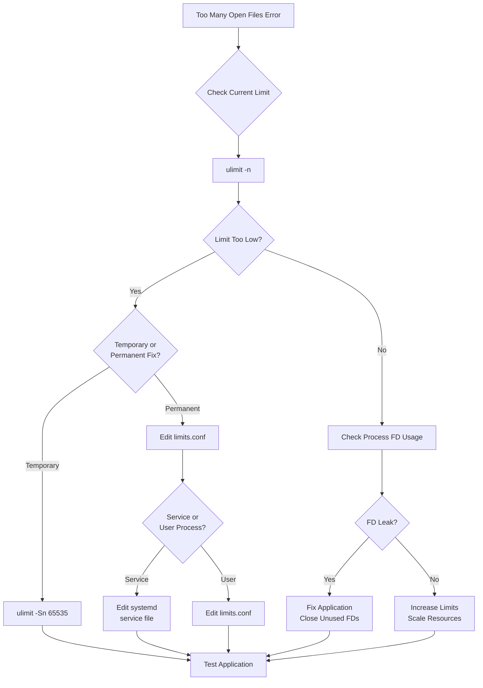

# How to Fix 'Too Many Open Files' Errors in Linux

Author: [nawazdhandala](https://www.github.com/nawazdhandala)

Tags: Linux, System Administration, File Descriptors, ulimit, Troubleshooting, Performance

Description: Learn how to diagnose and fix the common 'Too many open files' error in Linux by adjusting system and user limits for file descriptors.

---

The "Too many open files" error is one of the most common issues encountered by Linux system administrators, especially on busy servers running databases, web servers, or applications with many concurrent connections. This guide explains what causes this error and how to fix it permanently.

## Understanding the Error

In Linux, everything is a file - including network sockets, pipes, and actual files. Each open "file" requires a file descriptor (FD). When a process or the system reaches its file descriptor limit, you see errors like:

```
Too many open files
socket: Too many open files
java.io.IOException: Too many open files
Error: EMFILE, too many open files
```



## Types of Limits

Linux has multiple levels of file descriptor limits:



| Limit Type | Description | Configurable By |
|------------|-------------|-----------------|
| System-wide | Total FDs for entire system | Root (sysctl) |
| Hard limit | Maximum a user can raise to | Root (limits.conf) |
| Soft limit | Current enforced limit | User (up to hard limit) |
| Process limit | Per-process limit | Inherited from shell |

## Diagnosing the Problem

### Check Current Limits

```bash
# Check current soft limit for your session
# This is the limit currently enforced
ulimit -Sn

# Check current hard limit (maximum you can set)
ulimit -Hn

# Check both soft and hard limits
ulimit -a

# Example output:
# open files                      (-n) 1024
```

### Check System-wide Limit

```bash
# View the system-wide maximum number of file descriptors
cat /proc/sys/fs/file-max

# Example output: 9223372036854775807 (effectively unlimited on modern systems)

# Check currently allocated vs maximum
cat /proc/sys/fs/file-nr

# Output format: allocated    free    maximum
# Example: 5664    0    9223372036854775807
```

### Check Per-Process Usage

```bash
# Count open file descriptors for a specific process
# Replace PID with actual process ID
ls -la /proc/PID/fd | wc -l

# List all open files for a process
ls -la /proc/PID/fd

# Using lsof for detailed information
# Shows all files opened by process with PID
lsof -p PID

# Count files by type for a process
lsof -p PID | awk '{print $5}' | sort | uniq -c | sort -rn
```

### Find Processes with Most Open Files

```bash
# List all processes sorted by number of open files
# Shows top 10 file descriptor consumers
for pid in /proc/[0-9]*; do
    count=$(ls "$pid/fd" 2>/dev/null | wc -l)
    name=$(cat "$pid/comm" 2>/dev/null)
    if [ "$count" -gt 0 ]; then
        echo "$count $name ($(basename $pid))"
    fi
done | sort -rn | head -10

# Alternative using lsof
lsof | awk '{print $1}' | sort | uniq -c | sort -rn | head -10
```

## Temporary Fix: Adjust Soft Limit

For immediate relief, increase the soft limit in your current session:

```bash
# Increase soft limit to 65535 (cannot exceed hard limit)
ulimit -Sn 65535

# Verify the change
ulimit -n

# Note: This only affects the current shell and child processes
```

## Permanent Fix: System Configuration

### Method 1: Using limits.conf

Edit the security limits configuration file to set permanent limits:

```bash
# Open the limits configuration file
sudo nano /etc/security/limits.conf
```

Add these lines at the end of the file:

```bash
# Increase file descriptor limits for all users
# Format: <domain> <type> <item> <value>

# Set soft and hard limits for all users
*               soft    nofile          65535
*               hard    nofile          65535

# Set higher limits for specific user (e.g., www-data for web servers)
www-data        soft    nofile          100000
www-data        hard    nofile          100000

# Set limits for specific group (prefix with @)
@developers     soft    nofile          65535
@developers     hard    nofile          65535

# Root user (some systems require explicit root entry)
root            soft    nofile          65535
root            hard    nofile          65535
```

### Method 2: Using limits.d Directory

For better organization, create a separate file:

```bash
# Create a new limits configuration file
sudo nano /etc/security/limits.d/99-nofile.conf
```

Add your limits:

```bash
# Custom file descriptor limits
# Files in limits.d are loaded in alphabetical order
# Using 99- prefix ensures this loads last

*               soft    nofile          65535
*               hard    nofile          65535
```

### Ensure PAM Loads the Limits

Verify that PAM is configured to apply limits:

```bash
# Check if pam_limits.so is enabled
grep pam_limits /etc/pam.d/common-session

# You should see a line like:
# session required pam_limits.so
```

If missing, add it:

```bash
# Edit PAM session configuration
sudo nano /etc/pam.d/common-session

# Add this line if not present
session required pam_limits.so
```

For SSH sessions specifically:

```bash
# Check SSH PAM configuration
grep pam_limits /etc/pam.d/sshd

# Edit if necessary
sudo nano /etc/pam.d/sshd
```

### Method 3: System-wide sysctl Configuration

For system-wide kernel limits:

```bash
# View current system-wide limit
sysctl fs.file-max

# Temporarily increase (until reboot)
sudo sysctl -w fs.file-max=2097152

# Make permanent by adding to sysctl.conf
sudo nano /etc/sysctl.conf
```

Add these lines:

```bash
# Maximum number of file descriptors system-wide
fs.file-max = 2097152

# Increase inotify limits (for file watching applications)
fs.inotify.max_user_watches = 524288
fs.inotify.max_user_instances = 512
```

Apply changes:

```bash
# Load new sysctl settings
sudo sysctl -p

# Verify
sysctl fs.file-max
```

## Service-Specific Configuration

### Systemd Services

For services managed by systemd, edit the service file:

```bash
# Create an override file for the service
sudo systemctl edit nginx.service
```

Add these lines:

```ini
[Service]
# Set file descriptor limit for this service
LimitNOFILE=65535
```

Or edit the main service file:

```bash
# Find the service file location
systemctl show -p FragmentPath nginx.service

# Edit the service file
sudo nano /lib/systemd/system/nginx.service
```

Add under `[Service]` section:

```ini
[Service]
LimitNOFILE=65535
```

Apply changes:

```bash
# Reload systemd configuration
sudo systemctl daemon-reload

# Restart the service
sudo systemctl restart nginx.service

# Verify the limit is applied
cat /proc/$(pgrep -f 'nginx: master')/limits | grep 'open files'
```

### Docker Containers

For Docker, set limits in multiple ways:

```bash
# Run container with specific ulimit
docker run --ulimit nofile=65535:65535 myimage

# Or in docker-compose.yml
# version: '3'
# services:
#   myservice:
#     image: myimage
#     ulimits:
#       nofile:
#         soft: 65535
#         hard: 65535
```

For the Docker daemon itself:

```bash
# Edit Docker daemon configuration
sudo nano /etc/docker/daemon.json
```

```json
{
  "default-ulimits": {
    "nofile": {
      "Name": "nofile",
      "Hard": 65535,
      "Soft": 65535
    }
  }
}
```

```bash
# Restart Docker
sudo systemctl restart docker
```

### Nginx Configuration

Nginx has its own worker connection limits:

```bash
# Edit nginx.conf
sudo nano /etc/nginx/nginx.conf
```

```nginx
# Set at the top level
worker_rlimit_nofile 65535;

events {
    # Maximum connections per worker
    worker_connections 16384;

    # Use efficient event method
    use epoll;

    # Accept multiple connections at once
    multi_accept on;
}
```

### MySQL/MariaDB Configuration

```bash
# Edit MySQL configuration
sudo nano /etc/mysql/mysql.conf.d/mysqld.cnf
```

```ini
[mysqld]
# Maximum open files for MySQL
open_files_limit = 65535

# Also adjust table cache
table_open_cache = 4000
```

## Verification Steps

After making changes, verify they take effect:

```bash
# Log out and log back in (for limits.conf changes)
# Or reboot for all changes

# Check your current limits
ulimit -n

# Check limits for a running process
cat /proc/$(pgrep nginx | head -1)/limits | grep "open files"

# Example output:
# Max open files            65535                65535                files

# Check system-wide usage
cat /proc/sys/fs/file-nr
```

## Troubleshooting Flow



## Common Causes and Solutions

| Cause | Solution |
|-------|----------|
| Connection pool exhaustion | Configure proper pool limits and timeouts |
| FD leak in application | Fix code to close files/sockets properly |
| Too many log files | Implement log rotation |
| Socket TIME_WAIT buildup | Tune TCP settings, enable SO_REUSEADDR |
| Watching too many files | Reduce inotify watches or increase limit |

## Monitoring Script

Create a script to monitor file descriptor usage:

```bash
#!/bin/bash
# monitor-fd.sh - Monitor file descriptor usage

# Define warning threshold as percentage of limit
THRESHOLD=80

while true; do
    # Get system-wide usage
    read allocated free max < /proc/sys/fs/file-nr
    usage_pct=$((allocated * 100 / max))

    echo "$(date): System FDs: $allocated / $max ($usage_pct%)"

    # Check top consumers
    echo "Top 5 FD consumers:"
    for pid in /proc/[0-9]*; do
        if [ -d "$pid/fd" ]; then
            count=$(ls "$pid/fd" 2>/dev/null | wc -l)
            name=$(cat "$pid/comm" 2>/dev/null)
            echo "$count $name"
        fi
    done | sort -rn | head -5

    # Alert if threshold exceeded
    if [ $usage_pct -gt $THRESHOLD ]; then
        echo "WARNING: FD usage above ${THRESHOLD}%!"
    fi

    echo "---"
    sleep 60
done
```

## Conclusion

The "Too many open files" error is usually straightforward to fix once you understand the layered limit system in Linux. Start by diagnosing whether the issue is a limit problem or an application bug (FD leak). For limit issues, configure the appropriate level - user limits in limits.conf for user processes, systemd service limits for daemons, and kernel limits via sysctl for system-wide settings. Always verify changes take effect and monitor file descriptor usage to prevent future issues.
