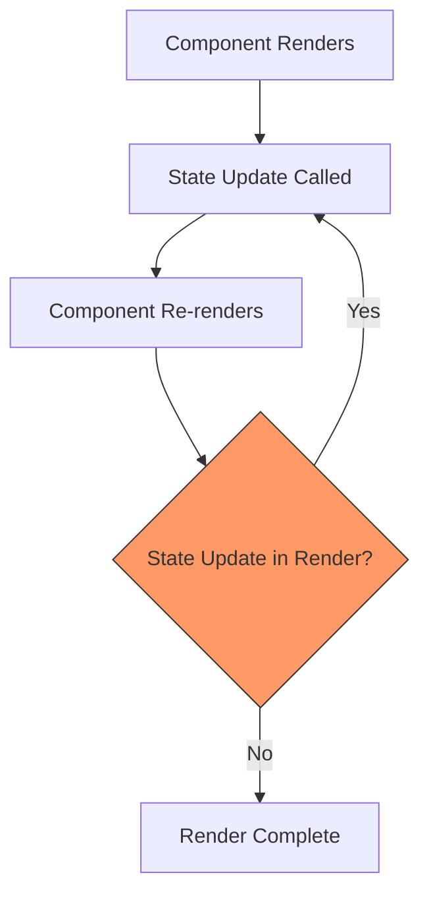
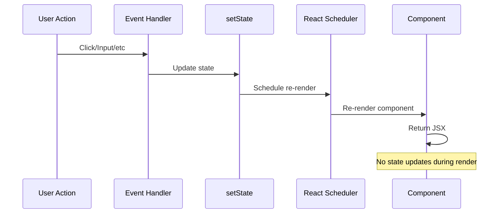

# How to Fix "Too Many Re-Renders" Errors in React

Author: [nawazdhandala](https://github.com/nawazdhandala)

Tags: React, JavaScript, Debugging, Frontend, Performance

Description: Learn how to diagnose and fix the "Too many re-renders" error in React by understanding render cycles and avoiding infinite loops.

---

The dreaded "Too many re-renders. React limits the number of renders to prevent an infinite loop" error stops your React application cold. This error occurs when your component triggers state updates during render, creating an infinite loop. Understanding why this happens and how to fix it requires grasping React's render cycle.

## Understanding the React Render Cycle

React re-renders a component whenever its state or props change. The "too many re-renders" error happens when a state update triggers another state update, which triggers another, and so on.



## Common Causes and Fixes

### 1. Calling Functions Instead of Passing References

The most common mistake is calling a function in an event handler instead of passing a reference:

```javascript
// BAD: This calls handleClick on every render, causing infinite loop
function Counter() {
  const [count, setCount] = useState(0);

  const handleClick = () => {
    setCount(count + 1);
  };

  return (
    // handleClick() is called immediately, not on click
    <button onClick={handleClick()}>
      Count: {count}
    </button>
  );
}

// GOOD: Pass the function reference, don't call it
function Counter() {
  const [count, setCount] = useState(0);

  const handleClick = () => {
    setCount(count + 1);
  };

  return (
    // handleClick is passed as reference, called only on click
    <button onClick={handleClick}>
      Count: {count}
    </button>
  );
}
```

### 2. State Updates in Render Body

Setting state directly in the component body causes infinite re-renders:

```javascript
// BAD: State update in render body causes infinite loop
function UserProfile({ userId }) {
  const [user, setUser] = useState(null);

  // This runs on every render, causing infinite loop
  fetch(`/api/users/${userId}`)
    .then(res => res.json())
    .then(data => setUser(data));

  return <div>{user?.name}</div>;
}

// GOOD: Use useEffect for side effects
function UserProfile({ userId }) {
  const [user, setUser] = useState(null);

  // useEffect runs after render, with dependency array
  useEffect(() => {
    fetch(`/api/users/${userId}`)
      .then(res => res.json())
      .then(data => setUser(data));
  }, [userId]); // Only re-run when userId changes

  return <div>{user?.name}</div>;
}
```

### 3. Conditional State Updates Without Proper Guards

Updating state based on props without proper conditions:

```javascript
// BAD: Always updates state when props change, even if value is same
function SyncedInput({ externalValue }) {
  const [value, setValue] = useState(externalValue);

  // This runs on every render, potentially causing loops
  if (externalValue !== undefined) {
    setValue(externalValue);
  }

  return <input value={value} onChange={e => setValue(e.target.value)} />;
}

// GOOD: Use useEffect with proper dependency
function SyncedInput({ externalValue }) {
  const [value, setValue] = useState(externalValue);

  useEffect(() => {
    if (externalValue !== undefined) {
      setValue(externalValue);
    }
  }, [externalValue]); // Only runs when externalValue changes

  return <input value={value} onChange={e => setValue(e.target.value)} />;
}

// BETTER: Use key to reset component entirely
function Parent() {
  const [externalValue, setExternalValue] = useState('');

  return (
    <SyncedInput
      key={externalValue} // Forces remount when value changes
      initialValue={externalValue}
    />
  );
}
```

### 4. Inline Function Definitions with State Updates

Creating new functions inline that update state:

```javascript
// BAD: New function created every render, can cause issues
function TodoList({ todos }) {
  const [selected, setSelected] = useState(null);

  return (
    <ul>
      {todos.map(todo => (
        <li
          key={todo.id}
          // New function on every render
          onClick={() => setSelected(todo.id)}
        >
          {todo.text}
        </li>
      ))}
    </ul>
  );
}

// GOOD: Use useCallback for stable function references
function TodoList({ todos }) {
  const [selected, setSelected] = useState(null);

  const handleSelect = useCallback((id) => {
    setSelected(id);
  }, []);

  return (
    <ul>
      {todos.map(todo => (
        <TodoItem
          key={todo.id}
          todo={todo}
          onSelect={handleSelect}
        />
      ))}
    </ul>
  );
}

// TodoItem component can use React.memo to prevent re-renders
const TodoItem = React.memo(({ todo, onSelect }) => (
  <li onClick={() => onSelect(todo.id)}>
    {todo.text}
  </li>
));
```

### 5. Incorrect useEffect Dependencies

Missing or incorrect dependencies can cause unexpected re-renders:

```javascript
// BAD: Missing dependency causes stale closure
function SearchResults({ query }) {
  const [results, setResults] = useState([]);

  useEffect(() => {
    // query is used but not in dependency array
    searchApi(query).then(setResults);
  }, []); // Empty array means this only runs once

  return <ResultsList results={results} />;
}

// BAD: Object in dependency array causes infinite loop
function SearchResults({ query }) {
  const [results, setResults] = useState([]);
  const options = { limit: 10, offset: 0 }; // New object every render

  useEffect(() => {
    searchApi(query, options).then(setResults);
  }, [query, options]); // options changes every render!

  return <ResultsList results={results} />;
}

// GOOD: Memoize objects or use primitive values
function SearchResults({ query }) {
  const [results, setResults] = useState([]);

  const options = useMemo(() => ({
    limit: 10,
    offset: 0
  }), []); // Stable reference

  useEffect(() => {
    searchApi(query, options).then(setResults);
  }, [query, options]); // Now options is stable

  return <ResultsList results={results} />;
}
```

## Debugging Techniques

### Using React DevTools

React DevTools can highlight components that re-render:

1. Open React DevTools in your browser
2. Go to Settings (gear icon)
3. Enable "Highlight updates when components render"
4. Interact with your app to see which components re-render

### Adding Render Logging

```javascript
// Debug component to track renders
function useRenderCount(componentName) {
  const renderCount = useRef(0);

  useEffect(() => {
    renderCount.current += 1;
    console.log(`${componentName} rendered ${renderCount.current} times`);
  });
}

function MyComponent() {
  useRenderCount('MyComponent');
  // ... rest of component
}
```

### Using the Profiler

```javascript
import { Profiler } from 'react';

function onRenderCallback(
  id, // The "id" prop of the Profiler tree
  phase, // "mount" or "update"
  actualDuration, // Time spent rendering
  baseDuration, // Estimated time without memoization
  startTime,
  commitTime,
  interactions
) {
  console.log({
    id,
    phase,
    actualDuration,
    baseDuration,
  });
}

function App() {
  return (
    <Profiler id="App" onRender={onRenderCallback}>
      <MyComponent />
    </Profiler>
  );
}
```

## Flow of Proper State Updates

Here is how state updates should flow in a React application:



## Summary of Common Fixes

| Problem | Solution |
|---------|----------|
| Calling function in onClick | Pass function reference: `onClick={handleClick}` |
| State update in render body | Move to useEffect with dependencies |
| Conditional state updates | Use useEffect or component key |
| New objects in dependencies | Use useMemo to memoize objects |
| New functions in dependencies | Use useCallback for stable references |
| Infinite loops in useEffect | Check and fix dependency array |

## Prevention Checklist

1. Never call setState directly in the component body
2. Always pass function references to event handlers, not function calls
3. Use useEffect for any side effects that update state
4. Memoize objects and arrays passed to useEffect dependencies
5. Use useCallback for functions passed as props or dependencies
6. Enable React StrictMode in development to catch issues early
7. Use ESLint with eslint-plugin-react-hooks for automatic detection

The "too many re-renders" error is React's way of protecting you from infinite loops. By understanding the render cycle and following these patterns, you can write React components that update state predictably and efficiently.
