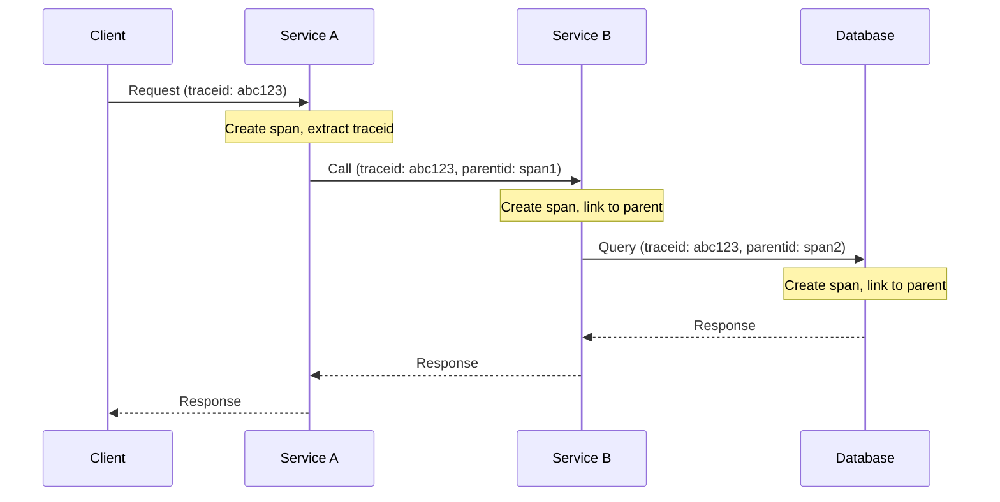

# How to Fix 'Trace Correlation' Issues

Author: [nawazdhandala](https://www.github.com/nawazdhandala)

Tags: Tracing, OpenTelemetry, Distributed Tracing, Observability, Debugging, DevOps

Description: Learn how to diagnose and fix trace correlation issues including broken traces, missing spans, context propagation failures, and cross-service correlation problems.

---

Distributed tracing becomes useless when traces are broken or incomplete. When you cannot follow a request across services, debugging production issues becomes a guessing game. This guide covers the most common trace correlation problems and how to fix them.

## How Trace Correlation Works

Before diving into problems, understand how correlation is supposed to work:



The trace ID must propagate through every service for correlation to work.

## Broken Traces Across Services

The most common issue is traces that stop at service boundaries. Usually this means context propagation is failing.

### Diagnosing Context Propagation Failures

First, check if trace headers are being sent. Look at outgoing requests:

```javascript
// Debug middleware to log trace headers
app.use((req, res, next) => {
  console.log('Incoming trace headers:', {
    traceparent: req.headers['traceparent'],
    tracestate: req.headers['tracestate'],
    'x-b3-traceid': req.headers['x-b3-traceid'],
  });
  next();
});
```

If headers are missing, the calling service is not propagating context.

### Fixing Context Propagation

Ensure you inject context into outgoing HTTP requests:

```javascript
const { context, propagation, trace } = require('@opentelemetry/api');
const https = require('https');

async function callDownstreamService(path, data) {
  // Get current trace context
  const carrier = {};

  // Inject trace context into headers
  propagation.inject(context.active(), carrier);

  const options = {
    hostname: 'service-b.internal',
    port: 443,
    path: path,
    method: 'POST',
    headers: {
      'Content-Type': 'application/json',
      // Spread the injected trace headers
      ...carrier,
    },
  };

  return new Promise((resolve, reject) => {
    const req = https.request(options, (res) => {
      let data = '';
      res.on('data', (chunk) => data += chunk);
      res.on('end', () => resolve(JSON.parse(data)));
    });

    req.on('error', reject);
    req.write(JSON.stringify(data));
    req.end();
  });
}
```

For axios or fetch, use interceptors:

```javascript
const axios = require('axios');
const { context, propagation } = require('@opentelemetry/api');

// Create axios instance with trace propagation
const client = axios.create({
  baseURL: 'https://service-b.internal',
});

// Request interceptor injects trace context
client.interceptors.request.use((config) => {
  const carrier = {};
  propagation.inject(context.active(), carrier);

  config.headers = {
    ...config.headers,
    ...carrier,
  };

  return config;
});
```

### Server-Side Context Extraction

The receiving service must extract context from incoming requests:

```javascript
const { context, propagation, trace } = require('@opentelemetry/api');

app.use((req, res, next) => {
  // Extract trace context from incoming headers
  const extractedContext = propagation.extract(context.active(), req.headers);

  // Run the rest of the request in this context
  context.with(extractedContext, () => {
    next();
  });
});
```

If using OpenTelemetry auto-instrumentation, this should happen automatically. Verify the instrumentation is loaded:

```javascript
// tracing.js - must be loaded before any other imports
const { NodeSDK } = require('@opentelemetry/sdk-node');
const { getNodeAutoInstrumentations } = require('@opentelemetry/auto-instrumentations-node');

const sdk = new NodeSDK({
  instrumentations: [
    getNodeAutoInstrumentations({
      // Enable HTTP instrumentation for context propagation
      '@opentelemetry/instrumentation-http': { enabled: true },
      '@opentelemetry/instrumentation-express': { enabled: true },
    }),
  ],
});

sdk.start();
```

## Missing Spans in Traces

Sometimes traces exist but are missing spans for certain operations.

### Async Context Loss

JavaScript async operations can lose trace context:

```javascript
// BAD: Context is lost in setTimeout
const { trace } = require('@opentelemetry/api');

app.get('/process', async (req, res) => {
  const span = trace.getActiveSpan();
  console.log('Request span:', span?.spanContext().spanId);  // Has span

  setTimeout(() => {
    const innerSpan = trace.getActiveSpan();
    console.log('Timeout span:', innerSpan?.spanContext().spanId);  // undefined!
    processData();
  }, 100);

  res.json({ status: 'processing' });
});
```

Fix by explicitly preserving context:

```javascript
const { trace, context } = require('@opentelemetry/api');

app.get('/process', async (req, res) => {
  const currentContext = context.active();

  setTimeout(() => {
    // Restore context in the callback
    context.with(currentContext, () => {
      const span = trace.getActiveSpan();
      console.log('Timeout span:', span?.spanContext().spanId);  // Now has span
      processData();
    });
  }, 100);

  res.json({ status: 'processing' });
});
```

For async/await, context usually propagates automatically, but verify with manual spans:

```javascript
const { trace } = require('@opentelemetry/api');
const tracer = trace.getTracer('my-service');

async function processOrder(orderId) {
  // Create a span and ensure it is the active span
  return tracer.startActiveSpan('processOrder', async (span) => {
    try {
      span.setAttribute('order.id', orderId);

      // Child operations will be linked
      await validateOrder(orderId);
      await chargePayment(orderId);
      await fulfillOrder(orderId);

      span.setStatus({ code: SpanStatusCode.OK });
    } catch (error) {
      span.recordException(error);
      span.setStatus({ code: SpanStatusCode.ERROR });
      throw error;
    } finally {
      span.end();
    }
  });
}
```

### Database and Cache Spans Missing

If database queries are not appearing in traces, check instrumentation:

```javascript
// Verify database instrumentation is enabled
const { getNodeAutoInstrumentations } = require('@opentelemetry/auto-instrumentations-node');

const instrumentations = getNodeAutoInstrumentations({
  '@opentelemetry/instrumentation-pg': {
    enabled: true,
    enhancedDatabaseReporting: true,  // Include query details
  },
  '@opentelemetry/instrumentation-redis': {
    enabled: true,
  },
  '@opentelemetry/instrumentation-mongodb': {
    enabled: true,
  },
});
```

If using a database client that is not auto-instrumented, add manual spans:

```javascript
const { trace, SpanStatusCode } = require('@opentelemetry/api');
const tracer = trace.getTracer('database');

class TracedDatabase {
  constructor(client) {
    this.client = client;
  }

  async query(sql, params) {
    return tracer.startActiveSpan('db.query', {
      attributes: {
        'db.system': 'postgresql',
        'db.statement': sql,
        'db.operation': sql.split(' ')[0].toUpperCase(),
      },
    }, async (span) => {
      try {
        const result = await this.client.query(sql, params);
        span.setAttribute('db.rows_affected', result.rowCount);
        span.setStatus({ code: SpanStatusCode.OK });
        return result;
      } catch (error) {
        span.recordException(error);
        span.setStatus({ code: SpanStatusCode.ERROR });
        throw error;
      } finally {
        span.end();
      }
    });
  }
}
```

## Trace ID Not Matching Across Services

When trace IDs differ between services, check propagation format compatibility.

### Format Mismatches

Different systems use different header formats:

```
W3C Trace Context (OpenTelemetry default):
  traceparent: 00-0af7651916cd43dd8448eb211c80319c-b7ad6b7169203331-01

Jaeger:
  uber-trace-id: 0af7651916cd43dd8448eb211c80319c:b7ad6b7169203331:0:1

B3 (Zipkin):
  X-B3-TraceId: 0af7651916cd43dd8448eb211c80319c
  X-B3-SpanId: b7ad6b7169203331
  X-B3-Sampled: 1
```

Configure OpenTelemetry to support multiple formats:

```javascript
const { NodeSDK } = require('@opentelemetry/sdk-node');
const { W3CTraceContextPropagator } = require('@opentelemetry/core');
const { JaegerPropagator } = require('@opentelemetry/propagator-jaeger');
const { B3Propagator, B3InjectEncoding } = require('@opentelemetry/propagator-b3');
const { CompositePropagator } = require('@opentelemetry/core');

const sdk = new NodeSDK({
  // Support multiple propagation formats
  textMapPropagator: new CompositePropagator({
    propagators: [
      new W3CTraceContextPropagator(),
      new JaegerPropagator(),
      new B3Propagator({ injectEncoding: B3InjectEncoding.MULTI_HEADER }),
    ],
  }),
});
```

## Correlating Traces with Logs

Traces and logs should be linked by trace ID.

### Adding Trace Context to Logs

Configure your logger to include trace information:

```javascript
const { trace } = require('@opentelemetry/api');
const winston = require('winston');

// Custom format that adds trace context
const traceFormat = winston.format((info) => {
  const span = trace.getActiveSpan();
  if (span) {
    const ctx = span.spanContext();
    info.traceId = ctx.traceId;
    info.spanId = ctx.spanId;
    info.traceFlags = ctx.traceFlags;
  }
  return info;
});

const logger = winston.createLogger({
  format: winston.format.combine(
    traceFormat(),
    winston.format.timestamp(),
    winston.format.json()
  ),
  transports: [new winston.transports.Console()],
});

// Usage - trace context automatically added
logger.info('Processing order', { orderId: '12345' });
// Output: {"level":"info","message":"Processing order","orderId":"12345","traceId":"abc...","spanId":"def...","timestamp":"..."}
```

### Configuring Log Backend Correlation

In Grafana, configure Loki to link to Tempo traces:

```yaml
# Grafana datasources
datasources:
  - name: Loki
    type: loki
    url: http://loki:3100
    jsonData:
      derivedFields:
        - name: TraceID
          matcherRegex: '"traceId":"([a-f0-9]+)"'
          url: '$${__value.raw}'
          datasourceUid: tempo
          urlDisplayLabel: View Trace
```

## Sampling Configuration Issues

Aggressive sampling can cause traces to be incomplete.

### Parent-Based Sampling

Ensure child services respect parent sampling decisions:

```javascript
const { ParentBasedSampler, AlwaysOnSampler, TraceIdRatioBasedSampler } = require('@opentelemetry/sdk-trace-base');

const sdk = new NodeSDK({
  sampler: new ParentBasedSampler({
    // If parent says sample, we sample
    // If no parent, sample 10% of traces
    root: new TraceIdRatioBasedSampler(0.1),
    // Always sample if parent is sampled
    remoteParentSampled: new AlwaysOnSampler(),
    // Never sample if parent is not sampled
    remoteParentNotSampled: new NeverSampler(),
  }),
});
```

### Head-Based vs Tail-Based Sampling

Head-based sampling decides at trace start. Tail-based sampling decides after the trace completes, capturing all errors:

```yaml
# OpenTelemetry Collector config for tail-based sampling
processors:
  tail_sampling:
    decision_wait: 10s
    num_traces: 100000
    policies:
      # Always sample errors
      - name: errors
        type: status_code
        status_code:
          status_codes: [ERROR]

      # Always sample slow requests
      - name: slow-requests
        type: latency
        latency:
          threshold_ms: 1000

      # Sample 10% of everything else
      - name: probabilistic
        type: probabilistic
        probabilistic:
          sampling_percentage: 10
```

## Debugging Trace Export Failures

If traces never appear in your backend, check the exporter:

```javascript
const { DiagConsoleLogger, DiagLogLevel, diag } = require('@opentelemetry/api');

// Enable debug logging
diag.setLogger(new DiagConsoleLogger(), DiagLogLevel.DEBUG);

// Now you will see export attempts and failures
```

Check exporter configuration:

```javascript
const { OTLPTraceExporter } = require('@opentelemetry/exporter-trace-otlp-http');

const exporter = new OTLPTraceExporter({
  url: process.env.OTEL_EXPORTER_OTLP_ENDPOINT || 'http://localhost:4318/v1/traces',
  headers: {
    // Some backends require authentication
    'Authorization': `Bearer ${process.env.OTEL_AUTH_TOKEN}`,
  },
  // Timeout for export requests
  timeoutMillis: 30000,
});
```

Test the endpoint directly:

```bash
# Check if the trace backend is reachable
curl -v http://tempo:4318/v1/traces \
  -H "Content-Type: application/json" \
  -d '{"resourceSpans":[]}'
```

## Summary

Trace correlation issues usually stem from context propagation failures, instrumentation gaps, format mismatches, or sampling decisions. Verify that trace headers flow through every service boundary. Ensure auto-instrumentation is loaded before other modules. Configure propagators to support all formats your services use. Link logs to traces by including trace IDs. When traces are incomplete, check sampling configuration and exporter connectivity. With proper correlation, distributed tracing becomes a powerful tool for understanding complex systems.
