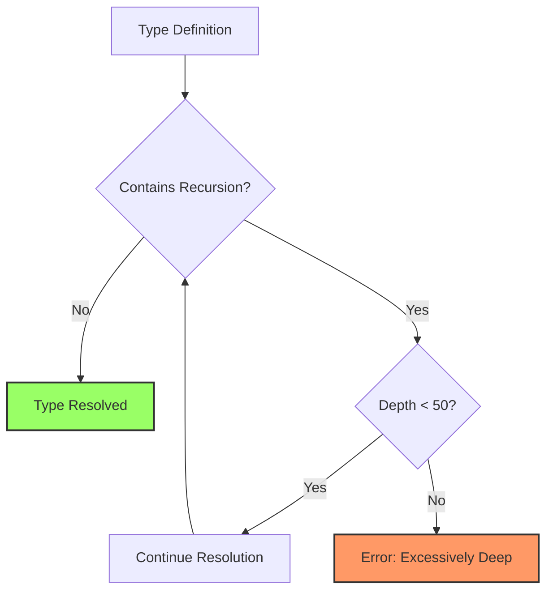
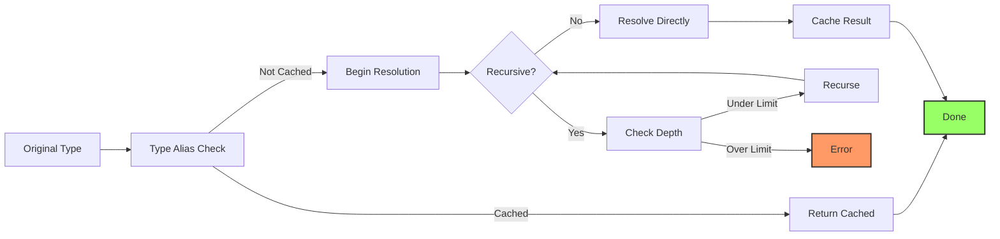

# How to Fix "Type Instantiation Is Excessively Deep" Errors

Author: [nawazdhandala](https://www.github.com/nawazdhandala)

Tags: TypeScript, Types, Debugging, Recursion, Performance

Description: Learn to diagnose and fix TypeScript "Type instantiation is excessively deep and possibly infinite" errors caused by recursive types.

---

The "Type instantiation is excessively deep and possibly infinite" error occurs when TypeScript's type checker encounters recursive or deeply nested types that exceed the compiler's instantiation depth limit. This guide explains the causes and provides practical solutions.

## Understanding the Error

TypeScript has a built-in recursion limit of 50 levels for type instantiation. When a type references itself too many times or creates deep nesting, the compiler stops with this error to prevent infinite loops.



## Common Causes

### 1. Unbounded Recursive Types

The most common cause is a type that recursively references itself without a proper base case:

```typescript
// BAD: This type causes infinite recursion
// The compiler cannot determine when to stop
type InfiniteNested<T> = {
  value: T;
  children: InfiniteNested<T>[];  // Always recurses
};

// Attempting to use deeply nested operations triggers the error
type DeepValue = InfiniteNested<string>["children"][0]["children"][0];  // Error!
```

### 2. Mapped Types with Recursion

Mapped types that transform properties recursively can exceed depth limits:

```typescript
// BAD: Deep recursion through object properties
// Each nested object adds another level of type resolution
type DeepReadonly<T> = {
  readonly [P in keyof T]: T[P] extends object
    ? DeepReadonly<T[P]>  // Recursive call
    : T[P];
};

// With deeply nested objects, this exceeds the depth limit
interface DeeplyNested {
  level1: {
    level2: {
      // ... many levels deep
    };
  };
}
```

### 3. Conditional Type Chains

Long chains of conditional types can exhaust the instantiation depth:

```typescript
// BAD: Each condition adds instantiation depth
// The compiler must evaluate each branch
type ExtractDeep<T> = T extends Promise<infer R>
  ? ExtractDeep<R>
  : T extends Array<infer V>
    ? ExtractDeep<V>
    : T extends object
      ? { [K in keyof T]: ExtractDeep<T[K]> }
      : T;
```

## Solutions

### Solution 1: Add Depth Limiting

Introduce a counter type that stops recursion at a specific depth:

```typescript
// GOOD: Limit recursion depth using a counter tuple
// Each recursion level removes one element from the counter
type Depth = [never, 0, 1, 2, 3, 4, 5, 6, 7, 8, 9, 10];

type DeepReadonlyLimited<T, D extends number = 10> = D extends 0
  ? T  // Base case: stop at depth 0
  : {
      readonly [P in keyof T]: T[P] extends object
        ? DeepReadonlyLimited<T[P], Depth[D]>  // Decrement depth
        : T[P];
    };

// Usage: now safely limited to 10 levels deep
type SafeReadonly = DeepReadonlyLimited<ComplexType>;
```

### Solution 2: Use Intersection Types for Termination

Create explicit termination conditions using never:

```typescript
// GOOD: Use conditional check to terminate recursion
// The extends check creates a clear stopping point
type SafeNested<T, Seen = never> = T extends Seen
  ? T  // Already seen this type, stop recursion
  : {
      value: T;
      children: SafeNested<T, Seen | T>[];
    };

// Alternative: explicit depth control
type TreeNode<T, MaxDepth extends number = 5> = MaxDepth extends 0
  ? { value: T; children: never[] }
  : {
      value: T;
      children: TreeNode<T, Subtract<MaxDepth, 1>>[];
    };

// Helper type for subtraction
type Subtract<N extends number, M extends 1> = [
  never, 0, 1, 2, 3, 4, 5, 6, 7, 8, 9
][N];
```

### Solution 3: Simplify Conditional Types

Flatten nested conditionals using union types:

```typescript
// BAD: Deeply nested conditionals
type BadUnwrap<T> = T extends Promise<infer R>
  ? R extends Promise<infer V>
    ? V extends Promise<infer W>
      ? W
      : V
    : R
  : T;

// GOOD: Flattened recursive approach with explicit limit
// Uses a simpler structure that TypeScript handles better
type UnwrapPromise<T, Depth extends number = 5> = Depth extends 0
  ? T
  : T extends Promise<infer R>
    ? UnwrapPromise<R, Prev[Depth]>
    : T;

type Prev = [never, 0, 1, 2, 3, 4, 5, 6, 7, 8, 9, 10];

// Usage
type Result = UnwrapPromise<Promise<Promise<string>>>;  // string
```

### Solution 4: Break Up Complex Types

Split large recursive types into smaller, manageable pieces:

```typescript
// BAD: One giant recursive type doing everything
type DoEverything<T> = T extends object
  ? T extends Array<infer R>
    ? DoEverything<R>[]
    : T extends Map<infer K, infer V>
      ? Map<DoEverything<K>, DoEverything<V>>
      : { [P in keyof T]: DoEverything<T[P]> }
  : T;

// GOOD: Separate types for each concern
// Each type has a single responsibility and limited depth
type HandleArray<T> = T extends Array<infer R> ? R[] : never;
type HandleMap<T> = T extends Map<infer K, infer V> ? Map<K, V> : never;
type HandleObject<T> = T extends object ? { [P in keyof T]: T[P] } : T;

// Compose them with explicit type guards
type Transform<T> = T extends Array<any>
  ? HandleArray<T>
  : T extends Map<any, any>
    ? HandleMap<T>
    : HandleObject<T>;
```

### Solution 5: Use Type Aliases for Caching

TypeScript caches type alias results. Using named aliases instead of inline types reduces redundant calculations:

```typescript
// BAD: Inline types computed multiple times
// Each use triggers fresh type resolution
function process<T>(
  input: T extends object ? { [K in keyof T]: T[K] } : T
): T extends object ? { [K in keyof T]: T[K] } : T {
  // ...
}

// GOOD: Named alias computed once and cached
// TypeScript can reuse the cached result
type Processed<T> = T extends object ? { [K in keyof T]: T[K] } : T;

function process<T>(input: Processed<T>): Processed<T> {
  // ...
}
```

## Real-World Example: JSON Type

A common use case that triggers this error is typing arbitrary JSON:

```typescript
// BAD: Naive JSON type causes infinite instantiation
type JsonValue =
  | string
  | number
  | boolean
  | null
  | JsonValue[]  // Recursive
  | { [key: string]: JsonValue };  // Recursive

// Deep operations on JsonValue trigger the error
type DeepPartialJson<T extends JsonValue> = T extends object
  ? { [K in keyof T]?: DeepPartialJson<T[K] & JsonValue> }
  : T;

// GOOD: Limited-depth JSON type
// Explicitly stops at a reasonable depth
type JsonValueLimited<Depth extends number = 5> = Depth extends 0
  ? unknown
  : string | number | boolean | null
    | JsonValueLimited<Prev[Depth]>[]
    | { [key: string]: JsonValueLimited<Prev[Depth]> };

type Prev = [never, 0, 1, 2, 3, 4, 5, 6, 7, 8, 9, 10];
```

## Debugging Strategies

### Strategy 1: Isolate the Problem

Comment out parts of your type to find which section causes the issue:

```typescript
// Start with the full type that errors
type Problematic<T> = {
  a: RecursivePartA<T>;
  b: RecursivePartB<T>;
  c: RecursivePartC<T>;
};

// Comment out sections to isolate
type Debugging<T> = {
  a: RecursivePartA<T>;  // Try with just this
  // b: RecursivePartB<T>;
  // c: RecursivePartC<T>;
};
```

### Strategy 2: Add Type Breakpoints

Insert intermediate type aliases to see where resolution stops:

```typescript
// Insert checkpoints to see resolution progress
type Step1<T> = T extends object ? keyof T : never;
type Step2<T> = T extends object ? { [K in Step1<T>]: T[K] } : T;
type Step3<T> = Step2<T> extends object ? Step2<Step2<T>> : Step2<T>;

// Check each step individually
type Check1 = Step1<MyType>;  // Works?
type Check2 = Step2<MyType>;  // Works?
type Check3 = Step3<MyType>;  // Errors here?
```

### Strategy 3: Use TypeScript Playground

The TypeScript Playground shows hover types. Use it to inspect intermediate types:

```typescript
// Hover over each type to see the resolved value
type Input = { deeply: { nested: { value: string } } };
type Level1 = Input["deeply"];
type Level2 = Level1["nested"];
type Level3 = Level2["value"];  // Find where it breaks
```

## Type Resolution Flow



## Best Practices Summary

| Practice | Benefit |
|----------|---------|
| Add depth limits | Prevents infinite recursion |
| Use type aliases | Enables caching |
| Split complex types | Easier to debug and maintain |
| Add base cases | Clear termination conditions |
| Test with real data | Catch issues early |

## Conclusion

The "Type instantiation is excessively deep" error indicates that TypeScript's type resolver is working too hard. The solutions involve adding explicit depth limits, using caching through type aliases, and simplifying complex recursive structures. When designing recursive types, always include a clear termination condition and consider the maximum expected depth of your data structures.
