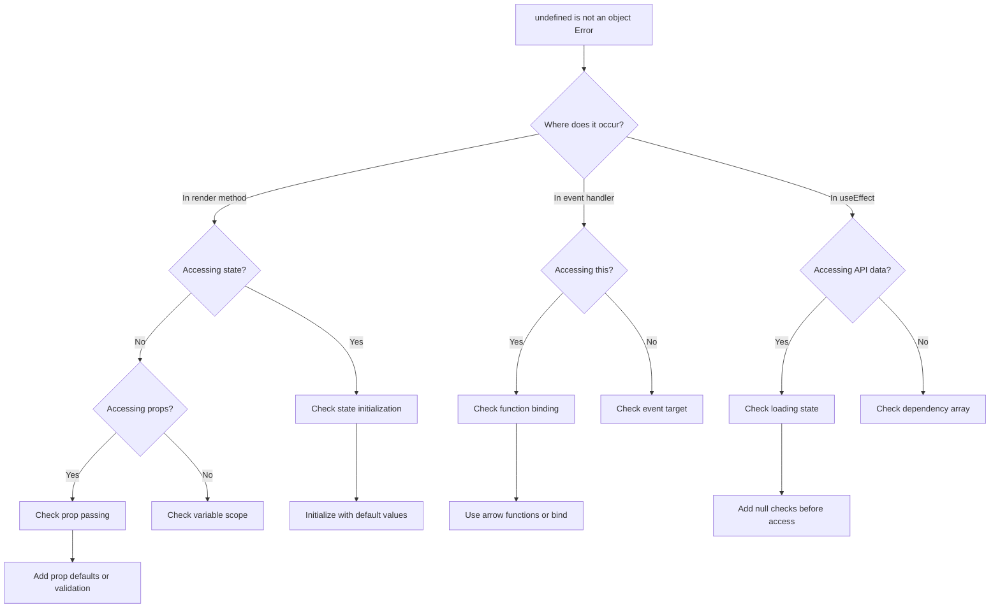

# How to Fix "Undefined Is Not an Object" in React

Author: [nawazdhandala](https://github.com/nawazdhandala)

Tags: React, JavaScript, Debugging, Error Handling, TypeError, Frontend

Description: A practical guide to diagnosing and fixing the "undefined is not an object" TypeError in React applications, with common causes and solutions.

---

The "undefined is not an object" error is one of the most common runtime errors in React applications. This TypeError occurs when you try to access a property or method on a value that is undefined. Understanding why this happens and how to prevent it will save you hours of debugging.

## Understanding the Error

This error occurs when JavaScript attempts to access a property on undefined.

```javascript
// This code throws "undefined is not an object"
const user = undefined;
console.log(user.name);  // TypeError: undefined is not an object

const items = undefined;
console.log(items.length);  // TypeError: undefined is not an object

const callback = undefined;
callback();  // TypeError: undefined is not a function
```

In React, this typically happens when:
- Component state is not initialized
- Props are not passed or are undefined
- API responses have unexpected structure
- Accessing nested object properties before they exist

## Error Diagnosis Flow

Use this diagram to identify the source of the error.



## Common Cause 1: Uninitialized State

The most frequent cause is accessing state before it has a value.

```javascript
// Problem: State is undefined before data loads
import React, { useState, useEffect } from 'react';

function UserProfile({ userId }) {
  // user starts as undefined
  const [user, setUser] = useState();

  useEffect(() => {
    fetchUser(userId).then(data => setUser(data));
  }, [userId]);

  // ERROR: user is undefined on first render
  return (
    <div>
      <h1>{user.name}</h1>
      <p>{user.email}</p>
    </div>
  );
}
```

### Solution: Initialize state with default values

```javascript
import React, { useState, useEffect } from 'react';

function UserProfile({ userId }) {
  // Initialize with an object that has the expected shape
  const [user, setUser] = useState({
    name: '',
    email: '',
    avatar: ''
  });
  const [loading, setLoading] = useState(true);

  useEffect(() => {
    setLoading(true);
    fetchUser(userId)
      .then(data => setUser(data))
      .finally(() => setLoading(false));
  }, [userId]);

  // Show loading state while data is being fetched
  if (loading) {
    return <div>Loading...</div>;
  }

  return (
    <div>
      <h1>{user.name}</h1>
      <p>{user.email}</p>
    </div>
  );
}

async function fetchUser(userId) {
  const response = await fetch(`/api/users/${userId}`);
  return response.json();
}

export default UserProfile;
```

### Alternative: Use null with conditional rendering

```javascript
import React, { useState, useEffect } from 'react';

function UserProfile({ userId }) {
  // null explicitly means "no data yet"
  const [user, setUser] = useState(null);
  const [error, setError] = useState(null);

  useEffect(() => {
    fetchUser(userId)
      .then(data => setUser(data))
      .catch(err => setError(err.message));
  }, [userId]);

  // Handle error state
  if (error) {
    return <div className="error">Error: {error}</div>;
  }

  // Handle loading state - user is null until loaded
  if (user === null) {
    return <div>Loading...</div>;
  }

  // Safe to access user properties now
  return (
    <div>
      <h1>{user.name}</h1>
      <p>{user.email}</p>
    </div>
  );
}

async function fetchUser(userId) {
  const response = await fetch(`/api/users/${userId}`);
  if (!response.ok) {
    throw new Error('Failed to fetch user');
  }
  return response.json();
}

export default UserProfile;
```

## Common Cause 2: Missing Props

Components may receive undefined props if the parent does not pass them.

```javascript
// Problem: parent does not pass user prop
function ParentComponent() {
  return <UserCard />;  // Missing user prop
}

function UserCard({ user }) {
  // ERROR: user is undefined
  return (
    <div>
      <h2>{user.name}</h2>
      <p>{user.bio}</p>
    </div>
  );
}
```

### Solution: Add default props and validation

```javascript
import React from 'react';
import PropTypes from 'prop-types';

function UserCard({ user }) {
  return (
    <div className="user-card">
      <h2>{user.name}</h2>
      <p>{user.bio}</p>
    </div>
  );
}

// Default props provide fallback values
UserCard.defaultProps = {
  user: {
    name: 'Anonymous',
    bio: 'No bio available'
  }
};

// PropTypes catch missing props during development
UserCard.propTypes = {
  user: PropTypes.shape({
    name: PropTypes.string.isRequired,
    bio: PropTypes.string
  })
};

export default UserCard;
```

### TypeScript solution

```typescript
import React from 'react';

// Define the shape of the user object
interface User {
  name: string;
  bio: string;
  avatar?: string;
}

interface UserCardProps {
  user?: User;  // Optional prop
}

// Default value in destructuring
function UserCard({ user = { name: 'Anonymous', bio: '' } }: UserCardProps) {
  return (
    <div className="user-card">
      <h2>{user.name}</h2>
      <p>{user.bio}</p>
    </div>
  );
}

// Or use nullish coalescing in the component
function UserCardAlt({ user }: UserCardProps) {
  const displayUser = user ?? { name: 'Anonymous', bio: '' };

  return (
    <div className="user-card">
      <h2>{displayUser.name}</h2>
      <p>{displayUser.bio}</p>
    </div>
  );
}

export default UserCard;
```

## Common Cause 3: Nested Object Access

Accessing deeply nested properties is risky when any level might be undefined.

```javascript
// Problem: any level of nesting could be undefined
function OrderDetails({ order }) {
  // ERROR if order, shipping, or address is undefined
  return (
    <div>
      <p>Ship to: {order.shipping.address.street}</p>
      <p>City: {order.shipping.address.city}</p>
    </div>
  );
}
```

### Solution: Use optional chaining

```javascript
import React from 'react';

function OrderDetails({ order }) {
  // Optional chaining safely handles undefined at any level
  const street = order?.shipping?.address?.street;
  const city = order?.shipping?.address?.city;
  const country = order?.shipping?.address?.country ?? 'Unknown';

  return (
    <div>
      <p>Ship to: {street || 'Address not available'}</p>
      <p>City: {city || 'City not available'}</p>
      <p>Country: {country}</p>
    </div>
  );
}

// Alternative: Extract with defaults
function OrderDetailsAlt({ order }) {
  // Destructure with defaults at each level
  const {
    shipping: {
      address: {
        street = 'N/A',
        city = 'N/A',
        country = 'N/A'
      } = {}
    } = {}
  } = order || {};

  return (
    <div>
      <p>Ship to: {street}</p>
      <p>City: {city}</p>
      <p>Country: {country}</p>
    </div>
  );
}

export default OrderDetails;
```

## Common Cause 4: Array Methods on Undefined

Calling array methods on undefined values causes this error.

```javascript
// Problem: items might be undefined
function ItemList({ items }) {
  // ERROR if items is undefined
  return (
    <ul>
      {items.map(item => (
        <li key={item.id}>{item.name}</li>
      ))}
    </ul>
  );
}
```

### Solution: Provide default arrays and guard clauses

```javascript
import React from 'react';

function ItemList({ items = [] }) {
  // Empty array as default prevents error
  if (items.length === 0) {
    return <p>No items found</p>;
  }

  return (
    <ul>
      {items.map(item => (
        <li key={item.id}>{item.name}</li>
      ))}
    </ul>
  );
}

// Alternative with inline guard
function ItemListAlt({ items }) {
  return (
    <ul>
      {/* Use nullish coalescing with empty array */}
      {(items ?? []).map(item => (
        <li key={item.id}>{item.name}</li>
      ))}
    </ul>
  );
}

// Using Array.isArray for extra safety
function ItemListSafe({ items }) {
  // Guard against non-array values
  const safeItems = Array.isArray(items) ? items : [];

  return (
    <ul>
      {safeItems.map(item => (
        <li key={item.id}>{item.name}</li>
      ))}
    </ul>
  );
}

export default ItemList;
```

## Common Cause 5: Event Handler Context

In class components, event handlers can lose their context.

```javascript
// Problem: this is undefined in event handler
class Counter extends React.Component {
  constructor(props) {
    super(props);
    this.state = { count: 0 };
  }

  handleClick() {
    // ERROR: this is undefined
    this.setState({ count: this.state.count + 1 });
  }

  render() {
    return (
      <button onClick={this.handleClick}>
        Count: {this.state.count}
      </button>
    );
  }
}
```

### Solution: Bind methods or use arrow functions

```javascript
import React from 'react';

// Solution 1: Bind in constructor
class CounterBound extends React.Component {
  constructor(props) {
    super(props);
    this.state = { count: 0 };
    // Bind the method to this instance
    this.handleClick = this.handleClick.bind(this);
  }

  handleClick() {
    this.setState({ count: this.state.count + 1 });
  }

  render() {
    return (
      <button onClick={this.handleClick}>
        Count: {this.state.count}
      </button>
    );
  }
}

// Solution 2: Arrow function class property
class CounterArrow extends React.Component {
  state = { count: 0 };

  // Arrow function automatically binds this
  handleClick = () => {
    this.setState({ count: this.state.count + 1 });
  };

  render() {
    return (
      <button onClick={this.handleClick}>
        Count: {this.state.count}
      </button>
    );
  }
}

// Solution 3: Use functional components (recommended)
function Counter() {
  const [count, setCount] = React.useState(0);

  // No this binding issues with function components
  const handleClick = () => {
    setCount(count + 1);
  };

  return (
    <button onClick={handleClick}>
      Count: {count}
    </button>
  );
}

export default Counter;
```

## Common Cause 6: Async Data in Effects

Accessing data before async operations complete causes undefined errors.

```javascript
// Problem: accessing data before fetch completes
function ProductPage({ productId }) {
  const [product, setProduct] = useState();
  const [reviews, setReviews] = useState();

  useEffect(() => {
    // These are async - data is undefined initially
    fetchProduct(productId).then(setProduct);
    fetchReviews(productId).then(setReviews);
  }, [productId]);

  // ERROR: product and reviews are undefined
  return (
    <div>
      <h1>{product.name}</h1>
      <p>Price: ${product.price}</p>
      <p>Reviews: {reviews.length}</p>
    </div>
  );
}
```

### Solution: Handle loading and error states properly

```javascript
import React, { useState, useEffect } from 'react';

function ProductPage({ productId }) {
  const [product, setProduct] = useState(null);
  const [reviews, setReviews] = useState([]);
  const [loading, setLoading] = useState(true);
  const [error, setError] = useState(null);

  useEffect(() => {
    let cancelled = false;

    async function loadData() {
      try {
        setLoading(true);
        setError(null);

        // Fetch both in parallel
        const [productData, reviewsData] = await Promise.all([
          fetchProduct(productId),
          fetchReviews(productId)
        ]);

        // Only update state if component is still mounted
        if (!cancelled) {
          setProduct(productData);
          setReviews(reviewsData);
        }
      } catch (err) {
        if (!cancelled) {
          setError(err.message);
        }
      } finally {
        if (!cancelled) {
          setLoading(false);
        }
      }
    }

    loadData();

    // Cleanup function to prevent state updates on unmounted component
    return () => {
      cancelled = true;
    };
  }, [productId]);

  // Handle loading state
  if (loading) {
    return <div className="loading">Loading product...</div>;
  }

  // Handle error state
  if (error) {
    return <div className="error">Error: {error}</div>;
  }

  // Handle missing product
  if (!product) {
    return <div>Product not found</div>;
  }

  // Safe to render - product is guaranteed to exist
  return (
    <div className="product-page">
      <h1>{product.name}</h1>
      <p>Price: ${product.price}</p>
      <p>Reviews: {reviews.length}</p>
      <ReviewList reviews={reviews} />
    </div>
  );
}

function ReviewList({ reviews }) {
  if (reviews.length === 0) {
    return <p>No reviews yet</p>;
  }

  return (
    <ul>
      {reviews.map(review => (
        <li key={review.id}>{review.text}</li>
      ))}
    </ul>
  );
}

async function fetchProduct(id) {
  const response = await fetch(`/api/products/${id}`);
  if (!response.ok) throw new Error('Product not found');
  return response.json();
}

async function fetchReviews(productId) {
  const response = await fetch(`/api/products/${productId}/reviews`);
  if (!response.ok) return [];
  return response.json();
}

export default ProductPage;
```

## Creating a Safe Access Utility

Build a utility function for safe property access.

```javascript
// utils/safeAccess.js

/**
 * Safely access nested object properties
 * @param {object} obj - The object to access
 * @param {string} path - Dot-notation path to the property
 * @param {*} defaultValue - Value to return if path is undefined
 */
export function get(obj, path, defaultValue = undefined) {
  // Handle null or undefined input
  if (obj == null) {
    return defaultValue;
  }

  // Split path into parts and traverse
  const parts = path.split('.');
  let current = obj;

  for (const part of parts) {
    if (current == null) {
      return defaultValue;
    }
    current = current[part];
  }

  // Return defaultValue if result is undefined
  return current === undefined ? defaultValue : current;
}

/**
 * Check if a value is defined (not null or undefined)
 */
export function isDefined(value) {
  return value !== null && value !== undefined;
}

/**
 * Return first defined value from arguments
 */
export function coalesce(...values) {
  for (const value of values) {
    if (isDefined(value)) {
      return value;
    }
  }
  return undefined;
}
```

Usage in components:

```javascript
import React from 'react';
import { get, coalesce } from './utils/safeAccess';

function UserProfile({ user }) {
  // Safely access nested properties with defaults
  const name = get(user, 'profile.displayName', 'Anonymous');
  const avatar = get(user, 'profile.avatar.url', '/default-avatar.png');
  const bio = get(user, 'profile.bio', 'No bio provided');
  const followerCount = get(user, 'stats.followers', 0);

  return (
    <div className="user-profile">
      
      <h2>{name}</h2>
      <p>{bio}</p>
      <p>Followers: {followerCount}</p>
    </div>
  );
}

export default UserProfile;
```

## Debugging Techniques

When you encounter this error, use these techniques to find the source.

```javascript
import React, { useState, useEffect } from 'react';

function DebugComponent({ data }) {
  // Log the value to see what you are working with
  console.log('data:', data);
  console.log('typeof data:', typeof data);

  // Add a breakpoint for debugging
  // debugger;

  // Validate before using
  if (data === undefined) {
    console.warn('data prop is undefined in DebugComponent');
    return <div>No data provided</div>;
  }

  if (data === null) {
    console.warn('data prop is null in DebugComponent');
    return <div>Data is null</div>;
  }

  // Check the shape of the data
  console.log('data keys:', Object.keys(data));

  return (
    <div>
      <pre>{JSON.stringify(data, null, 2)}</pre>
    </div>
  );
}

// Development-only prop validation
function withPropValidation(Component) {
  return function ValidatedComponent(props) {
    if (process.env.NODE_ENV === 'development') {
      // Log all props
      console.log(`${Component.name} props:`, props);

      // Check for undefined props
      Object.entries(props).forEach(([key, value]) => {
        if (value === undefined) {
          console.warn(`Prop "${key}" is undefined in ${Component.name}`);
        }
      });
    }

    return <Component {...props} />;
  };
}

export { DebugComponent, withPropValidation };
```

## Prevention Best Practices

Follow these patterns to prevent undefined errors.

```javascript
import React, { useState, useEffect } from 'react';

// 1. Always initialize state with appropriate default values
function BestPractices() {
  // Use empty array for lists
  const [items, setItems] = useState([]);

  // Use null for objects that will be loaded
  const [user, setUser] = useState(null);

  // Use sensible defaults for primitives
  const [count, setCount] = useState(0);
  const [name, setName] = useState('');
  const [isActive, setIsActive] = useState(false);

  // 2. Always handle loading states
  const [loading, setLoading] = useState(true);
  const [error, setError] = useState(null);

  useEffect(() => {
    async function loadUser() {
      try {
        setLoading(true);
        const data = await fetchUser();
        setUser(data);
      } catch (err) {
        setError(err);
      } finally {
        setLoading(false);
      }
    }
    loadUser();
  }, []);

  // 3. Guard renders with loading checks
  if (loading) return <div>Loading...</div>;
  if (error) return <div>Error: {error.message}</div>;
  if (!user) return <div>No user found</div>;

  // 4. Use optional chaining for nested access
  const avatar = user?.profile?.avatar ?? '/default.png';

  // 5. Provide defaults in destructuring
  const { name: userName = 'Guest', role = 'user' } = user;

  return (
    <div>
      <h1>Welcome, {userName}</h1>
      
      <p>Items: {items.length}</p>
    </div>
  );
}

async function fetchUser() {
  const response = await fetch('/api/user');
  return response.json();
}

export default BestPractices;
```

## Summary

| Cause | Solution |
|-------|----------|
| **Uninitialized state** | Initialize with default values or null with loading state |
| **Missing props** | Default props, PropTypes, or TypeScript interfaces |
| **Nested object access** | Optional chaining (?.) and nullish coalescing (??) |
| **Array methods on undefined** | Default to empty array, use Array.isArray() |
| **Lost this context** | Arrow functions or bind in constructor |
| **Async data access** | Loading states, null checks before render |

The key to avoiding "undefined is not an object" errors is defensive programming. Always assume data might be missing and handle those cases explicitly. Initialize state properly, validate props, use optional chaining for nested access, and handle loading states for async operations. These practices make your React applications more robust and easier to debug.
