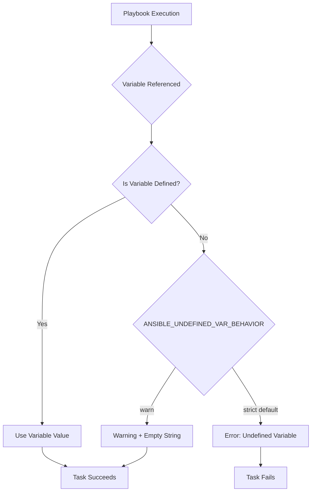
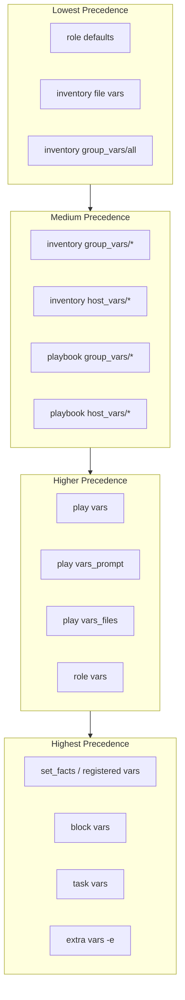

# How to Fix "Undefined Variable" Errors in Ansible

Author: [nawazdhandala](https://www.github.com/nawazdhandala)

Tags: Ansible, Automation, DevOps, Configuration Management, Troubleshooting, Variables

Description: Learn how to diagnose and fix undefined variable errors in Ansible playbooks with practical examples and debugging techniques.

---

You run your Ansible playbook and suddenly see: `FAILED! => {"msg": "The task includes an option with an undefined variable."}`. This error stops your automation in its tracks. Understanding why variables become undefined and how to fix them is essential for writing reliable Ansible playbooks.

## Understanding Undefined Variable Errors

Undefined variable errors occur when Ansible tries to use a variable that has not been defined or is not accessible in the current scope.



## Common Causes of Undefined Variables

### Cause 1: Typos in Variable Names

The most common cause is simply a typo in the variable name.

```yaml
# vars/main.yml - Variable definition
database_host: "db.example.com"

# tasks/main.yml - WRONG: typo in variable name
- name: Configure database connection
  template:
    src: config.j2
    dest: /etc/app/config.yml
  vars:
    # Typo: 'databse' instead of 'database'
    db_server: "{{ databse_host }}"  # This will fail!

# tasks/main.yml - CORRECT: proper variable name
- name: Configure database connection
  template:
    src: config.j2
    dest: /etc/app/config.yml
  vars:
    db_server: "{{ database_host }}"  # Correct spelling
```

### Cause 2: Variable Scope Issues

Variables defined in one play or role may not be accessible in another.

```yaml
# This will fail - variables from play 1 are not in play 2
---
- name: Play 1 - Define variables
  hosts: webservers
  vars:
    app_version: "2.0.0"
  tasks:
    - name: Display version
      debug:
        msg: "Version: {{ app_version }}"

- name: Play 2 - Try to use variables from Play 1
  hosts: dbservers
  tasks:
    - name: This will fail
      debug:
        msg: "Version: {{ app_version }}"  # Undefined!
```

The correct approach is to use proper variable scoping:

```yaml
# Solution 1: Define variables at the playbook level
---
- name: Common variables for all plays
  hosts: all
  vars:
    app_version: "2.0.0"

# Solution 2: Use group_vars or host_vars
# group_vars/all.yml
app_version: "2.0.0"

# Solution 3: Use set_fact with cacheable
- name: Set facts that persist
  hosts: webservers
  tasks:
    - name: Set cacheable fact
      set_fact:
        app_version: "2.0.0"
        cacheable: yes
```

### Cause 3: Conditional Variable Definition

Variables defined conditionally may not exist when expected.

```yaml
# Problem: Variable only defined when condition is true
- name: Set database type
  set_fact:
    db_type: "postgresql"
  when: use_postgresql | default(false)

- name: Configure database
  template:
    src: "{{ db_type }}.conf.j2"  # Fails if use_postgresql was false
    dest: /etc/db.conf
```

The fix is to always provide a default:

```yaml
# Solution: Use default filter
- name: Configure database
  template:
    src: "{{ db_type | default('mysql') }}.conf.j2"
    dest: /etc/db.conf

# Or ensure variable is always defined
- name: Set database type with default
  set_fact:
    db_type: "{{ 'postgresql' if (use_postgresql | default(false)) else 'mysql' }}"
```

## Using the Default Filter

The `default` filter is your best friend for handling potentially undefined variables.

```yaml
# Basic default value
server_port: "{{ custom_port | default(8080) }}"

# Default to another variable
backup_path: "{{ custom_backup_path | default(default_backup_path) }}"

# Default for boolean
enable_ssl: "{{ ssl_enabled | default(true) }}"

# Default for lists
allowed_ips: "{{ custom_allowed_ips | default(['127.0.0.1']) }}"

# Default for dictionaries
db_config: "{{ custom_db_config | default({'host': 'localhost', 'port': 5432}) }}"

# Chained defaults - try multiple variables
api_endpoint: "{{ primary_api | default(secondary_api) | default('https://api.example.com') }}"
```

### The omit Placeholder

Use `omit` to skip optional parameters when variables are undefined.

```yaml
# If backup_retention is undefined, the parameter is omitted entirely
- name: Configure backup
  backup_module:
    path: /data
    retention_days: "{{ backup_retention | default(omit) }}"
    compression: "{{ backup_compression | default(omit) }}"
```

## Debugging Undefined Variables

### Method 1: Use Debug Module

```yaml
# Print all variables available to a host
- name: Show all variables
  debug:
    var: hostvars[inventory_hostname]

# Print specific variable groups
- name: Show group variables
  debug:
    msg: |
      ansible_host: {{ ansible_host | default('NOT DEFINED') }}
      app_version: {{ app_version | default('NOT DEFINED') }}
      db_host: {{ db_host | default('NOT DEFINED') }}
```

### Method 2: Check Variable Definition

```yaml
# Check if variable is defined before using
- name: Check and use variable
  debug:
    msg: "App version is {{ app_version }}"
  when: app_version is defined

# Fail with clear message if required variable is missing
- name: Validate required variables
  fail:
    msg: "Required variable '{{ item }}' is not defined"
  when: vars[item] is not defined
  loop:
    - database_host
    - database_name
    - database_user
```

### Method 3: Use Verbose Mode

```bash
# Run playbook with increased verbosity to see variable values
ansible-playbook playbook.yml -vvv

# Show specific variable for all hosts
ansible all -m debug -a "var=hostvars[inventory_hostname].app_version"
```

## Variable Precedence

Understanding variable precedence helps avoid unexpected undefined variable errors.



## Handling Facts and Registered Variables

### Facts May Not Be Gathered

```yaml
# If gather_facts is disabled, ansible_* variables are undefined
- name: Configure server
  hosts: webservers
  gather_facts: no  # Facts not gathered!
  tasks:
    - name: This will fail
      debug:
        msg: "OS: {{ ansible_distribution }}"  # Undefined!

# Solution 1: Enable fact gathering
- name: Configure server
  hosts: webservers
  gather_facts: yes
  tasks:
    - name: Now this works
      debug:
        msg: "OS: {{ ansible_distribution }}"

# Solution 2: Gather facts manually when needed
- name: Configure server
  hosts: webservers
  gather_facts: no
  tasks:
    - name: Gather facts now
      setup:

    - name: Now facts are available
      debug:
        msg: "OS: {{ ansible_distribution }}"
```

### Registered Variables From Skipped Tasks

```yaml
# Problem: registered variable is undefined if task is skipped
- name: Get app status
  command: systemctl status myapp
  register: app_status
  when: check_app_status | default(false)

- name: Show status
  debug:
    msg: "{{ app_status.stdout }}"  # Fails if task was skipped!

# Solution: Check if variable is defined and not skipped
- name: Show status safely
  debug:
    msg: "{{ app_status.stdout }}"
  when:
    - app_status is defined
    - app_status is not skipped
```

## Best Practices for Avoiding Undefined Variables

### Create a Variables Validation Task

```yaml
# roles/myapp/tasks/validate.yml
---
- name: Validate required variables are defined
  assert:
    that:
      - app_name is defined
      - app_version is defined
      - app_port is defined
      - app_user is defined
    fail_msg: "One or more required variables are not defined"
    success_msg: "All required variables are defined"

- name: Validate variable types
  assert:
    that:
      - app_port | int > 0
      - app_port | int < 65536
      - app_user | length > 0
    fail_msg: "Variable validation failed"

# Include at the start of your role
# roles/myapp/tasks/main.yml
---
- name: Validate variables
  include_tasks: validate.yml

- name: Continue with deployment
  # ... rest of tasks
```

### Use Role Defaults

```yaml
# roles/myapp/defaults/main.yml
# Always provide sensible defaults
---
app_name: "myapp"
app_port: 8080
app_user: "appuser"
app_group: "appgroup"
app_home: "/opt/{{ app_name }}"
app_log_level: "info"

# Database defaults
db_host: "localhost"
db_port: 5432
db_name: "{{ app_name }}"
db_pool_size: 10

# Feature flags with safe defaults
enable_ssl: false
enable_monitoring: true
enable_debug: false
```

### Document Required Variables

```yaml
# roles/myapp/meta/argument_specs.yml
---
argument_specs:
  main:
    short_description: Deploy MyApp application
    description:
      - Deploys and configures MyApp
      - Requires database credentials to be provided
    options:
      app_version:
        type: str
        required: true
        description: Version of the application to deploy

      db_password:
        type: str
        required: true
        no_log: true
        description: Database password (sensitive)

      app_port:
        type: int
        required: false
        default: 8080
        description: Port for the application to listen on
```

## Complete Example: Robust Variable Handling

```yaml
# playbook.yml
---
- name: Deploy application with robust variable handling
  hosts: appservers
  vars_files:
    - vars/defaults.yml
    - vars/{{ env | default('development') }}.yml

  pre_tasks:
    - name: Validate all required variables
      assert:
        that:
          - item.var is defined
          - item.var | length > 0
        fail_msg: "Required variable '{{ item.name }}' is missing or empty"
      loop:
        - { name: 'app_version', var: "{{ app_version | default('') }}" }
        - { name: 'db_host', var: "{{ db_host | default('') }}" }
        - { name: 'db_password', var: "{{ db_password | default('') }}" }
      loop_control:
        label: "{{ item.name }}"

  tasks:
    - name: Display configuration
      debug:
        msg: |
          Application: {{ app_name | default('myapp') }}
          Version: {{ app_version }}
          Environment: {{ env | default('development') }}
          Database Host: {{ db_host }}
          Port: {{ app_port | default(8080) }}

    - name: Deploy application
      template:
        src: app-config.j2
        dest: "/etc/{{ app_name | default('myapp') }}/config.yml"
      vars:
        config:
          name: "{{ app_name | default('myapp') }}"
          version: "{{ app_version }}"
          port: "{{ app_port | default(8080) }}"
          database:
            host: "{{ db_host }}"
            port: "{{ db_port | default(5432) }}"
            name: "{{ db_name | default(app_name | default('myapp')) }}"
            pool_size: "{{ db_pool_size | default(10) }}"
          features:
            ssl: "{{ enable_ssl | default(false) }}"
            monitoring: "{{ enable_monitoring | default(true) }}"
```

---

Undefined variable errors are frustrating but preventable. Always use the `default` filter for optional variables, validate required variables at the start of your playbooks, and provide sensible defaults in your roles. When debugging, use verbose mode and the debug module to understand what variables are actually available. Following these practices will make your Ansible automation more reliable and easier to maintain.
