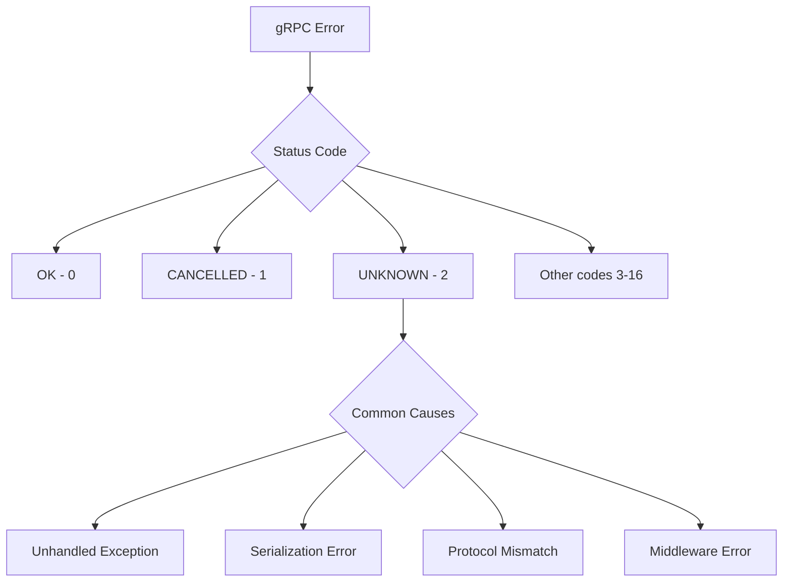
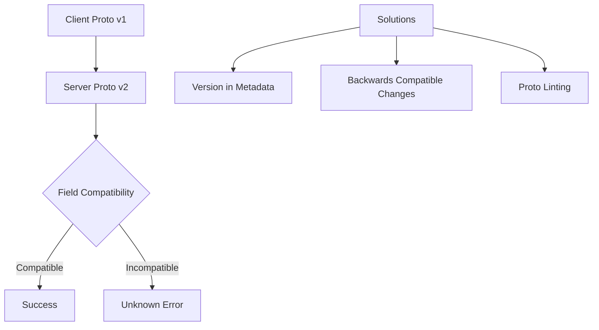
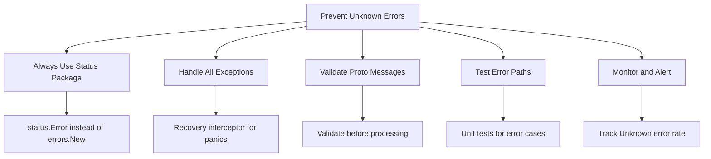

# How to Fix "Unknown" Status Errors in gRPC

Author: [nawazdhandala](https://www.github.com/nawazdhandala)

Tags: gRPC, Debugging, Error Handling, Status Codes, Troubleshooting

Description: Learn how to diagnose and resolve gRPC Unknown status errors caused by unhandled exceptions, serialization issues, and misconfigured services.

---

The UNKNOWN status code in gRPC indicates that an unexpected error occurred that does not map to a specific gRPC status code. These errors are often caused by unhandled exceptions, serialization problems, or misconfigured services. This guide covers common causes and provides practical solutions for fixing Unknown status errors.

## Understanding gRPC Status Codes

gRPC uses a standardized set of status codes to communicate error conditions.



## 1. Common Causes of Unknown Status

### Unhandled Server Exceptions

The most common cause of Unknown errors.

```go
// server_exception.go
package main

import (
    "context"
    "log"

    "google.golang.org/grpc/codes"
    "google.golang.org/grpc/status"

    pb "myapp/proto"
)

// BadServer demonstrates how unhandled panics cause Unknown errors
type BadServer struct {
    pb.UnimplementedUserServiceServer
}

func (s *BadServer) GetUser(ctx context.Context, req *pb.GetUserRequest) (*pb.User, error) {
    // This panic will result in an UNKNOWN error
    // The client will see: rpc error: code = Unknown desc =
    if req.UserId == "" {
        panic("user ID cannot be empty")
    }

    // This nil pointer dereference will also cause UNKNOWN
    var user *pb.User
    return user, nil // Returning nil with nil error can cause issues
}

// GoodServer properly handles errors and returns appropriate status codes
type GoodServer struct {
    pb.UnimplementedUserServiceServer
    db UserDB
}

func (s *GoodServer) GetUser(ctx context.Context, req *pb.GetUserRequest) (*pb.User, error) {
    // Validate input and return proper error
    if req.UserId == "" {
        return nil, status.Error(codes.InvalidArgument, "user_id is required")
    }

    user, err := s.db.FindByID(ctx, req.UserId)
    if err != nil {
        // Check for specific error types
        if isNotFound(err) {
            return nil, status.Error(codes.NotFound, "user not found")
        }
        if isTimeout(err) {
            return nil, status.Error(codes.DeadlineExceeded, "database query timed out")
        }
        // Log unexpected errors and return Internal instead of Unknown
        log.Printf("Unexpected database error: %v", err)
        return nil, status.Error(codes.Internal, "internal server error")
    }

    return user, nil
}

func isNotFound(err error) bool {
    // Check if error is a not found error
    return false
}

func isTimeout(err error) bool {
    // Check if error is a timeout
    return false
}

type UserDB interface {
    FindByID(ctx context.Context, id string) (*pb.User, error)
}
```

### Proper Error Conversion

```go
// error_conversion.go
package main

import (
    "context"
    "database/sql"
    "errors"
    "io"
    "net"
    "os"

    "google.golang.org/grpc/codes"
    "google.golang.org/grpc/status"
)

// ErrorConverter converts common errors to gRPC status
type ErrorConverter struct{}

// Convert converts an error to a gRPC status error
func (c *ErrorConverter) Convert(err error) error {
    if err == nil {
        return nil
    }

    // Check if already a gRPC status error
    if _, ok := status.FromError(err); ok {
        return err
    }

    // Context errors
    if errors.Is(err, context.Canceled) {
        return status.Error(codes.Canceled, "operation was canceled")
    }
    if errors.Is(err, context.DeadlineExceeded) {
        return status.Error(codes.DeadlineExceeded, "operation timed out")
    }

    // Database errors
    if errors.Is(err, sql.ErrNoRows) {
        return status.Error(codes.NotFound, "resource not found")
    }

    // IO errors
    if errors.Is(err, io.EOF) {
        return status.Error(codes.Unavailable, "connection closed")
    }

    // OS errors
    if errors.Is(err, os.ErrNotExist) {
        return status.Error(codes.NotFound, "file not found")
    }
    if errors.Is(err, os.ErrPermission) {
        return status.Error(codes.PermissionDenied, "permission denied")
    }

    // Network errors
    var netErr net.Error
    if errors.As(err, &netErr) {
        if netErr.Timeout() {
            return status.Error(codes.DeadlineExceeded, "network timeout")
        }
        return status.Error(codes.Unavailable, "network error")
    }

    // Unknown error - log for debugging
    return status.Errorf(codes.Internal, "internal error: %v", err)
}

// WrapHandler wraps a handler to convert errors automatically
func WrapHandler[Req, Resp any](
    handler func(context.Context, Req) (Resp, error),
    converter *ErrorConverter,
) func(context.Context, Req) (Resp, error) {
    return func(ctx context.Context, req Req) (Resp, error) {
        resp, err := handler(ctx, req)
        if err != nil {
            err = converter.Convert(err)
        }
        return resp, err
    }
}
```

## 2. Serialization Issues

Protocol buffer serialization problems often cause Unknown errors.

```go
// serialization_issues.go
package main

import (
    "context"
    "log"

    "google.golang.org/grpc/codes"
    "google.golang.org/grpc/status"
    "google.golang.org/protobuf/proto"

    pb "myapp/proto"
)

// Common serialization problems

// Problem 1: Returning wrong message type
type WrongTypeServer struct {
    pb.UnimplementedUserServiceServer
}

func (s *WrongTypeServer) GetUser(ctx context.Context, req *pb.GetUserRequest) (*pb.User, error) {
    // This compiles but may cause serialization issues if types differ
    // Always return the exact type defined in the proto
    return &pb.User{
        Id:    req.UserId,
        Name:  "John Doe",
        Email: "john@example.com",
    }, nil
}

// Problem 2: Oversized messages
func (s *WrongTypeServer) GetAllUsers(ctx context.Context, req *pb.GetAllUsersRequest) (*pb.GetAllUsersResponse, error) {
    users := make([]*pb.User, 0)

    // Loading too many users can exceed message size limits
    // Default max is 4MB, but can be configured
    for i := 0; i < 1000000; i++ {
        users = append(users, &pb.User{
            Id:   string(rune(i)),
            Name: "User with a very long name that takes up space",
        })
    }

    resp := &pb.GetAllUsersResponse{Users: users}

    // Check message size before returning
    size := proto.Size(resp)
    if size > 4*1024*1024 { // 4MB
        log.Printf("Response too large: %d bytes", size)
        return nil, status.Error(codes.ResourceExhausted, "response exceeds maximum size")
    }

    return resp, nil
}

// Solution: Paginate large responses
func (s *WrongTypeServer) GetUsersPaginated(ctx context.Context, req *pb.GetUsersRequest) (*pb.GetUsersResponse, error) {
    pageSize := int(req.PageSize)
    if pageSize <= 0 || pageSize > 100 {
        pageSize = 100 // Default and max page size
    }

    // Fetch only the requested page
    users, nextToken, err := s.fetchUsersPage(ctx, req.PageToken, pageSize)
    if err != nil {
        return nil, status.Error(codes.Internal, "failed to fetch users")
    }

    return &pb.GetUsersResponse{
        Users:         users,
        NextPageToken: nextToken,
    }, nil
}

func (s *WrongTypeServer) fetchUsersPage(ctx context.Context, token string, size int) ([]*pb.User, string, error) {
    return nil, "", nil
}
```

### Handling Invalid Protocol Buffer Messages

```go
// proto_validation.go
package main

import (
    "context"

    "google.golang.org/grpc/codes"
    "google.golang.org/grpc/status"

    pb "myapp/proto"
)

// Validator validates protobuf messages
type Validator interface {
    Validate() error
}

// ValidationInterceptor validates incoming requests
func ValidationInterceptor() grpc.UnaryServerInterceptor {
    return func(
        ctx context.Context,
        req interface{},
        info *grpc.UnaryServerInfo,
        handler grpc.UnaryHandler,
    ) (interface{}, error) {
        // Check if request implements Validator
        if v, ok := req.(Validator); ok {
            if err := v.Validate(); err != nil {
                return nil, status.Errorf(codes.InvalidArgument, "validation failed: %v", err)
            }
        }

        return handler(ctx, req)
    }
}

// GetUserRequest with validation
type GetUserRequest struct {
    *pb.GetUserRequest
}

func (r *GetUserRequest) Validate() error {
    if r.UserId == "" {
        return status.Error(codes.InvalidArgument, "user_id is required")
    }
    if len(r.UserId) > 128 {
        return status.Error(codes.InvalidArgument, "user_id is too long")
    }
    return nil
}
```

## 3. Protocol Version Mismatches

Client and server using different proto versions can cause Unknown errors.



### Checking Proto Compatibility

```go
// proto_compat.go
package main

import (
    "context"
    "log"

    "google.golang.org/grpc"
    "google.golang.org/grpc/codes"
    "google.golang.org/grpc/metadata"
    "google.golang.org/grpc/status"
)

const (
    ProtoVersionHeader = "x-proto-version"
    CurrentProtoVersion = "v2"
)

// ProtoVersionInterceptor checks client proto version
func ProtoVersionInterceptor(supportedVersions []string) grpc.UnaryServerInterceptor {
    supported := make(map[string]bool)
    for _, v := range supportedVersions {
        supported[v] = true
    }

    return func(
        ctx context.Context,
        req interface{},
        info *grpc.UnaryServerInfo,
        handler grpc.UnaryHandler,
    ) (interface{}, error) {
        md, ok := metadata.FromIncomingContext(ctx)
        if !ok {
            // No metadata - allow request but log warning
            log.Printf("Warning: no proto version header for %s", info.FullMethod)
            return handler(ctx, req)
        }

        versions := md.Get(ProtoVersionHeader)
        if len(versions) == 0 {
            // No version header - allow request
            return handler(ctx, req)
        }

        clientVersion := versions[0]
        if !supported[clientVersion] {
            return nil, status.Errorf(
                codes.FailedPrecondition,
                "unsupported proto version: %s, supported: %v",
                clientVersion, supportedVersions,
            )
        }

        return handler(ctx, req)
    }
}

// ClientVersionInterceptor adds proto version to outgoing requests
func ClientVersionInterceptor(version string) grpc.UnaryClientInterceptor {
    return func(
        ctx context.Context,
        method string,
        req, reply interface{},
        cc *grpc.ClientConn,
        invoker grpc.UnaryInvoker,
        opts ...grpc.CallOption,
    ) error {
        ctx = metadata.AppendToOutgoingContext(ctx, ProtoVersionHeader, version)
        return invoker(ctx, method, req, reply, cc, opts...)
    }
}
```

## 4. Middleware and Interceptor Errors

Errors in interceptors can cause Unknown status.

```go
// middleware_errors.go
package main

import (
    "context"
    "log"

    "google.golang.org/grpc"
    "google.golang.org/grpc/codes"
    "google.golang.org/grpc/status"
)

// BadInterceptor can cause Unknown errors
func BadInterceptor() grpc.UnaryServerInterceptor {
    return func(
        ctx context.Context,
        req interface{},
        info *grpc.UnaryServerInfo,
        handler grpc.UnaryHandler,
    ) (interface{}, error) {
        // Panic in interceptor causes Unknown error
        // panic("something went wrong")

        // Returning non-gRPC error causes Unknown error
        // return nil, errors.New("plain error")

        return handler(ctx, req)
    }
}

// SafeInterceptor handles errors properly
func SafeInterceptor() grpc.UnaryServerInterceptor {
    return func(
        ctx context.Context,
        req interface{},
        info *grpc.UnaryServerInfo,
        handler grpc.UnaryHandler,
    ) (resp interface{}, err error) {
        // Recover from panics
        defer func() {
            if r := recover(); r != nil {
                log.Printf("Panic in interceptor for %s: %v", info.FullMethod, r)
                err = status.Errorf(codes.Internal, "internal error")
            }
        }()

        resp, err = handler(ctx, req)

        // Convert non-gRPC errors
        if err != nil {
            if _, ok := status.FromError(err); !ok {
                log.Printf("Non-gRPC error: %v", err)
                err = status.Errorf(codes.Internal, "internal error: %v", err)
            }
        }

        return resp, err
    }
}

// ErrorConversionInterceptor converts all errors to proper gRPC status
func ErrorConversionInterceptor() grpc.UnaryServerInterceptor {
    return func(
        ctx context.Context,
        req interface{},
        info *grpc.UnaryServerInfo,
        handler grpc.UnaryHandler,
    ) (interface{}, error) {
        resp, err := handler(ctx, req)

        if err != nil {
            // Already a gRPC status error
            if st, ok := status.FromError(err); ok {
                // Check for Unknown status and try to provide more context
                if st.Code() == codes.Unknown {
                    log.Printf("Unknown error in %s: %v", info.FullMethod, st.Message())
                }
                return nil, err
            }

            // Convert to Internal error with message
            log.Printf("Converting error to gRPC status: %v", err)
            return nil, status.Errorf(codes.Internal, "internal error: %v", err)
        }

        return resp, nil
    }
}
```

## 5. Debugging Unknown Errors

Techniques for finding the root cause of Unknown errors.

```go
// debug_unknown.go
package main

import (
    "context"
    "log"
    "runtime/debug"

    "google.golang.org/grpc"
    "google.golang.org/grpc/codes"
    "google.golang.org/grpc/status"
)

// DebugInterceptor logs detailed information about Unknown errors
func DebugInterceptor() grpc.UnaryServerInterceptor {
    return func(
        ctx context.Context,
        req interface{},
        info *grpc.UnaryServerInfo,
        handler grpc.UnaryHandler,
    ) (resp interface{}, err error) {
        // Capture stack trace on panic
        defer func() {
            if r := recover(); r != nil {
                stack := debug.Stack()
                log.Printf("PANIC in %s: %v\nStack trace:\n%s", info.FullMethod, r, stack)
                err = status.Errorf(codes.Internal, "internal error (panic)")
            }
        }()

        resp, err = handler(ctx, req)

        if err != nil {
            st, ok := status.FromError(err)
            if !ok {
                // Not a gRPC error - this would become Unknown
                log.Printf("NON-GRPC ERROR in %s: %T: %v", info.FullMethod, err, err)
                log.Printf("Stack trace:\n%s", debug.Stack())
            } else if st.Code() == codes.Unknown {
                // gRPC Unknown error
                log.Printf("UNKNOWN ERROR in %s: %v", info.FullMethod, st.Message())
                log.Printf("Stack trace:\n%s", debug.Stack())
            }
        }

        return resp, err
    }
}

// ClientDebugInterceptor logs Unknown errors on client side
func ClientDebugInterceptor() grpc.UnaryClientInterceptor {
    return func(
        ctx context.Context,
        method string,
        req, reply interface{},
        cc *grpc.ClientConn,
        invoker grpc.UnaryInvoker,
        opts ...grpc.CallOption,
    ) error {
        err := invoker(ctx, method, req, reply, cc, opts...)

        if err != nil {
            st, ok := status.FromError(err)
            if ok && st.Code() == codes.Unknown {
                log.Printf("CLIENT: Unknown error from %s", method)
                log.Printf("  Message: %s", st.Message())

                // Check for details
                for _, detail := range st.Details() {
                    log.Printf("  Detail: %T: %v", detail, detail)
                }
            }
        }

        return err
    }
}
```

### Using Error Details

```go
// error_details.go
package main

import (
    "context"

    "google.golang.org/genproto/googleapis/rpc/errdetails"
    "google.golang.org/grpc/codes"
    "google.golang.org/grpc/status"
)

// CreateDetailedError creates an error with additional details
func CreateDetailedError(code codes.Code, message string, details ...interface{}) error {
    st := status.New(code, message)

    // Add error details
    for _, detail := range details {
        switch d := detail.(type) {
        case *errdetails.BadRequest:
            st, _ = st.WithDetails(d)
        case *errdetails.DebugInfo:
            st, _ = st.WithDetails(d)
        case *errdetails.ErrorInfo:
            st, _ = st.WithDetails(d)
        case *errdetails.RetryInfo:
            st, _ = st.WithDetails(d)
        }
    }

    return st.Err()
}

// Example: Return detailed validation error
func (s *server) CreateUser(ctx context.Context, req *CreateUserRequest) (*User, error) {
    // Validate request
    violations := validateCreateUserRequest(req)
    if len(violations) > 0 {
        br := &errdetails.BadRequest{
            FieldViolations: violations,
        }
        return nil, CreateDetailedError(
            codes.InvalidArgument,
            "invalid request",
            br,
        )
    }

    // Process request...
    return nil, nil
}

func validateCreateUserRequest(req *CreateUserRequest) []*errdetails.BadRequest_FieldViolation {
    var violations []*errdetails.BadRequest_FieldViolation

    if req.Email == "" {
        violations = append(violations, &errdetails.BadRequest_FieldViolation{
            Field:       "email",
            Description: "email is required",
        })
    }

    return violations
}

// Client: Extract error details
func handleError(err error) {
    st, ok := status.FromError(err)
    if !ok {
        log.Printf("Non-gRPC error: %v", err)
        return
    }

    log.Printf("Error code: %s", st.Code())
    log.Printf("Error message: %s", st.Message())

    for _, detail := range st.Details() {
        switch d := detail.(type) {
        case *errdetails.BadRequest:
            log.Println("Validation errors:")
            for _, v := range d.GetFieldViolations() {
                log.Printf("  - %s: %s", v.GetField(), v.GetDescription())
            }
        case *errdetails.DebugInfo:
            log.Printf("Debug info: %s", d.GetDetail())
            log.Printf("Stack trace: %v", d.GetStackEntries())
        case *errdetails.ErrorInfo:
            log.Printf("Error reason: %s", d.GetReason())
            log.Printf("Error domain: %s", d.GetDomain())
        }
    }
}
```

## 6. Common Scenarios and Fixes

### Scenario 1: HTTP/2 Protocol Issues

```go
// http2_issues.go
package main

import (
    "crypto/tls"
    "log"
    "net"

    "google.golang.org/grpc"
    "google.golang.org/grpc/credentials"
)

// Problem: Using HTTP/1.1 instead of HTTP/2
// gRPC requires HTTP/2, and protocol mismatch causes Unknown errors

// Server setup with proper TLS
func createSecureServer() *grpc.Server {
    cert, err := tls.LoadX509KeyPair("server.crt", "server.key")
    if err != nil {
        log.Fatalf("Failed to load certificates: %v", err)
    }

    tlsConfig := &tls.Config{
        Certificates: []tls.Certificate{cert},
        MinVersion:   tls.VersionTLS12,
        // Force HTTP/2
        NextProtos: []string{"h2"},
    }

    creds := credentials.NewTLS(tlsConfig)
    return grpc.NewServer(grpc.Creds(creds))
}

// Client setup with proper TLS
func createSecureClient(target string) (*grpc.ClientConn, error) {
    tlsConfig := &tls.Config{
        // Force HTTP/2
        NextProtos: []string{"h2"},
    }

    creds := credentials.NewTLS(tlsConfig)
    return grpc.Dial(target, grpc.WithTransportCredentials(creds))
}
```

### Scenario 2: Load Balancer Misconfiguration

```yaml
# nginx.conf
# Problem: NGINX not configured for gRPC

# Incorrect configuration
server {
    listen 443 ssl;
    # Missing http2 directive

    location / {
        # Using proxy_pass instead of grpc_pass
        proxy_pass http://backend;
    }
}

# Correct configuration
server {
    listen 443 ssl http2;  # Enable HTTP/2

    location / {
        grpc_pass grpc://backend;  # Use grpc_pass for gRPC

        # Important headers for gRPC
        grpc_set_header Host $host;
        grpc_set_header X-Real-IP $remote_addr;
    }

    # Handle gRPC errors
    error_page 502 = /error502grpc;
    location = /error502grpc {
        internal;
        default_type application/grpc;
        add_header grpc-status 14;
        add_header content-type application/grpc;
        return 204;
    }
}
```

### Scenario 3: Connection Pool Exhaustion

```go
// connection_pool.go
package main

import (
    "context"
    "sync"
    "time"

    "google.golang.org/grpc"
    "google.golang.org/grpc/connectivity"
    "google.golang.org/grpc/credentials/insecure"
)

// ConnectionPool manages multiple connections
type ConnectionPool struct {
    target  string
    conns   []*grpc.ClientConn
    mu      sync.Mutex
    index   int
    size    int
}

// NewConnectionPool creates a new connection pool
func NewConnectionPool(target string, size int) (*ConnectionPool, error) {
    pool := &ConnectionPool{
        target: target,
        conns:  make([]*grpc.ClientConn, size),
        size:   size,
    }

    for i := 0; i < size; i++ {
        conn, err := grpc.Dial(
            target,
            grpc.WithTransportCredentials(insecure.NewCredentials()),
            grpc.WithDefaultServiceConfig(`{"loadBalancingPolicy":"round_robin"}`),
        )
        if err != nil {
            pool.Close()
            return nil, err
        }
        pool.conns[i] = conn
    }

    // Start health checker
    go pool.healthCheck()

    return pool, nil
}

// Get returns a healthy connection
func (p *ConnectionPool) Get() *grpc.ClientConn {
    p.mu.Lock()
    defer p.mu.Unlock()

    // Try to find a ready connection
    for i := 0; i < p.size; i++ {
        idx := (p.index + i) % p.size
        conn := p.conns[idx]

        if conn.GetState() == connectivity.Ready {
            p.index = (idx + 1) % p.size
            return conn
        }
    }

    // Return any connection (it will reconnect)
    conn := p.conns[p.index]
    p.index = (p.index + 1) % p.size
    return conn
}

// healthCheck monitors and repairs connections
func (p *ConnectionPool) healthCheck() {
    ticker := time.NewTicker(10 * time.Second)
    defer ticker.Stop()

    for range ticker.C {
        p.mu.Lock()
        for i, conn := range p.conns {
            state := conn.GetState()
            if state == connectivity.TransientFailure || state == connectivity.Shutdown {
                // Reconnect
                conn.Close()
                newConn, err := grpc.Dial(
                    p.target,
                    grpc.WithTransportCredentials(insecure.NewCredentials()),
                )
                if err == nil {
                    p.conns[i] = newConn
                }
            }
        }
        p.mu.Unlock()
    }
}

// Close closes all connections
func (p *ConnectionPool) Close() {
    p.mu.Lock()
    defer p.mu.Unlock()

    for _, conn := range p.conns {
        if conn != nil {
            conn.Close()
        }
    }
}
```

## 7. Monitoring Unknown Errors

Track Unknown errors for proactive debugging.

```go
// monitoring.go
package main

import (
    "context"

    "github.com/prometheus/client_golang/prometheus"
    "github.com/prometheus/client_golang/prometheus/promauto"
    "google.golang.org/grpc"
    "google.golang.org/grpc/codes"
    "google.golang.org/grpc/status"
)

var (
    unknownErrors = promauto.NewCounterVec(
        prometheus.CounterOpts{
            Name: "grpc_unknown_errors_total",
            Help: "Total number of Unknown gRPC errors",
        },
        []string{"method", "message_prefix"},
    )

    errorsByCode = promauto.NewCounterVec(
        prometheus.CounterOpts{
            Name: "grpc_errors_by_code_total",
            Help: "Total number of gRPC errors by code",
        },
        []string{"method", "code"},
    )
)

// UnknownErrorMonitoringInterceptor tracks Unknown errors
func UnknownErrorMonitoringInterceptor() grpc.UnaryServerInterceptor {
    return func(
        ctx context.Context,
        req interface{},
        info *grpc.UnaryServerInfo,
        handler grpc.UnaryHandler,
    ) (interface{}, error) {
        resp, err := handler(ctx, req)

        if err != nil {
            st, ok := status.FromError(err)
            if ok {
                errorsByCode.WithLabelValues(info.FullMethod, st.Code().String()).Inc()

                if st.Code() == codes.Unknown {
                    // Extract first 50 chars of message for grouping
                    msg := st.Message()
                    if len(msg) > 50 {
                        msg = msg[:50]
                    }
                    unknownErrors.WithLabelValues(info.FullMethod, msg).Inc()
                }
            }
        }

        return resp, err
    }
}
```

### Alerting Configuration

```yaml
# prometheus-rules.yaml
groups:
  - name: grpc_unknown_errors
    rules:
      # Alert on high rate of Unknown errors
      - alert: HighUnknownErrorRate
        expr: |
          sum(rate(grpc_unknown_errors_total[5m])) by (method)
          /
          sum(rate(grpc_server_requests_total[5m])) by (method)
          > 0.01
        for: 5m
        labels:
          severity: warning
        annotations:
          summary: "High rate of Unknown gRPC errors"
          description: "Method {{ $labels.method }} has >1% Unknown error rate"

      # Alert on any Unknown errors (for critical services)
      - alert: UnknownErrorsDetected
        expr: increase(grpc_unknown_errors_total[5m]) > 0
        for: 1m
        labels:
          severity: info
        annotations:
          summary: "Unknown gRPC errors detected"
          description: "{{ $value }} Unknown errors in {{ $labels.method }}"
```

## 8. Best Practices to Prevent Unknown Errors

Follow these guidelines to minimize Unknown errors.



### Comprehensive Error Handling Template

```go
// error_template.go
package main

import (
    "context"
    "log"

    "google.golang.org/grpc/codes"
    "google.golang.org/grpc/status"
)

// ServiceError represents a domain error
type ServiceError struct {
    Code    codes.Code
    Message string
    Err     error
}

func (e *ServiceError) Error() string {
    if e.Err != nil {
        return e.Message + ": " + e.Err.Error()
    }
    return e.Message
}

func (e *ServiceError) GRPCStatus() *status.Status {
    return status.New(e.Code, e.Message)
}

// Common service errors
var (
    ErrNotFound = &ServiceError{
        Code:    codes.NotFound,
        Message: "resource not found",
    }

    ErrInvalidArgument = &ServiceError{
        Code:    codes.InvalidArgument,
        Message: "invalid argument",
    }

    ErrInternal = &ServiceError{
        Code:    codes.Internal,
        Message: "internal error",
    }
)

// WrapError wraps an error with a service error
func WrapError(err error, serviceErr *ServiceError) error {
    return &ServiceError{
        Code:    serviceErr.Code,
        Message: serviceErr.Message,
        Err:     err,
    }
}

// ToGRPCError converts any error to a gRPC status error
func ToGRPCError(err error) error {
    if err == nil {
        return nil
    }

    // Check for ServiceError
    if se, ok := err.(*ServiceError); ok {
        return se.GRPCStatus().Err()
    }

    // Check for existing gRPC status
    if _, ok := status.FromError(err); ok {
        return err
    }

    // Unknown error - log and convert
    log.Printf("Converting unknown error: %T: %v", err, err)
    return status.Error(codes.Internal, "internal error")
}

// Example handler using the template
func (s *server) GetResource(ctx context.Context, req *GetResourceRequest) (*Resource, error) {
    // Validate
    if req.Id == "" {
        return nil, status.Error(codes.InvalidArgument, "id is required")
    }

    // Fetch resource
    resource, err := s.repo.Find(ctx, req.Id)
    if err != nil {
        if isNotFoundError(err) {
            return nil, status.Error(codes.NotFound, "resource not found")
        }
        log.Printf("Error fetching resource: %v", err)
        return nil, status.Error(codes.Internal, "failed to fetch resource")
    }

    return resource, nil
}

func isNotFoundError(err error) bool {
    return false
}
```

---

Unknown status errors in gRPC often indicate unhandled exceptions or configuration issues. By using the status package consistently, implementing proper error conversion, handling panics with recovery interceptors, and monitoring Unknown error rates, you can build more reliable gRPC services with clearer error reporting for both developers and operators.
