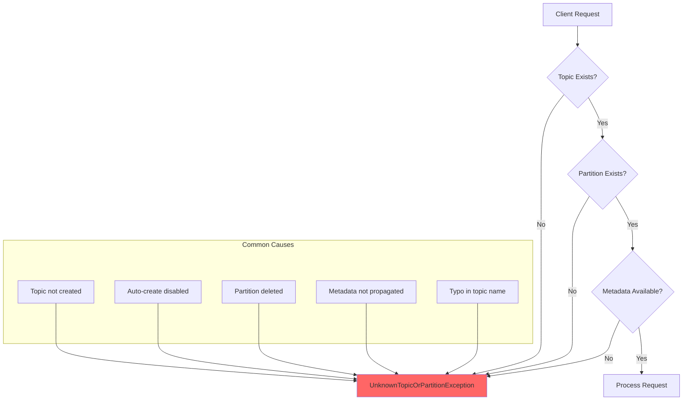
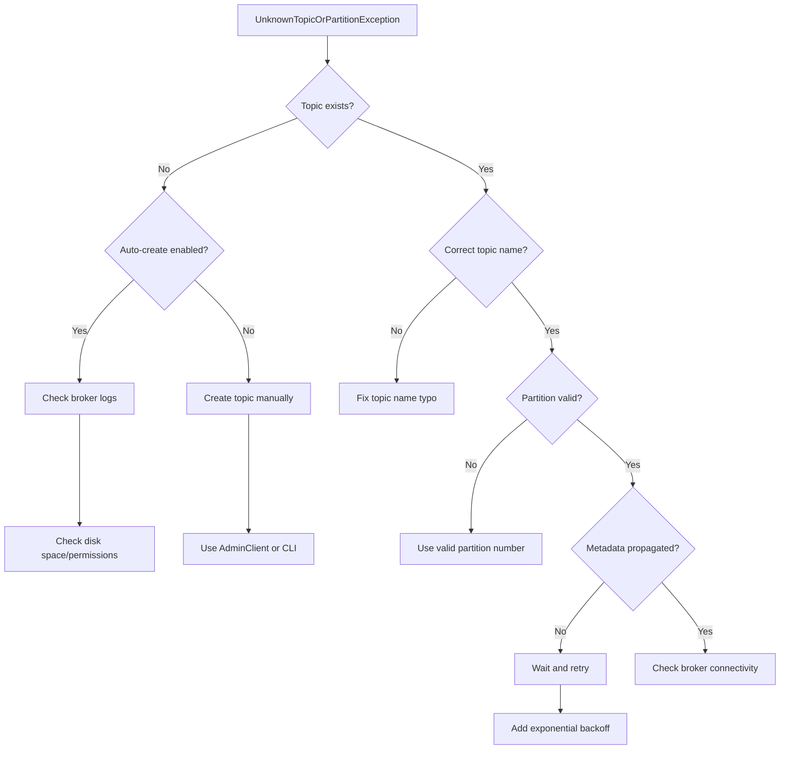

# How to Fix 'UnknownTopicOrPartitionException' in Kafka

Author: [nawazdhandala](https://www.github.com/nawazdhandala)

Tags: Kafka, Apache Kafka, Troubleshooting, Topic Management, Partitions, Java, Admin, Configuration

Description: A comprehensive guide to diagnosing and fixing UnknownTopicOrPartitionException in Apache Kafka, including causes, solutions, and best practices for topic and partition management.

---

> The `UnknownTopicOrPartitionException` in Apache Kafka indicates that a producer or consumer is trying to interact with a topic or partition that does not exist or is not yet available. This error can occur due to misconfiguration, timing issues during topic creation, or actual missing topics. This guide will help you diagnose and fix this common Kafka error.

Understanding why this exception occurs and how to prevent it is essential for building reliable Kafka-based applications.

---

## Understanding the Exception



### When This Exception Occurs

| Scenario | Description | Solution |
|----------|-------------|----------|
| Topic does not exist | Producing/consuming from non-existent topic | Create topic or enable auto-create |
| Partition does not exist | Accessing partition beyond topic's partition count | Check partition configuration |
| Topic being created | Race condition during topic creation | Add retry logic with backoff |
| Metadata stale | Cluster metadata not yet updated | Refresh metadata |
| Typo in topic name | Misspelled topic name in configuration | Verify topic names |

---

## Solution: Create Topic Before Use

```java
import org.apache.kafka.clients.admin.AdminClient;
import org.apache.kafka.clients.admin.AdminClientConfig;
import org.apache.kafka.clients.admin.CreateTopicsResult;
import org.apache.kafka.clients.admin.NewTopic;
import org.apache.kafka.common.errors.TopicExistsException;

import java.util.Collections;
import java.util.Properties;
import java.util.concurrent.ExecutionException;

public class TopicCreator {

    private final AdminClient adminClient;

    public TopicCreator(String bootstrapServers) {
        Properties props = new Properties();
        props.put(AdminClientConfig.BOOTSTRAP_SERVERS_CONFIG, bootstrapServers);
        this.adminClient = AdminClient.create(props);
    }

    public void createTopic(String topicName, int partitions, short replicationFactor) {
        NewTopic newTopic = new NewTopic(topicName, partitions, replicationFactor);

        // Configure topic settings
        newTopic.configs(java.util.Map.of(
            "cleanup.policy", "delete",
            "retention.ms", "604800000",  // 7 days
            "min.insync.replicas", "2"
        ));

        CreateTopicsResult result =
            adminClient.createTopics(Collections.singleton(newTopic));

        try {
            result.all().get();
            System.out.println("Topic '" + topicName + "' created successfully");

        } catch (ExecutionException e) {
            if (e.getCause() instanceof TopicExistsException) {
                System.out.println("Topic '" + topicName + "' already exists");
            } else {
                throw new RuntimeException("Failed to create topic", e);
            }
        } catch (InterruptedException e) {
            Thread.currentThread().interrupt();
            throw new RuntimeException("Topic creation interrupted", e);
        }
    }

    public void createTopicIfNotExists(String topicName, int partitions,
                                        short replicationFactor) {
        try {
            boolean exists = adminClient.listTopics().names().get()
                                        .contains(topicName);

            if (!exists) {
                createTopic(topicName, partitions, replicationFactor);
            } else {
                System.out.println("Topic '" + topicName + "' already exists");
            }
        } catch (InterruptedException | ExecutionException e) {
            throw new RuntimeException("Error checking/creating topic", e);
        }
    }
}
```

---

## Solution: Wait for Topic Availability

```java
import org.apache.kafka.clients.admin.AdminClient;
import org.apache.kafka.clients.admin.DescribeTopicsResult;
import org.apache.kafka.common.errors.UnknownTopicOrPartitionException;

import java.util.Collections;
import java.util.concurrent.ExecutionException;

public class TopicAvailabilityWaiter {

    private final AdminClient adminClient;

    public TopicAvailabilityWaiter(AdminClient adminClient) {
        this.adminClient = adminClient;
    }

    public boolean waitForTopic(String topicName, long timeoutMs) {
        long startTime = System.currentTimeMillis();
        long backoff = 100;
        long maxBackoff = 5000;

        while (System.currentTimeMillis() - startTime < timeoutMs) {
            try {
                DescribeTopicsResult result =
                    adminClient.describeTopics(Collections.singletonList(topicName));
                result.topicNameValues().get(topicName).get();

                System.out.println("Topic '" + topicName + "' is available");
                return true;

            } catch (ExecutionException e) {
                if (e.getCause() instanceof UnknownTopicOrPartitionException) {
                    System.out.println("Topic not yet available, waiting...");

                    try {
                        Thread.sleep(backoff);
                    } catch (InterruptedException ie) {
                        Thread.currentThread().interrupt();
                        return false;
                    }

                    backoff = Math.min(backoff * 2, maxBackoff);
                } else {
                    throw new RuntimeException("Error checking topic", e);
                }
            } catch (InterruptedException e) {
                Thread.currentThread().interrupt();
                return false;
            }
        }

        System.err.println("Timeout waiting for topic '" + topicName + "'");
        return false;
    }
}
```

---

## Troubleshooting Flowchart



---

## Best Practices Summary

1. **Create topics explicitly** before deploying producers/consumers
2. **Disable auto.create.topics.enable** in production
3. **Use infrastructure as code** for topic management
4. **Validate topics at application startup** before processing
5. **Implement retry logic** with exponential backoff for transient errors
6. **Monitor topic health** and alert on missing or unhealthy topics
7. **Use consistent naming conventions** to avoid typos
8. **Document required topics** for each application

---

## Conclusion

The `UnknownTopicOrPartitionException` is usually straightforward to fix once you identify whether the topic truly does not exist or if it is a timing/propagation issue. The key preventive measures are explicit topic creation, startup validation, and proper retry handling.

---

*Need to monitor your Kafka topics and ensure they are always available? [OneUptime](https://oneuptime.com) provides comprehensive monitoring for Apache Kafka, including topic health checks, partition metrics, and automated alerting for missing or unhealthy topics.*
