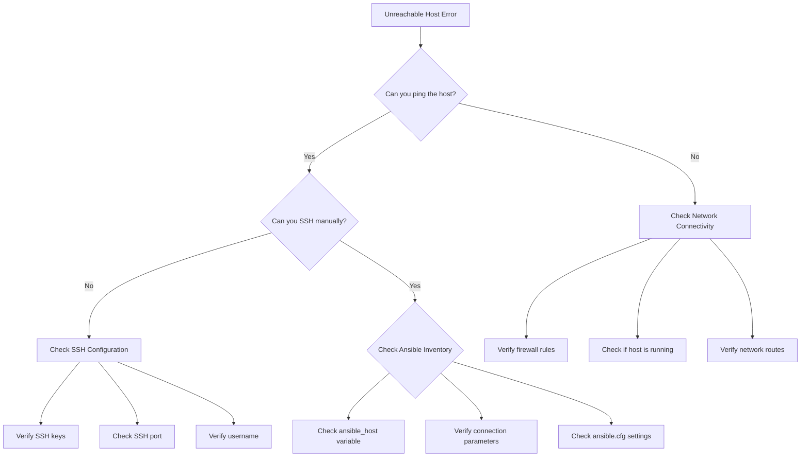
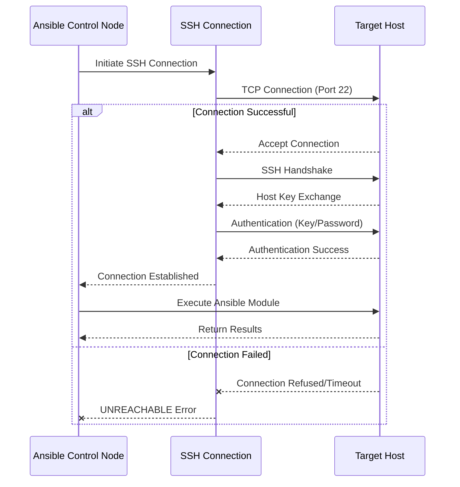
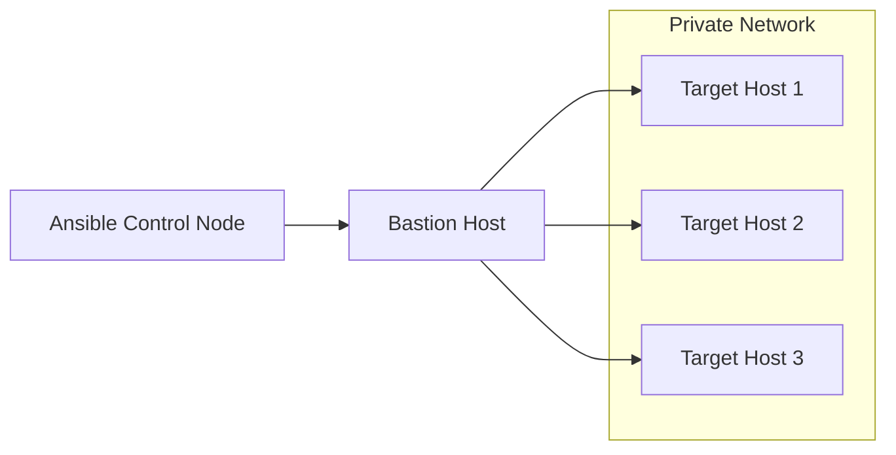

# How to Fix 'Unreachable' Host Errors in Ansible

Author: [nawazdhandala](https://www.github.com/nawazdhandala)

Tags: Ansible, DevOps, Automation, Troubleshooting, SSH, Networking

Description: Learn how to diagnose and fix common 'unreachable' host errors in Ansible playbooks by checking network connectivity, SSH configuration, and inventory settings.

---

When running Ansible playbooks, encountering the dreaded "UNREACHABLE!" error can halt your automation workflows. This error indicates that Ansible cannot establish a connection to one or more target hosts. In this guide, we will walk through the common causes and solutions for fixing unreachable host errors in Ansible.

## Understanding the Error

The unreachable error typically looks like this:

```
fatal: [webserver01]: UNREACHABLE! => {
    "changed": false,
    "msg": "Failed to connect to the host via ssh: ssh: connect to host 192.168.1.100 port 22: Connection timed out",
    "unreachable": true
}
```

This error can stem from various issues including network problems, SSH configuration errors, or incorrect inventory settings.

## Troubleshooting Flow



## Step 1: Verify Basic Network Connectivity

Before diving into Ansible-specific troubleshooting, confirm that the target host is reachable from your control node.

```bash
# Test basic connectivity to the target host
# Replace 192.168.1.100 with your actual target IP
ping -c 4 192.168.1.100

# Check if the SSH port is open
# This tests if port 22 is accepting connections
nc -zv 192.168.1.100 22

# Alternative: use telnet to test SSH port
telnet 192.168.1.100 22
```

If the ping fails, check the following:

- Verify the host is powered on and running
- Check that the IP address is correct
- Ensure there are no firewall rules blocking traffic
- Verify network routing between the control node and target

## Step 2: Test SSH Connection Manually

If the network is reachable, try connecting via SSH manually to isolate whether the issue is SSH-related or Ansible-related.

```bash
# Attempt manual SSH connection with verbose output
# The -v flag provides detailed connection debugging information
ssh -v username@192.168.1.100

# If using a specific private key
# Specify the path to your SSH private key
ssh -v -i /path/to/private_key username@192.168.1.100

# If using a non-standard SSH port
# Use -p to specify the custom port number
ssh -v -p 2222 username@192.168.1.100
```

Common SSH issues to look for in the verbose output:

- Permission denied (authentication failure)
- Host key verification failed
- Connection refused (SSH service not running)
- Connection timed out (firewall or network issue)

## Step 3: Check Your Ansible Inventory

Ensure your inventory file is correctly configured with the proper connection parameters.

```ini
# inventory/hosts.ini
# Define web servers group with connection parameters

[webservers]
# Specify the host with all necessary connection details
webserver01 ansible_host=192.168.1.100 ansible_user=deploy ansible_port=22

# You can also define variables for a group
[webservers:vars]
# Set SSH private key for all hosts in this group
ansible_ssh_private_key_file=/home/ansible/.ssh/id_rsa
# Set Python interpreter path (useful for various OS)
ansible_python_interpreter=/usr/bin/python3
```

For YAML inventory format:

```yaml
# inventory/hosts.yml
# YAML format inventory with nested structure

all:
  children:
    webservers:
      hosts:
        webserver01:
          # IP address or hostname of the target
          ansible_host: 192.168.1.100
          # SSH username for authentication
          ansible_user: deploy
          # SSH port (default is 22)
          ansible_port: 22
          # Path to SSH private key
          ansible_ssh_private_key_file: /home/ansible/.ssh/id_rsa
```

## Step 4: Verify Ansible Configuration

Check your `ansible.cfg` file for settings that might affect connectivity.

```ini
# ansible.cfg
# Place this file in your project root or /etc/ansible/

[defaults]
# Path to your inventory file or directory
inventory = ./inventory/hosts.ini
# Default SSH user for connections
remote_user = deploy
# Path to default SSH private key
private_key_file = /home/ansible/.ssh/id_rsa
# Disable host key checking (use with caution in production)
host_key_checking = False
# SSH connection timeout in seconds
timeout = 30

[ssh_connection]
# SSH arguments for persistent connections
# ControlMaster enables connection sharing
# ControlPersist keeps connections open for reuse
ssh_args = -C -o ControlMaster=auto -o ControlPersist=60s
# Number of SSH connection retries
retries = 3
```

## Step 5: Use Ansible Debug Options

Run your playbook with increased verbosity to get more debugging information.

```bash
# Run playbook with maximum verbosity
# -vvvv provides the most detailed output including SSH debug info
ansible-playbook -vvvv playbook.yml

# Test connectivity to all hosts in inventory
# This is a quick way to verify Ansible can reach all hosts
ansible all -m ping

# Test connectivity to a specific host
ansible webserver01 -m ping -vvv

# Test with explicit connection parameters
# Override inventory settings for testing
ansible webserver01 -m ping \
  -u deploy \
  -i inventory/hosts.ini \
  --private-key=/home/ansible/.ssh/id_rsa
```

## Step 6: Common Fixes

### Fix 1: SSH Host Key Issues

If you see "Host key verification failed", you need to add the host key to known_hosts.

```bash
# Add host key to known_hosts automatically
# StrictHostKeyChecking=accept-new adds new keys but rejects changed ones
ssh-keyscan -H 192.168.1.100 >> ~/.ssh/known_hosts

# Or connect once manually to accept the key
ssh deploy@192.168.1.100
```

Alternatively, disable host key checking in ansible.cfg (not recommended for production):

```ini
# ansible.cfg
[defaults]
# Disable host key verification (security risk in production)
host_key_checking = False
```

### Fix 2: SSH Key Permissions

SSH keys must have correct permissions to be accepted.

```bash
# Set correct permissions on SSH directory
# Directory should be readable only by owner
chmod 700 ~/.ssh

# Set correct permissions on private key
# Private key must not be readable by others
chmod 600 ~/.ssh/id_rsa

# Set correct permissions on public key
chmod 644 ~/.ssh/id_rsa.pub

# Set correct permissions on known_hosts
chmod 644 ~/.ssh/known_hosts
```

### Fix 3: Firewall Configuration

Ensure firewalls on both control node and target allow SSH traffic.

```bash
# Check if SSH port is blocked by firewall (on target host)
# List current firewall rules
sudo iptables -L -n | grep 22

# Allow SSH through UFW firewall
sudo ufw allow ssh

# Allow SSH through firewalld
sudo firewall-cmd --permanent --add-service=ssh
sudo firewall-cmd --reload
```

### Fix 4: SSH Service Status

Verify the SSH service is running on the target host.

```bash
# Check SSH service status
sudo systemctl status sshd

# Start SSH service if not running
sudo systemctl start sshd

# Enable SSH to start on boot
sudo systemctl enable sshd
```

## Connection Flow Diagram



## Step 7: Advanced Troubleshooting

### Using Connection Plugins

If standard SSH is not working, you might need to use a different connection plugin.

```yaml
# playbook.yml
# Configure connection settings at play level
---
- name: Configure web servers
  hosts: webservers
  # Specify connection type explicitly
  connection: ssh
  # Gather facts can fail on unreachable hosts
  gather_facts: yes

  vars:
    # Connection timeout in seconds
    ansible_ssh_timeout: 30
    # Additional SSH arguments
    ansible_ssh_common_args: '-o StrictHostKeyChecking=no'
    # Use pipelining for better performance
    ansible_ssh_pipelining: true

  tasks:
    - name: Test connectivity
      ansible.builtin.ping:
```

### Handling Bastion/Jump Hosts

If you need to connect through a bastion host, configure SSH proxy settings.

```ini
# inventory/hosts.ini
# Configuration for hosts behind a bastion/jump host

[webservers]
webserver01 ansible_host=10.0.0.100

[webservers:vars]
# Configure SSH to use bastion host as jump proxy
# ProxyJump specifies the intermediate host
ansible_ssh_common_args='-o ProxyJump=bastion_user@bastion.example.com'
```



## Prevention Best Practices

1. **Use SSH key-based authentication** instead of passwords for more reliable connections
2. **Implement connection pooling** with ControlMaster to reduce connection overhead
3. **Set appropriate timeouts** in ansible.cfg to handle slow networks
4. **Use ansible-pull** for hosts with intermittent connectivity
5. **Monitor host availability** before running playbooks

```yaml
# pre_tasks example to check connectivity
# playbook.yml
---
- name: Deploy application with connectivity check
  hosts: webservers
  gather_facts: no

  pre_tasks:
    - name: Wait for host to be reachable
      # Wait up to 300 seconds for SSH to become available
      ansible.builtin.wait_for_connection:
        timeout: 300
        delay: 5

    - name: Gather facts after connection confirmed
      ansible.builtin.setup:

  tasks:
    - name: Continue with deployment
      ansible.builtin.debug:
        msg: "Host {{ inventory_hostname }} is reachable"
```

## Summary

Unreachable host errors in Ansible typically stem from network connectivity issues, SSH configuration problems, or incorrect inventory settings. By following this systematic troubleshooting approach, you can identify and resolve these errors efficiently. Start with basic network tests, verify SSH connectivity manually, check your inventory configuration, and use Ansible's verbose mode for detailed debugging information.
