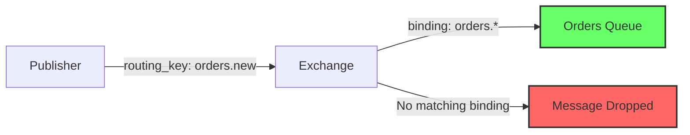
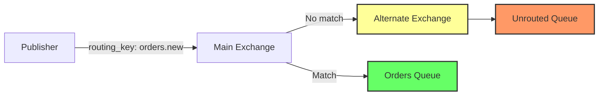
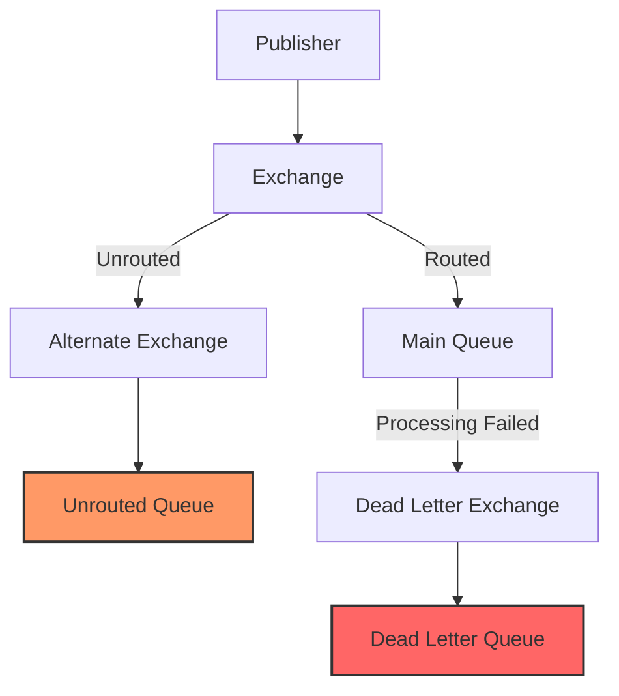

# How to Fix 'Unroutable Message' Errors in RabbitMQ

Author: [nawazdhandala](https://www.github.com/nawazdhandala)

Tags: RabbitMQ, Message Queue, Troubleshooting, DevOps, Messaging, AMQP, Error Handling

Description: Learn how to diagnose and fix unroutable message errors in RabbitMQ by understanding exchange types, binding configurations, and implementing proper message handling strategies.

---

> Unroutable messages in RabbitMQ occur when a message is published to an exchange but no queue is bound to receive it. This guide will help you understand why this happens and how to fix it.

When RabbitMQ receives a message that cannot be routed to any queue, the default behavior is to silently drop the message. This can lead to data loss and debugging nightmares if you are not prepared.

---

## Understanding the Problem

### What Causes Unroutable Messages?

Unroutable messages occur when:

1. **No queue is bound to the exchange** - The exchange has no bindings
2. **Routing key mismatch** - The message routing key does not match any binding
3. **Queue was deleted** - A previously bound queue no longer exists
4. **Binding was removed** - The binding between exchange and queue was removed



### Default Behavior

By default, RabbitMQ silently drops unroutable messages:

```python
# This message will be silently dropped if no queue is bound
import pika

connection = pika.BlockingConnection(pika.ConnectionParameters('localhost'))
channel = connection.channel()

# Declare a direct exchange
channel.exchange_declare(exchange='orders', exchange_type='direct')

# Publish without any queue bound - message is lost!
channel.basic_publish(
    exchange='orders',
    routing_key='orders.new',
    body='Order data here'
)

print("Message sent - but was it delivered?")  # You won't know!
```

---

## Solution 1: Use Mandatory Flag with Return Callbacks

The `mandatory` flag tells RabbitMQ to return the message if it cannot be routed:

```python
import pika
import logging

logging.basicConfig(level=logging.INFO)
logger = logging.getLogger(__name__)

def on_message_returned(channel, method, properties, body):
    """
    Callback function invoked when a message cannot be routed.
    This allows you to handle unroutable messages gracefully.
    """
    logger.error(f"Message returned: {body.decode()}")
    logger.error(f"Reply code: {method.reply_code}")
    logger.error(f"Reply text: {method.reply_text}")
    logger.error(f"Exchange: {method.exchange}")
    logger.error(f"Routing key: {method.routing_key}")

    # Implement your fallback logic here
    # Options: store in database, send to dead letter queue, alert ops team
    handle_unroutable_message(body, method.routing_key)

def handle_unroutable_message(body, routing_key):
    """Store unroutable messages for later investigation"""
    # Store in a fallback location (database, file, etc.)
    logger.warning(f"Storing unroutable message for routing key: {routing_key}")

# Set up connection with return callback
connection = pika.BlockingConnection(pika.ConnectionParameters('localhost'))
channel = connection.channel()

# Register the return callback
channel.add_on_return_callback(on_message_returned)

# Declare exchange
channel.exchange_declare(exchange='orders', exchange_type='direct')

# Publish with mandatory=True - message will be returned if unroutable
channel.basic_publish(
    exchange='orders',
    routing_key='orders.new',
    body='Order data here',
    mandatory=True  # Key setting - enables return callback
)

# Process any returned messages
connection.process_data_events()
```

---

## Solution 2: Use Alternate Exchange

An alternate exchange (AE) catches all unroutable messages and routes them to a backup queue:



### Setting Up an Alternate Exchange

```python
import pika

connection = pika.BlockingConnection(pika.ConnectionParameters('localhost'))
channel = connection.channel()

# Step 1: Create the alternate exchange (fanout to catch everything)
channel.exchange_declare(
    exchange='unrouted-messages',
    exchange_type='fanout'  # Fanout sends to all bound queues
)

# Step 2: Create a queue to store unrouted messages
channel.queue_declare(queue='unrouted-queue', durable=True)

# Step 3: Bind the queue to the alternate exchange
channel.queue_bind(
    queue='unrouted-queue',
    exchange='unrouted-messages'
)

# Step 4: Create the main exchange with alternate-exchange argument
channel.exchange_declare(
    exchange='orders',
    exchange_type='direct',
    arguments={
        'alternate-exchange': 'unrouted-messages'  # Fallback exchange
    }
)

# Now any unroutable message goes to unrouted-queue
channel.basic_publish(
    exchange='orders',
    routing_key='nonexistent.key',  # No binding for this key
    body='This message will go to unrouted-queue'
)

print("Message sent to alternate exchange")
```

### Consuming Unrouted Messages

```python
def process_unrouted_message(ch, method, properties, body):
    """
    Process messages that could not be routed to their intended destination.
    These messages require investigation and potential manual handling.
    """
    print(f"Unrouted message received: {body.decode()}")

    # Log for investigation
    logger.warning(f"Unrouted message: {body.decode()}")

    # Check original routing key if available in headers
    if properties.headers:
        original_key = properties.headers.get('x-first-death-reason')
        logger.info(f"Original routing context: {original_key}")

    # Acknowledge after processing
    ch.basic_ack(delivery_tag=method.delivery_tag)

# Consume from the unrouted queue
channel.basic_consume(
    queue='unrouted-queue',
    on_message_callback=process_unrouted_message
)

print("Waiting for unrouted messages...")
channel.start_consuming()
```

---

## Solution 3: Publisher Confirms

Publisher confirms provide acknowledgment that a message was successfully routed:

```python
import pika

connection = pika.BlockingConnection(pika.ConnectionParameters('localhost'))
channel = connection.channel()

# Enable publisher confirms on this channel
channel.confirm_delivery()

# Declare exchange and queue
channel.exchange_declare(exchange='orders', exchange_type='direct')
channel.queue_declare(queue='orders-queue', durable=True)
channel.queue_bind(queue='orders-queue', exchange='orders', routing_key='orders.new')

try:
    # Publish with confirmation - will raise exception if not confirmed
    channel.basic_publish(
        exchange='orders',
        routing_key='orders.new',
        body='Order data',
        mandatory=True,
        properties=pika.BasicProperties(
            delivery_mode=2  # Persistent message
        )
    )
    print("Message was confirmed by broker")

except pika.exceptions.UnroutableError as e:
    # This exception is raised when mandatory=True and message is unroutable
    print(f"Message could not be routed: {e}")
    # Handle the unroutable message
    for returned_message in e.messages:
        print(f"Returned: {returned_message.body}")
```

---

## Solution 4: Proper Exchange and Queue Setup

Ensure your exchanges and queues are properly configured:

```python
import pika

def setup_rabbitmq_topology():
    """
    Set up a robust RabbitMQ topology with proper bindings
    and alternate exchange for unroutable messages.
    """
    connection = pika.BlockingConnection(pika.ConnectionParameters('localhost'))
    channel = connection.channel()

    # Create alternate exchange for catching unrouted messages
    channel.exchange_declare(
        exchange='ae.unrouted',
        exchange_type='fanout',
        durable=True
    )

    # Create queue for unrouted messages
    channel.queue_declare(
        queue='q.unrouted',
        durable=True,
        arguments={
            'x-message-ttl': 604800000  # 7 days TTL for investigation
        }
    )
    channel.queue_bind(queue='q.unrouted', exchange='ae.unrouted')

    # Create main exchange with alternate exchange
    channel.exchange_declare(
        exchange='ex.orders',
        exchange_type='topic',  # Topic for flexible routing
        durable=True,
        arguments={
            'alternate-exchange': 'ae.unrouted'
        }
    )

    # Create queues for different order types
    queues = [
        ('q.orders.new', 'orders.new'),
        ('q.orders.update', 'orders.update'),
        ('q.orders.cancel', 'orders.cancel'),
    ]

    for queue_name, routing_key in queues:
        channel.queue_declare(queue=queue_name, durable=True)
        channel.queue_bind(
            queue=queue_name,
            exchange='ex.orders',
            routing_key=routing_key
        )
        print(f"Created queue {queue_name} with binding {routing_key}")

    # Create a catch-all binding for orders.*
    channel.queue_declare(queue='q.orders.all', durable=True)
    channel.queue_bind(
        queue='q.orders.all',
        exchange='ex.orders',
        routing_key='orders.*'  # Wildcard binding
    )

    connection.close()
    print("Topology setup complete")

setup_rabbitmq_topology()
```

---

## Diagnosing Unroutable Messages

### Using RabbitMQ Management API

```bash
# Check exchange bindings
curl -u guest:guest http://localhost:15672/api/exchanges/%2F/orders/bindings/source

# Check queue bindings
curl -u guest:guest http://localhost:15672/api/queues/%2F/orders-queue/bindings

# Get exchange details including alternate exchange
curl -u guest:guest http://localhost:15672/api/exchanges/%2F/orders
```

### Using rabbitmqctl

```bash
# List all exchanges
rabbitmqctl list_exchanges name type

# List all bindings
rabbitmqctl list_bindings source_name source_kind destination_name destination_kind routing_key

# Check for exchanges without bindings
rabbitmqctl list_exchanges name type | while read name type; do
    bindings=$(rabbitmqctl list_bindings source_name | grep "^$name$" | wc -l)
    if [ "$bindings" -eq 0 ]; then
        echo "Exchange $name has no bindings"
    fi
done
```

---

## Monitoring Unroutable Messages

### Enable Metrics

```python
# Using Prometheus metrics
from prometheus_client import Counter

unroutable_messages = Counter(
    'rabbitmq_unroutable_messages_total',
    'Total number of unroutable messages',
    ['exchange', 'routing_key']
)

def on_message_returned(channel, method, properties, body):
    """Track unroutable messages with Prometheus metrics"""
    unroutable_messages.labels(
        exchange=method.exchange,
        routing_key=method.routing_key
    ).inc()

    # Log and handle the message
    logger.error(f"Unroutable message to {method.exchange}/{method.routing_key}")
```

### RabbitMQ Configuration for Logging

```ini
# rabbitmq.conf - Enable logging for unroutable messages
log.file.level = info

# Enable return logging
log.channel.level = warning
```

---

## Best Practices

### 1. Always Use Alternate Exchanges in Production

```python
# Every main exchange should have an alternate exchange
channel.exchange_declare(
    exchange='production.exchange',
    exchange_type='topic',
    durable=True,
    arguments={'alternate-exchange': 'ae.unrouted'}
)
```

### 2. Use Publisher Confirms for Critical Messages

```python
channel.confirm_delivery()

# Critical business messages should always use confirms
channel.basic_publish(
    exchange='payments',
    routing_key='payment.process',
    body=payment_data,
    mandatory=True
)
```

### 3. Implement Dead Letter Queues



### 4. Monitor and Alert

```yaml
# Prometheus alerting rule
groups:
  - name: rabbitmq
    rules:
      - alert: HighUnroutableMessageRate
        expr: rate(rabbitmq_unroutable_messages_total[5m]) > 10
        for: 5m
        labels:
          severity: warning
        annotations:
          summary: High rate of unroutable messages
          description: "More than 10 unroutable messages per second"
```

---

## Common Mistakes to Avoid

1. **Forgetting to bind queues** - Always verify bindings after creating exchanges
2. **Typos in routing keys** - Use constants for routing keys
3. **Not handling returned messages** - Always register return callbacks
4. **Ignoring alternate exchanges** - Set up AE for all production exchanges
5. **Not monitoring unrouted queues** - Regularly check and process unrouted messages

---

## Conclusion

Unroutable message errors in RabbitMQ can lead to silent data loss if not properly handled. Key takeaways:

- **Use mandatory flag** with return callbacks for critical messages
- **Set up alternate exchanges** to catch unroutable messages
- **Enable publisher confirms** for delivery guarantees
- **Monitor and alert** on unroutable message rates
- **Regularly audit** exchange and queue bindings

---

*Need to monitor your RabbitMQ cluster? [OneUptime](https://oneuptime.com) provides comprehensive monitoring for message queues with alerting on unroutable messages and queue depth.*
