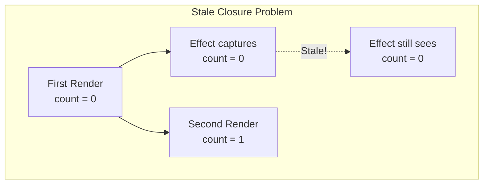
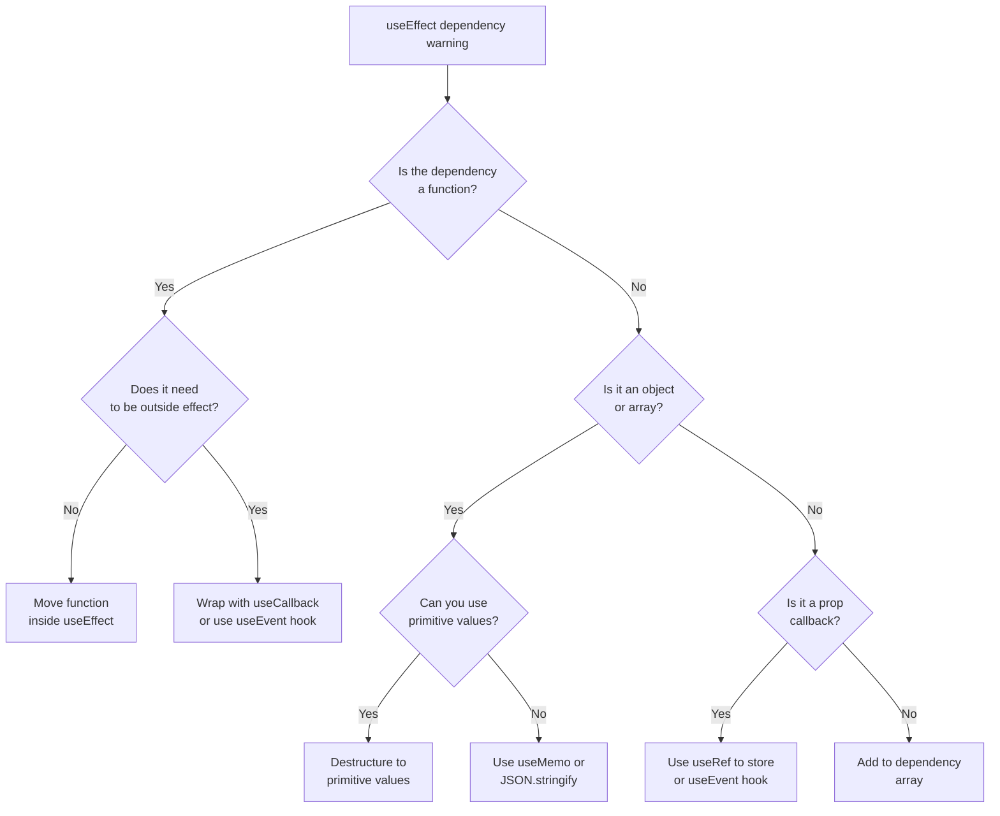

# How to Fix 'useEffect Dependencies' Warnings

Author: [nawazdhandala](https://www.github.com/nawazdhandala)

Tags: React, useEffect, Hooks, Dependencies, ESLint, JavaScript, TypeScript, Debugging

Description: Learn how to fix React useEffect dependency warnings by understanding the dependency array and implementing proper patterns for side effects.

---

> The exhaustive-deps ESLint rule exists to prevent bugs caused by stale closures in useEffect. Ignoring these warnings leads to subtle bugs where your effect uses outdated values. Learn to fix them properly instead of disabling the rule.

Understanding useEffect dependencies is crucial for writing bug-free React components.

---

## Understanding the Warning



---

## Why the Warning Exists

### The Stale Closure Problem

```tsx
// BAD: Missing dependency causes stale closure
function Counter() {
  const [count, setCount] = useState(0);

  useEffect(() => {
    // This interval always logs 0 because count is captured
    // at the time the effect runs (only on mount)
    const interval = setInterval(() => {
      console.log('Count:', count); // Always logs 0
    }, 1000);

    return () => clearInterval(interval);
  }, []); // Warning: count is missing from dependencies

  return (
    <button onClick={() => setCount((c) => c + 1)}>
      Count: {count}
    </button>
  );
}

// GOOD: Include the dependency
function Counter() {
  const [count, setCount] = useState(0);

  useEffect(() => {
    const interval = setInterval(() => {
      console.log('Count:', count); // Logs current count
    }, 1000);

    return () => clearInterval(interval);
  }, [count]); // Effect re-runs when count changes

  return (
    <button onClick={() => setCount((c) => c + 1)}>
      Count: {count}
    </button>
  );
}
```

---

## Common Warning Patterns

### Pattern 1: Fetching Data with Variables

```tsx
// BAD: Missing userId dependency
function UserProfile({ userId }: { userId: string }) {
  const [user, setUser] = useState<User | null>(null);

  useEffect(() => {
    fetchUser(userId).then(setUser);
  }, []); // Warning: userId is missing

  // Bug: When userId prop changes, the effect does not re-run
  // Component shows stale data from the previous user

  return <div>{user?.name}</div>;
}

// GOOD: Include userId in dependencies
function UserProfile({ userId }: { userId: string }) {
  const [user, setUser] = useState<User | null>(null);

  useEffect(() => {
    // Create abort controller for cleanup
    const abortController = new AbortController();

    fetchUser(userId, { signal: abortController.signal })
      .then(setUser)
      .catch((error) => {
        // Ignore abort errors
        if (error.name !== 'AbortError') {
          console.error('Failed to fetch user:', error);
        }
      });

    // Cleanup: abort fetch if userId changes before fetch completes
    return () => abortController.abort();
  }, [userId]); // Re-fetch when userId changes

  return <div>{user?.name}</div>;
}
```

### Pattern 2: Event Handlers That Use State

```tsx
// BAD: Handler captures stale state
function SearchComponent() {
  const [query, setQuery] = useState('');
  const [results, setResults] = useState<string[]>([]);

  const handleSearch = () => {
    // This function captures query at creation time
    searchAPI(query).then(setResults);
  };

  useEffect(() => {
    document.addEventListener('keydown', (e) => {
      if (e.key === 'Enter') {
        handleSearch(); // Uses stale query value
      }
    });
  }, []); // Warning: handleSearch is missing

  return (
    <input value={query} onChange={(e) => setQuery(e.target.value)} />
  );
}

// GOOD: Use useCallback with proper dependencies
function SearchComponent() {
  const [query, setQuery] = useState('');
  const [results, setResults] = useState<string[]>([]);

  // Memoize handler with its dependencies
  const handleSearch = useCallback(() => {
    searchAPI(query).then(setResults);
  }, [query]);

  useEffect(() => {
    const handleKeyDown = (e: KeyboardEvent) => {
      if (e.key === 'Enter') {
        handleSearch();
      }
    };

    document.addEventListener('keydown', handleKeyDown);
    return () => document.removeEventListener('keydown', handleKeyDown);
  }, [handleSearch]); // Re-attach when handler changes

  return (
    <input value={query} onChange={(e) => setQuery(e.target.value)} />
  );
}
```

### Pattern 3: Object and Array Dependencies

```tsx
// BAD: Object reference changes every render
function DataFetcher({ options }: { options: { page: number; limit: number } }) {
  const [data, setData] = useState([]);

  useEffect(() => {
    fetchData(options).then(setData);
  }, [options]); // Effect runs every render because options is new object

  return <div>{data.length} items</div>;
}

// GOOD: Destructure to primitive values
function DataFetcher({ options }: { options: { page: number; limit: number } }) {
  const [data, setData] = useState([]);
  const { page, limit } = options;

  useEffect(() => {
    fetchData({ page, limit }).then(setData);
  }, [page, limit]); // Only re-run when page or limit actually change

  return <div>{data.length} items</div>;
}

// ALTERNATIVE: Use JSON.stringify for complex objects
function DataFetcher({ filters }: { filters: Record<string, string> }) {
  const [data, setData] = useState([]);
  const filtersKey = JSON.stringify(filters);

  useEffect(() => {
    const parsedFilters = JSON.parse(filtersKey);
    fetchData(parsedFilters).then(setData);
  }, [filtersKey]); // String comparison is stable

  return <div>{data.length} items</div>;
}
```

---

## Fixing Strategies

### Strategy 1: Move Functions Inside useEffect

```tsx
// BEFORE: Function defined outside effect
function Component({ userId }: { userId: string }) {
  const [user, setUser] = useState<User | null>(null);

  // This function is recreated every render
  const loadUser = async () => {
    const data = await fetchUser(userId);
    setUser(data);
  };

  useEffect(() => {
    loadUser();
  }, []); // Warning: loadUser is missing (and userId transitively)

  return <div>{user?.name}</div>;
}

// AFTER: Function defined inside effect
function Component({ userId }: { userId: string }) {
  const [user, setUser] = useState<User | null>(null);

  useEffect(() => {
    // Define the async function inside the effect
    const loadUser = async () => {
      const data = await fetchUser(userId);
      setUser(data);
    };

    loadUser();
  }, [userId]); // Only userId needs to be a dependency

  return <div>{user?.name}</div>;
}
```

### Strategy 2: Use useCallback for Handlers

```tsx
// BEFORE: Inline function in dependency
function Timer() {
  const [count, setCount] = useState(0);

  useEffect(() => {
    const tick = () => {
      setCount(count + 1); // Captures stale count
    };

    const id = setInterval(tick, 1000);
    return () => clearInterval(id);
  }, [count]); // Effect restarts every second!

  return <div>{count}</div>;
}

// AFTER: Use functional update to remove dependency
function Timer() {
  const [count, setCount] = useState(0);

  useEffect(() => {
    const tick = () => {
      // Functional update - does not need count in closure
      setCount((prevCount) => prevCount + 1);
    };

    const id = setInterval(tick, 1000);
    return () => clearInterval(id);
  }, []); // No dependencies needed

  return <div>{count}</div>;
}
```

### Strategy 3: Use useRef for Mutable Values

```tsx
// BEFORE: Callback changes cause effect to re-run
function Component({ onComplete }: { onComplete: () => void }) {
  const [isLoading, setIsLoading] = useState(true);

  useEffect(() => {
    loadData().then(() => {
      setIsLoading(false);
      onComplete(); // onComplete changes every render
    });
  }, [onComplete]); // Effect re-runs unnecessarily

  return <div>{isLoading ? 'Loading...' : 'Done'}</div>;
}

// AFTER: Store callback in ref
function Component({ onComplete }: { onComplete: () => void }) {
  const [isLoading, setIsLoading] = useState(true);
  const onCompleteRef = useRef(onComplete);

  // Keep ref updated with latest callback
  useEffect(() => {
    onCompleteRef.current = onComplete;
  });

  useEffect(() => {
    loadData().then(() => {
      setIsLoading(false);
      onCompleteRef.current(); // Always calls latest callback
    });
  }, []); // Effect runs only once

  return <div>{isLoading ? 'Loading...' : 'Done'}</div>;
}
```

---

## Advanced Patterns

### Custom Hook for Event Handlers

Create a hook that always provides the latest callback:

```tsx
// src/hooks/useEvent.ts
import { useCallback, useRef, useLayoutEffect } from 'react';

// This hook returns a stable function that always calls the latest callback
export function useEvent<T extends (...args: any[]) => any>(
  callback: T
): T {
  const callbackRef = useRef<T>(callback);

  // Update ref synchronously after each render
  useLayoutEffect(() => {
    callbackRef.current = callback;
  });

  // Return a stable function that calls the ref
  return useCallback(
    ((...args) => callbackRef.current(...args)) as T,
    []
  );
}

// Usage
function SearchComponent({ onSearch }: { onSearch: (query: string) => void }) {
  const [query, setQuery] = useState('');

  // stableOnSearch never changes but always calls latest onSearch
  const stableOnSearch = useEvent(onSearch);

  useEffect(() => {
    const debounceId = setTimeout(() => {
      if (query) {
        stableOnSearch(query);
      }
    }, 300);

    return () => clearTimeout(debounceId);
  }, [query, stableOnSearch]); // stableOnSearch is stable, no re-runs

  return (
    <input value={query} onChange={(e) => setQuery(e.target.value)} />
  );
}
```

### Debounced Effect Hook

```tsx
// src/hooks/useDebouncedEffect.ts
import { useEffect, useRef } from 'react';

export function useDebouncedEffect(
  effect: () => void | (() => void),
  dependencies: any[],
  delay: number
) {
  const timeoutRef = useRef<NodeJS.Timeout>();
  const cleanupRef = useRef<(() => void) | void>();

  useEffect(() => {
    // Clear any pending timeout
    if (timeoutRef.current) {
      clearTimeout(timeoutRef.current);
    }

    // Set new timeout
    timeoutRef.current = setTimeout(() => {
      // Run any previous cleanup
      if (cleanupRef.current) {
        cleanupRef.current();
      }
      // Run effect and store cleanup
      cleanupRef.current = effect();
    }, delay);

    // Cleanup on unmount or dependency change
    return () => {
      if (timeoutRef.current) {
        clearTimeout(timeoutRef.current);
      }
      if (cleanupRef.current) {
        cleanupRef.current();
      }
    };
    // eslint-disable-next-line react-hooks/exhaustive-deps
  }, [...dependencies, delay]);
}

// Usage
function SearchResults({ query }: { query: string }) {
  const [results, setResults] = useState<string[]>([]);

  useDebouncedEffect(
    () => {
      if (!query) {
        setResults([]);
        return;
      }

      const controller = new AbortController();

      searchAPI(query, { signal: controller.signal })
        .then(setResults)
        .catch(() => {});

      return () => controller.abort();
    },
    [query],
    300 // Debounce by 300ms
  );

  return (
    <ul>
      {results.map((result) => (
        <li key={result}>{result}</li>
      ))}
    </ul>
  );
}
```

---

## Decision Tree



---

## When to Suppress the Warning

Only suppress warnings when you have a legitimate reason:

```tsx
// ACCEPTABLE: Effect intentionally runs only once
function Analytics({ pageId }: { pageId: string }) {
  useEffect(() => {
    // Track page view only on mount, not on every pageId change
    // This is intentional for analytics purposes
    trackPageView(pageId);

    // eslint-disable-next-line react-hooks/exhaustive-deps
  }, []); // Intentionally empty

  return null;
}

// DOCUMENT WHY you are suppressing:
// - The effect should only run on mount
// - Subsequent pageId changes are tracked elsewhere
// - This matches the analytics team's requirements
```

---

## Common Mistakes

### Mistake 1: Adding Setters to Dependencies

```tsx
// UNNECESSARY: setState functions are stable
function Counter() {
  const [count, setCount] = useState(0);

  useEffect(() => {
    const id = setInterval(() => {
      setCount((c) => c + 1);
    }, 1000);

    return () => clearInterval(id);
  }, [setCount]); // setCount is stable, no need to include

  // React guarantees setState functions are stable across renders
  // Including them is harmless but unnecessary
}
```

### Mistake 2: Infinite Loops

```tsx
// BAD: Creates infinite loop
function DataLoader() {
  const [data, setData] = useState<Data[]>([]);

  useEffect(() => {
    fetchData().then((newData) => {
      setData([...data, ...newData]); // Depends on data
    });
  }, [data]); // Effect runs, updates data, triggers effect again

  return <div>{data.length}</div>;
}

// GOOD: Use functional update
function DataLoader() {
  const [data, setData] = useState<Data[]>([]);

  useEffect(() => {
    fetchData().then((newData) => {
      // Functional update removes dependency on data
      setData((prevData) => [...prevData, ...newData]);
    });
  }, []); // No dependencies on data

  return <div>{data.length}</div>;
}
```

---

## Best Practices

1. **Trust the linter** - it catches real bugs
2. **Move functions inside effects** - when possible
3. **Use functional updates** - to avoid state dependencies
4. **Destructure objects** - to get stable primitive values
5. **Use refs for callbacks** - that should not trigger re-runs
6. **Document suppressions** - explain why the rule is disabled

---

## Conclusion

The exhaustive-deps rule exists to prevent real bugs in your React application. Key takeaways:

- **Missing dependencies cause stale closures**
- **Move functions inside useEffect** when possible
- **Use useCallback** for handlers that must be outside
- **Use refs** for values that should not trigger effects
- **Only suppress with documentation** when intentional

---

*Need to catch React bugs in production? [OneUptime](https://oneuptime.com) provides error tracking and performance monitoring to identify issues before users report them.*
