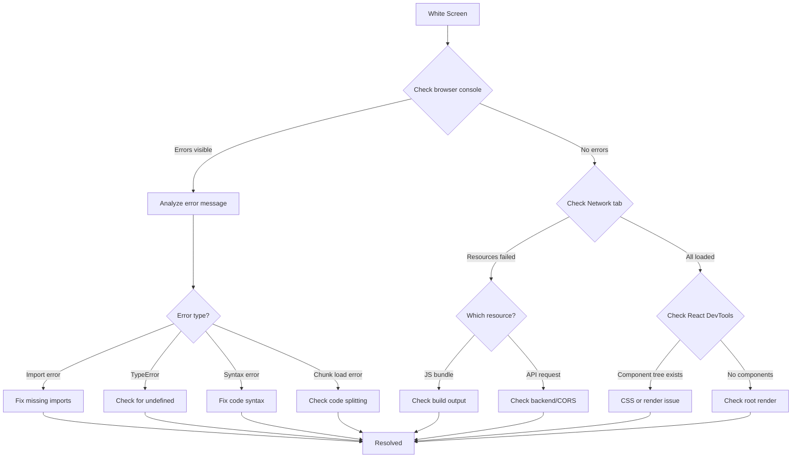
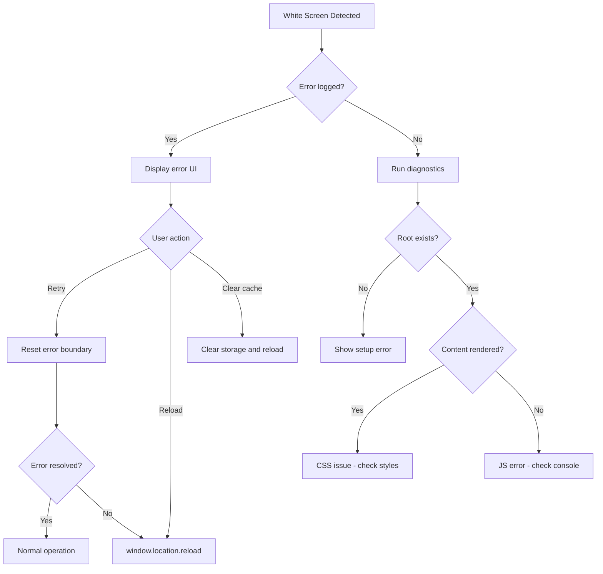

# How to Fix 'White Screen of Death' in React

Author: [nawazdhandala](https://github.com/nawazdhandala)

Tags: React, Debugging, Error Handling, JavaScript, Frontend, Troubleshooting

Description: A systematic guide to diagnosing and fixing the white screen of death in React applications, covering common causes and debugging strategies.

---

The white screen of death (WSOD) is one of the most frustrating issues in React development. Your application renders nothing but a blank white page, often without any visible error messages. This guide provides a systematic approach to diagnosing and fixing this problem.

## Understanding the White Screen

A white screen typically means JavaScript execution failed before or during the initial render. Common causes include:

- Uncaught JavaScript errors crashing the app
- Missing or incorrect imports
- Build configuration problems
- Server-side rendering hydration mismatches
- Browser compatibility issues
- Network failures loading critical resources

## Diagnostic Flowchart



## Step 1: Check the Browser Console

The browser console is your first diagnostic tool. Open it with F12 or right-click and select Inspect.

```javascript
// Common console errors that cause white screens

// 1. Module not found
// "Uncaught SyntaxError: Cannot use import statement outside a module"
// "Uncaught ReferenceError: require is not defined"

// 2. Component errors
// "Uncaught TypeError: Cannot read properties of undefined"
// "Uncaught Error: Objects are not valid as a React child"

// 3. Build errors
// "Uncaught SyntaxError: Unexpected token '<'"
// "ChunkLoadError: Loading chunk X failed"
```

## Step 2: Check Root Rendering

Verify your root element exists and React is mounting correctly.

```javascript
// src/index.js - check your entry point

import React from 'react';
import { createRoot } from 'react-dom/client';
import App from './App';

// Verify the root element exists in index.html
const container = document.getElementById('root');

if (!container) {
  console.error('Root element not found! Check your index.html');
  // Display error message to help diagnose
  document.body.innerHTML = `
    <div style="padding: 20px; font-family: sans-serif;">
      <h1>Application Error</h1>
      <p>Root element with id="root" not found in document.</p>
    </div>
  `;
} else {
  const root = createRoot(container);

  // Wrap in try-catch to catch render errors
  try {
    root.render(
      <React.StrictMode>
        <App />
      </React.StrictMode>
    );
  } catch (error) {
    console.error('Failed to render application:', error);
    container.innerHTML = `
      <div style="padding: 20px; font-family: sans-serif; color: red;">
        <h1>Render Error</h1>
        <pre>${error.message}</pre>
      </div>
    `;
  }
}
```

Verify your HTML has the root element:

```html
<!-- public/index.html -->
<!DOCTYPE html>
<html lang="en">
<head>
    <meta charset="UTF-8">
    <meta name="viewport" content="width=device-width, initial-scale=1.0">
    <title>My App</title>
</head>
<body>
    <!-- This element MUST exist -->
    <div id="root"></div>

    <!-- Script should load after the root element -->
</body>
</html>
```

## Step 3: Add Error Boundaries

Error Boundaries catch rendering errors and display fallback UI instead of a white screen.

```typescript
// src/components/ErrorBoundary.tsx

import React, { Component, ReactNode } from 'react';

interface Props {
  children: ReactNode;
  fallback?: ReactNode;
}

interface State {
  hasError: boolean;
  error: Error | null;
  errorInfo: React.ErrorInfo | null;
}

class ErrorBoundary extends Component<Props, State> {
  constructor(props: Props) {
    super(props);
    this.state = {
      hasError: false,
      error: null,
      errorInfo: null
    };
  }

  static getDerivedStateFromError(error: Error): Partial<State> {
    return { hasError: true, error };
  }

  componentDidCatch(error: Error, errorInfo: React.ErrorInfo): void {
    this.setState({ errorInfo });

    // Log to console for debugging
    console.error('ErrorBoundary caught an error:', error);
    console.error('Component stack:', errorInfo.componentStack);

    // Send to error monitoring service
    this.logErrorToService(error, errorInfo);
  }

  logErrorToService(error: Error, errorInfo: React.ErrorInfo): void {
    // Replace with your error reporting service
    fetch('/api/errors', {
      method: 'POST',
      headers: { 'Content-Type': 'application/json' },
      body: JSON.stringify({
        message: error.message,
        stack: error.stack,
        componentStack: errorInfo.componentStack,
        url: window.location.href,
        timestamp: new Date().toISOString()
      })
    }).catch(console.error);
  }

  handleRetry = (): void => {
    this.setState({ hasError: false, error: null, errorInfo: null });
  };

  render(): ReactNode {
    if (this.state.hasError) {
      if (this.props.fallback) {
        return this.props.fallback;
      }

      return (
        <div style={{
          padding: '40px',
          textAlign: 'center',
          fontFamily: 'system-ui, sans-serif'
        }}>
          <h1 style={{ color: '#e53e3e' }}>Something went wrong</h1>
          <p style={{ color: '#718096' }}>
            The application encountered an unexpected error.
          </p>

          {process.env.NODE_ENV === 'development' && this.state.error && (
            <details style={{
              marginTop: '20px',
              textAlign: 'left',
              background: '#f7fafc',
              padding: '20px',
              borderRadius: '8px'
            }}>
              <summary style={{ cursor: 'pointer', fontWeight: 'bold' }}>
                Error Details
              </summary>
              <pre style={{
                marginTop: '10px',
                overflow: 'auto',
                fontSize: '12px',
                color: '#e53e3e'
              }}>
                {this.state.error.toString()}
                {this.state.errorInfo?.componentStack}
              </pre>
            </details>
          )}

          <button
            onClick={this.handleRetry}
            style={{
              marginTop: '20px',
              padding: '10px 20px',
              fontSize: '16px',
              cursor: 'pointer',
              backgroundColor: '#3182ce',
              color: 'white',
              border: 'none',
              borderRadius: '4px'
            }}
          >
            Try Again
          </button>

          <button
            onClick={() => window.location.reload()}
            style={{
              marginTop: '20px',
              marginLeft: '10px',
              padding: '10px 20px',
              fontSize: '16px',
              cursor: 'pointer',
              backgroundColor: '#718096',
              color: 'white',
              border: 'none',
              borderRadius: '4px'
            }}
          >
            Reload Page
          </button>
        </div>
      );
    }

    return this.props.children;
  }
}

export default ErrorBoundary;
```

Wrap your app with Error Boundaries:

```typescript
// src/App.tsx

import React, { Suspense, lazy } from 'react';
import ErrorBoundary from './components/ErrorBoundary';

// Lazy load routes
const Dashboard = lazy(() => import('./pages/Dashboard'));
const Settings = lazy(() => import('./pages/Settings'));

function App() {
  return (
    <ErrorBoundary>
      <div className="app">
        <header>
          <h1>My Application</h1>
        </header>

        <main>
          <ErrorBoundary fallback={<p>Dashboard failed to load</p>}>
            <Suspense fallback={<div>Loading dashboard...</div>}>
              <Dashboard />
            </Suspense>
          </ErrorBoundary>

          <ErrorBoundary fallback={<p>Settings failed to load</p>}>
            <Suspense fallback={<div>Loading settings...</div>}>
              <Settings />
            </Suspense>
          </ErrorBoundary>
        </main>
      </div>
    </ErrorBoundary>
  );
}

export default App;
```

## Common Cause 1: Import Errors

Missing or incorrect imports are a frequent cause of white screens.

```javascript
// Problem: typo in import path
import MyComponent from './components/MyComponet';  // Typo!

// Problem: default vs named export mismatch
import { App } from './App';  // App uses default export

// Problem: case sensitivity issues on Linux
import header from './Header';  // File is Header.js

// Problem: missing file extension in some configs
import utils from './utils';  // Might need ./utils.js
```

### Solution: Verify imports carefully

```javascript
// Correct: match the export type
// If App.js uses: export default App
import App from './App';

// If App.js uses: export const App = ...
import { App } from './App';

// Use IDE features to auto-import
// Enable strict TypeScript to catch these at build time
```

Check for circular dependencies:

```javascript
// circular-dependency-check.js
// Run with: node circular-dependency-check.js

const madge = require('madge');

madge('./src/index.js').then((res) => {
  const circular = res.circular();
  if (circular.length > 0) {
    console.log('Circular dependencies found:');
    circular.forEach((path) => {
      console.log(path.join(' -> '));
    });
    process.exit(1);
  } else {
    console.log('No circular dependencies found');
  }
});
```

## Common Cause 2: Undefined Values in Render

Accessing undefined values during render crashes the component.

```javascript
// Problem: user is undefined on first render
function UserProfile({ userId }) {
  const [user, setUser] = useState();  // undefined initially

  useEffect(() => {
    fetchUser(userId).then(setUser);
  }, [userId]);

  // CRASH: Cannot read property 'name' of undefined
  return <h1>{user.name}</h1>;
}
```

### Solution: Handle loading states

```typescript
import React, { useState, useEffect } from 'react';

interface User {
  id: string;
  name: string;
  email: string;
}

interface UserProfileProps {
  userId: string;
}

function UserProfile({ userId }: UserProfileProps) {
  const [user, setUser] = useState<User | null>(null);
  const [loading, setLoading] = useState(true);
  const [error, setError] = useState<string | null>(null);

  useEffect(() => {
    let mounted = true;

    async function loadUser() {
      try {
        setLoading(true);
        setError(null);
        const data = await fetchUser(userId);
        if (mounted) {
          setUser(data);
        }
      } catch (err) {
        if (mounted) {
          setError(err instanceof Error ? err.message : 'Failed to load user');
        }
      } finally {
        if (mounted) {
          setLoading(false);
        }
      }
    }

    loadUser();

    return () => {
      mounted = false;
    };
  }, [userId]);

  // Handle loading state
  if (loading) {
    return <div className="loading">Loading user profile...</div>;
  }

  // Handle error state
  if (error) {
    return <div className="error">Error: {error}</div>;
  }

  // Handle missing data
  if (!user) {
    return <div className="not-found">User not found</div>;
  }

  // Safe to render - user is guaranteed to exist
  return (
    <div className="user-profile">
      <h1>{user.name}</h1>
      <p>{user.email}</p>
    </div>
  );
}

async function fetchUser(userId: string): Promise<User> {
  const response = await fetch(`/api/users/${userId}`);
  if (!response.ok) {
    throw new Error(`Failed to fetch user: ${response.statusText}`);
  }
  return response.json();
}

export default UserProfile;
```

## Common Cause 3: Build Configuration Issues

Misconfigured builds can produce broken JavaScript.

```javascript
// Check if your build output is correct
// Look for these signs in the browser Network tab:

// 1. JavaScript files returning HTML (404 page)
// 2. MIME type errors in console
// 3. Empty JavaScript files
// 4. Syntax errors in bundled code
```

### Solution: Verify build configuration

```javascript
// webpack.config.js - ensure correct output

const path = require('path');
const HtmlWebpackPlugin = require('html-webpack-plugin');

module.exports = {
  entry: './src/index.js',

  output: {
    path: path.resolve(__dirname, 'dist'),
    filename: '[name].[contenthash].js',
    publicPath: '/',  // Important for routing
    clean: true
  },

  module: {
    rules: [
      {
        test: /\.(js|jsx|ts|tsx)$/,
        exclude: /node_modules/,
        use: {
          loader: 'babel-loader',
          options: {
            presets: [
              '@babel/preset-env',
              ['@babel/preset-react', { runtime: 'automatic' }],
              '@babel/preset-typescript'
            ]
          }
        }
      }
    ]
  },

  plugins: [
    new HtmlWebpackPlugin({
      template: './public/index.html',
      inject: 'body'
    })
  ],

  resolve: {
    extensions: ['.js', '.jsx', '.ts', '.tsx']
  },

  devServer: {
    historyApiFallback: true,  // Required for client-side routing
    static: './dist'
  }
};
```

For Create React App, check environment variables:

```bash
# .env file issues

# Wrong: variables must start with REACT_APP_
API_URL=http://localhost:3001  # Won't work

# Correct
REACT_APP_API_URL=http://localhost:3001

# Check if .env is being loaded
console.log(process.env.REACT_APP_API_URL);
```

## Common Cause 4: Code Splitting Failures

Lazy-loaded chunks failing to load causes white screens.

```javascript
// Problem: chunk fails to load
const Dashboard = lazy(() => import('./Dashboard'));

// If Dashboard.js has an error or network fails,
// the app crashes without Suspense fallback
```

### Solution: Handle chunk loading errors

```typescript
import React, { Suspense, lazy, ComponentType } from 'react';

// Create a wrapper for lazy loading with error handling
function lazyWithRetry<T extends ComponentType<unknown>>(
  importFn: () => Promise<{ default: T }>,
  retries = 3,
  delay = 1000
): React.LazyExoticComponent<T> {
  return lazy(async () => {
    let lastError: Error | undefined;

    for (let i = 0; i < retries; i++) {
      try {
        return await importFn();
      } catch (error) {
        lastError = error as Error;
        console.warn(`Failed to load chunk (attempt ${i + 1}/${retries}):`, error);

        if (i < retries - 1) {
          // Wait before retrying
          await new Promise((resolve) => setTimeout(resolve, delay));
          // Try clearing the cache
          if ('caches' in window) {
            const keys = await caches.keys();
            await Promise.all(keys.map((key) => caches.delete(key)));
          }
        }
      }
    }

    throw lastError;
  });
}

// Use the wrapper
const Dashboard = lazyWithRetry(() => import('./pages/Dashboard'));
const Settings = lazyWithRetry(() => import('./pages/Settings'));

// Loading fallback component
function LoadingSpinner() {
  return (
    <div className="loading-spinner">
      <div className="spinner"></div>
      <p>Loading...</p>
    </div>
  );
}

// Chunk error fallback
function ChunkErrorFallback({ retry }: { retry: () => void }) {
  return (
    <div className="chunk-error">
      <h2>Failed to load page</h2>
      <p>Please check your internet connection and try again.</p>
      <button onClick={retry}>Retry</button>
      <button onClick={() => window.location.reload()}>Reload Page</button>
    </div>
  );
}

function App() {
  return (
    <ErrorBoundary fallback={<ChunkErrorFallback retry={() => window.location.reload()} />}>
      <Suspense fallback={<LoadingSpinner />}>
        <Dashboard />
      </Suspense>
    </ErrorBoundary>
  );
}

export default App;
```

## Common Cause 5: CSS Hiding Content

Sometimes the content renders but CSS makes it invisible.

```css
/* Problems that hide content */

/* Content pushed off screen */
.app {
  margin-left: -9999px;
}

/* Zero dimensions */
.container {
  width: 0;
  height: 0;
  overflow: hidden;
}

/* Invisible */
.content {
  opacity: 0;
  visibility: hidden;
}

/* Wrong z-index */
.overlay {
  position: fixed;
  z-index: 9999;
  background: white;
  inset: 0;
}
```

### Solution: Debug with browser DevTools

```javascript
// Add temporary debug styles to find hidden content

// In browser console:
document.querySelectorAll('*').forEach(el => {
  el.style.outline = '1px solid red';
});

// Or add to your CSS temporarily:
// * { outline: 1px solid red !important; }

// Check if React rendered anything:
console.log(document.getElementById('root').innerHTML);

// Check computed styles on elements:
const element = document.querySelector('.app');
console.log(getComputedStyle(element));
```

## Debugging Checklist

```typescript
// src/debug/diagnostics.ts

export function runDiagnostics(): void {
  console.group('React App Diagnostics');

  // Check if root element exists
  const root = document.getElementById('root');
  console.log('Root element exists:', !!root);
  console.log('Root element content:', root?.innerHTML?.substring(0, 100));

  // Check for JavaScript errors
  console.log('Check console for errors above this message');

  // Check environment
  console.log('NODE_ENV:', process.env.NODE_ENV);
  console.log('Public URL:', process.env.PUBLIC_URL);

  // Check browser support
  console.log('ES6 Modules supported:', 'noModule' in document.createElement('script'));
  console.log('Fetch API supported:', 'fetch' in window);
  console.log('Promise supported:', 'Promise' in window);

  // Check network requests
  if ('performance' in window) {
    const resources = performance.getEntriesByType('resource');
    const failedResources = resources.filter(
      (r) => (r as PerformanceResourceTiming).transferSize === 0
    );
    console.log('Failed resources:', failedResources.map((r) => r.name));
  }

  // Check localStorage/sessionStorage
  try {
    localStorage.setItem('test', 'test');
    localStorage.removeItem('test');
    console.log('localStorage available:', true);
  } catch (e) {
    console.log('localStorage available:', false);
  }

  console.groupEnd();
}

// Call in development
if (process.env.NODE_ENV === 'development') {
  window.addEventListener('load', () => {
    setTimeout(runDiagnostics, 1000);
  });
}
```

## Production Monitoring

Set up error tracking for production white screens.

```typescript
// src/monitoring/errorTracking.ts

interface ErrorReport {
  message: string;
  stack?: string;
  url: string;
  userAgent: string;
  timestamp: string;
  componentStack?: string;
}

// Global error handler
window.onerror = function (message, source, lineno, colno, error) {
  const report: ErrorReport = {
    message: String(message),
    stack: error?.stack,
    url: window.location.href,
    userAgent: navigator.userAgent,
    timestamp: new Date().toISOString()
  };

  sendErrorReport(report);
  return false;  // Let default handler run too
};

// Unhandled promise rejection handler
window.onunhandledrejection = function (event) {
  const report: ErrorReport = {
    message: `Unhandled Promise Rejection: ${event.reason}`,
    stack: event.reason?.stack,
    url: window.location.href,
    userAgent: navigator.userAgent,
    timestamp: new Date().toISOString()
  };

  sendErrorReport(report);
};

async function sendErrorReport(report: ErrorReport): Promise<void> {
  try {
    // Use sendBeacon for reliability on page unload
    if ('sendBeacon' in navigator) {
      navigator.sendBeacon(
        '/api/errors',
        JSON.stringify(report)
      );
    } else {
      await fetch('/api/errors', {
        method: 'POST',
        headers: { 'Content-Type': 'application/json' },
        body: JSON.stringify(report)
      });
    }
  } catch (e) {
    console.error('Failed to send error report:', e);
  }
}

export { sendErrorReport, ErrorReport };
```

## Recovery Strategies



## Summary

| Cause | Diagnostic | Solution |
|-------|-----------|----------|
| **JavaScript error** | Check browser console | Fix the error, add Error Boundaries |
| **Missing imports** | Module not found error | Verify import paths and exports |
| **Undefined access** | TypeError in console | Add null checks and loading states |
| **Build issues** | Network tab shows errors | Fix webpack/build configuration |
| **Chunk load failure** | ChunkLoadError | Add retry logic and Suspense |
| **CSS hiding content** | DevTools inspect | Fix CSS rules hiding elements |
| **Browser compatibility** | Test in target browsers | Add polyfills or transpilation |

The white screen of death is always caused by something specific. Use the browser DevTools systematically to identify the cause. Add Error Boundaries to prevent silent failures. Monitor errors in production to catch issues before users report them. With proper error handling and monitoring, you can quickly identify and fix white screen issues.
