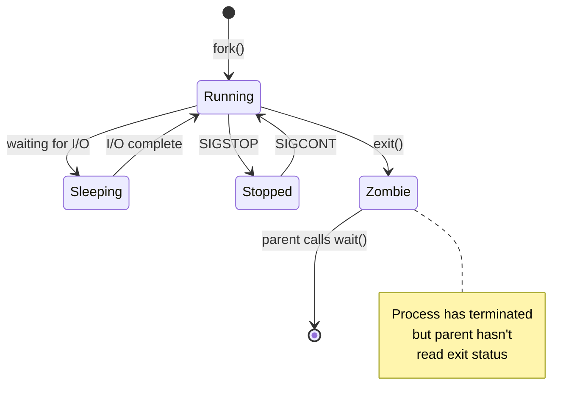
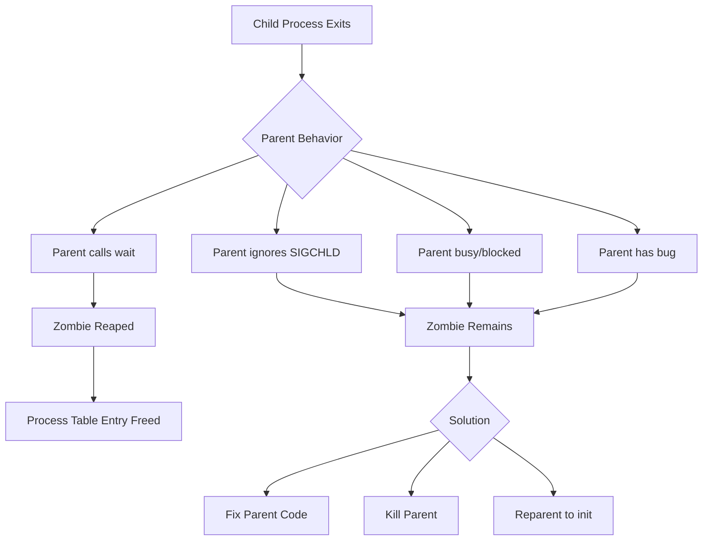
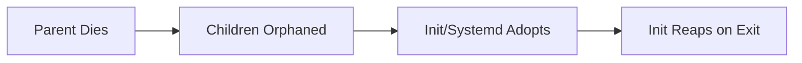
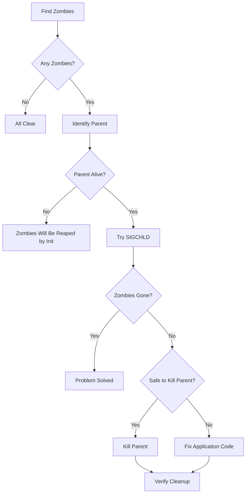

# How to Fix 'Zombie Process' Issues in Linux

Author: [nawazdhandala](https://www.github.com/nawazdhandala)

Tags: Linux, Processes, Troubleshooting, System Administration, Zombie Processes, Process Management

Description: Learn how to identify, diagnose, and fix zombie processes in Linux, including understanding their causes, proper cleanup methods, and prevention strategies.

---

Zombie processes are a common source of confusion for Linux administrators. They appear in process listings, cannot be killed directly, and may indicate deeper problems with parent processes. This guide explains what zombies are and how to handle them properly.

## Understanding Zombie Processes



### What Is a Zombie Process?

A zombie process is a terminated process that:

1. Has finished execution
2. Still has an entry in the process table
3. Waits for its parent to read its exit status
4. Shows as `<defunct>` or status `Z` in process listings

Zombies consume minimal resources (just a process table entry), but large numbers can exhaust the process table.

### Process States

| State | Symbol | Description |
|-------|--------|-------------|
| Running | R | Currently executing or ready to run |
| Sleeping | S | Waiting for an event (interruptible) |
| Disk Sleep | D | Waiting for I/O (uninterruptible) |
| Stopped | T | Stopped by signal |
| Zombie | Z | Terminated but not reaped |

## Identifying Zombie Processes

### Finding Zombies

```bash
# List all zombie processes
ps aux | grep -w Z

# Count zombie processes
ps aux | awk '$8 ~ /Z/ {count++} END {print count}'

# Or use ps directly with state filter
ps -eo pid,ppid,stat,comm | grep -w Z

# Check for zombies with detailed info
ps -eo pid,ppid,stat,user,comm,time | awk '$3 ~ /Z/'
```

### Example Output

```bash
$ ps aux | grep -w Z
USER       PID %CPU %MEM    VSZ   RSS TTY      STAT START   TIME COMMAND
root      1234  0.0  0.0      0     0 ?        Z    10:00   0:00 [myapp] <defunct>
root      1235  0.0  0.0      0     0 ?        Z    10:01   0:00 [myapp] <defunct>
```

Key indicators:
- `STAT` shows `Z` or `Z+`
- `<defunct>` in the COMMAND column
- `VSZ` and `RSS` are 0 (no memory used)

### Finding the Parent Process

```bash
# Find parent of a zombie
ps -o ppid= -p <zombie-pid>

# Get details about the parent
ps -p <parent-pid> -o pid,comm,stat

# See the process tree
pstree -p <parent-pid>

# Or use ps to show parent-child relationship
ps -eo pid,ppid,stat,comm | grep -E "PPID|<parent-pid>|<zombie-pid>"
```

### Monitoring Zombies Over Time

```bash
# Watch zombie count
watch -n 1 'ps aux | grep -c " Z "'

# Monitor with top (shows zombie count in header)
top
# Look for "zombie" in the header line

# Monitor specific parent and its zombies
watch -n 1 'ps --ppid <parent-pid> -o pid,stat,comm'
```

## Why Zombies Occur



### Common Causes

1. **Parent not calling wait()**: The parent process should call `wait()` or `waitpid()` to read child exit status
2. **Ignoring SIGCHLD**: Parent ignores the signal that indicates child termination
3. **Parent too busy**: Parent is blocked or too busy to handle child termination
4. **Buggy application**: Programming error in the parent process
5. **Orphaned children**: Parent dies, children become orphans (init adopts them)

## Fixing Zombie Processes

### Important: You Cannot Kill Zombies Directly

```bash
# This will NOT work - zombies are already dead!
kill -9 <zombie-pid>
# The zombie will remain

# Zombies cannot be killed because they're already terminated
# They're waiting for their parent to acknowledge their death
```

### Solution 1: Kill the Parent Process

The most effective solution is to terminate the parent, which causes the zombies to be inherited by init (PID 1), which will immediately reap them.

```bash
# Find the parent PID
ps -o ppid= -p <zombie-pid>

# Kill the parent
kill <parent-pid>

# If parent doesn't respond
kill -9 <parent-pid>

# Verify zombies are gone
ps aux | grep -w Z
```

**Warning**: Only kill the parent if it's safe to do so. Critical system processes should not be killed.

### Solution 2: Send SIGCHLD to Parent

Sometimes the parent just needs a reminder to reap its children.

```bash
# Find parent PID
PPID=$(ps -o ppid= -p <zombie-pid>)

# Send SIGCHLD to parent
kill -SIGCHLD $PPID

# Or use signal number
kill -17 $PPID

# Check if zombies were reaped
ps aux | grep -w Z
```

### Solution 3: Wait for Parent to Handle Zombies

If the parent is just slow, zombies may be reaped eventually.

```bash
# Monitor zombie count over time
watch -n 5 'ps aux | grep -c " Z "'

# Give the parent time to catch up
# If count decreases, parent is working
```

### Solution 4: Fix the Parent Application

If you have access to the source code, ensure proper child handling:

```c
/* C example: proper child handling */
#include <signal.h>
#include <sys/wait.h>

/* Option 1: Handle SIGCHLD */
void sigchld_handler(int signum) {
    /* Reap all terminated children */
    while (waitpid(-1, NULL, WNOHANG) > 0);
}

int main() {
    /* Set up signal handler */
    signal(SIGCHLD, sigchld_handler);

    /* Or ignore SIGCHLD to auto-reap (System V) */
    signal(SIGCHLD, SIG_IGN);

    /* ... rest of program ... */
}
```

```python
# Python example: proper subprocess handling
import subprocess
import os
import signal

# Option 1: Use subprocess.run() which waits automatically
result = subprocess.run(['command', 'arg1'])

# Option 2: Explicitly wait for Popen processes
proc = subprocess.Popen(['command'])
# ... do other work ...
proc.wait()  # This reaps the child

# Option 3: Ignore SIGCHLD (auto-reap children)
signal.signal(signal.SIGCHLD, signal.SIG_IGN)
```

```bash
# Bash example: proper child handling
#!/bin/bash

# Wait for all background jobs
./long-running-task &
./another-task &

# Reap all children
wait

# Or wait for specific job
./task &
task_pid=$!
wait $task_pid
```

## Handling Orphan Processes

When a parent dies, its children become orphans and are adopted by init (PID 1).



### Finding Orphan Processes

```bash
# Processes parented by init (PID 1) that shouldn't be
ps -eo pid,ppid,comm | awk '$2 == 1 {print}'

# Check if these are expected daemons or orphans
ps -eo pid,ppid,stat,comm | awk '$2 == 1 && $3 !~ /S/'
```

### Subreaper Processes

Modern systems use PR_SET_CHILD_SUBREAPER to designate a process to adopt orphans instead of init.

```c
/* Set current process as subreaper */
#include <sys/prctl.h>

prctl(PR_SET_CHILD_SUBREAPER, 1);
```

Systemd services can use this:

```ini
[Service]
# Systemd acts as subreaper for service
Delegate=yes
```

## Preventing Zombie Accumulation

### System-Wide Settings

```bash
# Check process limit
cat /proc/sys/kernel/pid_max

# Monitor process count
ls -d /proc/[0-9]* | wc -l

# Set up monitoring alert
cat << 'EOF' > /usr/local/bin/check_zombies.sh
#!/bin/bash
ZOMBIE_COUNT=$(ps aux | grep -c " Z ")
if [ "$ZOMBIE_COUNT" -gt 10 ]; then
    echo "Warning: $ZOMBIE_COUNT zombie processes detected"
    # Send alert
fi
EOF
chmod +x /usr/local/bin/check_zombies.sh
```

### Systemd Service Configuration

```ini
# /etc/systemd/system/myapp.service
[Service]
ExecStart=/usr/bin/myapp

# Restart service if it becomes unresponsive
WatchdogSec=30

# Kill all child processes when service stops
KillMode=control-group

# Time to wait before SIGKILL
TimeoutStopSec=30
```

### Application Best Practices

```bash
# When writing shell scripts, always wait for background jobs
#!/bin/bash

# Start background jobs
job1 &
job2 &

# Wait for all background jobs to complete
wait

echo "All jobs completed"
```

## Diagnostic Script

Create a comprehensive zombie diagnostic script:

```bash
#!/bin/bash
# zombie-diagnosis.sh - Diagnose zombie process issues

echo "=== Zombie Process Diagnostic Report ==="
echo "Generated: $(date)"
echo

# Count zombies
ZOMBIE_COUNT=$(ps aux | awk '$8 ~ /Z/ {count++} END {print count+0}')
echo "Total zombie processes: $ZOMBIE_COUNT"
echo

if [ "$ZOMBIE_COUNT" -eq 0 ]; then
    echo "No zombie processes found."
    exit 0
fi

echo "=== Zombie Process Details ==="
ps aux | head -1
ps aux | awk '$8 ~ /Z/'
echo

echo "=== Parent Process Analysis ==="
# Get unique parent PIDs of zombies
ps -eo pid,ppid,stat | awk '$3 ~ /Z/ {print $2}' | sort -u | while read PPID; do
    echo "--- Parent PID: $PPID ---"
    ps -p $PPID -o pid,ppid,stat,user,comm,time 2>/dev/null || echo "Parent no longer exists"

    # Count zombies for this parent
    CHILD_ZOMBIES=$(ps --ppid $PPID -o stat | grep -c Z)
    echo "Zombie children: $CHILD_ZOMBIES"

    # Show process tree
    echo "Process tree:"
    pstree -p $PPID 2>/dev/null | head -10
    echo
done

echo "=== System Process Statistics ==="
echo "Total processes: $(ps aux | wc -l)"
echo "Running: $(ps aux | awk '$8 ~ /R/ {count++} END {print count+0}')"
echo "Sleeping: $(ps aux | awk '$8 ~ /S/ {count++} END {print count+0}')"
echo "Stopped: $(ps aux | awk '$8 ~ /T/ {count++} END {print count+0}')"
echo "Zombie: $ZOMBIE_COUNT"
echo

echo "=== Recommendations ==="
if [ "$ZOMBIE_COUNT" -gt 100 ]; then
    echo "- HIGH: Large number of zombies. Investigate parent processes immediately."
elif [ "$ZOMBIE_COUNT" -gt 10 ]; then
    echo "- MEDIUM: Several zombies detected. Monitor parent process behavior."
else
    echo "- LOW: Few zombies. Usually transient, but monitor the trend."
fi

echo
echo "=== Quick Fixes ==="
ps -eo pid,ppid,stat | awk '$3 ~ /Z/ {print $2}' | sort -u | while read PPID; do
    if [ "$PPID" != "1" ]; then
        echo "# Send SIGCHLD to parent $PPID:"
        echo "kill -SIGCHLD $PPID"
        echo
        echo "# If that doesn't work, kill parent $PPID (if safe):"
        echo "kill $PPID"
        echo
    fi
done
```

## Zombie Process Workflow



## Quick Reference

| Task | Command |
|------|---------|
| Find zombies | `ps aux \| grep -w Z` |
| Count zombies | `ps aux \| awk '$8 ~ /Z/ {c++} END {print c}'` |
| Find parent | `ps -o ppid= -p <pid>` |
| Signal parent | `kill -SIGCHLD <ppid>` |
| Kill parent | `kill <ppid>` |
| Process tree | `pstree -p <ppid>` |
| Monitor zombies | `watch 'ps aux \| grep -c " Z "'` |

## Common Misconceptions

1. **"Zombies consume memory"**: False. Zombies only use a process table entry (a few bytes).

2. **"You can kill a zombie"**: False. Zombies are already dead. You must handle the parent.

3. **"Zombies are always bad"**: Not necessarily. Brief zombies are normal. Only persistent zombies indicate problems.

4. **"Just reboot to fix"**: While this works, it's better to fix the root cause to prevent recurrence.

---

Zombie processes are not the monsters they sound like. They are simply terminated processes waiting to be acknowledged by their parents. The key is to handle the parent process properly, either by signaling it to reap its children or by fixing the parent's code to properly wait for its children. In most cases, a few zombies are harmless and transient.
