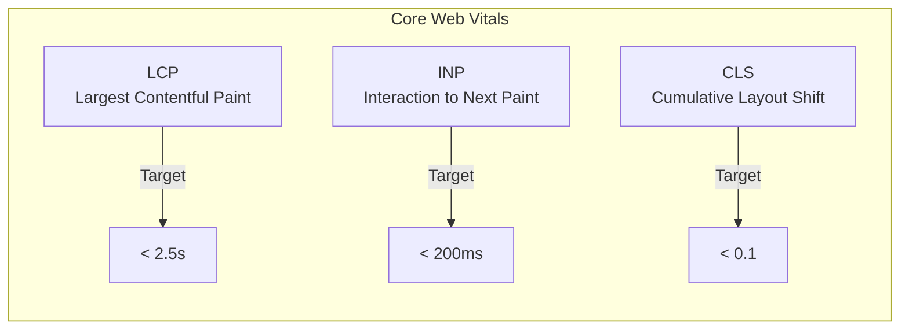
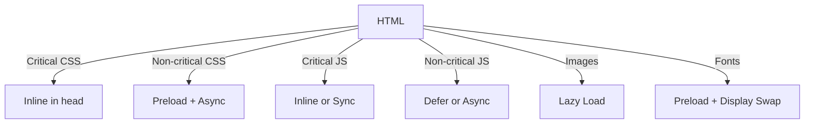

# How to Handle Frontend Performance Optimization

Author: [nawazdhandala](https://www.github.com/nawazdhandala)

Tags: Frontend, Performance, JavaScript, CSS, Web Vitals, Optimization

Description: Learn practical techniques to optimize frontend performance and deliver faster, more responsive web applications.

---

Frontend performance directly impacts user experience, conversion rates, and SEO rankings. Slow websites frustrate users and cost businesses money. This guide covers practical techniques to measure and improve frontend performance.

---

## Core Web Vitals



These metrics measure real user experience:
- **LCP**: How quickly the main content loads
- **INP**: How responsive the page is to user interactions
- **CLS**: How stable the layout is during loading

---

## Measuring Performance

```javascript
// performance-metrics.js
// Collect and report Core Web Vitals

class PerformanceMetrics {
    constructor() {
        this.metrics = {};
        this.init();
    }

    init() {
        // Largest Contentful Paint
        this.observeLCP();

        // First Input Delay / Interaction to Next Paint
        this.observeINP();

        // Cumulative Layout Shift
        this.observeCLS();

        // First Contentful Paint
        this.observeFCP();
    }

    observeLCP() {
        const observer = new PerformanceObserver((list) => {
            const entries = list.getEntries();
            const lastEntry = entries[entries.length - 1];
            this.metrics.lcp = lastEntry.startTime;
            console.log('LCP:', this.metrics.lcp.toFixed(2), 'ms');
        });

        observer.observe({ type: 'largest-contentful-paint', buffered: true });
    }

    observeINP() {
        let maxDuration = 0;

        const observer = new PerformanceObserver((list) => {
            for (const entry of list.getEntries()) {
                if (entry.duration > maxDuration) {
                    maxDuration = entry.duration;
                    this.metrics.inp = maxDuration;
                    console.log('INP:', this.metrics.inp.toFixed(2), 'ms');
                }
            }
        });

        observer.observe({ type: 'event', buffered: true, durationThreshold: 16 });
    }

    observeCLS() {
        let clsValue = 0;

        const observer = new PerformanceObserver((list) => {
            for (const entry of list.getEntries()) {
                if (!entry.hadRecentInput) {
                    clsValue += entry.value;
                    this.metrics.cls = clsValue;
                    console.log('CLS:', this.metrics.cls.toFixed(4));
                }
            }
        });

        observer.observe({ type: 'layout-shift', buffered: true });
    }

    observeFCP() {
        const observer = new PerformanceObserver((list) => {
            for (const entry of list.getEntries()) {
                if (entry.name === 'first-contentful-paint') {
                    this.metrics.fcp = entry.startTime;
                    console.log('FCP:', this.metrics.fcp.toFixed(2), 'ms');
                }
            }
        });

        observer.observe({ type: 'paint', buffered: true });
    }

    getMetrics() {
        return { ...this.metrics };
    }

    sendToAnalytics(endpoint) {
        // Send metrics to your analytics service
        if (navigator.sendBeacon) {
            navigator.sendBeacon(endpoint, JSON.stringify(this.metrics));
        } else {
            fetch(endpoint, {
                method: 'POST',
                body: JSON.stringify(this.metrics),
                keepalive: true
            });
        }
    }
}

// Initialize on page load
const perfMetrics = new PerformanceMetrics();

// Send metrics when user leaves
window.addEventListener('visibilitychange', () => {
    if (document.visibilityState === 'hidden') {
        perfMetrics.sendToAnalytics('/api/metrics');
    }
});
```

---

## JavaScript Optimization

### Code Splitting

```javascript
// Before: Everything in one bundle
import { HeavyChart } from './charts';
import { DataTable } from './table';
import { ExportPDF } from './export';

// After: Dynamic imports for code splitting
const loadChart = () => import('./charts');
const loadTable = () => import('./table');
const loadExport = () => import('./export');

// Load components only when needed
async function showChart(data) {
    const { HeavyChart } = await loadChart();
    return new HeavyChart(data);
}

// React example with lazy loading
import React, { lazy, Suspense } from 'react';

const HeavyChart = lazy(() => import('./HeavyChart'));
const DataTable = lazy(() => import('./DataTable'));

function Dashboard() {
    return (
        <Suspense fallback={<div>Loading...</div>}>
            <HeavyChart />
            <DataTable />
        </Suspense>
    );
}
```

---

### Debouncing and Throttling

```javascript
// debounce-throttle.js
// Prevent excessive function calls

function debounce(func, wait) {
    let timeout;

    return function executedFunction(...args) {
        const later = () => {
            clearTimeout(timeout);
            func(...args);
        };

        clearTimeout(timeout);
        timeout = setTimeout(later, wait);
    };
}

function throttle(func, limit) {
    let inThrottle;

    return function executedFunction(...args) {
        if (!inThrottle) {
            func(...args);
            inThrottle = true;
            setTimeout(() => inThrottle = false, limit);
        }
    };
}

// Usage examples
const searchInput = document.getElementById('search');
const scrollContainer = document.getElementById('content');

// Debounce search - wait for user to stop typing
searchInput.addEventListener('input', debounce((e) => {
    performSearch(e.target.value);
}, 300));

// Throttle scroll - execute at most once per 100ms
scrollContainer.addEventListener('scroll', throttle(() => {
    updateScrollPosition();
}, 100));
```

---

### Efficient DOM Updates

```javascript
// dom-optimization.js
// Batch DOM updates to avoid layout thrashing

// BAD: Forces multiple layout recalculations
function updateElementsBad(elements, newWidth) {
    elements.forEach(el => {
        const currentHeight = el.offsetHeight;  // Read - triggers layout
        el.style.width = newWidth + 'px';       // Write - invalidates layout
        el.style.height = currentHeight + 'px'; // Read needed - triggers layout again
    });
}

// GOOD: Batch reads, then batch writes
function updateElementsGood(elements, newWidth) {
    // First, read all values
    const heights = elements.map(el => el.offsetHeight);

    // Then, write all values
    elements.forEach((el, i) => {
        el.style.width = newWidth + 'px';
        el.style.height = heights[i] + 'px';
    });
}

// BETTER: Use requestAnimationFrame for visual updates
function updateElementsBetter(elements, newWidth) {
    const heights = elements.map(el => el.offsetHeight);

    requestAnimationFrame(() => {
        elements.forEach((el, i) => {
            el.style.width = newWidth + 'px';
            el.style.height = heights[i] + 'px';
        });
    });
}

// BEST: Use CSS transforms instead of layout properties
function animateElement(element, x, y) {
    // Layout-triggering (causes reflow)
    // element.style.left = x + 'px';
    // element.style.top = y + 'px';

    // GPU-accelerated (no reflow)
    element.style.transform = `translate(${x}px, ${y}px)`;
}
```

---

## Image Optimization

```html
<!-- image-optimization.html -->
<!-- Use modern formats and responsive images -->

<!-- Basic responsive image -->


<!-- Modern format with fallback -->
<picture>
    <source srcset="image.avif" type="image/avif">
    <source srcset="image.webp" type="image/webp">
    
</picture>

<!-- Prevent CLS by setting dimensions -->

```

```javascript
// lazy-loading-images.js
// Implement lazy loading with Intersection Observer

class LazyImageLoader {
    constructor(options = {}) {
        this.rootMargin = options.rootMargin || '50px';
        this.threshold = options.threshold || 0.1;

        this.observer = new IntersectionObserver(
            this.handleIntersection.bind(this),
            {
                rootMargin: this.rootMargin,
                threshold: this.threshold
            }
        );

        this.init();
    }

    init() {
        const lazyImages = document.querySelectorAll('img[data-src]');
        lazyImages.forEach(img => this.observer.observe(img));
    }

    handleIntersection(entries) {
        entries.forEach(entry => {
            if (entry.isIntersecting) {
                this.loadImage(entry.target);
                this.observer.unobserve(entry.target);
            }
        });
    }

    loadImage(img) {
        const src = img.dataset.src;
        const srcset = img.dataset.srcset;

        // Create a new image to preload
        const preloader = new Image();

        preloader.onload = () => {
            img.src = src;
            if (srcset) img.srcset = srcset;
            img.classList.add('loaded');
        };

        preloader.src = src;
    }
}

// Initialize
new LazyImageLoader();
```

---

## CSS Optimization

```css
/* css-optimization.css */

/* Use CSS containment for complex components */
.card {
    contain: layout style paint;
}

/* Use will-change sparingly for animations */
.animated-element {
    will-change: transform;
}

/* Remove will-change after animation completes */
.animated-element.animation-done {
    will-change: auto;
}

/* Use content-visibility for off-screen content */
.below-fold-section {
    content-visibility: auto;
    contain-intrinsic-size: 0 500px;
}

/* Optimize font loading */
@font-face {
    font-family: 'CustomFont';
    src: url('/fonts/custom.woff2') format('woff2');
    font-display: swap;  /* Show fallback immediately */
}

/* Reduce motion for users who prefer it */
@media (prefers-reduced-motion: reduce) {
    * {
        animation-duration: 0.01ms !important;
        animation-iteration-count: 1 !important;
        transition-duration: 0.01ms !important;
    }
}
```

---

## Resource Loading Strategy



```html
<!-- resource-loading.html -->
<!DOCTYPE html>
<html>
<head>
    <!-- Critical CSS inlined -->
    <style>
        /* Above-the-fold styles */
        body { margin: 0; font-family: system-ui; }
        .header { height: 60px; background: #333; }
        .hero { min-height: 400px; }
    </style>

    <!-- Preload critical resources -->
    <link rel="preload" href="/fonts/main.woff2" as="font" type="font/woff2" crossorigin>
    <link rel="preload" href="/images/hero.webp" as="image">

    <!-- Preconnect to external domains -->
    <link rel="preconnect" href="https://api.example.com">
    <link rel="dns-prefetch" href="https://cdn.example.com">

    <!-- Non-critical CSS loaded async -->
    <link rel="preload" href="/css/non-critical.css" as="style" onload="this.onload=null;this.rel='stylesheet'">
    <noscript><link rel="stylesheet" href="/css/non-critical.css"></noscript>
</head>
<body>
    <!-- Content -->

    <!-- Defer non-critical JavaScript -->
    <script src="/js/app.js" defer></script>

    <!-- Load analytics after page is interactive -->
    <script>
        window.addEventListener('load', () => {
            setTimeout(() => {
                const script = document.createElement('script');
                script.src = '/js/analytics.js';
                document.body.appendChild(script);
            }, 3000);
        });
    </script>
</body>
</html>
```

---

## Virtual Scrolling for Large Lists

```javascript
// virtual-scroll.js
// Render only visible items for large lists

class VirtualScroller {
    constructor(container, items, options = {}) {
        this.container = container;
        this.items = items;
        this.itemHeight = options.itemHeight || 50;
        this.bufferSize = options.bufferSize || 5;

        this.visibleItems = [];
        this.scrollTop = 0;

        this.init();
    }

    init() {
        // Create wrapper with total height
        this.wrapper = document.createElement('div');
        this.wrapper.style.height = `${this.items.length * this.itemHeight}px`;
        this.wrapper.style.position = 'relative';

        // Create content container
        this.content = document.createElement('div');
        this.content.style.position = 'absolute';
        this.content.style.top = '0';
        this.content.style.left = '0';
        this.content.style.right = '0';

        this.wrapper.appendChild(this.content);
        this.container.appendChild(this.wrapper);

        // Handle scroll events
        this.container.addEventListener('scroll',
            this.throttle(this.onScroll.bind(this), 16)
        );

        // Initial render
        this.render();
    }

    throttle(func, limit) {
        let inThrottle;
        return function(...args) {
            if (!inThrottle) {
                func.apply(this, args);
                inThrottle = true;
                setTimeout(() => inThrottle = false, limit);
            }
        };
    }

    onScroll() {
        this.scrollTop = this.container.scrollTop;
        this.render();
    }

    render() {
        const containerHeight = this.container.clientHeight;

        // Calculate visible range
        const startIndex = Math.max(0,
            Math.floor(this.scrollTop / this.itemHeight) - this.bufferSize
        );
        const endIndex = Math.min(this.items.length,
            Math.ceil((this.scrollTop + containerHeight) / this.itemHeight) + this.bufferSize
        );

        // Update content position
        this.content.style.transform = `translateY(${startIndex * this.itemHeight}px)`;

        // Render visible items
        this.content.innerHTML = '';
        for (let i = startIndex; i < endIndex; i++) {
            const itemEl = this.renderItem(this.items[i], i);
            this.content.appendChild(itemEl);
        }
    }

    renderItem(item, index) {
        const div = document.createElement('div');
        div.style.height = `${this.itemHeight}px`;
        div.style.display = 'flex';
        div.style.alignItems = 'center';
        div.textContent = `Item ${index}: ${item.name}`;
        return div;
    }
}

// Usage
const container = document.getElementById('list-container');
const items = Array.from({ length: 10000 }, (_, i) => ({ name: `Item ${i}` }));
new VirtualScroller(container, items, { itemHeight: 40 });
```

---

## Performance Budget

| Resource | Budget | Impact |
|----------|--------|--------|
| Total JavaScript | < 200KB gzipped | Parse time, execution |
| Total CSS | < 50KB gzipped | Render blocking |
| Largest image | < 200KB | LCP |
| Web fonts | < 100KB | FOIT/FOUT |
| Time to Interactive | < 3s on 3G | User experience |

---

## Summary

Frontend performance optimization requires attention to multiple areas:

1. **Measure first** with Core Web Vitals and Real User Monitoring
2. **Optimize JavaScript** through code splitting, lazy loading, and efficient DOM updates
3. **Optimize images** with modern formats, responsive images, and lazy loading
4. **Optimize CSS** with critical CSS inlining, containment, and efficient selectors
5. **Load resources strategically** with preload, preconnect, and proper script attributes
6. **Implement virtual scrolling** for large data sets

Start with the metrics, focus on the biggest bottlenecks, and iterate. Small improvements compound into significant user experience gains.

---

*Track your frontend performance metrics with [OneUptime](https://oneuptime.com). Monitor Core Web Vitals, set performance budgets, and get alerted when regressions occur.*
