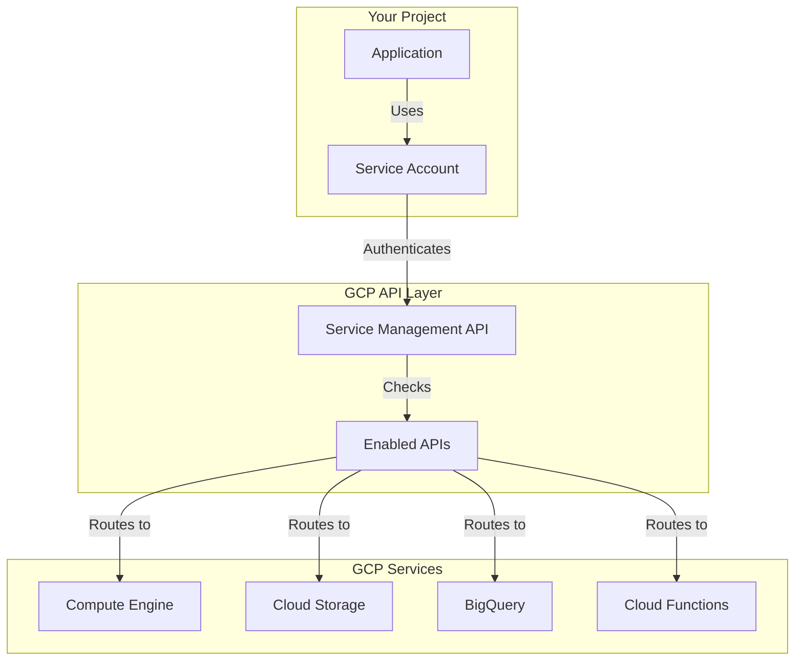
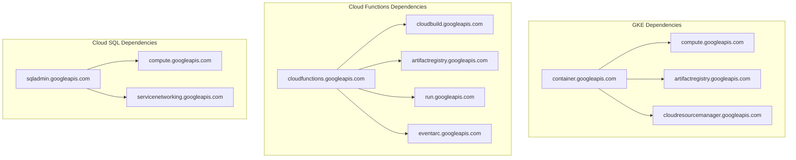
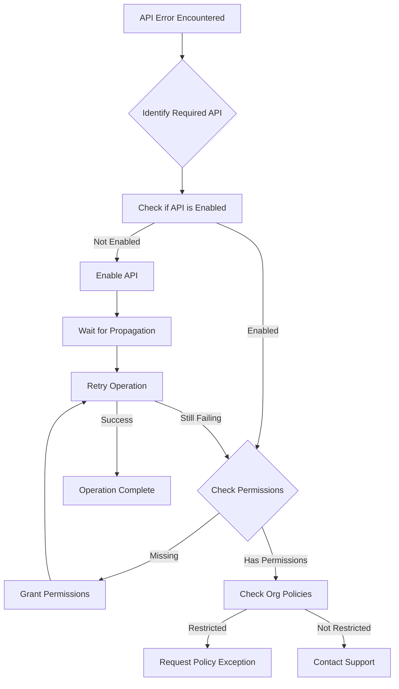

# How to Fix "API Not Enabled" Errors in GCP

Author: [nawazdhandala](https://www.github.com/nawazdhandala)

Tags: GCP, Google Cloud Platform, APIs, Cloud Services, Troubleshooting, Infrastructure

Description: Learn how to diagnose and fix "API Not Enabled" errors in Google Cloud Platform by enabling required APIs and managing service dependencies.

---

When working with Google Cloud Platform, you will frequently encounter "API Not Enabled" errors. These errors occur when your project tries to use a GCP service whose API has not been activated. While frustrating at first, these errors are simple to fix once you understand how GCP's API system works.

## Understanding GCP API Architecture



Every GCP service is accessed through its API. Before using a service, you must explicitly enable its API in your project. This design provides security and cost control by ensuring you only have access to services you intentionally activate.

## Common Error Messages

You might see these errors in various forms:

```
ERROR: (gcloud.compute.instances.create) PERMISSION_DENIED: Compute Engine API has not been used in project 123456789 before or it is disabled.
```

From API responses:

```json
{
  "error": {
    "code": 403,
    "message": "Cloud Functions API has not been used in project my-project before or it is disabled. Enable it by visiting https://console.developers.google.com/apis/api/cloudfunctions.googleapis.com/overview?project=my-project then retry.",
    "status": "PERMISSION_DENIED"
  }
}
```

Or from Terraform:

```
Error: Error creating Instance: googleapi: Error 403: Compute Engine API has not been used in project 123456789 before or it is disabled.
```

## Enabling APIs

### Using gcloud CLI

```bash
# Enable a single API
gcloud services enable compute.googleapis.com

# Enable multiple APIs at once
gcloud services enable \
    compute.googleapis.com \
    container.googleapis.com \
    cloudfunctions.googleapis.com \
    cloudbuild.googleapis.com \
    secretmanager.googleapis.com

# Enable API for a specific project
gcloud services enable compute.googleapis.com --project=my-project
```

### Check Which APIs Are Enabled

```bash
# List all enabled APIs
gcloud services list --enabled

# List all available APIs (including disabled)
gcloud services list --available

# Check if a specific API is enabled
gcloud services list --enabled --filter="NAME:compute.googleapis.com"

# Get detailed information about an API
gcloud services describe compute.googleapis.com
```

### Using the Cloud Console

1. Go to APIs & Services > Library
2. Search for the API you need
3. Click on the API
4. Click "Enable"

## Common APIs and Their Dependencies

Many GCP services require multiple APIs to function properly. Here are common services and their required APIs:

### Compute Engine

```bash
gcloud services enable \
    compute.googleapis.com \
    oslogin.googleapis.com \
    iap.googleapis.com
```

### Google Kubernetes Engine (GKE)

```bash
gcloud services enable \
    container.googleapis.com \
    compute.googleapis.com \
    containerregistry.googleapis.com \
    artifactregistry.googleapis.com \
    cloudresourcemanager.googleapis.com
```

### Cloud Functions

```bash
gcloud services enable \
    cloudfunctions.googleapis.com \
    cloudbuild.googleapis.com \
    artifactregistry.googleapis.com \
    run.googleapis.com \
    eventarc.googleapis.com
```

### Cloud Run

```bash
gcloud services enable \
    run.googleapis.com \
    cloudbuild.googleapis.com \
    artifactregistry.googleapis.com \
    containerregistry.googleapis.com
```

### BigQuery

```bash
gcloud services enable \
    bigquery.googleapis.com \
    bigquerystorage.googleapis.com \
    bigquerydatatransfer.googleapis.com
```

## API Dependency Map



## Terraform API Management

### Enable APIs Before Resources

```hcl
# Enable required APIs first
resource "google_project_service" "required_apis" {
  for_each = toset([
    "compute.googleapis.com",
    "container.googleapis.com",
    "cloudfunctions.googleapis.com",
    "cloudbuild.googleapis.com",
    "secretmanager.googleapis.com",
    "cloudresourcemanager.googleapis.com",
    "iam.googleapis.com",
    "logging.googleapis.com",
    "monitoring.googleapis.com",
  ])

  project = var.project_id
  service = each.key

  # Do not disable the API when destroying resources
  disable_on_destroy = false

  # Wait for the API to be fully enabled
  disable_dependent_services = false
}

# Make resources depend on API enablement
resource "google_compute_instance" "default" {
  depends_on = [google_project_service.required_apis]

  name         = "my-instance"
  machine_type = "e2-medium"
  zone         = "us-central1-a"

  boot_disk {
    initialize_params {
      image = "debian-cloud/debian-11"
    }
  }

  network_interface {
    network = "default"
  }
}
```

### Handling API Enablement Delays

```hcl
# Add time delay after enabling APIs
resource "google_project_service" "gke_api" {
  project = var.project_id
  service = "container.googleapis.com"
}

resource "time_sleep" "wait_for_api" {
  depends_on = [google_project_service.gke_api]

  create_duration = "60s"
}

resource "google_container_cluster" "primary" {
  depends_on = [time_sleep.wait_for_api]

  name     = "my-cluster"
  location = "us-central1"

  initial_node_count = 1
}
```

## Scripting API Enablement

### Bash Script for Project Setup

```bash
#!/bin/bash
# enable-apis.sh - Enable all required APIs for a new project

PROJECT_ID="${1:-$(gcloud config get-value project)}"

if [ -z "$PROJECT_ID" ]; then
    echo "Error: No project ID provided"
    echo "Usage: ./enable-apis.sh PROJECT_ID"
    exit 1
fi

echo "Enabling APIs for project: $PROJECT_ID"

# Core APIs
CORE_APIS=(
    "cloudresourcemanager.googleapis.com"
    "serviceusage.googleapis.com"
    "iam.googleapis.com"
    "iamcredentials.googleapis.com"
)

# Compute APIs
COMPUTE_APIS=(
    "compute.googleapis.com"
    "container.googleapis.com"
    "containerregistry.googleapis.com"
    "artifactregistry.googleapis.com"
)

# Serverless APIs
SERVERLESS_APIS=(
    "cloudfunctions.googleapis.com"
    "run.googleapis.com"
    "cloudbuild.googleapis.com"
    "eventarc.googleapis.com"
)

# Data APIs
DATA_APIS=(
    "bigquery.googleapis.com"
    "storage.googleapis.com"
    "firestore.googleapis.com"
    "sqladmin.googleapis.com"
)

# Observability APIs
OBSERVABILITY_APIS=(
    "logging.googleapis.com"
    "monitoring.googleapis.com"
    "cloudtrace.googleapis.com"
    "cloudprofiler.googleapis.com"
)

# Combine all APIs
ALL_APIS=(
    "${CORE_APIS[@]}"
    "${COMPUTE_APIS[@]}"
    "${SERVERLESS_APIS[@]}"
    "${DATA_APIS[@]}"
    "${OBSERVABILITY_APIS[@]}"
)

# Enable APIs in batches
echo "Enabling ${#ALL_APIS[@]} APIs..."

for api in "${ALL_APIS[@]}"; do
    echo "Enabling: $api"
    gcloud services enable "$api" --project="$PROJECT_ID" --quiet &
done

# Wait for all background jobs
wait

echo "All APIs enabled successfully!"

# Verify
echo ""
echo "Verifying enabled APIs..."
gcloud services list --enabled --project="$PROJECT_ID" --format="value(NAME)" | wc -l
echo "APIs are now enabled"
```

### Python Script for API Management

```python
# manage_apis.py
from google.cloud import service_usage_v1
from google.api_core import exceptions
import time

class GCPAPIManager:
    def __init__(self, project_id: str):
        self.project_id = project_id
        self.client = service_usage_v1.ServiceUsageClient()
        self.parent = f"projects/{project_id}"

    def enable_api(self, api_name: str) -> bool:
        """Enable a single API."""
        service_name = f"{self.parent}/services/{api_name}"

        try:
            operation = self.client.enable_service(
                request={"name": service_name}
            )
            result = operation.result()
            print(f"Enabled: {api_name}")
            return True
        except exceptions.PermissionDenied as e:
            print(f"Permission denied for {api_name}: {e}")
            return False
        except Exception as e:
            print(f"Error enabling {api_name}: {e}")
            return False

    def enable_apis(self, api_list: list) -> dict:
        """Enable multiple APIs."""
        results = {}
        for api in api_list:
            results[api] = self.enable_api(api)
            time.sleep(1)  # Small delay between API calls
        return results

    def list_enabled_apis(self) -> list:
        """List all enabled APIs."""
        enabled = []
        request = service_usage_v1.ListServicesRequest(
            parent=self.parent,
            filter="state:ENABLED"
        )

        for service in self.client.list_services(request=request):
            enabled.append(service.config.name)

        return enabled

    def is_api_enabled(self, api_name: str) -> bool:
        """Check if a specific API is enabled."""
        service_name = f"{self.parent}/services/{api_name}"

        try:
            service = self.client.get_service(request={"name": service_name})
            return service.state == service_usage_v1.State.ENABLED
        except exceptions.NotFound:
            return False

# Usage
if __name__ == "__main__":
    manager = GCPAPIManager("my-project")

    required_apis = [
        "compute.googleapis.com",
        "container.googleapis.com",
        "cloudfunctions.googleapis.com",
    ]

    # Enable all required APIs
    results = manager.enable_apis(required_apis)

    # Check results
    for api, success in results.items():
        status = "enabled" if success else "failed"
        print(f"{api}: {status}")
```

## Troubleshooting API Issues

### API Enabled But Still Getting Errors

Sometimes an API appears enabled but calls still fail:

```bash
# Force re-enable the API
gcloud services disable compute.googleapis.com --force
gcloud services enable compute.googleapis.com

# Check if there are any restrictions
gcloud org-policies list --project=my-project
```

### Permission Issues

```bash
# Ensure you have permission to enable APIs
gcloud projects get-iam-policy my-project \
    --flatten="bindings[].members" \
    --filter="bindings.role:serviceUsage" \
    --format="table(bindings.role,bindings.members)"

# Grant API enablement permission
gcloud projects add-iam-policy-binding my-project \
    --member="user:developer@example.com" \
    --role="roles/serviceusage.serviceUsageAdmin"
```

### Organization Policy Restrictions

```bash
# Check if organization policies restrict API enablement
gcloud org-policies describe constraints/serviceuser.services \
    --project=my-project

# List all organization policies affecting the project
gcloud org-policies list --project=my-project
```

## API Enablement Workflow



## Best Practices

1. **Enable APIs at project creation** - Use scripts or Terraform to enable all required APIs when setting up new projects.

2. **Document API requirements** - Maintain a list of required APIs for each application or service.

3. **Use Infrastructure as Code** - Manage API enablement through Terraform or Deployment Manager for consistency.

4. **Handle delays gracefully** - APIs can take 30-60 seconds to fully propagate after enablement. Build in retries.

5. **Monitor API usage** - Use Cloud Monitoring to track API call volumes and errors.

```bash
# Create an alert for API errors
gcloud alpha monitoring policies create \
    --display-name="API Errors Alert" \
    --condition-display-name="High API Error Rate" \
    --condition-filter='metric.type="serviceruntime.googleapis.com/api/request_count" AND metric.labels.response_code_class!="2xx"' \
    --condition-threshold-value=100 \
    --condition-threshold-comparison=COMPARISON_GT
```

6. **Keep APIs enabled** - Avoid disabling APIs in production projects as this can break existing workloads.

## Conclusion

"API Not Enabled" errors in GCP are straightforward to resolve once you know how to identify and enable the required APIs. Use the gcloud CLI or Terraform to manage APIs systematically, especially when setting up new projects. Remember that some services depend on multiple APIs, so enabling the obvious one might not be enough. With the scripts and patterns covered in this guide, you can quickly resolve API errors and set up proper API management for your GCP projects.
