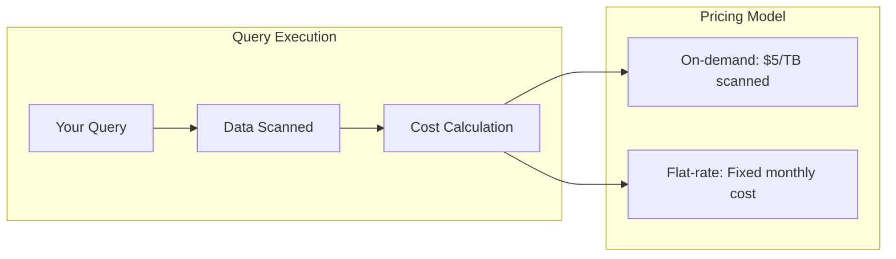
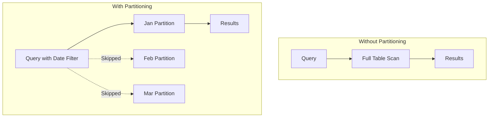
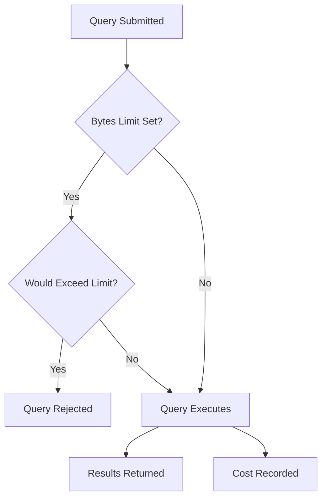

# How to Handle BigQuery Queries

Author: [nawazdhandala](https://www.github.com/nawazdhandala)

Tags: GCP, Google Cloud, BigQuery, SQL, Data Analytics, Performance, Cost Optimization

Description: Learn how to write efficient BigQuery queries, optimize performance, control costs, and handle common query patterns including partitioning, clustering, and query scheduling.

---

BigQuery is Google's serverless data warehouse that can process petabytes of data. But with great power comes great cost - poorly written queries can burn through your budget in minutes. This guide covers practical techniques for writing efficient queries, optimizing performance, and keeping costs under control.

## Understanding BigQuery Pricing

BigQuery charges for data scanned, not query complexity. A simple SELECT that scans 1 TB costs the same as a complex JOIN that scans 1 TB.



## Estimating Query Cost Before Running

Always check how much data a query will scan before executing it.

```sql
-- Use the BigQuery dry run feature
-- In the console, click "More" > "Query settings" > "Dry run"

-- Or via bq command line
-- This shows bytes processed without running the query
```

```bash
# Dry run to estimate cost
bq query --dry_run --use_legacy_sql=false '
SELECT
    user_id,
    COUNT(*) as order_count,
    SUM(total_amount) as total_spent
FROM `my-project.sales.orders`
WHERE order_date >= "2024-01-01"
GROUP BY user_id
'

# Output shows: Query successfully validated. Assuming the tables are not modified,
# running this query will process 2.5 GB of data.
```

In Python, use the dry run option.

```python
from google.cloud import bigquery

client = bigquery.Client()

query = """
SELECT user_id, COUNT(*) as order_count
FROM `my-project.sales.orders`
WHERE order_date >= '2024-01-01'
GROUP BY user_id
"""

# Configure dry run
job_config = bigquery.QueryJobConfig(dry_run=True, use_query_cache=False)

# Run dry run
query_job = client.query(query, job_config=job_config)

# Calculate cost (on-demand pricing: $5 per TB)
bytes_processed = query_job.total_bytes_processed
cost_estimate = (bytes_processed / (1024**4)) * 5

print(f"This query will process {bytes_processed / (1024**3):.2f} GB")
print(f"Estimated cost: ${cost_estimate:.4f}")
```

## Optimizing Query Performance

### Select Only Needed Columns

Never use SELECT *. It scans all columns and costs more.

```sql
-- Bad: Scans all columns
SELECT * FROM `my-project.sales.orders` LIMIT 100;

-- Good: Only scans selected columns
SELECT order_id, user_id, total_amount
FROM `my-project.sales.orders`
LIMIT 100;
```

### Use Partitioned Tables

Partitioned tables let BigQuery scan only relevant partitions.

```sql
-- Create a partitioned table
CREATE TABLE `my-project.sales.orders_partitioned`
PARTITION BY DATE(order_date)
CLUSTER BY user_id
AS SELECT * FROM `my-project.sales.orders`;

-- Query with partition filter - only scans matching partitions
SELECT user_id, SUM(total_amount) as total
FROM `my-project.sales.orders_partitioned`
WHERE order_date >= '2024-01-01' AND order_date < '2024-02-01'
GROUP BY user_id;
```



### Use Clustering

Clustering sorts data within partitions for faster filtering.

```sql
-- Create table with clustering
CREATE TABLE `my-project.sales.orders_optimized`
PARTITION BY DATE(order_date)
CLUSTER BY region, product_category
AS SELECT * FROM `my-project.sales.orders`;

-- Queries filtering on cluster columns are faster
SELECT product_category, SUM(total_amount)
FROM `my-project.sales.orders_optimized`
WHERE order_date >= '2024-01-01'
  AND region = 'US'
  AND product_category IN ('Electronics', 'Clothing')
GROUP BY product_category;
```

## Handling Large Result Sets

### Use LIMIT for Exploration

```sql
-- Always use LIMIT when exploring data
SELECT *
FROM `my-project.sales.orders`
WHERE order_date = CURRENT_DATE()
LIMIT 1000;
```

### Export Large Results to a Table

```sql
-- Save results to a destination table instead of downloading
CREATE TABLE `my-project.analytics.daily_summary` AS
SELECT
    DATE(order_date) as date,
    region,
    COUNT(*) as order_count,
    SUM(total_amount) as revenue
FROM `my-project.sales.orders`
GROUP BY date, region;
```

### Stream Results in Python

```python
from google.cloud import bigquery

client = bigquery.Client()

query = """
SELECT user_id, order_id, total_amount
FROM `my-project.sales.orders`
WHERE order_date >= '2024-01-01'
"""

# Use query results iterator to avoid loading all data into memory
query_job = client.query(query)

# Process results in batches
for row in query_job.result(page_size=10000):
    # Process each row without loading everything into memory
    process_order(row.user_id, row.order_id, row.total_amount)
```

## Common Query Patterns

### Deduplication

```sql
-- Remove duplicates keeping the most recent record
WITH ranked AS (
    SELECT
        *,
        ROW_NUMBER() OVER (
            PARTITION BY user_id, order_id
            ORDER BY updated_at DESC
        ) as rn
    FROM `my-project.sales.orders`
)
SELECT * EXCEPT(rn)
FROM ranked
WHERE rn = 1;
```

### Running Totals

```sql
-- Calculate running total by date
SELECT
    order_date,
    daily_revenue,
    SUM(daily_revenue) OVER (
        ORDER BY order_date
        ROWS BETWEEN UNBOUNDED PRECEDING AND CURRENT ROW
    ) as running_total
FROM (
    SELECT
        DATE(order_date) as order_date,
        SUM(total_amount) as daily_revenue
    FROM `my-project.sales.orders`
    GROUP BY order_date
)
ORDER BY order_date;
```

### Pivot Tables

```sql
-- Pivot data to get columns per category
SELECT
    region,
    SUM(IF(product_category = 'Electronics', total_amount, 0)) as electronics,
    SUM(IF(product_category = 'Clothing', total_amount, 0)) as clothing,
    SUM(IF(product_category = 'Food', total_amount, 0)) as food
FROM `my-project.sales.orders`
WHERE order_date >= '2024-01-01'
GROUP BY region;
```

### Handling JSON Data

```sql
-- Extract fields from JSON columns
SELECT
    order_id,
    JSON_EXTRACT_SCALAR(metadata, '$.source') as source,
    JSON_EXTRACT_SCALAR(metadata, '$.campaign_id') as campaign_id,
    CAST(JSON_EXTRACT_SCALAR(metadata, '$.discount_percent') AS FLOAT64) as discount
FROM `my-project.sales.orders`
WHERE JSON_EXTRACT_SCALAR(metadata, '$.source') = 'mobile_app';
```

## Scheduled Queries

Automate recurring queries with BigQuery scheduled queries.

```bash
# Create a scheduled query via bq command
bq query \
    --use_legacy_sql=false \
    --destination_table='my-project:analytics.daily_summary' \
    --schedule='every 24 hours' \
    --display_name='Daily Sales Summary' \
    --replace=true \
    '
    SELECT
        CURRENT_DATE() as report_date,
        region,
        COUNT(*) as order_count,
        SUM(total_amount) as revenue
    FROM `my-project.sales.orders`
    WHERE DATE(order_date) = DATE_SUB(CURRENT_DATE(), INTERVAL 1 DAY)
    GROUP BY region
    '
```

Using Terraform:

```hcl
resource "google_bigquery_data_transfer_config" "daily_summary" {
  display_name           = "Daily Sales Summary"
  location               = "US"
  data_source_id         = "scheduled_query"
  schedule               = "every 24 hours"
  destination_dataset_id = google_bigquery_dataset.analytics.dataset_id

  params = {
    destination_table_name_template = "daily_summary"
    write_disposition               = "WRITE_TRUNCATE"
    query                           = <<-EOT
      SELECT
        CURRENT_DATE() as report_date,
        region,
        COUNT(*) as order_count,
        SUM(total_amount) as revenue
      FROM `my-project.sales.orders`
      WHERE DATE(order_date) = DATE_SUB(CURRENT_DATE(), INTERVAL 1 DAY)
      GROUP BY region
    EOT
  }
}
```

## Query Caching

BigQuery caches results for 24 hours. Use caching to save costs on repeated queries.

```python
from google.cloud import bigquery

client = bigquery.Client()

# Enable caching (default is True)
job_config = bigquery.QueryJobConfig(use_query_cache=True)

query_job = client.query("""
    SELECT region, SUM(total_amount) as revenue
    FROM `my-project.sales.orders`
    WHERE order_date >= '2024-01-01'
    GROUP BY region
""", job_config=job_config)

results = query_job.result()

# Check if results came from cache
if query_job.cache_hit:
    print("Results served from cache - no cost!")
else:
    print(f"Query scanned {query_job.total_bytes_processed} bytes")
```

## Cost Control Best Practices

### Set Project-Level Quotas

```bash
# Set maximum bytes billed per query (1 GB limit)
bq query --maximum_bytes_billed=1000000000 --use_legacy_sql=false '
SELECT * FROM `my-project.sales.orders`
'

# This query will fail if it would scan more than 1 GB
```

### Use Labels for Cost Tracking

```sql
-- Add labels to track costs by team or project
-- In the query settings or via API

-- Python example
job_config = bigquery.QueryJobConfig(
    labels={"team": "analytics", "project": "q1-report"}
)
```

### Monitor with BigQuery INFORMATION_SCHEMA

```sql
-- Check query costs over the last 7 days
SELECT
    user_email,
    COUNT(*) as query_count,
    SUM(total_bytes_processed) / POW(1024, 4) as tb_processed,
    SUM(total_bytes_processed) / POW(1024, 4) * 5 as estimated_cost_usd
FROM `region-us`.INFORMATION_SCHEMA.JOBS_BY_PROJECT
WHERE creation_time >= TIMESTAMP_SUB(CURRENT_TIMESTAMP(), INTERVAL 7 DAY)
  AND job_type = 'QUERY'
  AND state = 'DONE'
GROUP BY user_email
ORDER BY tb_processed DESC;
```



## Summary

Efficient BigQuery usage comes down to three principles: scan less data (use partitions, select specific columns, apply filters early), leverage caching for repeated queries, and monitor costs with dry runs and INFORMATION_SCHEMA queries.

Start every query with a dry run to estimate costs. Use partitioned and clustered tables for large datasets. Set byte limits to prevent runaway queries. And monitor your usage regularly to catch unexpected costs before they become problems.

BigQuery is incredibly powerful, but that power makes it easy to accidentally scan terabytes of data. Build good habits early, and you will get fast results without breaking the budget.
