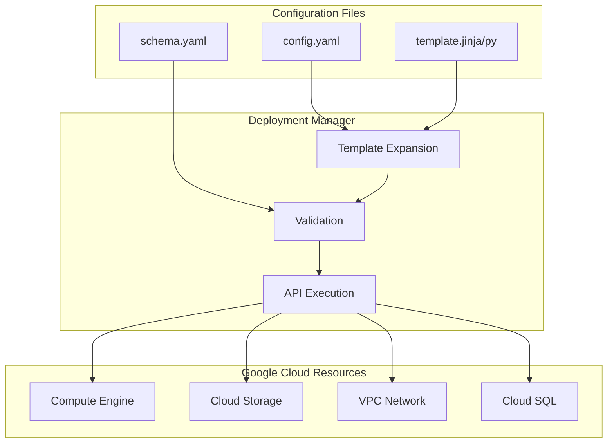

# How to Configure Cloud Deployment Manager

Author: [nawazdhandala](https://www.github.com/nawazdhandala)

Tags: GCP, Google Cloud, Cloud Deployment Manager, Infrastructure as Code, DevOps, Automation

Description: A comprehensive guide to configuring Google Cloud Deployment Manager for infrastructure automation, including templates, schemas, and best practices.

---

Google Cloud Deployment Manager lets you define your infrastructure as code using YAML, Python, or Jinja2 templates. Unlike Terraform which works across multiple clouds, Deployment Manager is deeply integrated with GCP and can access APIs the moment they're released. This guide walks through everything from basic deployments to complex multi-resource configurations.

## Understanding Deployment Manager Architecture

Deployment Manager uses a declarative approach where you define the desired state of your infrastructure. The service then figures out how to create, update, or delete resources to match that state.



## Setting Up Your First Deployment

### Enable the API

```bash
# Enable Deployment Manager API
gcloud services enable deploymentmanager.googleapis.com

# Verify it's enabled
gcloud services list --enabled | grep deploymentmanager
```

### Basic Configuration File

Create a simple deployment that provisions a Compute Engine instance:

```yaml
# simple-vm.yaml
resources:
  - name: my-first-vm
    type: compute.v1.instance
    properties:
      zone: us-central1-a
      machineType: zones/us-central1-a/machineTypes/e2-medium

      # Boot disk configuration
      disks:
        - deviceName: boot
          type: PERSISTENT
          boot: true
          autoDelete: true
          initializeParams:
            sourceImage: projects/debian-cloud/global/images/family/debian-11
            diskSizeGb: 20

      # Network interface
      networkInterfaces:
        - network: global/networks/default
          accessConfigs:
            - name: External NAT
              type: ONE_TO_ONE_NAT

      # Metadata for startup script
      metadata:
        items:
          - key: startup-script
            value: |
              #!/bin/bash
              apt-get update
              apt-get install -y nginx
              systemctl start nginx
```

### Deploy the Configuration

```bash
# Create the deployment
gcloud deployment-manager deployments create my-first-deployment \
    --config simple-vm.yaml

# Check deployment status
gcloud deployment-manager deployments describe my-first-deployment

# List all resources in the deployment
gcloud deployment-manager resources list --deployment my-first-deployment
```

## Using Templates for Reusability

Templates let you parameterize your configurations and reuse them across environments.

### Jinja2 Template Example

```jinja2
{# vm-template.jinja #}





resources:
  - name: {{ env["name"] }}-vm
    type: compute.v1.instance
    properties:
      zone: {{ ZONE }}
      machineType: zones/{{ ZONE }}/machineTypes/{{ MACHINE_TYPE }}

      disks:
        - deviceName: boot
          type: PERSISTENT
          boot: true
          autoDelete: true
          initializeParams:
            sourceImage: projects/debian-cloud/global/images/family/debian-11
            diskSizeGb: {{ properties["diskSizeGb"] }}

      networkInterfaces:
        - network: global/networks/{{ properties["network"] }}
          
          accessConfigs:
            - name: External NAT
              type: ONE_TO_ONE_NAT
          

      labels:
        environment: {{ properties["environment"] }}
        team: {{ properties["team"] }}

      
      tags:
        items:
          
          - {{ tag }}
          
      
```

### Template Schema for Validation

```yaml
# vm-template.jinja.schema
info:
  title: VM Template
  author: Platform Team
  description: Creates a Compute Engine VM with configurable properties
  version: 1.0

required:
  - zone
  - machineType
  - environment

properties:
  zone:
    type: string
    description: GCP zone for the VM
    default: us-central1-a

  machineType:
    type: string
    description: Machine type for the VM
    enum:
      - e2-micro
      - e2-small
      - e2-medium
      - e2-standard-2
      - e2-standard-4

  diskSizeGb:
    type: integer
    description: Boot disk size in GB
    default: 20
    minimum: 10
    maximum: 500

  network:
    type: string
    description: VPC network name
    default: default

  externalIp:
    type: boolean
    description: Whether to assign an external IP
    default: false

  environment:
    type: string
    description: Environment label
    enum:
      - dev
      - staging
      - production

  team:
    type: string
    description: Team owning this resource
    default: platform

  tags:
    type: array
    description: Network tags for firewall rules
    items:
      type: string
```

### Using the Template

```yaml
# production-config.yaml
imports:
  - path: vm-template.jinja

resources:
  - name: web-server
    type: vm-template.jinja
    properties:
      zone: us-central1-a
      machineType: e2-standard-2
      diskSizeGb: 50
      network: production-vpc
      externalIp: true
      environment: production
      team: web-platform
      tags:
        - http-server
        - https-server

  - name: api-server
    type: vm-template.jinja
    properties:
      zone: us-central1-b
      machineType: e2-standard-4
      diskSizeGb: 100
      network: production-vpc
      externalIp: false
      environment: production
      team: api-platform
      tags:
        - internal-api
```

## Python Templates for Complex Logic

Python templates give you full programming capabilities for dynamic infrastructure.

```python
# network-template.py
"""Creates a VPC network with subnets and firewall rules."""

def generate_config(context):
    """Generates the configuration."""

    project = context.env['project']
    name_prefix = context.properties['namePrefix']
    region = context.properties['region']

    resources = []
    outputs = []

    # Create VPC network
    network_name = f"{name_prefix}-vpc"
    resources.append({
        'name': network_name,
        'type': 'compute.v1.network',
        'properties': {
            'autoCreateSubnetworks': False,
            'routingConfig': {
                'routingMode': 'REGIONAL'
            }
        }
    })

    # Create subnets based on configuration
    for subnet in context.properties.get('subnets', []):
        subnet_name = f"{name_prefix}-{subnet['name']}"
        resources.append({
            'name': subnet_name,
            'type': 'compute.v1.subnetwork',
            'properties': {
                'network': f"$(ref.{network_name}.selfLink)",
                'region': region,
                'ipCidrRange': subnet['cidr'],
                'privateIpGoogleAccess': subnet.get('privateGoogleAccess', True),
                'secondaryIpRanges': subnet.get('secondaryRanges', [])
            }
        })

        outputs.append({
            'name': f"{subnet['name']}-subnet-link",
            'value': f"$(ref.{subnet_name}.selfLink)"
        })

    # Create firewall rules
    for rule in context.properties.get('firewallRules', []):
        rule_name = f"{name_prefix}-{rule['name']}"
        firewall_config = {
            'name': rule_name,
            'type': 'compute.v1.firewall',
            'properties': {
                'network': f"$(ref.{network_name}.selfLink)",
                'priority': rule.get('priority', 1000),
                'direction': rule.get('direction', 'INGRESS'),
                'allowed': rule['allowed']
            }
        }

        # Add source or destination ranges
        if 'sourceRanges' in rule:
            firewall_config['properties']['sourceRanges'] = rule['sourceRanges']
        if 'sourceTags' in rule:
            firewall_config['properties']['sourceTags'] = rule['sourceTags']
        if 'targetTags' in rule:
            firewall_config['properties']['targetTags'] = rule['targetTags']

        resources.append(firewall_config)

    # Add Cloud NAT if requested
    if context.properties.get('enableCloudNat', False):
        router_name = f"{name_prefix}-router"
        resources.append({
            'name': router_name,
            'type': 'compute.v1.router',
            'properties': {
                'network': f"$(ref.{network_name}.selfLink)",
                'region': region
            }
        })

        resources.append({
            'name': f"{name_prefix}-nat",
            'type': 'compute.v1.router',
            'metadata': {
                'dependsOn': [router_name]
            },
            'properties': {
                'region': region,
                'router': f"$(ref.{router_name}.name)",
                'nats': [{
                    'name': f"{name_prefix}-nat-config",
                    'natIpAllocateOption': 'AUTO_ONLY',
                    'sourceSubnetworkIpRangesToNat': 'ALL_SUBNETWORKS_ALL_IP_RANGES'
                }]
            }
        })

    outputs.append({
        'name': 'network-link',
        'value': f"$(ref.{network_name}.selfLink)"
    })

    return {
        'resources': resources,
        'outputs': outputs
    }
```

## Managing Deployments

### Update a Deployment

```bash
# Preview changes before applying
gcloud deployment-manager deployments update my-deployment \
    --config updated-config.yaml \
    --preview

# Apply the previewed changes
gcloud deployment-manager deployments update my-deployment

# Or apply directly without preview
gcloud deployment-manager deployments update my-deployment \
    --config updated-config.yaml
```

### Delete a Deployment

```bash
# Delete deployment and all its resources
gcloud deployment-manager deployments delete my-deployment

# Delete but keep certain resources
gcloud deployment-manager deployments delete my-deployment \
    --delete-policy ABANDON
```

### Export Existing Resources

```bash
# Export a deployment to a file
gcloud deployment-manager deployments describe my-deployment \
    --format yaml > exported-deployment.yaml
```

## Best Practices

### Use Resource References

Instead of hardcoding resource names, use references to ensure proper dependency ordering:

```yaml
resources:
  - name: my-network
    type: compute.v1.network
    properties:
      autoCreateSubnetworks: false

  - name: my-subnet
    type: compute.v1.subnetwork
    properties:
      # Reference the network instead of hardcoding
      network: $(ref.my-network.selfLink)
      region: us-central1
      ipCidrRange: 10.0.0.0/24
```

### Organize with Composite Types

Register frequently used templates as composite types for your organization:

```bash
# Create a composite type
gcloud deployment-manager types create my-vm-type \
    --template vm-template.jinja \
    --project my-project

# Use it in deployments
# type: my-project/my-vm-type
```

### Handle Secrets Properly

Never put secrets directly in templates. Use Secret Manager or Cloud KMS:

```yaml
resources:
  - name: db-password
    type: gcp-types/secretmanager-v1:projects.secrets
    properties:
      parent: projects/{{ env["project"] }}
      secretId: db-password
      replication:
        automatic: {}
```

## Troubleshooting Common Issues

### Debugging Failed Deployments

```bash
# Get detailed error information
gcloud deployment-manager deployments describe my-deployment

# Check operation details
gcloud deployment-manager operations list
gcloud deployment-manager operations describe OPERATION_NAME

# View manifest for expanded configuration
gcloud deployment-manager manifests list --deployment my-deployment
gcloud deployment-manager manifests describe MANIFEST_NAME \
    --deployment my-deployment
```

### Common Errors and Solutions

**API not enabled**: Enable the required API with `gcloud services enable`.

**Quota exceeded**: Request quota increases in the GCP Console or reduce resource counts.

**Permission denied**: Ensure the Deployment Manager service account has necessary IAM roles.

**Resource already exists**: Use `--create-policy CREATE_OR_ACQUIRE` to adopt existing resources.

---

Cloud Deployment Manager provides a native GCP experience for infrastructure as code. While Terraform offers multi-cloud flexibility, Deployment Manager's tight integration with GCP APIs makes it an excellent choice for GCP-only environments. Start with simple YAML configurations, graduate to templates as complexity grows, and leverage Python for truly dynamic infrastructure definitions.
