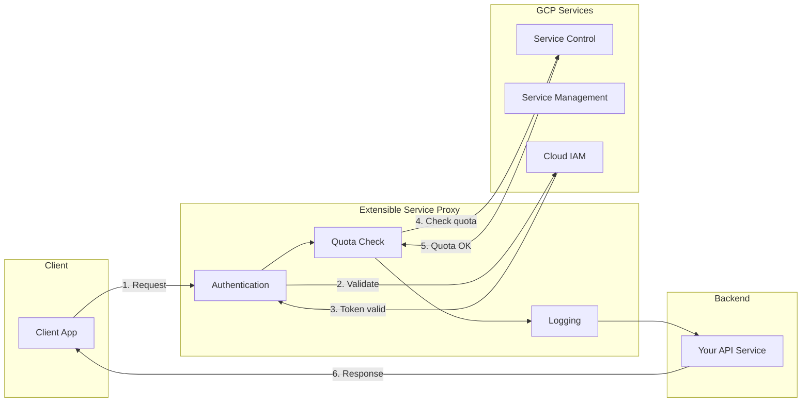

# How to Fix "Cloud Endpoints" API Errors

Author: [nawazdhandala](https://www.github.com/nawazdhandala)

Tags: GCP, Google Cloud, Cloud Endpoints, API Gateway, REST API, gRPC, Troubleshooting, DevOps

Description: A practical troubleshooting guide for fixing Cloud Endpoints API errors, covering authentication issues, configuration problems, and deployment failures.

---

Cloud Endpoints provides API management for your services running on GCP. It handles authentication, monitoring, and rate limiting through the Extensible Service Proxy (ESP). When things go wrong, errors can occur at multiple layers: the ESP, your backend service, or the configuration itself. This guide covers the most common Cloud Endpoints errors and their solutions.

## Cloud Endpoints Architecture

Understanding how requests flow helps identify where problems occur:



## Error: "PERMISSION_DENIED: API not enabled"

This error means the Endpoints API hasn't been enabled for your project or the service configuration hasn't been deployed.

### Enable Required APIs

```bash
# Enable Cloud Endpoints APIs
gcloud services enable servicemanagement.googleapis.com
gcloud services enable servicecontrol.googleapis.com
gcloud services enable endpoints.googleapis.com

# Verify APIs are enabled
gcloud services list --enabled | grep -E "(servicemanagement|servicecontrol|endpoints)"
```

### Deploy Your API Configuration

```bash
# Deploy OpenAPI specification
gcloud endpoints services deploy openapi.yaml

# For gRPC services, deploy the descriptor and config
gcloud endpoints services deploy api_descriptor.pb service_config.yaml

# Verify deployment
gcloud endpoints services describe your-api.endpoints.your-project.cloud.goog
```

## Error: "JWT validation failed" or "UNAUTHENTICATED"

Authentication errors are the most common issues with Cloud Endpoints.

### Check OpenAPI Security Configuration

```yaml
# openapi.yaml
swagger: "2.0"
info:
  title: "My API"
  version: "1.0.0"
host: "my-api.endpoints.my-project.cloud.goog"
schemes:
  - "https"

# Security definitions
securityDefinitions:
  firebase:
    authorizationUrl: ""
    flow: "implicit"
    type: "oauth2"
    x-google-issuer: "https://securetoken.google.com/my-project"
    x-google-jwks_uri: "https://www.googleapis.com/service_accounts/v1/metadata/x509/securetoken@system.gserviceaccount.com"
    x-google-audiences: "my-project"

  api_key:
    type: "apiKey"
    name: "key"
    in: "query"

  google_id_token:
    authorizationUrl: ""
    flow: "implicit"
    type: "oauth2"
    x-google-issuer: "https://accounts.google.com"
    x-google-jwks_uri: "https://www.googleapis.com/oauth2/v3/certs"
    # Specify allowed client IDs
    x-google-audiences: "your-client-id.apps.googleusercontent.com"

# Apply security globally or per-path
security:
  - firebase: []

paths:
  /public:
    get:
      summary: "Public endpoint"
      security: []  # Override to allow unauthenticated access
      responses:
        200:
          description: "Success"

  /protected:
    get:
      summary: "Protected endpoint"
      # Uses global security (firebase)
      responses:
        200:
          description: "Success"
```

### Debug JWT Token Issues

```bash
# Decode a JWT token to inspect claims (without verification)
echo "YOUR_JWT_TOKEN" | cut -d'.' -f2 | base64 -d 2>/dev/null | jq .

# Check required claims:
# - iss (issuer): Must match x-google-issuer
# - aud (audience): Must match x-google-audiences
# - exp (expiration): Must be in the future
# - iat (issued at): Must be in the past
```

### Common JWT Fixes

```python
# Client-side: Ensure token is fresh before requests
import google.auth.transport.requests
from google.oauth2 import id_token

def get_valid_token(client_id):
    """Get a valid Google ID token."""
    request = google.auth.transport.requests.Request()

    # For service accounts
    from google.auth import compute_engine
    credentials = compute_engine.IDTokenCredentials(
        request=request,
        target_audience=client_id
    )
    credentials.refresh(request)
    return credentials.token

# Make request with token
import requests

token = get_valid_token("your-api.endpoints.your-project.cloud.goog")
response = requests.get(
    "https://your-api.endpoints.your-project.cloud.goog/api/data",
    headers={"Authorization": f"Bearer {token}"}
)
```

## Error: "Service control request failed"

This indicates the ESP can't communicate with Google's Service Control API.

### Check ESP Configuration

```yaml
# For Cloud Run deployments
# cloudbuild.yaml
steps:
  - name: 'gcr.io/google.com/cloudsdktool/cloud-sdk'
    entrypoint: 'bash'
    args:
      - '-c'
      - |
        gcloud run deploy my-api \
          --image="gcr.io/my-project/my-api:latest" \
          --platform=managed \
          --region=us-central1 \
          --set-env-vars="^@^ENDPOINTS_SERVICE_NAME=my-api.endpoints.my-project.cloud.goog" \
          --allow-unauthenticated
```

### Verify Service Account Permissions

```bash
# The service account running ESP needs these roles
PROJECT_ID="my-project"
SERVICE_ACCOUNT="my-service@my-project.iam.gserviceaccount.com"

# Grant Service Controller role
gcloud projects add-iam-policy-binding $PROJECT_ID \
    --member="serviceAccount:$SERVICE_ACCOUNT" \
    --role="roles/servicemanagement.serviceController"

# Grant Cloud Trace Agent for tracing (optional but recommended)
gcloud projects add-iam-policy-binding $PROJECT_ID \
    --member="serviceAccount:$SERVICE_ACCOUNT" \
    --role="roles/cloudtrace.agent"
```

## Error: "Backend unavailable" or "502 Bad Gateway"

The ESP can't reach your backend service.

### Check ESP Backend Configuration

For ESPv2 on Cloud Run:

```yaml
# openapi.yaml
swagger: "2.0"
info:
  title: "My API"
  version: "1.0.0"
host: "my-api.endpoints.my-project.cloud.goog"

# Backend address configuration
x-google-backend:
  address: https://my-backend-service-xxxxx-uc.a.run.app
  path_translation: APPEND_PATH_TO_ADDRESS
  deadline: 30.0  # Timeout in seconds
```

### Debug Backend Connectivity

```bash
# Test backend directly (bypassing ESP)
curl -v https://my-backend-service-xxxxx-uc.a.run.app/health

# Check ESP logs for backend errors
gcloud logging read "resource.type=cloud_run_revision AND \
    resource.labels.service_name=my-api AND \
    severity>=ERROR" \
    --limit=50 \
    --format="table(timestamp,jsonPayload.message)"
```

### Common Backend Issues

```yaml
# Issue: Path not matching
# ESP adds base path from OpenAPI spec

# openapi.yaml
basePath: "/v1"
paths:
  /users:  # Full path becomes /v1/users
    get:
      ...

# Backend must handle /v1/users, not just /users
# Or use path_translation: CONSTANT_ADDRESS to strip base path
x-google-backend:
  address: https://backend.run.app/v1
  path_translation: CONSTANT_ADDRESS
```

## Error: "Quota exceeded"

API quota limits have been reached.

### Check and Increase Quotas

```bash
# View current quota usage
gcloud endpoints quota list \
    --service=my-api.endpoints.my-project.cloud.goog \
    --consumer=project:my-project

# Request quota increase (opens browser)
gcloud endpoints quota update --help
```

### Configure Quotas in OpenAPI

```yaml
# openapi.yaml
x-google-management:
  metrics:
    - name: "read-requests"
      displayName: "Read Requests"
      valueType: INT64
      metricKind: DELTA
    - name: "write-requests"
      displayName: "Write Requests"
      valueType: INT64
      metricKind: DELTA

  quota:
    limits:
      - name: "read-limit"
        metric: "read-requests"
        unit: "1/min/{project}"
        values:
          STANDARD: 1000
      - name: "write-limit"
        metric: "write-requests"
        unit: "1/min/{project}"
        values:
          STANDARD: 100

paths:
  /data:
    get:
      x-google-quota:
        metricCosts:
          read-requests: 1
    post:
      x-google-quota:
        metricCosts:
          write-requests: 1
```

## Error: "Service configuration not found"

The ESP can't find or load the service configuration.

### Verify Configuration Deployment

```bash
# List all configurations for your service
gcloud endpoints configs list \
    --service=my-api.endpoints.my-project.cloud.goog

# Get details of a specific configuration
gcloud endpoints configs describe CONFIG_ID \
    --service=my-api.endpoints.my-project.cloud.goog

# Redeploy configuration
gcloud endpoints services deploy openapi.yaml
```

### ESP Configuration Options

```bash
# For ESPv2, specify config version explicitly
docker run -d \
    --name esp \
    -p 8080:8080 \
    gcr.io/endpoints-release/endpoints-runtime:2 \
    --service=my-api.endpoints.my-project.cloud.goog \
    --rollout_strategy=managed \  # Or fixed with --version=CONFIG_ID
    --backend=http://localhost:8081
```

## Complete Debugging Workflow

```bash
#!/bin/bash
# endpoints-debug.sh

SERVICE_NAME="my-api.endpoints.my-project.cloud.goog"
PROJECT_ID="my-project"

echo "=== Step 1: Check APIs enabled ==="
gcloud services list --enabled --filter="name:service" --format="table(name)"

echo -e "\n=== Step 2: Check service exists ==="
gcloud endpoints services describe $SERVICE_NAME 2>&1 || \
    echo "Service not found. Deploy with: gcloud endpoints services deploy openapi.yaml"

echo -e "\n=== Step 3: List configurations ==="
gcloud endpoints configs list --service=$SERVICE_NAME

echo -e "\n=== Step 4: Check recent errors ==="
gcloud logging read "resource.type=api AND \
    resource.labels.service=$SERVICE_NAME AND \
    severity>=WARNING" \
    --limit=20 \
    --format="table(timestamp,severity,jsonPayload.error_cause)"

echo -e "\n=== Step 5: Check ESP logs ==="
gcloud logging read "resource.type=cloud_run_revision AND \
    jsonPayload.@type=type.googleapis.com/google.cloud.loadbalancing.type.LoadBalancerLogEntry" \
    --limit=10 \
    --format="table(timestamp,jsonPayload.statusDetails)"

echo -e "\n=== Step 6: Test endpoint ==="
curl -s -o /dev/null -w "HTTP Status: %{http_code}\n" \
    "https://$SERVICE_NAME/health"
```

## Best Practices

### Use API Versioning

```yaml
# openapi.yaml
swagger: "2.0"
info:
  title: "My API"
  version: "2.0.0"
host: "my-api.endpoints.my-project.cloud.goog"
basePath: "/v2"

# Support multiple versions with different backends
x-google-backend:
  address: https://backend-v2.run.app
```

### Enable Detailed Logging

```yaml
# openapi.yaml
x-google-management:
  logs:
    - name: "endpoints_log"

# In backend, add request logging
x-google-backend:
  address: https://backend.run.app
  jwt_audience: https://backend.run.app
  protocol: h2  # Use HTTP/2 for better performance
```

### Monitor API Health

```bash
# Set up uptime checks
gcloud monitoring uptime-check-configs create my-api-check \
    --display-name="My API Health Check" \
    --resource-type=uptime-url \
    --hostname="my-api.endpoints.my-project.cloud.goog" \
    --path="/health" \
    --check-interval=60s
```

---

Cloud Endpoints errors usually fall into three categories: authentication and authorization issues, configuration deployment problems, or backend connectivity failures. Work through each layer systematically, starting with API enablement, then configuration, authentication, and finally backend connectivity. The ESP logs in Cloud Logging provide detailed information about what went wrong at each stage of request processing.
