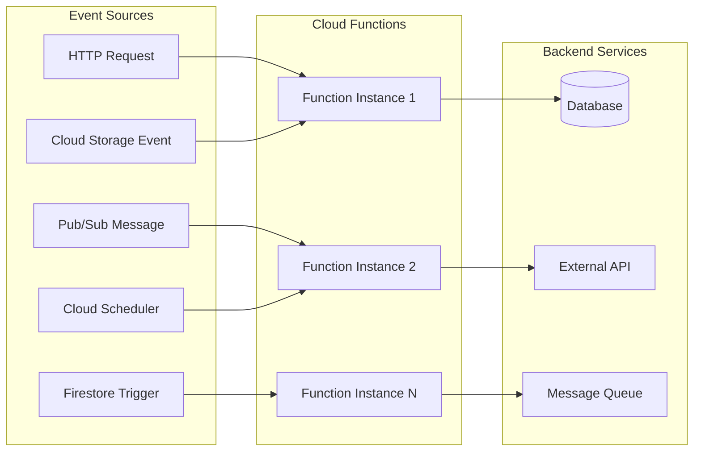
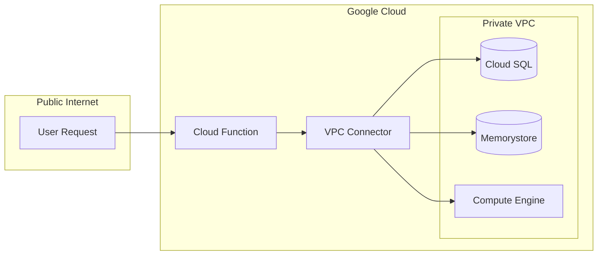
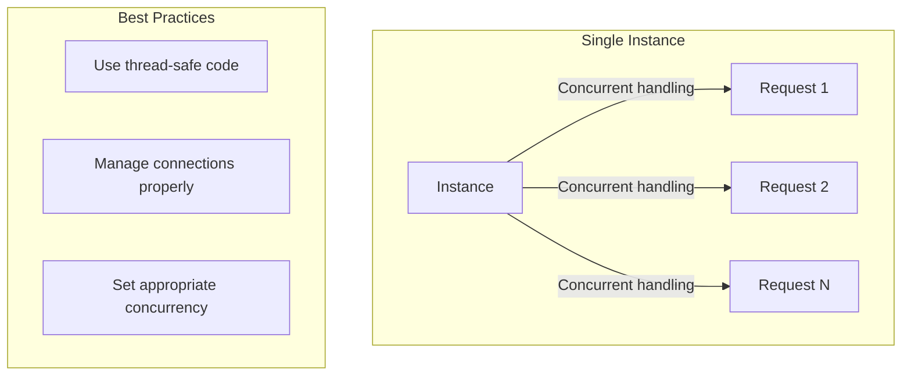

# How to Configure Cloud Functions in GCP

Author: [nawazdhandala](https://www.github.com/nawazdhandala)

Tags: GCP, Google Cloud Platform, Cloud Functions, Serverless, FaaS, Event-Driven Architecture

Description: Learn how to configure and deploy Google Cloud Functions with proper triggers, environment variables, networking, and security settings.

---

Google Cloud Functions is a serverless execution environment that lets you run code in response to events without managing servers. Proper configuration is essential for building reliable, secure, and cost-effective serverless applications. This guide covers everything from basic setup to advanced configuration patterns.

## Cloud Functions Architecture



Cloud Functions automatically scales based on incoming requests, spinning up new instances as needed and scaling down when idle.

## Basic Function Deployment

### HTTP Triggered Function

```python
# main.py
import functions_framework
from flask import jsonify

@functions_framework.http
def hello_world(request):
    """HTTP Cloud Function.

    Args:
        request (flask.Request): The request object.
    Returns:
        The response text, or any set of values that can be turned into a
        Response object using flask.make_response.
    """
    request_json = request.get_json(silent=True)
    name = request_json.get('name', 'World') if request_json else 'World'

    return jsonify({
        'message': f'Hello, {name}!',
        'status': 'success'
    })
```

```bash
# Deploy the function
gcloud functions deploy hello-world \
    --gen2 \
    --runtime=python312 \
    --region=us-central1 \
    --source=. \
    --entry-point=hello_world \
    --trigger-http \
    --allow-unauthenticated
```

### Pub/Sub Triggered Function

```python
# main.py
import base64
import functions_framework
from cloudevents.http import CloudEvent

@functions_framework.cloud_event
def process_pubsub(cloud_event: CloudEvent):
    """Process a Pub/Sub message.

    Args:
        cloud_event: The CloudEvent containing the Pub/Sub message.
    """
    # Decode the Pub/Sub message
    message_data = base64.b64decode(cloud_event.data["message"]["data"]).decode()

    print(f"Received message: {message_data}")

    # Process the message
    # Your business logic here
```

```bash
# Deploy Pub/Sub triggered function
gcloud functions deploy process-pubsub \
    --gen2 \
    --runtime=python312 \
    --region=us-central1 \
    --source=. \
    --entry-point=process_pubsub \
    --trigger-topic=my-topic
```

## Configuration Options

### Memory and CPU Allocation

```bash
# Deploy with custom memory and CPU
gcloud functions deploy high-performance-function \
    --gen2 \
    --runtime=python312 \
    --region=us-central1 \
    --source=. \
    --entry-point=handler \
    --trigger-http \
    --memory=2048MB \
    --cpu=2 \
    --timeout=300s
```

Memory and CPU configurations:

| Memory | Default CPU | Max CPU |
|--------|-------------|---------|
| 128MB  | 0.083       | 1       |
| 256MB  | 0.167       | 1       |
| 512MB  | 0.333       | 1       |
| 1GB    | 0.583       | 1       |
| 2GB    | 1           | 2       |
| 4GB    | 2           | 2       |
| 8GB    | 2           | 4       |
| 16GB   | 4           | 4       |

### Environment Variables

```bash
# Deploy with environment variables
gcloud functions deploy my-function \
    --gen2 \
    --runtime=python312 \
    --region=us-central1 \
    --source=. \
    --entry-point=handler \
    --trigger-http \
    --set-env-vars="DATABASE_HOST=10.0.0.5,LOG_LEVEL=INFO,FEATURE_FLAG=true"

# Update environment variables on existing function
gcloud functions deploy my-function \
    --gen2 \
    --update-env-vars="LOG_LEVEL=DEBUG"
```

### Using Secret Manager

```python
# main.py
import functions_framework
from google.cloud import secretmanager

def access_secret(project_id: str, secret_id: str, version: str = "latest") -> str:
    """Access a secret from Secret Manager."""
    client = secretmanager.SecretManagerServiceClient()
    name = f"projects/{project_id}/secrets/{secret_id}/versions/{version}"
    response = client.access_secret_version(request={"name": name})
    return response.payload.data.decode("UTF-8")

@functions_framework.http
def secure_function(request):
    # Access API key from Secret Manager
    api_key = access_secret("my-project", "api-key")

    # Use the secret
    # ...
```

```bash
# Deploy with secret environment variables
gcloud functions deploy secure-function \
    --gen2 \
    --runtime=python312 \
    --region=us-central1 \
    --source=. \
    --entry-point=secure_function \
    --trigger-http \
    --set-secrets="API_KEY=projects/my-project/secrets/api-key:latest,DB_PASSWORD=db-password:latest"
```

## Networking Configuration

### VPC Connector for Private Resources



```bash
# Create a VPC connector
gcloud compute networks vpc-access connectors create my-connector \
    --region=us-central1 \
    --network=my-vpc \
    --range=10.8.0.0/28 \
    --min-instances=2 \
    --max-instances=10

# Deploy function with VPC connector
gcloud functions deploy private-function \
    --gen2 \
    --runtime=python312 \
    --region=us-central1 \
    --source=. \
    --entry-point=handler \
    --trigger-http \
    --vpc-connector=my-connector \
    --egress-settings=private-ranges-only
```

### Configuring Ingress Settings

```bash
# Allow only internal traffic
gcloud functions deploy internal-function \
    --gen2 \
    --runtime=python312 \
    --region=us-central1 \
    --source=. \
    --entry-point=handler \
    --trigger-http \
    --ingress-settings=internal-only

# Allow internal and Cloud Load Balancing traffic
gcloud functions deploy lb-function \
    --gen2 \
    --runtime=python312 \
    --region=us-central1 \
    --source=. \
    --entry-point=handler \
    --trigger-http \
    --ingress-settings=internal-and-gclb
```

## Security Configuration

### Service Account Configuration

```bash
# Create a dedicated service account
gcloud iam service-accounts create function-sa \
    --display-name="Cloud Function Service Account"

# Grant necessary permissions
gcloud projects add-iam-policy-binding my-project \
    --member="serviceAccount:function-sa@my-project.iam.gserviceaccount.com" \
    --role="roles/cloudsql.client"

gcloud projects add-iam-policy-binding my-project \
    --member="serviceAccount:function-sa@my-project.iam.gserviceaccount.com" \
    --role="roles/secretmanager.secretAccessor"

# Deploy with custom service account
gcloud functions deploy my-function \
    --gen2 \
    --runtime=python312 \
    --region=us-central1 \
    --source=. \
    --entry-point=handler \
    --trigger-http \
    --service-account=function-sa@my-project.iam.gserviceaccount.com
```

### Authentication and Authorization

```python
# main.py - Validate authentication
import functions_framework
from google.auth.transport import requests
from google.oauth2 import id_token
from flask import abort

def validate_token(request):
    """Validate the ID token from the request."""
    auth_header = request.headers.get('Authorization', '')

    if not auth_header.startswith('Bearer '):
        return None

    token = auth_header.split('Bearer ')[1]

    try:
        # Verify the token
        decoded_token = id_token.verify_oauth2_token(
            token,
            requests.Request(),
            audience='my-project'
        )
        return decoded_token
    except Exception as e:
        print(f"Token validation failed: {e}")
        return None

@functions_framework.http
def authenticated_function(request):
    """Function that requires authentication."""
    user_info = validate_token(request)

    if not user_info:
        abort(401, 'Unauthorized: Invalid or missing token')

    # Process authenticated request
    return f"Hello, {user_info.get('email', 'User')}!"
```

```bash
# Require authentication for the function
gcloud functions deploy authenticated-function \
    --gen2 \
    --runtime=python312 \
    --region=us-central1 \
    --source=. \
    --entry-point=authenticated_function \
    --trigger-http \
    --no-allow-unauthenticated

# Grant invoker permission to specific users
gcloud functions add-invoker-policy-binding authenticated-function \
    --region=us-central1 \
    --member="user:developer@example.com"
```

## Concurrency and Scaling

```bash
# Configure concurrency and instance limits
gcloud functions deploy scalable-function \
    --gen2 \
    --runtime=python312 \
    --region=us-central1 \
    --source=. \
    --entry-point=handler \
    --trigger-http \
    --concurrency=100 \
    --min-instances=1 \
    --max-instances=100
```

### Concurrency Considerations



```python
# main.py - Thread-safe function with connection pooling
import functions_framework
from google.cloud import firestore
import threading

# Global client for connection reuse (thread-safe)
_db_client = None
_client_lock = threading.Lock()

def get_db_client():
    """Get or create a Firestore client (thread-safe)."""
    global _db_client
    if _db_client is None:
        with _client_lock:
            if _db_client is None:
                _db_client = firestore.Client()
    return _db_client

@functions_framework.http
def concurrent_function(request):
    """Handle concurrent requests safely."""
    db = get_db_client()

    # Your business logic using the shared client
    doc_ref = db.collection('items').document('item1')
    doc = doc_ref.get()

    return {'data': doc.to_dict()}
```

## Event-Driven Patterns

### Cloud Storage Trigger

```python
# main.py
import functions_framework
from cloudevents.http import CloudEvent
from google.cloud import storage

@functions_framework.cloud_event
def process_uploaded_file(cloud_event: CloudEvent):
    """Process files uploaded to Cloud Storage."""
    data = cloud_event.data

    bucket_name = data["bucket"]
    file_name = data["name"]

    print(f"Processing file: gs://{bucket_name}/{file_name}")

    # Download and process the file
    storage_client = storage.Client()
    bucket = storage_client.bucket(bucket_name)
    blob = bucket.blob(file_name)

    content = blob.download_as_text()

    # Process content
    processed_data = content.upper()  # Example transformation

    # Save processed file
    output_blob = bucket.blob(f"processed/{file_name}")
    output_blob.upload_from_string(processed_data)

    print(f"Processed file saved to: gs://{bucket_name}/processed/{file_name}")
```

```bash
# Deploy with Cloud Storage trigger
gcloud functions deploy process-uploads \
    --gen2 \
    --runtime=python312 \
    --region=us-central1 \
    --source=. \
    --entry-point=process_uploaded_file \
    --trigger-event-filters="type=google.cloud.storage.object.v1.finalized" \
    --trigger-event-filters="bucket=my-upload-bucket"
```

### Scheduled Function with Cloud Scheduler

```bash
# Deploy the function
gcloud functions deploy scheduled-task \
    --gen2 \
    --runtime=python312 \
    --region=us-central1 \
    --source=. \
    --entry-point=handler \
    --trigger-http \
    --no-allow-unauthenticated

# Create a Cloud Scheduler job
gcloud scheduler jobs create http daily-cleanup \
    --location=us-central1 \
    --schedule="0 2 * * *" \
    --uri="https://us-central1-my-project.cloudfunctions.net/scheduled-task" \
    --http-method=POST \
    --oidc-service-account-email=scheduler-sa@my-project.iam.gserviceaccount.com \
    --oidc-token-audience="https://us-central1-my-project.cloudfunctions.net/scheduled-task"
```

## Terraform Configuration

```hcl
# Cloud Function with comprehensive configuration
resource "google_cloudfunctions2_function" "api_function" {
  name        = "api-function"
  location    = "us-central1"
  description = "API backend function"

  build_config {
    runtime     = "python312"
    entry_point = "handler"

    source {
      storage_source {
        bucket = google_storage_bucket.source_bucket.name
        object = google_storage_bucket_object.source_code.name
      }
    }
  }

  service_config {
    max_instance_count    = 100
    min_instance_count    = 1
    available_memory      = "256M"
    timeout_seconds       = 60
    max_instance_request_concurrency = 80

    environment_variables = {
      LOG_LEVEL = "INFO"
      ENV       = "production"
    }

    secret_environment_variables {
      key        = "API_KEY"
      project_id = var.project_id
      secret     = google_secret_manager_secret.api_key.secret_id
      version    = "latest"
    }

    service_account_email = google_service_account.function_sa.email

    vpc_connector = google_vpc_access_connector.connector.id
    vpc_connector_egress_settings = "PRIVATE_RANGES_ONLY"

    ingress_settings = "ALLOW_ALL"
  }
}

# IAM binding for public access
resource "google_cloud_run_service_iam_member" "invoker" {
  location = google_cloudfunctions2_function.api_function.location
  service  = google_cloudfunctions2_function.api_function.name
  role     = "roles/run.invoker"
  member   = "allUsers"
}
```

## Conclusion

Configuring Cloud Functions properly is essential for building production-ready serverless applications. Start with the basic deployment options and add security, networking, and scaling configurations as your needs grow. Use service accounts with minimal permissions, secrets management for sensitive data, and VPC connectors for private resource access. With the configuration patterns covered in this guide, you can build secure, scalable, and maintainable serverless applications on Google Cloud Platform.
