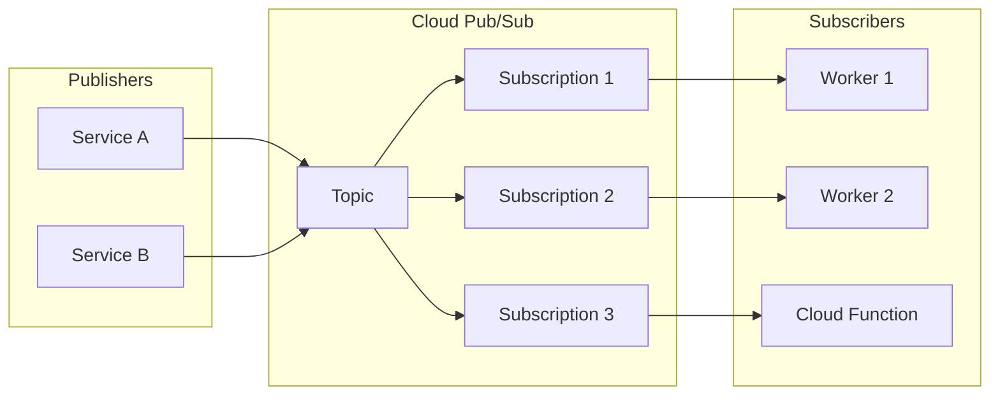
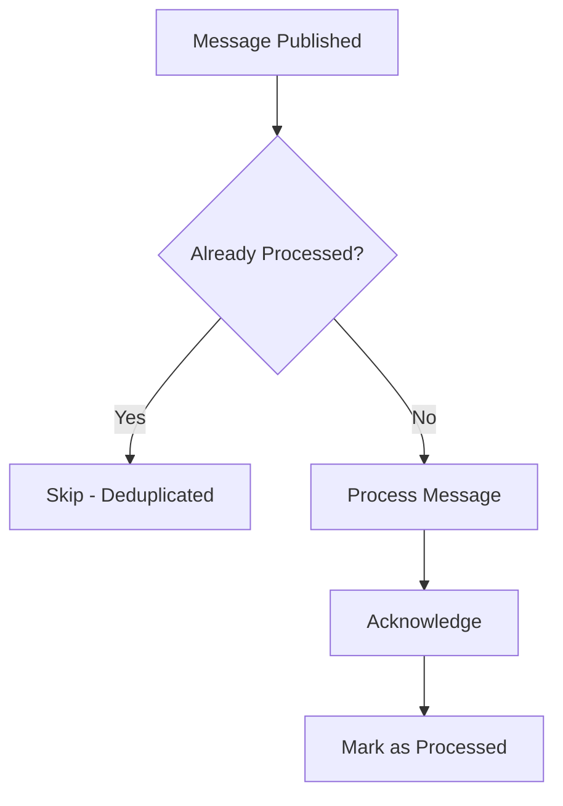
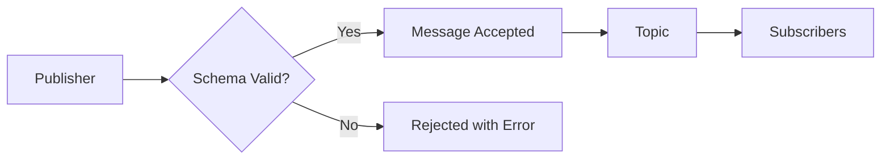

# How to Configure Cloud Pub/Sub

Author: [nawazdhandala](https://www.github.com/nawazdhandala)

Tags: GCP, Google Cloud, Pub/Sub, Messaging, Event-Driven, Microservices, DevOps

Description: A comprehensive guide to configuring Google Cloud Pub/Sub for reliable message delivery, including topics, subscriptions, dead letter queues, and monitoring best practices.

---

Cloud Pub/Sub is Google's fully managed messaging service that enables asynchronous communication between applications. Whether you are building event-driven microservices or processing streaming data, proper Pub/Sub configuration is essential for reliability and performance. This guide covers everything from basic setup to advanced configurations.

## Understanding Pub/Sub Architecture

Before configuring anything, let's understand how Pub/Sub works.



Publishers send messages to topics. Subscriptions receive copies of messages from topics. Multiple subscriptions can receive the same message, enabling fan-out patterns.

## Creating Topics and Subscriptions

### Basic Topic Creation

```bash
# Create a simple topic
gcloud pubsub topics create orders-topic

# Create a topic with message retention (keeps messages even after ack)
gcloud pubsub topics create orders-topic \
    --message-retention-duration=7d

# List all topics
gcloud pubsub topics list
```

### Creating Subscriptions

```bash
# Create a pull subscription
gcloud pubsub subscriptions create orders-subscription \
    --topic=orders-topic \
    --ack-deadline=60 \
    --message-retention-duration=7d

# Create a push subscription that sends to an HTTP endpoint
gcloud pubsub subscriptions create orders-push-subscription \
    --topic=orders-topic \
    --push-endpoint=https://my-service.example.com/pubsub/push \
    --ack-deadline=30
```

## Configuring Message Delivery

### Acknowledgment Deadline

The ack deadline determines how long Pub/Sub waits before redelivering an unacknowledged message.

```bash
# Set a longer ack deadline for slow processing (max 600 seconds)
gcloud pubsub subscriptions update orders-subscription \
    --ack-deadline=300
```

In your application, extend the deadline for long-running operations.

```python
# Python example - extending ack deadline
from google.cloud import pubsub_v1
from concurrent.futures import TimeoutError

subscriber = pubsub_v1.SubscriberClient()
subscription_path = subscriber.subscription_path('my-project', 'orders-subscription')

def callback(message):
    print(f"Received message: {message.data}")

    # Modify ack deadline to get more processing time
    # This gives you another 120 seconds
    message.modify_ack_deadline(120)

    # Do your processing here
    process_order(message.data)

    # Acknowledge when done
    message.ack()

# Subscribe with flow control
flow_control = pubsub_v1.types.FlowControl(
    max_messages=100,  # Max outstanding messages
    max_bytes=10 * 1024 * 1024,  # 10 MB max outstanding bytes
)

streaming_pull_future = subscriber.subscribe(
    subscription_path,
    callback=callback,
    flow_control=flow_control
)

print(f"Listening for messages on {subscription_path}")

try:
    streaming_pull_future.result(timeout=300)
except TimeoutError:
    streaming_pull_future.cancel()
    streaming_pull_future.result()
```

### Exactly-Once Delivery

Enable exactly-once delivery for subscriptions that need deduplication.

```bash
# Create subscription with exactly-once delivery
gcloud pubsub subscriptions create critical-orders-subscription \
    --topic=orders-topic \
    --enable-exactly-once-delivery \
    --ack-deadline=60
```



## Dead Letter Queues

Dead letter queues capture messages that fail processing repeatedly.

```bash
# Create a dead letter topic
gcloud pubsub topics create orders-dead-letter

# Create a subscription for the dead letter topic
gcloud pubsub subscriptions create orders-dead-letter-subscription \
    --topic=orders-dead-letter

# Update the main subscription to use dead letter queue
gcloud pubsub subscriptions update orders-subscription \
    --dead-letter-topic=orders-dead-letter \
    --max-delivery-attempts=5

# Grant Pub/Sub permission to publish to dead letter topic
PROJECT_NUMBER=$(gcloud projects describe my-project --format='value(projectNumber)')

gcloud pubsub topics add-iam-policy-binding orders-dead-letter \
    --member="serviceAccount:service-${PROJECT_NUMBER}@gcp-sa-pubsub.iam.gserviceaccount.com" \
    --role="roles/pubsub.publisher"

# Grant permission to acknowledge from original subscription
gcloud pubsub subscriptions add-iam-policy-binding orders-subscription \
    --member="serviceAccount:service-${PROJECT_NUMBER}@gcp-sa-pubsub.iam.gserviceaccount.com" \
    --role="roles/pubsub.subscriber"
```

## Message Filtering

Reduce processing overhead by filtering messages at the subscription level.

```bash
# Create a subscription that only receives high-priority orders
gcloud pubsub subscriptions create high-priority-orders \
    --topic=orders-topic \
    --filter='attributes.priority="high"'

# Create a subscription for specific regions
gcloud pubsub subscriptions create us-orders \
    --topic=orders-topic \
    --filter='attributes.region="us"'
```

When publishing, include attributes for filtering.

```python
# Python - publishing with attributes for filtering
from google.cloud import pubsub_v1
import json

publisher = pubsub_v1.PublisherClient()
topic_path = publisher.topic_path('my-project', 'orders-topic')

def publish_order(order_data, priority, region):
    """Publish an order with filtering attributes."""

    # Message data must be bytes
    data = json.dumps(order_data).encode('utf-8')

    # Publish with attributes
    future = publisher.publish(
        topic_path,
        data,
        priority=priority,    # Attribute for filtering
        region=region,        # Attribute for filtering
        order_id=str(order_data['id'])
    )

    message_id = future.result()
    print(f"Published message {message_id}")
    return message_id

# Example usage
order = {"id": 12345, "items": ["widget"], "total": 99.99}
publish_order(order, priority="high", region="us")
```

## Retry Configuration

Configure retry policies for push subscriptions.

```bash
# Create push subscription with retry policy
gcloud pubsub subscriptions create orders-push-subscription \
    --topic=orders-topic \
    --push-endpoint=https://my-service.example.com/pubsub/push \
    --min-retry-delay=10s \
    --max-retry-delay=600s
```

## Schema Validation

Enforce message schemas to catch invalid data at publish time.

```bash
# Create an Avro schema
cat > order-schema.avsc << 'EOF'
{
  "type": "record",
  "name": "Order",
  "fields": [
    {"name": "order_id", "type": "string"},
    {"name": "customer_id", "type": "string"},
    {"name": "total", "type": "double"},
    {"name": "items", "type": {"type": "array", "items": "string"}}
  ]
}
EOF

# Create the schema in Pub/Sub
gcloud pubsub schemas create order-schema \
    --type=AVRO \
    --definition-file=order-schema.avsc

# Create topic with schema validation
gcloud pubsub topics create validated-orders-topic \
    --schema=order-schema \
    --message-encoding=JSON
```



## Monitoring and Alerting

### Key Metrics to Monitor

```bash
# View subscription metrics
gcloud monitoring metrics list --filter="metric.type=pubsub.googleapis.com"

# Key metrics to watch:
# - subscription/num_undelivered_messages (backlog)
# - subscription/oldest_unacked_message_age
# - subscription/dead_letter_message_count
# - topic/send_request_count
```

### Create Alerting Policy

```bash
# Alert when message backlog exceeds threshold
gcloud alpha monitoring policies create \
    --display-name="Pub/Sub Backlog Alert" \
    --condition-display-name="High backlog" \
    --condition-filter='resource.type="pubsub_subscription" AND metric.type="pubsub.googleapis.com/subscription/num_undelivered_messages"' \
    --condition-threshold-value=10000 \
    --condition-threshold-comparison=COMPARISON_GT \
    --condition-threshold-duration=300s \
    --notification-channels="projects/my-project/notificationChannels/CHANNEL_ID"
```

## Terraform Configuration

For infrastructure as code, here is a complete Terraform setup.

```hcl
# main.tf - Pub/Sub infrastructure

resource "google_pubsub_schema" "order_schema" {
  name       = "order-schema"
  type       = "AVRO"
  definition = file("${path.module}/schemas/order.avsc")
}

resource "google_pubsub_topic" "orders" {
  name = "orders-topic"

  schema_settings {
    schema   = google_pubsub_schema.order_schema.id
    encoding = "JSON"
  }

  message_retention_duration = "604800s"  # 7 days
}

resource "google_pubsub_topic" "orders_dead_letter" {
  name = "orders-dead-letter"
}

resource "google_pubsub_subscription" "orders_subscription" {
  name  = "orders-subscription"
  topic = google_pubsub_topic.orders.name

  ack_deadline_seconds       = 60
  message_retention_duration = "604800s"
  retain_acked_messages      = true

  enable_exactly_once_delivery = true

  dead_letter_policy {
    dead_letter_topic     = google_pubsub_topic.orders_dead_letter.id
    max_delivery_attempts = 5
  }

  retry_policy {
    minimum_backoff = "10s"
    maximum_backoff = "600s"
  }

  expiration_policy {
    ttl = ""  # Never expire
  }
}

resource "google_pubsub_subscription" "high_priority" {
  name   = "high-priority-orders"
  topic  = google_pubsub_topic.orders.name
  filter = "attributes.priority=\"high\""

  ack_deadline_seconds = 30
}
```

## Testing Your Configuration

Verify your setup works correctly.

```bash
# Publish a test message
gcloud pubsub topics publish orders-topic \
    --message='{"order_id": "test-123", "customer_id": "cust-456", "total": 99.99, "items": ["widget"]}' \
    --attribute=priority=high,region=us

# Pull messages to verify delivery
gcloud pubsub subscriptions pull orders-subscription \
    --auto-ack \
    --limit=10

# Check subscription backlog
gcloud pubsub subscriptions describe orders-subscription \
    --format='value(numUndeliveredMessages)'
```

## Summary

Proper Pub/Sub configuration involves several key decisions: choosing between push and pull delivery, setting appropriate ack deadlines, configuring dead letter queues for failed messages, and using message filtering to reduce processing overhead. Schema validation ensures data quality at the source. Always monitor your subscriptions for backlog growth and message age to catch issues before they become problems.

Start simple with basic topics and subscriptions, then add features like exactly-once delivery, filtering, and dead letter queues as your reliability requirements grow.
