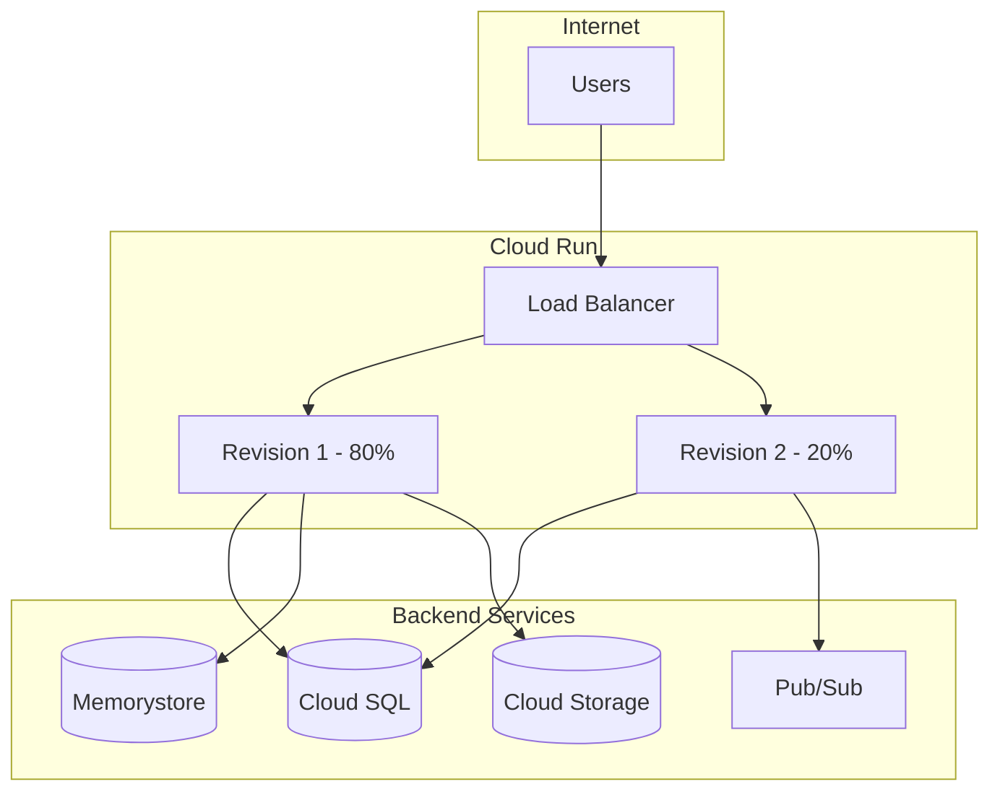
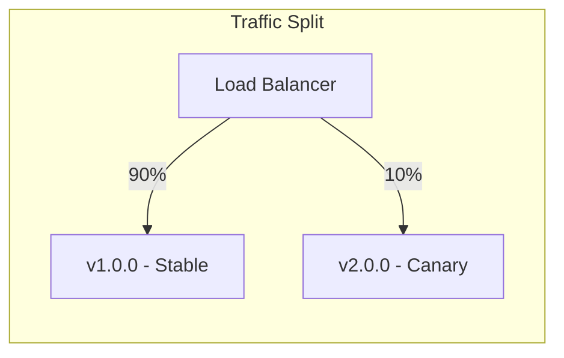

# How to Configure Cloud Run Services in GCP

Author: [nawazdhandala](https://www.github.com/nawazdhandala)

Tags: GCP, Cloud Run, Serverless, Containers, Google Cloud, DevOps, Kubernetes

Description: Learn how to deploy, configure, and optimize Cloud Run services including traffic splitting, custom domains, scaling, and integration with other GCP services.

---

Cloud Run is Google Cloud's fully managed serverless platform for running containers. It abstracts away infrastructure management while giving you the flexibility of containers. This guide covers everything from basic deployment to advanced configurations like traffic splitting and VPC connectivity.

## Cloud Run Architecture



## Basic Deployment

### Deploying from Source Code

```bash
# Deploy directly from source (uses Cloud Build)
gcloud run deploy my-service \
    --source . \
    --region us-central1 \
    --allow-unauthenticated

# Deploy with specific build configuration
gcloud run deploy my-service \
    --source . \
    --region us-central1 \
    --memory 512Mi \
    --cpu 1 \
    --min-instances 1 \
    --max-instances 10
```

### Deploying from Container Image

```bash
# Build and push image to Container Registry
docker build -t gcr.io/my-project/my-app:v1 .
docker push gcr.io/my-project/my-app:v1

# Deploy the container
gcloud run deploy my-service \
    --image gcr.io/my-project/my-app:v1 \
    --region us-central1 \
    --platform managed \
    --port 8080

# Or use Artifact Registry (recommended)
docker build -t us-central1-docker.pkg.dev/my-project/my-repo/my-app:v1 .
docker push us-central1-docker.pkg.dev/my-project/my-repo/my-app:v1

gcloud run deploy my-service \
    --image us-central1-docker.pkg.dev/my-project/my-repo/my-app:v1 \
    --region us-central1
```

## Service Configuration

### Resource Limits and Scaling

```bash
# Configure CPU and memory
gcloud run services update my-service \
    --region us-central1 \
    --memory 1Gi \
    --cpu 2

# Configure scaling
gcloud run services update my-service \
    --region us-central1 \
    --min-instances 2 \
    --max-instances 100 \
    --concurrency 80

# Configure request timeout
gcloud run services update my-service \
    --region us-central1 \
    --timeout 300s

# CPU allocation options
# always: CPU is always allocated (good for background processing)
# request: CPU only during request processing (default, cost efficient)
gcloud run services update my-service \
    --region us-central1 \
    --cpu-throttling
```

### Environment Variables and Secrets

```bash
# Set environment variables
gcloud run services update my-service \
    --region us-central1 \
    --set-env-vars "DATABASE_HOST=10.0.0.1,LOG_LEVEL=info"

# Add environment variables (without replacing existing)
gcloud run services update my-service \
    --region us-central1 \
    --update-env-vars "NEW_VAR=value"

# Mount secrets from Secret Manager
gcloud run services update my-service \
    --region us-central1 \
    --set-secrets "DB_PASSWORD=db-password:latest,API_KEY=api-key:1"

# Mount secret as a file
gcloud run services update my-service \
    --region us-central1 \
    --set-secrets "/secrets/config.json=app-config:latest"
```

## Terraform Configuration

```hcl
# main.tf - Complete Cloud Run service configuration

resource "google_cloud_run_v2_service" "api" {
  name     = "api-service"
  location = "us-central1"
  ingress  = "INGRESS_TRAFFIC_ALL"

  template {
    # Service account for the container
    service_account = google_service_account.cloud_run_sa.email

    # Scaling configuration
    scaling {
      min_instance_count = 1
      max_instance_count = 100
    }

    # Container configuration
    containers {
      image = "us-central1-docker.pkg.dev/${var.project_id}/my-repo/api:${var.image_tag}"

      # Resource limits
      resources {
        limits = {
          cpu    = "2"
          memory = "1Gi"
        }
        cpu_idle = true  # Scale to zero when idle
      }

      # Port configuration
      ports {
        container_port = 8080
      }

      # Environment variables
      env {
        name  = "LOG_LEVEL"
        value = "info"
      }

      env {
        name  = "PROJECT_ID"
        value = var.project_id
      }

      # Secrets from Secret Manager
      env {
        name = "DATABASE_PASSWORD"
        value_source {
          secret_key_ref {
            secret  = google_secret_manager_secret.db_password.secret_id
            version = "latest"
          }
        }
      }

      # Liveness probe
      liveness_probe {
        http_get {
          path = "/health"
        }
        initial_delay_seconds = 10
        period_seconds        = 10
      }

      # Startup probe
      startup_probe {
        http_get {
          path = "/ready"
        }
        initial_delay_seconds = 5
        period_seconds        = 5
        failure_threshold     = 3
      }
    }

    # VPC connector for private connectivity
    vpc_access {
      connector = google_vpc_access_connector.connector.id
      egress    = "PRIVATE_RANGES_ONLY"
    }

    # Request timeout
    timeout = "300s"

    # Concurrency
    max_instance_request_concurrency = 80
  }

  # Traffic configuration
  traffic {
    type    = "TRAFFIC_TARGET_ALLOCATION_TYPE_LATEST"
    percent = 100
  }

  depends_on = [
    google_project_service.run
  ]
}

# IAM - Allow unauthenticated access
resource "google_cloud_run_service_iam_member" "public" {
  location = google_cloud_run_v2_service.api.location
  service  = google_cloud_run_v2_service.api.name
  role     = "roles/run.invoker"
  member   = "allUsers"
}

# Output the service URL
output "service_url" {
  value = google_cloud_run_v2_service.api.uri
}
```

## Traffic Splitting and Canary Deployments



```bash
# Deploy new revision without shifting traffic
gcloud run deploy my-service \
    --image gcr.io/my-project/my-app:v2 \
    --region us-central1 \
    --no-traffic

# Split traffic between revisions
gcloud run services update-traffic my-service \
    --region us-central1 \
    --to-revisions my-service-00001-abc=90,my-service-00002-def=10

# Route traffic to latest revision
gcloud run services update-traffic my-service \
    --region us-central1 \
    --to-latest

# Gradual rollout
gcloud run services update-traffic my-service \
    --region us-central1 \
    --to-revisions LATEST=25

# Tag a revision for testing
gcloud run services update-traffic my-service \
    --region us-central1 \
    --set-tags canary=my-service-00002-def

# Access tagged revision directly
# https://canary---my-service-xyz.a.run.app
```

## Custom Domains

```bash
# Map a custom domain
gcloud run domain-mappings create \
    --service my-service \
    --domain api.example.com \
    --region us-central1

# Verify domain ownership (if not already verified)
gcloud domains verify api.example.com

# List domain mappings
gcloud run domain-mappings list --region us-central1

# Check domain mapping status
gcloud run domain-mappings describe \
    --domain api.example.com \
    --region us-central1
```

### DNS Configuration

After creating the mapping, configure your DNS:

```
# For apex domain (example.com)
A     @    216.239.32.21
A     @    216.239.34.21
A     @    216.239.36.21
A     @    216.239.38.21
AAAA  @    2001:4860:4802:32::15
AAAA  @    2001:4860:4802:34::15
AAAA  @    2001:4860:4802:36::15
AAAA  @    2001:4860:4802:38::15

# For subdomain (api.example.com)
CNAME api ghs.googlehosted.com
```

## VPC Connectivity

### Serverless VPC Access Connector

```bash
# Create VPC connector
gcloud compute networks vpc-access connectors create my-connector \
    --region us-central1 \
    --network default \
    --range 10.8.0.0/28

# Update service to use connector
gcloud run services update my-service \
    --region us-central1 \
    --vpc-connector my-connector \
    --vpc-egress private-ranges-only

# Or route all traffic through VPC
gcloud run services update my-service \
    --region us-central1 \
    --vpc-connector my-connector \
    --vpc-egress all-traffic
```

### Terraform VPC Configuration

```hcl
resource "google_vpc_access_connector" "connector" {
  name          = "cloud-run-connector"
  region        = "us-central1"
  network       = google_compute_network.vpc.name
  ip_cidr_range = "10.8.0.0/28"

  min_instances = 2
  max_instances = 10
}
```

## Cloud SQL Connection

```bash
# Deploy with Cloud SQL connection
gcloud run deploy my-service \
    --image gcr.io/my-project/my-app:v1 \
    --region us-central1 \
    --add-cloudsql-instances my-project:us-central1:my-instance \
    --set-env-vars "DB_SOCKET=/cloudsql/my-project:us-central1:my-instance"
```

### Application Code for Cloud SQL

```python
# Python example using Cloud SQL connector
import os
from google.cloud.sql.connector import Connector
import sqlalchemy

def get_connection():
    connector = Connector()

    def getconn():
        conn = connector.connect(
            os.environ["INSTANCE_CONNECTION_NAME"],
            "pg8000",
            user=os.environ["DB_USER"],
            password=os.environ["DB_PASS"],
            db=os.environ["DB_NAME"],
        )
        return conn

    pool = sqlalchemy.create_engine(
        "postgresql+pg8000://",
        creator=getconn,
        pool_size=5,
        max_overflow=2,
        pool_timeout=30,
        pool_recycle=1800,
    )
    return pool
```

## Authentication and Authorization

```bash
# Require authentication
gcloud run services update my-service \
    --region us-central1 \
    --no-allow-unauthenticated

# Grant invoker access to a service account
gcloud run services add-iam-policy-binding my-service \
    --region us-central1 \
    --member="serviceAccount:caller@my-project.iam.gserviceaccount.com" \
    --role="roles/run.invoker"

# Grant invoker access to a group
gcloud run services add-iam-policy-binding my-service \
    --region us-central1 \
    --member="group:developers@example.com" \
    --role="roles/run.invoker"
```

### Calling Authenticated Services

```python
# Python - calling an authenticated Cloud Run service
import google.auth.transport.requests
import google.oauth2.id_token

def call_cloud_run_service(url):
    auth_req = google.auth.transport.requests.Request()
    id_token = google.oauth2.id_token.fetch_id_token(auth_req, url)

    headers = {"Authorization": f"Bearer {id_token}"}
    response = requests.get(url, headers=headers)
    return response.json()
```

## Monitoring and Logging

```bash
# View logs
gcloud run services logs read my-service --region us-central1

# Tail logs in real-time
gcloud run services logs tail my-service --region us-central1

# View specific revision logs
gcloud run revisions logs read my-service-00002-abc --region us-central1

# Export logs to BigQuery
gcloud logging sinks create cloud-run-logs \
    bigquery.googleapis.com/projects/my-project/datasets/logs \
    --log-filter='resource.type="cloud_run_revision"'
```

## Best Practices

1. **Use minimum instances** - Set min-instances to 1+ for production to avoid cold starts
2. **Configure appropriate memory** - Container uses more memory under load than at startup
3. **Use health checks** - Configure liveness and startup probes for reliability
4. **Implement graceful shutdown** - Handle SIGTERM to complete in-flight requests
5. **Use Artifact Registry** - Store images in the same region as your service
6. **Set request timeout** - Match timeout to your longest expected request
7. **Enable VPC connector** - For secure access to internal resources
8. **Use service accounts** - Never use default compute service account in production

## Common Issues

**Cold start latency**: Increase min-instances or optimize container startup time

**Request timeouts**: Increase timeout setting or optimize application code

**Memory errors**: Increase memory allocation, check for memory leaks

**Connection limits**: Use connection pooling for database connections

---

Cloud Run provides a powerful serverless platform for running containers without managing infrastructure. With proper configuration of scaling, VPC connectivity, and traffic management, you can build robust production services that scale automatically with demand while maintaining security and cost efficiency.
