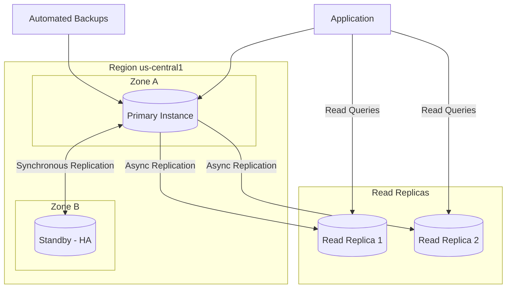
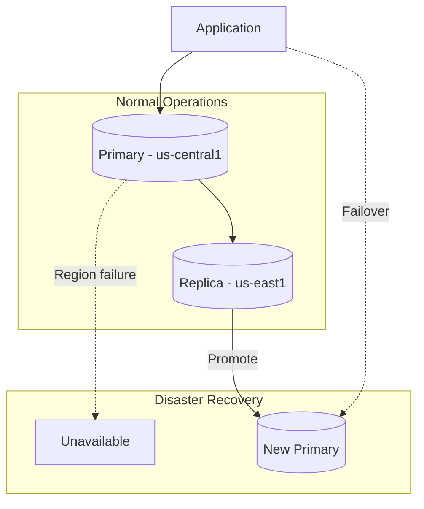

# How to Handle Cloud SQL Instance Management in GCP

Author: [nawazdhandala](https://www.github.com/nawazdhandala)

Tags: GCP, Cloud SQL, Database, PostgreSQL, MySQL, Google Cloud, DevOps

Description: Learn how to create, configure, and manage Cloud SQL instances including high availability, backups, maintenance windows, and performance optimization.

---

Cloud SQL is Google Cloud's fully managed relational database service supporting MySQL, PostgreSQL, and SQL Server. While it handles much of the operational burden, you still need to understand proper configuration to ensure reliability, security, and performance. This guide covers everything from instance creation to disaster recovery.

## Cloud SQL Architecture



## Creating Cloud SQL Instances

### Using gcloud CLI

```bash
# Create a PostgreSQL instance
gcloud sql instances create my-postgres \
    --database-version=POSTGRES_15 \
    --tier=db-custom-2-8192 \
    --region=us-central1 \
    --availability-type=REGIONAL \
    --storage-type=SSD \
    --storage-size=100GB \
    --storage-auto-increase \
    --backup-start-time=02:00 \
    --enable-point-in-time-recovery \
    --maintenance-window-day=SUN \
    --maintenance-window-hour=03 \
    --database-flags=max_connections=200,log_min_duration_statement=1000

# Create a MySQL instance
gcloud sql instances create my-mysql \
    --database-version=MYSQL_8_0 \
    --tier=db-n1-standard-2 \
    --region=us-central1 \
    --availability-type=REGIONAL \
    --storage-type=SSD \
    --storage-size=50GB \
    --backup-start-time=02:00

# Create a database
gcloud sql databases create myapp \
    --instance=my-postgres

# Create a user
gcloud sql users create appuser \
    --instance=my-postgres \
    --password=securepassword123
```

### Terraform Configuration

```hcl
# main.tf - Complete Cloud SQL configuration

resource "google_sql_database_instance" "primary" {
  name             = "my-postgres-${random_id.suffix.hex}"
  database_version = "POSTGRES_15"
  region           = "us-central1"

  # Prevent accidental deletion
  deletion_protection = true

  settings {
    tier              = "db-custom-4-16384"  # 4 vCPUs, 16GB RAM
    availability_type = "REGIONAL"           # High availability
    disk_type         = "PD_SSD"
    disk_size         = 100
    disk_autoresize   = true
    disk_autoresize_limit = 500

    # Backup configuration
    backup_configuration {
      enabled                        = true
      start_time                     = "02:00"
      point_in_time_recovery_enabled = true
      transaction_log_retention_days = 7
      backup_retention_settings {
        retained_backups = 30
        retention_unit   = "COUNT"
      }
    }

    # Maintenance window
    maintenance_window {
      day          = 7  # Sunday
      hour         = 3  # 3 AM
      update_track = "stable"
    }

    # IP configuration
    ip_configuration {
      ipv4_enabled    = false  # Disable public IP
      private_network = google_compute_network.vpc.id
      require_ssl     = true

      # If public IP is needed, use authorized networks
      # authorized_networks {
      #   name  = "office"
      #   value = "203.0.113.0/24"
      # }
    }

    # Database flags
    database_flags {
      name  = "max_connections"
      value = "200"
    }

    database_flags {
      name  = "log_min_duration_statement"
      value = "1000"  # Log queries > 1 second
    }

    database_flags {
      name  = "log_checkpoints"
      value = "on"
    }

    # Insights for query analysis
    insights_config {
      query_insights_enabled  = true
      query_string_length     = 4096
      record_application_tags = true
      record_client_address   = true
    }

    # Labels
    user_labels = {
      environment = "production"
      team        = "backend"
    }
  }

  depends_on = [google_service_networking_connection.private_vpc_connection]
}

# Database
resource "google_sql_database" "database" {
  name     = "myapp"
  instance = google_sql_database_instance.primary.name
}

# User
resource "google_sql_user" "app_user" {
  name     = "appuser"
  instance = google_sql_database_instance.primary.name
  password = random_password.db_password.result
}

# Random suffix for unique instance names
resource "random_id" "suffix" {
  byte_length = 4
}

# Secure password generation
resource "random_password" "db_password" {
  length  = 32
  special = true
}

# Store password in Secret Manager
resource "google_secret_manager_secret" "db_password" {
  secret_id = "db-password"

  replication {
    auto {}
  }
}

resource "google_secret_manager_secret_version" "db_password" {
  secret      = google_secret_manager_secret.db_password.id
  secret_data = random_password.db_password.result
}
```

## Private IP Configuration

```bash
# Allocate IP range for private services
gcloud compute addresses create google-managed-services-range \
    --global \
    --purpose=VPC_PEERING \
    --prefix-length=16 \
    --network=my-vpc

# Create private connection
gcloud services vpc-peerings connect \
    --service=servicenetworking.googleapis.com \
    --ranges=google-managed-services-range \
    --network=my-vpc

# Update instance to use private IP
gcloud sql instances patch my-postgres \
    --network=projects/my-project/global/networks/my-vpc \
    --no-assign-ip
```

### Terraform Private Network

```hcl
# Reserve IP range for Cloud SQL
resource "google_compute_global_address" "private_ip_range" {
  name          = "google-managed-services"
  purpose       = "VPC_PEERING"
  address_type  = "INTERNAL"
  prefix_length = 16
  network       = google_compute_network.vpc.id
}

# Create private connection
resource "google_service_networking_connection" "private_vpc_connection" {
  network                 = google_compute_network.vpc.id
  service                 = "servicenetworking.googleapis.com"
  reserved_peering_ranges = [google_compute_global_address.private_ip_range.name]
}
```

## Read Replicas

```bash
# Create a read replica
gcloud sql instances create my-postgres-replica \
    --master-instance-name=my-postgres \
    --region=us-east1 \
    --tier=db-custom-2-8192 \
    --availability-type=ZONAL

# List replicas
gcloud sql instances list --filter="masterInstanceName:my-postgres"

# Promote replica to standalone (for failover)
gcloud sql instances promote-replica my-postgres-replica
```

### Terraform Read Replica

```hcl
resource "google_sql_database_instance" "read_replica" {
  name                 = "my-postgres-replica"
  master_instance_name = google_sql_database_instance.primary.name
  region               = "us-east1"
  database_version     = "POSTGRES_15"

  replica_configuration {
    failover_target = false
  }

  settings {
    tier              = "db-custom-2-8192"
    availability_type = "ZONAL"
    disk_type         = "PD_SSD"
    disk_size         = 100

    ip_configuration {
      ipv4_enabled    = false
      private_network = google_compute_network.vpc.id
    }
  }
}
```

## Backup and Recovery

```bash
# Create an on-demand backup
gcloud sql backups create \
    --instance=my-postgres \
    --description="Pre-migration backup"

# List backups
gcloud sql backups list --instance=my-postgres

# Restore from backup
gcloud sql backups restore BACKUP_ID \
    --restore-instance=my-postgres \
    --backup-instance=my-postgres

# Point-in-time recovery
gcloud sql instances clone my-postgres my-postgres-recovered \
    --point-in-time="2024-01-15T10:30:00Z"

# Export database to Cloud Storage
gcloud sql export sql my-postgres gs://my-bucket/backup.sql \
    --database=myapp

# Import from Cloud Storage
gcloud sql import sql my-postgres gs://my-bucket/backup.sql \
    --database=myapp
```

## Performance Optimization

### Database Flags

```bash
# PostgreSQL performance flags
gcloud sql instances patch my-postgres \
    --database-flags="\
shared_buffers=4096MB,\
effective_cache_size=12288MB,\
work_mem=64MB,\
maintenance_work_mem=512MB,\
checkpoint_completion_target=0.9,\
random_page_cost=1.1"

# MySQL performance flags
gcloud sql instances patch my-mysql \
    --database-flags="\
innodb_buffer_pool_size=6442450944,\
innodb_log_file_size=536870912,\
innodb_flush_log_at_trx_commit=2,\
slow_query_log=on,\
long_query_time=1"
```

### Query Insights

```bash
# Enable Query Insights
gcloud sql instances patch my-postgres \
    --insights-config-query-insights-enabled \
    --insights-config-query-string-length=4096 \
    --insights-config-record-application-tags \
    --insights-config-record-client-address

# View slow queries via Cloud Console or API
# Navigate to: Cloud SQL > Instance > Query Insights
```

## Monitoring and Alerting

```bash
# View instance metrics
gcloud monitoring dashboards create \
    --config-from-file=cloudsql-dashboard.json

# Create alerting policy for high CPU
gcloud alpha monitoring policies create \
    --notification-channels=my-channel \
    --display-name="Cloud SQL High CPU" \
    --condition-display-name="CPU > 80%" \
    --condition-filter='metric.type="cloudsql.googleapis.com/database/cpu/utilization" AND resource.type="cloudsql_database"' \
    --condition-threshold-value=0.8 \
    --condition-threshold-duration=300s
```

### Key Metrics to Monitor

```yaml
# Prometheus/Grafana queries for Cloud SQL metrics
# CPU Utilization
cloudsql_database_cpu_utilization

# Memory Utilization
cloudsql_database_memory_utilization

# Disk Utilization
cloudsql_database_disk_utilization

# Active Connections
cloudsql_database_postgresql_num_backends
# or for MySQL
cloudsql_database_mysql_threads_connected

# Replication Lag (for replicas)
cloudsql_database_replication_replica_lag
```

## Maintenance and Updates

```bash
# View pending maintenance
gcloud sql instances describe my-postgres \
    --format="get(maintenancePendingDescription)"

# Reschedule maintenance
gcloud sql instances reschedule-maintenance my-postgres \
    --reschedule-type=SPECIFIC_TIME \
    --schedule-time="2024-02-01T03:00:00Z"

# Update instance tier (requires restart)
gcloud sql instances patch my-postgres \
    --tier=db-custom-4-16384

# Update storage size (no restart required)
gcloud sql instances patch my-postgres \
    --storage-size=200GB
```

## Connection Management

### Cloud SQL Proxy

```bash
# Download Cloud SQL Proxy
curl -o cloud-sql-proxy https://storage.googleapis.com/cloud-sql-connectors/cloud-sql-proxy/v2.8.0/cloud-sql-proxy.linux.amd64
chmod +x cloud-sql-proxy

# Run proxy for local development
./cloud-sql-proxy my-project:us-central1:my-postgres

# Connect via proxy
psql "host=127.0.0.1 port=5432 user=appuser dbname=myapp"

# Kubernetes deployment with Cloud SQL Proxy sidecar
```

### Kubernetes Sidecar Configuration

```yaml
apiVersion: apps/v1
kind: Deployment
metadata:
  name: my-app
spec:
  template:
    spec:
      serviceAccountName: my-app-sa
      containers:
        - name: app
          image: my-app:latest
          env:
            - name: DB_HOST
              value: "127.0.0.1"
            - name: DB_PORT
              value: "5432"
            - name: DB_NAME
              value: "myapp"
            - name: DB_USER
              valueFrom:
                secretKeyRef:
                  name: db-credentials
                  key: username
            - name: DB_PASSWORD
              valueFrom:
                secretKeyRef:
                  name: db-credentials
                  key: password

        - name: cloud-sql-proxy
          image: gcr.io/cloud-sql-connectors/cloud-sql-proxy:2.8.0
          args:
            - "--structured-logs"
            - "--port=5432"
            - "my-project:us-central1:my-postgres"
          securityContext:
            runAsNonRoot: true
          resources:
            requests:
              memory: "256Mi"
              cpu: "100m"
            limits:
              memory: "512Mi"
              cpu: "500m"
```

## Disaster Recovery



### Failover Procedure

```bash
# Check replica status
gcloud sql instances describe my-postgres-replica \
    --format="get(state,replicaConfiguration)"

# Promote replica to primary
gcloud sql instances promote-replica my-postgres-replica

# Update application connection strings
# Point to new primary instance

# Create new replica in original region (after recovery)
gcloud sql instances create my-postgres-replica-new \
    --master-instance-name=my-postgres-replica \
    --region=us-central1
```

## Best Practices

1. **Use high availability** - Enable regional availability for production workloads
2. **Enable automated backups** - Configure daily backups with point-in-time recovery
3. **Use private IP** - Disable public IP and use VPC peering
4. **Require SSL** - Enforce encrypted connections
5. **Use read replicas** - Offload read queries for better performance
6. **Monitor proactively** - Set up alerts for CPU, memory, and connections
7. **Plan maintenance windows** - Schedule during low-traffic periods
8. **Use connection pooling** - Implement PgBouncer or ProxySQL for high-traffic apps
9. **Test disaster recovery** - Regularly practice failover procedures
10. **Right-size instances** - Start small and scale based on actual usage

## Common Issues

**High connection count**: Implement connection pooling or increase max_connections

**Slow queries**: Enable Query Insights, add indexes, optimize queries

**Replication lag**: Scale up replica, reduce write load, check network

**Storage full**: Enable auto-resize or manually increase storage

**Backup failures**: Check Cloud Storage permissions, ensure sufficient storage

---

Cloud SQL simplifies database management but requires proper configuration for production workloads. Focus on high availability, regular backups, and monitoring to ensure your databases remain reliable and performant. Always test your disaster recovery procedures before you actually need them.
