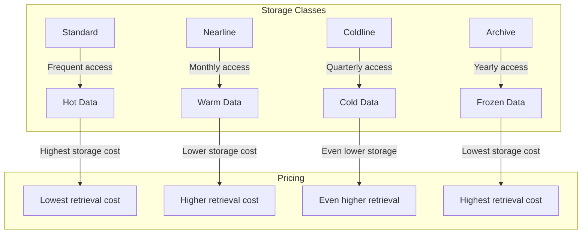
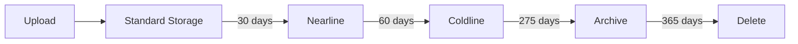

# How to Handle Cloud Storage Buckets in GCP

Author: [nawazdhandala](https://www.github.com/nawazdhandala)

Tags: GCP, Cloud Storage, Buckets, Google Cloud, DevOps, Infrastructure

Description: Learn how to create, configure, and manage Google Cloud Storage buckets with best practices for security, lifecycle policies, and access control.

---

Google Cloud Storage is the backbone of data storage in GCP. Whether you are storing application logs, user uploads, backups, or static assets, understanding how to properly configure and manage storage buckets is essential. This guide covers everything from bucket creation to advanced lifecycle management.

## Understanding Cloud Storage Classes

Before creating buckets, you need to understand storage classes. Each class has different pricing, availability, and use cases.



## Creating Buckets with gcloud CLI

### Basic Bucket Creation

```bash
# Create a standard storage bucket in a specific region
gcloud storage buckets create gs://my-app-data-bucket \
    --location=us-central1 \
    --storage-class=STANDARD \
    --uniform-bucket-level-access

# Create a multi-region bucket for high availability
gcloud storage buckets create gs://my-global-assets \
    --location=US \
    --storage-class=STANDARD

# Create a nearline bucket for infrequent access
gcloud storage buckets create gs://my-backup-bucket \
    --location=us-central1 \
    --storage-class=NEARLINE \
    --uniform-bucket-level-access
```

### Bucket Creation with Terraform

```hcl
# main.tf - Cloud Storage bucket configuration

resource "google_storage_bucket" "app_data" {
  name          = "my-app-data-${var.project_id}"
  location      = "US-CENTRAL1"
  storage_class = "STANDARD"

  # Enable uniform bucket-level access (recommended)
  uniform_bucket_level_access = true

  # Prevent accidental deletion
  force_destroy = false

  # Enable versioning for data protection
  versioning {
    enabled = true
  }

  # Lifecycle rules for cost optimization
  lifecycle_rule {
    condition {
      age = 30  # Days
    }
    action {
      type          = "SetStorageClass"
      storage_class = "NEARLINE"
    }
  }

  lifecycle_rule {
    condition {
      age = 90
    }
    action {
      type          = "SetStorageClass"
      storage_class = "COLDLINE"
    }
  }

  lifecycle_rule {
    condition {
      age = 365
    }
    action {
      type = "Delete"
    }
  }

  # Labels for organization
  labels = {
    environment = "production"
    team        = "backend"
  }
}

# Output the bucket URL
output "bucket_url" {
  value = google_storage_bucket.app_data.url
}
```

## Configuring Access Control

### Using IAM Policies

```bash
# Grant read access to a specific user
gcloud storage buckets add-iam-policy-binding gs://my-app-data-bucket \
    --member="user:developer@example.com" \
    --role="roles/storage.objectViewer"

# Grant write access to a service account
gcloud storage buckets add-iam-policy-binding gs://my-app-data-bucket \
    --member="serviceAccount:my-app@my-project.iam.gserviceaccount.com" \
    --role="roles/storage.objectCreator"

# Grant full control to a group
gcloud storage buckets add-iam-policy-binding gs://my-app-data-bucket \
    --member="group:storage-admins@example.com" \
    --role="roles/storage.admin"
```

### IAM Configuration with Terraform

```hcl
# IAM binding for the storage bucket
resource "google_storage_bucket_iam_binding" "viewers" {
  bucket = google_storage_bucket.app_data.name
  role   = "roles/storage.objectViewer"

  members = [
    "group:developers@example.com",
    "serviceAccount:app-reader@${var.project_id}.iam.gserviceaccount.com",
  ]
}

resource "google_storage_bucket_iam_binding" "writers" {
  bucket = google_storage_bucket.app_data.name
  role   = "roles/storage.objectCreator"

  members = [
    "serviceAccount:app-writer@${var.project_id}.iam.gserviceaccount.com",
  ]
}
```

## Uploading and Managing Objects

```bash
# Upload a single file
gcloud storage cp local-file.txt gs://my-app-data-bucket/

# Upload a directory recursively
gcloud storage cp -r ./data/ gs://my-app-data-bucket/data/

# Upload with specific content type
gcloud storage cp image.png gs://my-app-data-bucket/ \
    --content-type="image/png"

# List objects in a bucket
gcloud storage ls gs://my-app-data-bucket/

# List with details
gcloud storage ls -l gs://my-app-data-bucket/

# Download an object
gcloud storage cp gs://my-app-data-bucket/file.txt ./local-file.txt

# Sync a directory (like rsync)
gcloud storage rsync -r ./local-dir gs://my-app-data-bucket/remote-dir
```

## Setting Up Lifecycle Policies

Lifecycle policies help manage storage costs by automatically transitioning or deleting objects.



### Lifecycle Configuration via JSON

```bash
# Create lifecycle.json
cat > lifecycle.json << 'EOF'
{
  "lifecycle": {
    "rule": [
      {
        "action": {"type": "SetStorageClass", "storageClass": "NEARLINE"},
        "condition": {"age": 30, "matchesStorageClass": ["STANDARD"]}
      },
      {
        "action": {"type": "SetStorageClass", "storageClass": "COLDLINE"},
        "condition": {"age": 90, "matchesStorageClass": ["NEARLINE"]}
      },
      {
        "action": {"type": "Delete"},
        "condition": {"age": 365}
      },
      {
        "action": {"type": "Delete"},
        "condition": {"isLive": false, "numNewerVersions": 3}
      }
    ]
  }
}
EOF

# Apply lifecycle configuration
gcloud storage buckets update gs://my-app-data-bucket \
    --lifecycle-file=lifecycle.json
```

## Enabling CORS for Web Applications

If your bucket serves content to web applications, you need CORS configuration.

```bash
# Create cors.json
cat > cors.json << 'EOF'
[
  {
    "origin": ["https://myapp.example.com", "https://staging.example.com"],
    "method": ["GET", "HEAD", "PUT", "POST", "DELETE"],
    "responseHeader": ["Content-Type", "Access-Control-Allow-Origin"],
    "maxAgeSeconds": 3600
  }
]
EOF

# Apply CORS configuration
gcloud storage buckets update gs://my-app-data-bucket \
    --cors-file=cors.json

# View current CORS configuration
gcloud storage buckets describe gs://my-app-data-bucket \
    --format="json(cors)"
```

## Setting Up Bucket Notifications

Trigger Cloud Functions or Pub/Sub when objects change.

```bash
# Create a Pub/Sub topic for notifications
gcloud pubsub topics create storage-notifications

# Set up bucket notification to Pub/Sub
gcloud storage buckets notifications create gs://my-app-data-bucket \
    --topic=storage-notifications \
    --event-types=OBJECT_FINALIZE,OBJECT_DELETE

# List notifications
gcloud storage buckets notifications list gs://my-app-data-bucket
```

### Terraform Configuration for Notifications

```hcl
resource "google_pubsub_topic" "storage_notifications" {
  name = "storage-notifications"
}

resource "google_storage_notification" "notification" {
  bucket         = google_storage_bucket.app_data.name
  payload_format = "JSON_API_V1"
  topic          = google_pubsub_topic.storage_notifications.id
  event_types    = ["OBJECT_FINALIZE", "OBJECT_DELETE"]

  depends_on = [google_pubsub_topic_iam_binding.storage_publisher]
}

# Grant GCS permission to publish to Pub/Sub
resource "google_pubsub_topic_iam_binding" "storage_publisher" {
  topic = google_pubsub_topic.storage_notifications.id
  role  = "roles/pubsub.publisher"

  members = [
    "serviceAccount:service-${var.project_number}@gs-project-accounts.iam.gserviceaccount.com",
  ]
}
```

## Securing Buckets

### Enable Encryption with Customer-Managed Keys

```bash
# Create a Cloud KMS key ring
gcloud kms keyrings create my-keyring \
    --location=us-central1

# Create a key
gcloud kms keys create storage-key \
    --keyring=my-keyring \
    --location=us-central1 \
    --purpose=encryption

# Create bucket with CMEK
gcloud storage buckets create gs://my-encrypted-bucket \
    --location=us-central1 \
    --default-encryption-key=projects/my-project/locations/us-central1/keyRings/my-keyring/cryptoKeys/storage-key
```

### Prevent Public Access

```bash
# Enable public access prevention
gcloud storage buckets update gs://my-app-data-bucket \
    --public-access-prevention

# Check bucket's public access status
gcloud storage buckets describe gs://my-app-data-bucket \
    --format="json(iamConfiguration)"
```

## Monitoring and Logging

```bash
# Enable access logging
gcloud storage buckets update gs://my-app-data-bucket \
    --log-bucket=gs://my-logs-bucket \
    --log-object-prefix=storage-logs/

# View bucket metrics in Cloud Monitoring
gcloud monitoring dashboards create \
    --config-from-file=storage-dashboard.json
```

## Best Practices

1. **Use uniform bucket-level access** - Simplifies permission management and improves security
2. **Enable versioning** - Protects against accidental deletions and overwrites
3. **Set lifecycle policies** - Automate storage class transitions to optimize costs
4. **Use meaningful naming** - Include project ID or environment in bucket names
5. **Enable logging** - Track access patterns and detect anomalies
6. **Implement least privilege** - Grant only necessary permissions to users and service accounts
7. **Use signed URLs** - For temporary access without exposing bucket permissions
8. **Enable public access prevention** - Unless your bucket must be public

## Common Issues and Solutions

**Issue**: "Access Denied" when accessing objects
- Check IAM permissions on both bucket and project level
- Verify the service account has the correct roles
- Ensure uniform bucket-level access is configured correctly

**Issue**: High storage costs
- Review lifecycle policies to transition old data
- Use Nearline or Coldline for infrequently accessed data
- Delete unnecessary object versions

**Issue**: Slow uploads
- Use parallel composite uploads for large files
- Choose a region closer to your application
- Use `gcloud storage rsync` for efficient syncing

---

Cloud Storage buckets are fundamental to GCP infrastructure. With proper configuration of access controls, lifecycle policies, and monitoring, you can build a secure and cost-effective storage solution. Start with the basics and gradually add advanced features like CMEK encryption and Pub/Sub notifications as your needs grow.
