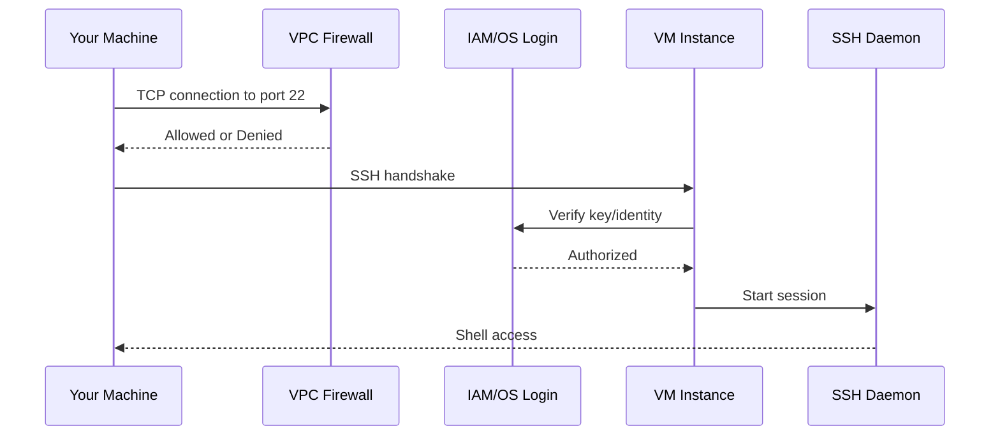
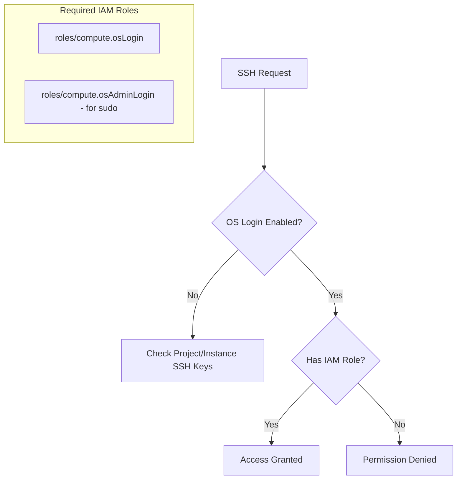

# How to Fix 'Compute Engine' SSH Errors

Author: [nawazdhandala](https://www.github.com/nawazdhandala)

Tags: GCP, Google Cloud, Compute Engine, SSH, Troubleshooting, Networking, Security

Description: Learn how to diagnose and fix SSH connection errors to Google Compute Engine instances, including firewall issues, key problems, and OS-level configurations.

---

SSH errors to Compute Engine instances are frustrating because they can originate from multiple layers - network firewall rules, IAM permissions, SSH key configuration, or the instance itself. This guide walks through systematic troubleshooting to identify and fix the root cause.

## Understanding SSH Connection Flow

When you SSH to a GCE instance, several things must work correctly.



## Error 1: Connection Timed Out

This usually means the firewall is blocking traffic or the instance has no external IP.

### Check If Instance Has External IP

```bash
# List instance details
gcloud compute instances describe my-instance \
    --zone=us-central1-a \
    --format="yaml(networkInterfaces[0].accessConfigs)"

# If empty or missing natIP, the instance has no external IP
```

### Solution: Add External IP or Use IAP Tunneling

```bash
# Add an external IP to an existing instance
gcloud compute instances add-access-config my-instance \
    --zone=us-central1-a \
    --access-config-name="External NAT"

# Or use IAP (Identity-Aware Proxy) tunneling - no external IP needed
gcloud compute ssh my-instance \
    --zone=us-central1-a \
    --tunnel-through-iap
```

### Check Firewall Rules

```bash
# Check if SSH is allowed
gcloud compute firewall-rules list \
    --filter="allowed[].ports:22" \
    --format="table(name, network, sourceRanges[], targetTags[])"

# Create SSH firewall rule if missing
gcloud compute firewall-rules create allow-ssh \
    --network=default \
    --allow=tcp:22 \
    --source-ranges="0.0.0.0/0" \
    --target-tags=allow-ssh \
    --priority=1000

# Add the tag to your instance
gcloud compute instances add-tags my-instance \
    --zone=us-central1-a \
    --tags=allow-ssh
```

For IAP tunneling, you need a different firewall rule.

```bash
# Allow IAP's IP range to access SSH
gcloud compute firewall-rules create allow-ssh-iap \
    --network=default \
    --allow=tcp:22 \
    --source-ranges="35.235.240.0/20" \
    --target-tags=allow-ssh-iap
```

## Error 2: Permission Denied (publickey)

Your SSH key is not recognized by the instance.

```bash
# You see this error
Permission denied (publickey,gssapi-keyex,gssapi-with-mic).
```

### Check Your SSH Keys

```bash
# List SSH keys in your project metadata
gcloud compute project-info describe \
    --format="value(commonInstanceMetadata.items.filter(key:ssh-keys).value)"

# List SSH keys specific to the instance
gcloud compute instances describe my-instance \
    --zone=us-central1-a \
    --format="value(metadata.items.filter(key:ssh-keys).value)"
```

### Solution: Add Your SSH Key

```bash
# Generate a new SSH key if needed
ssh-keygen -t rsa -b 4096 -C "your-email@example.com" -f ~/.ssh/gcp_key

# Format the key for GCP (username:key-content)
USERNAME=$(whoami)
KEY_CONTENT=$(cat ~/.ssh/gcp_key.pub)
echo "${USERNAME}:${KEY_CONTENT}" > /tmp/ssh-key-entry.txt

# Add to project metadata (affects all instances)
gcloud compute project-info add-metadata \
    --metadata-from-file=ssh-keys=/tmp/ssh-key-entry.txt

# Or add to specific instance only
gcloud compute instances add-metadata my-instance \
    --zone=us-central1-a \
    --metadata-from-file=ssh-keys=/tmp/ssh-key-entry.txt

# Connect using the specific key
ssh -i ~/.ssh/gcp_key ${USERNAME}@EXTERNAL_IP
```

### Use gcloud compute ssh (Recommended)

The simplest approach is to use gcloud, which handles key management automatically.

```bash
# This automatically generates and uploads SSH keys
gcloud compute ssh my-instance --zone=us-central1-a

# Specify a different username
gcloud compute ssh my-user@my-instance --zone=us-central1-a
```

## Error 3: OS Login Permission Denied

If OS Login is enabled, you need the correct IAM roles.



### Check If OS Login Is Enabled

```bash
# Check project-level OS Login setting
gcloud compute project-info describe \
    --format="value(commonInstanceMetadata.items.filter(key:enable-oslogin).value)"

# Check instance-level setting
gcloud compute instances describe my-instance \
    --zone=us-central1-a \
    --format="value(metadata.items.filter(key:enable-oslogin).value)"
```

### Solution: Grant OS Login IAM Roles

```bash
# Grant basic SSH access
gcloud projects add-iam-policy-binding my-project \
    --member="user:your-email@example.com" \
    --role="roles/compute.osLogin"

# Grant sudo access (admin login)
gcloud projects add-iam-policy-binding my-project \
    --member="user:your-email@example.com" \
    --role="roles/compute.osAdminLogin"

# Also need Service Account User role if instance uses a service account
gcloud iam service-accounts add-iam-policy-binding \
    instance-sa@my-project.iam.gserviceaccount.com \
    --member="user:your-email@example.com" \
    --role="roles/iam.serviceAccountUser"
```

## Error 4: SSH Daemon Not Running

The instance is reachable, but SSH is not working at the OS level.

### Diagnose via Serial Console

```bash
# View serial console output
gcloud compute instances get-serial-port-output my-instance \
    --zone=us-central1-a

# Look for SSH-related errors
gcloud compute instances get-serial-port-output my-instance \
    --zone=us-central1-a 2>&1 | grep -i ssh

# Connect to serial console interactively
gcloud compute connect-to-serial-port my-instance \
    --zone=us-central1-a
```

### Solution: Fix SSH via Startup Script

If SSH is broken, use a startup script to repair it.

```bash
# Create a repair startup script
cat > /tmp/repair-ssh.sh << 'EOF'
#!/bin/bash
# Reinstall and restart SSH
apt-get update
apt-get install -y --reinstall openssh-server
systemctl enable ssh
systemctl restart ssh
EOF

# Apply the startup script to the instance
gcloud compute instances add-metadata my-instance \
    --zone=us-central1-a \
    --metadata-from-file=startup-script=/tmp/repair-ssh.sh

# Restart the instance to run the script
gcloud compute instances reset my-instance --zone=us-central1-a

# Remove the script after repair
gcloud compute instances remove-metadata my-instance \
    --zone=us-central1-a \
    --keys=startup-script
```

## Error 5: Host Key Verification Failed

Your local machine has a different host key stored for this IP.

```bash
# Error message
@@@@@@@@@@@@@@@@@@@@@@@@@@@@@@@@@@@@@@@@@@@@@@@@@@@@@@@@@@@
@    WARNING: REMOTE HOST IDENTIFICATION HAS CHANGED!     @
@@@@@@@@@@@@@@@@@@@@@@@@@@@@@@@@@@@@@@@@@@@@@@@@@@@@@@@@@@@
```

### Solution: Remove Old Host Key

```bash
# Remove the old host key for this IP
ssh-keygen -R INSTANCE_EXTERNAL_IP

# Or remove by hostname
ssh-keygen -R my-instance.us-central1-a.my-project

# Then connect again
gcloud compute ssh my-instance --zone=us-central1-a
```

## Complete Debugging Script

Here is a comprehensive script to diagnose SSH issues.

```bash
#!/bin/bash
# diagnose-ssh.sh - Diagnose GCE SSH connection issues

INSTANCE=$1
ZONE=$2

if [ -z "$INSTANCE" ] || [ -z "$ZONE" ]; then
    echo "Usage: $0 <instance-name> <zone>"
    exit 1
fi

echo "=== Instance Status ==="
gcloud compute instances describe "$INSTANCE" --zone="$ZONE" \
    --format="table(name, status, machineType.basename())"

echo ""
echo "=== Network Configuration ==="
gcloud compute instances describe "$INSTANCE" --zone="$ZONE" \
    --format="yaml(networkInterfaces)"

EXTERNAL_IP=$(gcloud compute instances describe "$INSTANCE" --zone="$ZONE" \
    --format="value(networkInterfaces[0].accessConfigs[0].natIP)")

if [ -z "$EXTERNAL_IP" ]; then
    echo "WARNING: No external IP. Use --tunnel-through-iap"
else
    echo "External IP: $EXTERNAL_IP"
fi

NETWORK=$(gcloud compute instances describe "$INSTANCE" --zone="$ZONE" \
    --format="value(networkInterfaces[0].network)" | awk -F'/' '{print $NF}')

echo ""
echo "=== Firewall Rules Allowing SSH ==="
gcloud compute firewall-rules list \
    --filter="network:$NETWORK AND allowed[].ports:22 AND direction=INGRESS" \
    --format="table(name, sourceRanges[], targetTags[])"

echo ""
echo "=== OS Login Status ==="
OS_LOGIN=$(gcloud compute instances describe "$INSTANCE" --zone="$ZONE" \
    --format="value(metadata.items.filter(key:enable-oslogin).value)")

if [ "$OS_LOGIN" = "TRUE" ] || [ "$OS_LOGIN" = "true" ]; then
    echo "OS Login is ENABLED - check IAM roles"
    echo "Required roles: roles/compute.osLogin or roles/compute.osAdminLogin"
else
    echo "OS Login is DISABLED - check SSH keys in metadata"
fi

echo ""
echo "=== SSH Keys in Instance Metadata ==="
gcloud compute instances describe "$INSTANCE" --zone="$ZONE" \
    --format="value(metadata.items.filter(key:ssh-keys).value)" | head -5

echo ""
echo "=== Testing Connectivity ==="
if [ -n "$EXTERNAL_IP" ]; then
    echo "Testing port 22..."
    nc -zv -w5 "$EXTERNAL_IP" 22 2>&1
fi

echo ""
echo "=== Recent Serial Console Output (last 50 lines) ==="
gcloud compute instances get-serial-port-output "$INSTANCE" \
    --zone="$ZONE" 2>&1 | tail -50

echo ""
echo "=== Recommendations ==="
echo "1. Try: gcloud compute ssh $INSTANCE --zone=$ZONE"
echo "2. If no external IP: gcloud compute ssh $INSTANCE --zone=$ZONE --tunnel-through-iap"
echo "3. For persistent issues, check serial console for OS-level errors"
```

## Summary

SSH errors to GCE instances typically fall into these categories:

1. **Network issues** - No external IP or firewall blocking port 22. Use IAP tunneling or fix firewall rules.
2. **Key issues** - SSH key not in metadata or wrong format. Use gcloud compute ssh which handles keys automatically.
3. **OS Login issues** - Missing IAM roles. Grant roles/compute.osLogin.
4. **OS-level issues** - SSH daemon crashed. Use serial console to diagnose and startup scripts to repair.

Start with gcloud compute ssh as it handles most configuration automatically. If that fails, use the debugging script to identify which layer is causing the problem. For instances without external IPs, IAP tunneling is the recommended approach as it provides authenticated access without exposing SSH to the internet.
