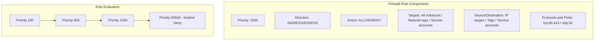
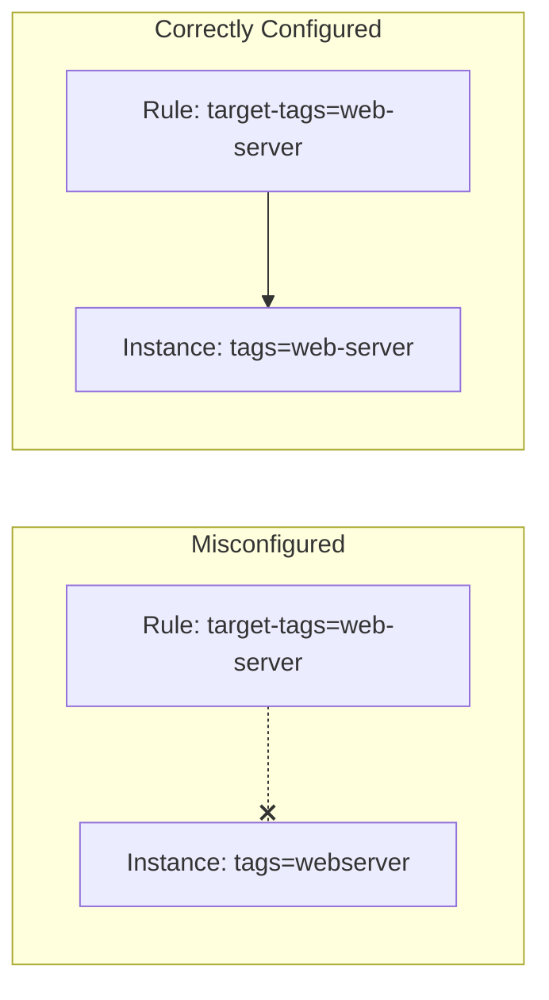
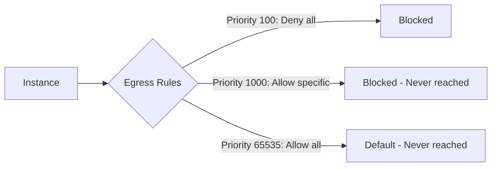

# How to Fix 'Firewall Rule' Not Working in GCP

Author: [nawazdhandala](https://www.github.com/nawazdhandala)

Tags: GCP, Google Cloud, Firewall, VPC, Networking, Security, Troubleshooting

Description: Learn how to diagnose and fix firewall rules that are not working in Google Cloud Platform, including priority conflicts, target misconfigurations, and network tag issues.

---

You created a firewall rule in GCP, but traffic is still being blocked (or allowed when it should not be). Firewall rules in GCP have several moving parts - priorities, targets, source ranges, and network tags - and any misconfiguration can cause unexpected behavior. This guide walks through the most common reasons firewall rules fail and how to fix them.

## Understanding GCP Firewall Rules

GCP firewall rules are stateful and operate at the VPC network level. Each rule has these key components.



Rules are evaluated by priority (lower number = higher priority). The first matching rule wins.

## Problem 1: Priority Conflicts

A higher-priority rule is overriding your rule.

### Diagnosis

```bash
# List all firewall rules sorted by priority
gcloud compute firewall-rules list \
    --format="table(name, network, direction, priority, allowed[], denied[], sourceRanges[], targetTags[])" \
    --sort-by=priority

# Check for conflicting rules
gcloud compute firewall-rules list \
    --filter="direction=INGRESS AND network=my-vpc" \
    --format="table(name, priority, allowed[], sourceRanges[])" \
    --sort-by=priority
```

### Solution

Either lower your rule's priority number or modify the conflicting rule.

```bash
# Update your rule to have higher priority (lower number)
gcloud compute firewall-rules update my-allow-http \
    --priority=500

# Or delete the conflicting rule
gcloud compute firewall-rules delete conflicting-deny-rule
```

## Problem 2: Wrong Network Tags

Your instances do not have the tags specified in the firewall rule.



### Diagnosis

```bash
# Check the firewall rule's target tags
gcloud compute firewall-rules describe my-allow-http \
    --format="value(targetTags)"

# Check your instance's network tags
gcloud compute instances describe my-instance \
    --zone=us-central1-a \
    --format="value(tags.items)"

# Find instances with specific tags
gcloud compute instances list \
    --filter="tags.items=web-server" \
    --format="table(name, zone, tags.items)"
```

### Solution

Add the correct tag to your instance or update the firewall rule.

```bash
# Add tag to the instance
gcloud compute instances add-tags my-instance \
    --zone=us-central1-a \
    --tags=web-server

# Or update the firewall rule to match existing tags
gcloud compute firewall-rules update my-allow-http \
    --target-tags=webserver
```

## Problem 3: Source Range Does Not Include the Client

The source IP range in your ingress rule does not include the connecting client.

### Diagnosis

```bash
# Check the source ranges in your rule
gcloud compute firewall-rules describe my-allow-http \
    --format="value(sourceRanges)"

# Test from the client to get its public IP
curl ifconfig.me

# Or check client IP range if behind NAT
# Make sure this IP is within the sourceRanges
```

### Solution

Update the source range to include the client IP or use 0.0.0.0/0 for all IPs.

```bash
# Allow specific IP range
gcloud compute firewall-rules update my-allow-http \
    --source-ranges="203.0.113.0/24,198.51.100.0/24"

# Allow all IPs (use with caution)
gcloud compute firewall-rules update my-allow-http \
    --source-ranges="0.0.0.0/0"
```

## Problem 4: Wrong Protocol or Port

The rule allows the wrong protocol or port combination.

### Diagnosis

```bash
# Check what protocols and ports are allowed
gcloud compute firewall-rules describe my-allow-http \
    --format="yaml(allowed)"

# Test connectivity to the specific port
nc -zv INSTANCE_EXTERNAL_IP 80
nc -zv INSTANCE_EXTERNAL_IP 443
```

### Solution

Update the rule with the correct protocols and ports.

```bash
# Allow HTTP and HTTPS
gcloud compute firewall-rules update my-allow-http \
    --allow=tcp:80,tcp:443

# Allow a range of ports
gcloud compute firewall-rules update my-allow-app \
    --allow=tcp:8000-8100

# Allow all TCP traffic (not recommended for production)
gcloud compute firewall-rules update my-allow-all-tcp \
    --allow=tcp
```

## Problem 5: Rule Applied to Wrong Network

The instance is in a different VPC network than the firewall rule.

### Diagnosis

```bash
# Check which network the firewall rule belongs to
gcloud compute firewall-rules describe my-allow-http \
    --format="value(network)"

# Check which network the instance is in
gcloud compute instances describe my-instance \
    --zone=us-central1-a \
    --format="value(networkInterfaces[0].network)"
```

### Solution

Create the rule in the correct network or move the instance.

```bash
# Create rule in the correct network
gcloud compute firewall-rules create my-allow-http-correct \
    --network=my-actual-vpc \
    --allow=tcp:80,tcp:443 \
    --source-ranges="0.0.0.0/0" \
    --target-tags=web-server \
    --priority=1000
```

## Problem 6: Egress Rules Blocking Outbound Traffic

Default egress allows all, but a custom deny rule might be blocking traffic.



### Diagnosis

```bash
# List egress rules
gcloud compute firewall-rules list \
    --filter="direction=EGRESS" \
    --format="table(name, priority, denied[], destinationRanges[])" \
    --sort-by=priority
```

### Solution

Create a higher-priority allow rule or modify the deny rule.

```bash
# Allow egress to specific destination with higher priority
gcloud compute firewall-rules create allow-egress-to-api \
    --network=my-vpc \
    --direction=EGRESS \
    --action=ALLOW \
    --rules=tcp:443 \
    --destination-ranges="203.0.113.0/24" \
    --priority=50 \
    --target-tags=api-client
```

## Problem 7: Hierarchical Firewall Policies Overriding VPC Rules

Organization or folder-level firewall policies take precedence over VPC firewall rules.

### Diagnosis

```bash
# Check organization-level firewall policies
gcloud compute firewall-policies list \
    --organization=ORGANIZATION_ID

# Check folder-level policies
gcloud compute firewall-policies list \
    --folder=FOLDER_ID

# Describe a policy to see its rules
gcloud compute firewall-policies describe POLICY_NAME \
    --organization=ORGANIZATION_ID
```

### Solution

Work with your organization admin to modify hierarchical policies or add exceptions.

```bash
# Add an exception rule in the hierarchical policy (requires org admin)
gcloud compute firewall-policies rules create 1000 \
    --firewall-policy=POLICY_NAME \
    --organization=ORGANIZATION_ID \
    --action=allow \
    --direction=INGRESS \
    --src-ip-ranges="0.0.0.0/0" \
    --layer4-configs=tcp:80,tcp:443 \
    --target-resources="projects/my-project/zones/us-central1-a/instances/my-instance"
```

## Debugging with Firewall Rules Logging

Enable logging to see which rules are being hit.

```bash
# Enable logging on a firewall rule
gcloud compute firewall-rules update my-allow-http \
    --enable-logging

# View logs in Cloud Logging
gcloud logging read 'resource.type="gce_subnetwork" AND jsonPayload.rule_details.reference:*' \
    --limit=20 \
    --format="table(timestamp, jsonPayload.rule_details.reference, jsonPayload.connection.src_ip, jsonPayload.connection.dest_port, jsonPayload.disposition)"
```

## Complete Debugging Script

Here is a script to diagnose firewall issues.

```bash
#!/bin/bash
# debug-firewall.sh - Diagnose GCP firewall issues

INSTANCE=$1
ZONE=$2
PORT=$3

if [ -z "$INSTANCE" ] || [ -z "$ZONE" ]; then
    echo "Usage: $0 <instance-name> <zone> [port]"
    exit 1
fi

PORT=${PORT:-80}

echo "=== Instance Details ==="
gcloud compute instances describe "$INSTANCE" --zone="$ZONE" \
    --format="yaml(name, networkInterfaces[0].network, tags.items)"

NETWORK=$(gcloud compute instances describe "$INSTANCE" --zone="$ZONE" \
    --format="value(networkInterfaces[0].network)" | awk -F'/' '{print $NF}')

TAGS=$(gcloud compute instances describe "$INSTANCE" --zone="$ZONE" \
    --format="value(tags.items)")

echo ""
echo "=== Network: $NETWORK ==="
echo "=== Tags: $TAGS ==="
echo ""
echo "=== Firewall Rules (sorted by priority) ==="
gcloud compute firewall-rules list \
    --filter="network:$NETWORK AND direction=INGRESS" \
    --format="table(name, priority, allowed[], sourceRanges[], targetTags[])" \
    --sort-by=priority

echo ""
echo "=== Rules matching instance tags ==="
for tag in $(echo "$TAGS" | tr ',' ' '); do
    echo "Tag: $tag"
    gcloud compute firewall-rules list \
        --filter="network:$NETWORK AND targetTags:$tag" \
        --format="table(name, priority, allowed[])"
done

echo ""
echo "=== Testing connectivity to port $PORT ==="
EXTERNAL_IP=$(gcloud compute instances describe "$INSTANCE" --zone="$ZONE" \
    --format="value(networkInterfaces[0].accessConfigs[0].natIP)")

if [ -n "$EXTERNAL_IP" ]; then
    echo "External IP: $EXTERNAL_IP"
    nc -zv -w5 "$EXTERNAL_IP" "$PORT" 2>&1
else
    echo "No external IP found"
fi
```

## Summary

Firewall rule issues in GCP usually stem from priority conflicts, mismatched network tags, incorrect source ranges, or rules applied to the wrong network. Start debugging by listing all rules sorted by priority and comparing them against your instance's network and tags.

Enable firewall logging for detailed visibility into which rules are being applied. For complex environments with hierarchical policies, coordinate with organization admins to understand the full rule hierarchy.

Remember that firewall rules are evaluated by priority, and the first matching rule wins. When in doubt, create a rule with a very low priority number (high priority) and verify it works before fine-tuning.
