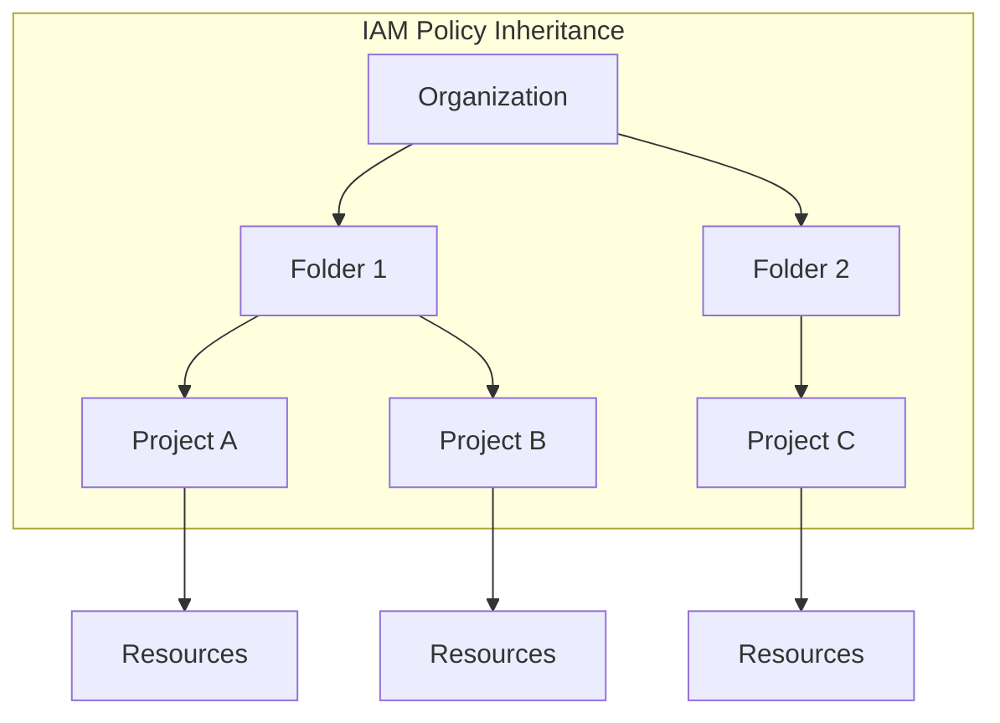
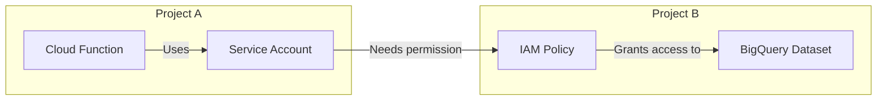
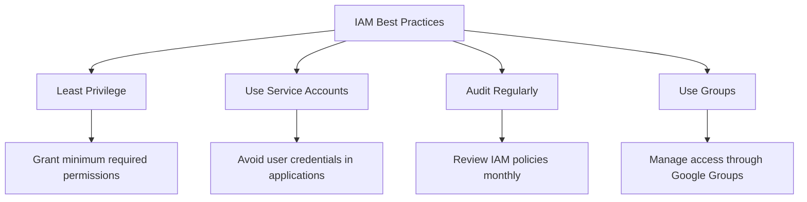

# How to Fix 'Permission Denied' IAM Errors in GCP

Author: [nawazdhandala](https://www.github.com/nawazdhandala)

Tags: GCP, Google Cloud Platform, IAM, Permissions, Security, Cloud Infrastructure, Troubleshooting

Description: Learn how to diagnose and fix 'Permission Denied' IAM errors in Google Cloud Platform by understanding roles, policies, and access management.

---

Google Cloud Platform's Identity and Access Management (IAM) system is powerful but can be confusing when you encounter "Permission Denied" errors. These errors typically occur when a user or service account lacks the necessary permissions to perform an operation. In this guide, we will walk through common scenarios, diagnostic approaches, and solutions to get your GCP resources accessible again.

## Understanding GCP IAM Structure

Before diving into troubleshooting, it is important to understand how GCP IAM works. Permissions in GCP are organized into a hierarchy of resources, roles, and bindings.



Permissions flow downward in the hierarchy. A role granted at the organization level applies to all folders and projects beneath it. This inheritance is crucial for understanding why some permissions work and others do not.

## Common Permission Denied Error Messages

You might encounter these errors in various forms:

```
Error: googleapi: Error 403: Required 'compute.instances.create' permission for 'projects/my-project'
```

Or from the gcloud CLI:

```
ERROR: (gcloud.compute.instances.create) Could not fetch resource:
 - Required 'compute.instances.create' permission for 'projects/my-project/zones/us-central1-a/instances/my-instance'
```

## Diagnosing Permission Issues

### Step 1: Identify the Required Permission

First, determine exactly which permission is needed. The error message usually tells you the specific permission, like `compute.instances.create` or `storage.objects.get`.

```bash
# Check what permissions a specific role grants
gcloud iam roles describe roles/compute.instanceAdmin.v1

# List all permissions for a custom role
gcloud iam roles describe projects/my-project/roles/customRole --project=my-project
```

### Step 2: Check Current IAM Bindings

Examine who has what permissions on your resource:

```bash
# Check project-level IAM policy
gcloud projects get-iam-policy my-project --format=json

# Check IAM policy for a specific resource like a bucket
gsutil iam get gs://my-bucket

# Check service account permissions
gcloud projects get-iam-policy my-project \
    --flatten="bindings[].members" \
    --filter="bindings.members:serviceAccount:my-sa@my-project.iam.gserviceaccount.com" \
    --format="table(bindings.role)"
```

### Step 3: Test Permissions

You can test if a principal has specific permissions without actually performing the operation:

```bash
# Test permissions on a project
gcloud projects test-iam-permissions my-project \
    --permissions=compute.instances.create,compute.instances.delete

# Test permissions on a resource using the API
curl -X POST \
    -H "Authorization: Bearer $(gcloud auth print-access-token)" \
    -H "Content-Type: application/json" \
    -d '{"permissions": ["storage.objects.get", "storage.objects.create"]}' \
    "https://cloudresourcemanager.googleapis.com/v1/projects/my-project:testIamPermissions"
```

## Common Scenarios and Solutions

### Scenario 1: Service Account Missing Permissions

When a Cloud Function or Compute instance cannot access other GCP resources:

```bash
# Grant Storage Admin role to a service account
gcloud projects add-iam-policy-binding my-project \
    --member="serviceAccount:my-function@my-project.iam.gserviceaccount.com" \
    --role="roles/storage.admin"

# For more granular control, grant specific roles
gcloud projects add-iam-policy-binding my-project \
    --member="serviceAccount:my-function@my-project.iam.gserviceaccount.com" \
    --role="roles/storage.objectViewer"
```

### Scenario 2: Cross-Project Access

When accessing resources in another project:

```bash
# Grant access to a service account from project-a to resources in project-b
gcloud projects add-iam-policy-binding project-b \
    --member="serviceAccount:my-sa@project-a.iam.gserviceaccount.com" \
    --role="roles/bigquery.dataViewer"
```



### Scenario 3: User Missing Project Access

When a team member cannot access a project:

```bash
# Grant basic viewer access
gcloud projects add-iam-policy-binding my-project \
    --member="user:developer@example.com" \
    --role="roles/viewer"

# Grant specific role for development
gcloud projects add-iam-policy-binding my-project \
    --member="user:developer@example.com" \
    --role="roles/compute.developer"
```

### Scenario 4: Conditional IAM Bindings

Sometimes permissions are restricted by conditions:

```bash
# Check for conditional bindings in the policy
gcloud projects get-iam-policy my-project --format=json | jq '.bindings[] | select(.condition != null)'

# Grant time-limited access
gcloud projects add-iam-policy-binding my-project \
    --member="user:contractor@example.com" \
    --role="roles/editor" \
    --condition="expression=request.time < timestamp('2026-03-01T00:00:00Z'),title=temporary-access,description=Access until March 2026"
```

## Working with Custom Roles

When predefined roles are too broad or too narrow, create custom roles:

```bash
# Create a custom role with specific permissions
gcloud iam roles create customStorageReader \
    --project=my-project \
    --title="Custom Storage Reader" \
    --description="Can read objects but not list buckets" \
    --permissions=storage.objects.get,storage.objects.list \
    --stage=GA

# Grant the custom role
gcloud projects add-iam-policy-binding my-project \
    --member="serviceAccount:my-sa@my-project.iam.gserviceaccount.com" \
    --role="projects/my-project/roles/customStorageReader"
```

## Using Terraform for IAM Management

For infrastructure as code, manage IAM with Terraform:

```hcl
# Define a service account
resource "google_service_account" "app_sa" {
  account_id   = "my-app-service-account"
  display_name = "Application Service Account"
  project      = "my-project"
}

# Grant roles to the service account
resource "google_project_iam_member" "app_sa_storage" {
  project = "my-project"
  role    = "roles/storage.objectViewer"
  member  = "serviceAccount:${google_service_account.app_sa.email}"
}

# Grant access to a specific bucket
resource "google_storage_bucket_iam_member" "bucket_access" {
  bucket = "my-private-bucket"
  role   = "roles/storage.objectAdmin"
  member = "serviceAccount:${google_service_account.app_sa.email}"
}

# Create a custom role
resource "google_project_iam_custom_role" "custom_role" {
  role_id     = "customAppRole"
  title       = "Custom Application Role"
  description = "Custom role for application specific permissions"
  permissions = [
    "compute.instances.get",
    "compute.instances.list",
    "storage.objects.get",
    "storage.objects.list"
  ]
  project = "my-project"
}
```

## Debugging with Policy Troubleshooter

GCP provides a built-in tool to troubleshoot access issues:

```bash
# Use the Policy Troubleshooter API
gcloud policy-troubleshoot iam \
    --principal="serviceAccount:my-sa@my-project.iam.gserviceaccount.com" \
    --resource="//storage.googleapis.com/projects/_/buckets/my-bucket/objects/my-file" \
    --permission="storage.objects.get"
```

You can also use the Cloud Console's Policy Troubleshooter under IAM & Admin to visually trace why access is denied.

## Best Practices



1. **Follow the principle of least privilege** - Grant only the permissions necessary for the task. Start with minimal permissions and add more as needed.

2. **Use service accounts for applications** - Never embed user credentials in code. Service accounts provide better security and auditability.

3. **Prefer predefined roles** - Google maintains these roles and updates them with new permissions. Custom roles require ongoing maintenance.

4. **Use groups for team access** - Instead of granting roles to individual users, use Google Groups to manage team permissions.

5. **Enable audit logging** - Turn on Cloud Audit Logs to track who accessed what and when.

```bash
# Enable Data Access audit logs for a project
gcloud projects get-iam-policy my-project --format=json > policy.json
# Edit policy.json to add auditConfigs, then apply:
gcloud projects set-iam-policy my-project policy.json
```

6. **Review permissions regularly** - Use IAM Recommender to identify overly permissive roles:

```bash
# Get IAM recommendations
gcloud recommender recommendations list \
    --project=my-project \
    --location=global \
    --recommender=google.iam.policy.Recommender
```

## Conclusion

Permission denied errors in GCP are usually straightforward to resolve once you understand the IAM hierarchy and know how to diagnose the issue. Start by identifying the exact permission needed, check current bindings, and grant the appropriate role at the correct level. Remember to follow least privilege principles and use service accounts for application access. With the tools and techniques covered in this guide, you should be able to troubleshoot and resolve most IAM-related access issues in your GCP environment.
