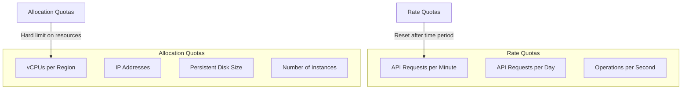
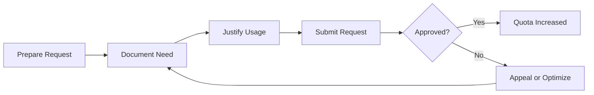
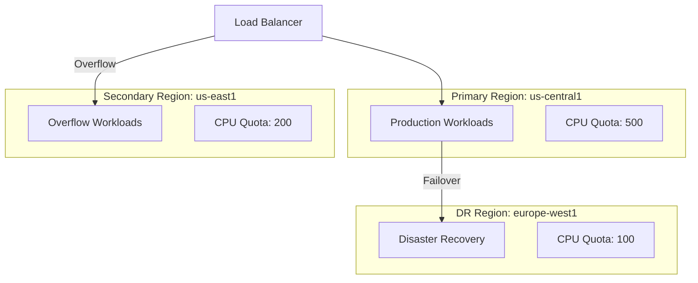

# How to Fix 'Quota Exceeded' Errors in GCP

Author: [nawazdhandala](https://www.github.com/nawazdhandala)

Tags: GCP, Google Cloud Platform, Quotas, Resource Management, Cloud Infrastructure, Troubleshooting

Description: Learn how to diagnose, prevent, and resolve quota exceeded errors in Google Cloud Platform through monitoring, requests, and resource optimization.

---

Google Cloud Platform enforces quotas to prevent runaway resource usage and ensure fair access across all customers. When you hit these limits, you will see "Quota Exceeded" errors that block your operations. This guide explains how GCP quotas work, how to monitor them, and what to do when you need more resources.

## Understanding GCP Quotas

GCP uses two types of quotas:



Rate quotas limit how frequently you can call APIs or perform operations. They reset automatically after the time window passes. Allocation quotas limit the total resources you can provision and require explicit requests to increase.

## Common Quota Exceeded Error Messages

You might encounter errors like:

```
ERROR: (gcloud.compute.instances.create) Could not fetch resource:
 - Quota 'CPUS' exceeded. Limit: 24.0 in region us-central1.
```

Or from API calls:

```json
{
  "error": {
    "code": 429,
    "message": "Quota exceeded for quota metric 'compute.googleapis.com/cpus' and limit 'CPUS-per-project-region' of service 'compute.googleapis.com' for consumer 'project_number:123456789'.",
    "status": "RESOURCE_EXHAUSTED"
  }
}
```

## Diagnosing Quota Issues

### Checking Current Quota Usage

```bash
# List all compute quotas for a region
gcloud compute regions describe us-central1 \
    --format="table(quotas.metric,quotas.limit,quotas.usage)"

# Check specific quota metrics
gcloud compute project-info describe \
    --format="table(quotas.metric,quotas.limit,quotas.usage)" \
    | grep -E "CPUS|SSD|INSTANCES"

# List quotas for a specific service
gcloud services list --enabled --filter="NAME:compute" --format="value(NAME)" | \
    xargs -I {} gcloud alpha services quota list --service={}
```

### Using the Cloud Console

Navigate to IAM & Admin > Quotas to see a comprehensive view of all quotas across services. You can filter by:
- Service name
- Quota metric
- Usage percentage
- Region

### Monitoring Quotas Programmatically

```python
# Python script to check quota usage
from google.cloud import monitoring_v3
from google.cloud.monitoring_v3 import query

def check_quota_usage(project_id, metric_type):
    """Check quota usage for a specific metric."""
    client = monitoring_v3.MetricServiceClient()
    project_name = f"projects/{project_id}"

    # Query quota usage
    results = client.list_time_series(
        request={
            "name": project_name,
            "filter": f'metric.type="{metric_type}"',
            "interval": {
                "end_time": {"seconds": int(time.time())},
                "start_time": {"seconds": int(time.time()) - 3600}
            },
            "view": monitoring_v3.ListTimeSeriesRequest.TimeSeriesView.FULL
        }
    )

    for result in results:
        print(f"Resource: {result.resource}")
        for point in result.points:
            print(f"  Value: {point.value.int64_value}")
            print(f"  Time: {point.interval.end_time}")

# Check CPU quota usage
check_quota_usage("my-project", "compute.googleapis.com/quota/cpus_per_project/usage")
```

## Requesting Quota Increases

### Through gcloud CLI

```bash
# Request a quota increase for CPUs
gcloud alpha services quota update \
    --consumer=projects/my-project \
    --service=compute.googleapis.com \
    --metric=compute.googleapis.com/cpus \
    --unit=1/project/region \
    --dimensions=region=us-central1 \
    --value=100

# Check the status of your quota increase request
gcloud alpha services quota list \
    --service=compute.googleapis.com \
    --consumer=projects/my-project \
    --filter="metric:cpus"
```

### Through the Cloud Console

1. Go to IAM & Admin > Quotas
2. Filter for the quota you need to increase
3. Select the quota and click "Edit Quotas"
4. Enter your requested limit and justification
5. Submit the request

### Best Practices for Quota Requests



When requesting increases:

1. **Be specific about your needs** - Explain what workload requires the additional resources
2. **Provide growth projections** - Show expected usage over the next 6-12 months
3. **Start with reasonable increases** - Request 2x current needs rather than 10x
4. **Request in advance** - Quota increases can take 24-48 hours to process

## Handling Rate Quota Errors

### Implementing Exponential Backoff

```python
import time
import random
from google.api_core import exceptions
from google.cloud import storage

def upload_with_retry(bucket_name, blob_name, data, max_retries=5):
    """Upload data with exponential backoff for rate limits."""
    client = storage.Client()
    bucket = client.bucket(bucket_name)
    blob = bucket.blob(blob_name)

    for attempt in range(max_retries):
        try:
            blob.upload_from_string(data)
            print(f"Upload successful on attempt {attempt + 1}")
            return True
        except exceptions.ResourceExhausted as e:
            if attempt == max_retries - 1:
                raise e

            # Calculate backoff with jitter
            wait_time = (2 ** attempt) + random.uniform(0, 1)
            print(f"Rate limited. Waiting {wait_time:.2f}s before retry...")
            time.sleep(wait_time)

    return False
```

### Batch API Operations

```python
from google.cloud import compute_v1

def batch_create_instances(project, zone, instance_configs):
    """Create multiple instances with batching to avoid rate limits."""
    client = compute_v1.InstancesClient()

    # Use batch operations instead of individual calls
    batch_size = 10
    for i in range(0, len(instance_configs), batch_size):
        batch = instance_configs[i:i + batch_size]

        operations = []
        for config in batch:
            operation = client.insert(
                project=project,
                zone=zone,
                instance_resource=config
            )
            operations.append(operation)

        # Wait for batch to complete before next batch
        for op in operations:
            op.result()

        # Small delay between batches
        time.sleep(1)
```

## Optimizing Resource Usage

### Identifying Unused Resources

```bash
# Find unused IP addresses
gcloud compute addresses list \
    --filter="status=RESERVED" \
    --format="table(name,address,region,status)"

# Find unattached persistent disks
gcloud compute disks list \
    --filter="NOT users:*" \
    --format="table(name,zone,sizeGb,status)"

# Find stopped instances still consuming quota
gcloud compute instances list \
    --filter="status=TERMINATED" \
    --format="table(name,zone,machineType,status)"
```

### Cleaning Up Resources

```bash
# Delete unused IP addresses
gcloud compute addresses delete unused-ip-1 unused-ip-2 --region=us-central1

# Delete unattached disks
gcloud compute disks delete orphaned-disk-1 --zone=us-central1-a

# Delete terminated instances
gcloud compute instances delete old-instance --zone=us-central1-a
```

### Right-Sizing Instances

```bash
# Get machine type recommendations
gcloud compute instances list \
    --format="table(name,zone,machineType)" \
    --filter="status=RUNNING"

# Check instance utilization in Cloud Monitoring
gcloud monitoring metrics-scopes list
```

## Setting Up Quota Alerts

### Creating Monitoring Alerts

```bash
# Create an alert policy for quota usage
gcloud alpha monitoring policies create \
    --display-name="CPU Quota Alert" \
    --condition-display-name="CPU quota above 80%" \
    --condition-filter='metric.type="compute.googleapis.com/quota/cpus_per_project/usage" AND resource.type="consumer_quota"' \
    --condition-threshold-value=0.8 \
    --condition-threshold-comparison=COMPARISON_GT \
    --notification-channels="projects/my-project/notificationChannels/12345" \
    --documentation="CPU quota usage is above 80%. Consider requesting an increase or optimizing resource usage."
```

### Terraform Configuration for Quota Monitoring

```hcl
# Alert when quota usage exceeds 80%
resource "google_monitoring_alert_policy" "quota_alert" {
  display_name = "GCP Quota Usage Alert"
  combiner     = "OR"

  conditions {
    display_name = "CPU Quota High Usage"

    condition_threshold {
      filter          = "metric.type=\"compute.googleapis.com/quota/cpus_per_project/usage\" AND resource.type=\"consumer_quota\""
      duration        = "300s"
      comparison      = "COMPARISON_GT"
      threshold_value = 0.8

      aggregations {
        alignment_period   = "60s"
        per_series_aligner = "ALIGN_MEAN"
      }
    }
  }

  notification_channels = [google_monitoring_notification_channel.email.id]

  documentation {
    content   = "CPU quota usage has exceeded 80%. Review resource usage and request quota increase if needed."
    mime_type = "text/markdown"
  }
}

resource "google_monitoring_notification_channel" "email" {
  display_name = "DevOps Team Email"
  type         = "email"

  labels = {
    email_address = "devops@example.com"
  }
}
```

## Multi-Region Quota Strategy



Distribute workloads across regions to avoid hitting single-region quotas:

```bash
# Check quota availability across regions
for region in us-central1 us-east1 europe-west1; do
    echo "=== $region ==="
    gcloud compute regions describe $region \
        --format="table(quotas.metric,quotas.limit,quotas.usage)" \
        | grep CPUS
done
```

## Emergency Quota Situations

When you hit a quota wall during a critical deployment:

1. **Check other regions** - Deploy to a region with available quota
2. **Optimize immediately** - Delete unused resources to free up quota
3. **Contact Google Support** - Paid support plans can expedite quota increases
4. **Use preemptible/spot VMs** - These have separate quota pools

```bash
# Quick switch to spot instances if regular quota is exhausted
gcloud compute instances create emergency-instance \
    --zone=us-central1-a \
    --machine-type=e2-standard-4 \
    --provisioning-model=SPOT \
    --instance-termination-action=STOP
```

## Conclusion

Quota exceeded errors in GCP are frustrating but manageable with the right approach. Proactive monitoring helps you anticipate quota needs before they become blockers. Regular cleanup of unused resources maximizes your available quota. When you do need increases, submit well-documented requests with clear justification. By following the practices in this guide, you can maintain smooth operations and avoid quota-related outages in your GCP infrastructure.
