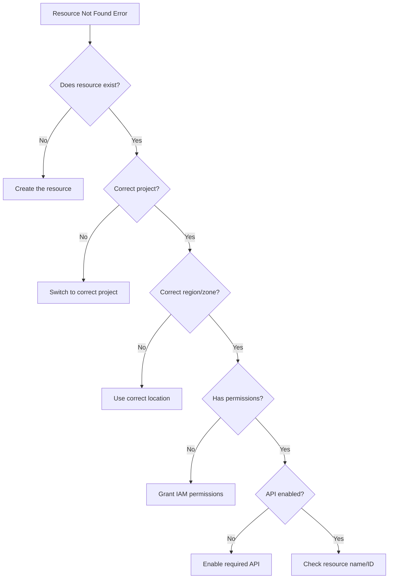

# How to Fix "Resource Not Found" Errors in GCP

Author: [nawazdhandala](https://www.github.com/nawazdhandala)

Tags: GCP, Google Cloud, Errors, Troubleshooting, DevOps, Cloud Infrastructure

Description: Learn how to diagnose and fix common "Resource Not Found" errors in Google Cloud Platform across various services like Compute Engine, Cloud Storage, and IAM.

---

"Resource Not Found" is one of the most common errors you will encounter in GCP. While it seems straightforward, the root cause can vary widely depending on the service and context. This guide covers systematic approaches to diagnosing and fixing these errors across different GCP services.

## Understanding the Error



## Common Causes

1. **Resource does not exist** - The resource was never created or was deleted
2. **Wrong project context** - Working in a different project than expected
3. **Wrong region or zone** - Looking for regional resources in the wrong location
4. **Permission issues** - Lacking permission to view the resource
5. **API not enabled** - The service API is not enabled for the project
6. **Typos in resource names** - Simple naming mistakes

## Debugging Steps

### Step 1: Verify Your Project Context

```bash
# Check current project
gcloud config get-value project

# List all configured projects
gcloud config configurations list

# Switch to the correct project
gcloud config set project my-correct-project

# Or use project flag with commands
gcloud compute instances list --project=my-correct-project
```

### Step 2: Enable Required APIs

```bash
# List enabled APIs
gcloud services list --enabled

# Check if a specific API is enabled
gcloud services list --enabled --filter="name:compute.googleapis.com"

# Enable common APIs
gcloud services enable compute.googleapis.com
gcloud services enable storage.googleapis.com
gcloud services enable cloudfunctions.googleapis.com
gcloud services enable run.googleapis.com
gcloud services enable sqladmin.googleapis.com

# Enable multiple APIs at once
gcloud services enable \
    compute.googleapis.com \
    storage.googleapis.com \
    container.googleapis.com
```

### Step 3: Check Resource Location

```bash
# For Compute Engine instances - list all zones
gcloud compute instances list

# List instances in a specific zone
gcloud compute instances list --zones=us-central1-a

# For regional resources like disks
gcloud compute disks list --regions=us-central1

# For Cloud SQL instances
gcloud sql instances list

# For Cloud Run services
gcloud run services list --region=us-central1

# List all regions where you have resources
gcloud compute regions list
```

## Service-Specific Troubleshooting

### Compute Engine

```bash
# Error: "The resource 'projects/my-project/zones/us-central1-a/instances/my-vm' was not found"

# Step 1: List all instances across all zones
gcloud compute instances list

# Step 2: Check if instance exists in a different zone
gcloud compute instances describe my-vm --zone=us-central1-b

# Step 3: Verify instance name spelling
gcloud compute instances list --filter="name~my-vm"

# Step 4: Check if instance was recently deleted
gcloud logging read 'resource.type="gce_instance" AND protoPayload.methodName="v1.compute.instances.delete"' \
    --limit=10 \
    --format="table(timestamp,protoPayload.resourceName)"
```

### Cloud Storage

```bash
# Error: "The specified bucket does not exist"

# Step 1: List all buckets
gcloud storage ls

# Step 2: Check bucket name (globally unique)
gcloud storage buckets describe gs://my-bucket-name

# Step 3: Verify bucket exists with gsutil
gsutil ls -b gs://my-bucket-name

# Step 4: Check for case sensitivity issues
# Bucket names are case-insensitive but stored as lowercase
gcloud storage ls | grep -i "mybucket"
```

### Cloud SQL

```bash
# Error: "The Cloud SQL instance does not exist"

# Step 1: List all SQL instances
gcloud sql instances list

# Step 2: Check instance in specific project
gcloud sql instances describe my-instance --project=my-project

# Step 3: Check if instance was deleted
gcloud logging read 'resource.type="cloudsql_database" AND protoPayload.methodName="cloudsql.instances.delete"' \
    --limit=10

# Step 4: Verify connection name format
# Format: project:region:instance-name
echo "my-project:us-central1:my-instance"
```

### Cloud Run

```bash
# Error: "Resource not found: services/my-service"

# Step 1: List services in all regions
gcloud run services list

# Step 2: Check specific region
gcloud run services describe my-service --region=us-central1

# Step 3: Verify the platform (managed vs gke)
gcloud run services list --platform=managed

# Step 4: Check service name
gcloud run services list --filter="metadata.name~my-service"
```

### IAM Service Accounts

```bash
# Error: "Service account not found"

# Step 1: List all service accounts
gcloud iam service-accounts list

# Step 2: Check service account email format
# Format: name@project-id.iam.gserviceaccount.com
gcloud iam service-accounts describe my-sa@my-project.iam.gserviceaccount.com

# Step 3: Check if account exists in different project
gcloud iam service-accounts list --project=other-project

# Step 4: Search by display name
gcloud iam service-accounts list --filter="displayName~'My Service Account'"
```

## Terraform-Specific Issues

When using Terraform, "Resource Not Found" often means state drift.

```bash
# Check Terraform state
terraform state list

# Show specific resource
terraform state show google_compute_instance.my_vm

# Refresh state to match actual infrastructure
terraform refresh

# Import existing resource into state
terraform import google_compute_instance.my_vm projects/my-project/zones/us-central1-a/instances/my-vm

# Remove resource from state (if deleted externally)
terraform state rm google_compute_instance.my_vm
```

### Terraform Data Source Errors

```hcl
# This will fail if the resource does not exist
data "google_compute_instance" "existing" {
  name    = "my-vm"
  zone    = "us-central1-a"
  project = "my-project"
}

# Better approach - use try() or handle the error
locals {
  instance_exists = try(data.google_compute_instance.existing.id, null) != null
}

# Or use count to conditionally reference
data "google_compute_instance" "existing" {
  count   = var.import_existing ? 1 : 0
  name    = "my-vm"
  zone    = "us-central1-a"
  project = "my-project"
}
```

## Permission-Related "Not Found" Errors

Sometimes "Not Found" actually means "Permission Denied" but GCP returns a less revealing error.

```bash
# Check your current permissions
gcloud projects get-iam-policy my-project \
    --flatten="bindings[].members" \
    --filter="bindings.members:user@example.com" \
    --format="table(bindings.role)"

# Check service account permissions
gcloud projects get-iam-policy my-project \
    --flatten="bindings[].members" \
    --filter="bindings.members:serviceAccount:my-sa@my-project.iam.gserviceaccount.com" \
    --format="table(bindings.role)"

# Test specific permission
gcloud asset search-all-iam-policies \
    --scope=projects/my-project \
    --query="policy:compute.instances.get"

# Grant viewer access to verify resource exists
gcloud projects add-iam-policy-binding my-project \
    --member="user:user@example.com" \
    --role="roles/viewer"
```

## Audit Logs for Deleted Resources

```bash
# Search for deleted Compute Engine resources
gcloud logging read '
  resource.type="gce_instance" AND
  protoPayload.methodName="v1.compute.instances.delete"
' --limit=20 --format=json

# Search for deleted Cloud Storage objects
gcloud logging read '
  resource.type="gcs_bucket" AND
  protoPayload.methodName="storage.objects.delete"
' --limit=20

# Search for deleted Cloud Run services
gcloud logging read '
  resource.type="cloud_run_revision" AND
  protoPayload.methodName="google.cloud.run.v1.Services.DeleteService"
' --limit=20

# General search for any deletion in the last 24 hours
gcloud logging read '
  protoPayload.methodName=~"delete" AND
  timestamp>="2024-01-01T00:00:00Z"
' --limit=50
```

## Using Cloud Asset Inventory

Cloud Asset Inventory helps find resources across projects and organizations.

```bash
# Search for a resource by name
gcloud asset search-all-resources \
    --scope=projects/my-project \
    --query="name:my-vm"

# Search across the entire organization
gcloud asset search-all-resources \
    --scope=organizations/123456789 \
    --query="name:my-vm"

# Search by asset type
gcloud asset search-all-resources \
    --scope=projects/my-project \
    --asset-types="compute.googleapis.com/Instance" \
    --query="*"

# Export all assets to BigQuery for analysis
gcloud asset export \
    --project=my-project \
    --content-type=resource \
    --bigquery-table=projects/my-project/datasets/assets/tables/resources
```

## Debugging Script

```bash
#!/bin/bash
# debug-resource-not-found.sh
# Usage: ./debug-resource-not-found.sh <resource-type> <resource-name>

RESOURCE_TYPE=$1
RESOURCE_NAME=$2
PROJECT=$(gcloud config get-value project)

echo "=== Debugging Resource Not Found ==="
echo "Resource Type: $RESOURCE_TYPE"
echo "Resource Name: $RESOURCE_NAME"
echo "Project: $PROJECT"
echo ""

# Check API status
echo "=== Checking API Status ==="
case $RESOURCE_TYPE in
  "instance"|"vm")
    gcloud services list --enabled --filter="name:compute.googleapis.com"
    ;;
  "bucket"|"storage")
    gcloud services list --enabled --filter="name:storage.googleapis.com"
    ;;
  "sql"|"database")
    gcloud services list --enabled --filter="name:sqladmin.googleapis.com"
    ;;
  "run"|"cloudrun")
    gcloud services list --enabled --filter="name:run.googleapis.com"
    ;;
esac

echo ""
echo "=== Searching for Resource ==="
case $RESOURCE_TYPE in
  "instance"|"vm")
    gcloud compute instances list --filter="name~$RESOURCE_NAME"
    ;;
  "bucket"|"storage")
    gcloud storage ls | grep -i "$RESOURCE_NAME"
    ;;
  "sql"|"database")
    gcloud sql instances list --filter="name~$RESOURCE_NAME"
    ;;
  "run"|"cloudrun")
    gcloud run services list --filter="metadata.name~$RESOURCE_NAME"
    ;;
esac

echo ""
echo "=== Checking Audit Logs for Deletion ==="
gcloud logging read "protoPayload.resourceName~\"$RESOURCE_NAME\" AND protoPayload.methodName~\"delete\"" \
    --limit=5 \
    --format="table(timestamp,protoPayload.methodName,protoPayload.resourceName)"

echo ""
echo "=== Asset Inventory Search ==="
gcloud asset search-all-resources \
    --scope=projects/$PROJECT \
    --query="name:$RESOURCE_NAME" 2>/dev/null || echo "Asset API might not be enabled"
```

## Best Practices to Avoid "Resource Not Found"

1. **Use consistent naming conventions** - Prefix resources with project or environment name
2. **Tag and label resources** - Makes finding and auditing easier
3. **Use Terraform or Infrastructure as Code** - Track resources in version control
4. **Enable audit logging** - Track resource creation and deletion
5. **Set up resource monitoring** - Get alerts when critical resources are deleted
6. **Document resource locations** - Keep a runbook with resource zones and regions
7. **Use Cloud Asset Inventory** - Maintain visibility across projects

---

"Resource Not Found" errors can be frustrating, but with systematic debugging you can quickly identify whether the resource truly does not exist, whether you are looking in the wrong place, or whether it is a permission issue masquerading as a not-found error. Use the debugging script and checklist above to streamline your troubleshooting process.
