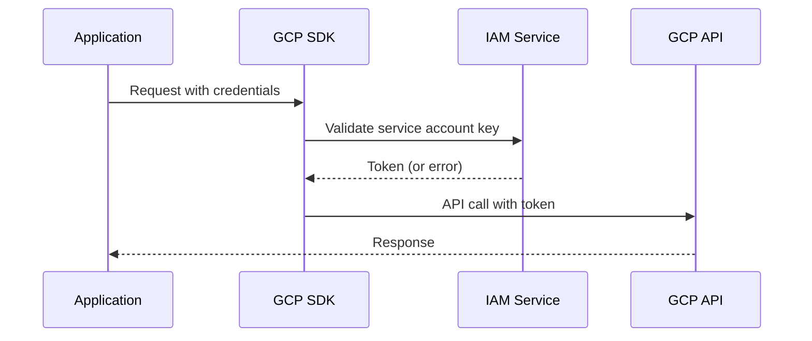
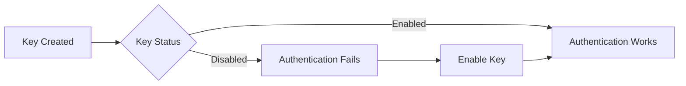
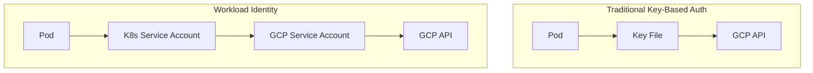

# How to Fix "Service Account" Key Errors

Author: [nawazdhandala](https://www.github.com/nawazdhandala)

Tags: GCP, Google Cloud, Service Account, Authentication, IAM, Security, DevOps

Description: Learn how to diagnose and fix common service account key errors in Google Cloud Platform, including authentication failures, permission issues, and key management best practices.

---

Service account key errors are among the most frustrating issues you will encounter when working with Google Cloud Platform. They can manifest in different ways - from cryptic authentication failures to permission denied errors that leave you scratching your head. This guide walks through the most common service account key problems and their solutions.

## Understanding Service Account Authentication

Before diving into fixes, let's understand how service account authentication works in GCP.



Service accounts authenticate using JSON key files or workload identity. When something goes wrong, you typically see errors like:

- `Could not load the default credentials`
- `The caller does not have permission`
- `Invalid JWT signature`
- `Service account key is disabled`

## Error 1: Could Not Load Default Credentials

This is the most common error. It means the SDK cannot find valid credentials.

```bash
# The error message looks like this
google.auth.exceptions.DefaultCredentialsError: Could not automatically
determine credentials.
```

### Solution: Set GOOGLE_APPLICATION_CREDENTIALS

The simplest fix is to explicitly set the path to your service account key file.

```bash
# Set the environment variable pointing to your key file
export GOOGLE_APPLICATION_CREDENTIALS="/path/to/service-account-key.json"

# Verify the file exists and is readable
ls -la $GOOGLE_APPLICATION_CREDENTIALS

# Test authentication with gcloud
gcloud auth activate-service-account --key-file=$GOOGLE_APPLICATION_CREDENTIALS
```

For applications running in containers, include the key file and set the variable.

```dockerfile
# Dockerfile example
FROM python:3.11-slim

# Copy the service account key (in production, use secrets management)
COPY service-account-key.json /app/credentials.json

# Set the environment variable
ENV GOOGLE_APPLICATION_CREDENTIALS=/app/credentials.json

COPY . /app
WORKDIR /app
RUN pip install -r requirements.txt

CMD ["python", "app.py"]
```

### Solution: Use Application Default Credentials

For local development, use gcloud to set up application default credentials.

```bash
# Login and set up ADC
gcloud auth application-default login

# This creates credentials at:
# Linux/macOS: ~/.config/gcloud/application_default_credentials.json
# Windows: %APPDATA%\gcloud\application_default_credentials.json
```

## Error 2: Invalid JWT Signature or Corrupt Key

This error indicates the key file is corrupted or was modified incorrectly.

```bash
google.auth.exceptions.RefreshError: ('invalid_grant: Invalid JWT Signature.',
{'error': 'invalid_grant', 'error_description': 'Invalid JWT Signature.'})
```

### Solution: Validate and Regenerate the Key

First, verify the key file format is correct.

```bash
# Check if the JSON is valid
cat service-account-key.json | jq .

# The file should contain these fields
cat service-account-key.json | jq 'keys'
# Expected output:
# ["type", "project_id", "private_key_id", "private_key",
#  "client_email", "client_id", "auth_uri", "token_uri",
#  "auth_provider_x509_cert_url", "client_x509_cert_url"]
```

If the key is corrupted, generate a new one.

```bash
# List existing keys for the service account
gcloud iam service-accounts keys list \
    --iam-account=my-service-account@my-project.iam.gserviceaccount.com

# Delete the corrupted key
gcloud iam service-accounts keys delete KEY_ID \
    --iam-account=my-service-account@my-project.iam.gserviceaccount.com

# Create a new key
gcloud iam service-accounts keys create new-key.json \
    --iam-account=my-service-account@my-project.iam.gserviceaccount.com
```

## Error 3: Service Account Key Is Disabled

GCP allows you to disable keys without deleting them. A disabled key returns authentication errors.



### Solution: Check and Enable the Key

```bash
# List all keys and their status
gcloud iam service-accounts keys list \
    --iam-account=my-service-account@my-project.iam.gserviceaccount.com \
    --format="table(name, validAfterTime, validBeforeTime, keyType)"

# If using the console, navigate to:
# IAM & Admin > Service Accounts > [Your SA] > Keys
```

Unfortunately, you cannot re-enable a disabled key via gcloud. You need to use the Console or create a new key.

```bash
# Create a new key to replace the disabled one
gcloud iam service-accounts keys create replacement-key.json \
    --iam-account=my-service-account@my-project.iam.gserviceaccount.com
```

## Error 4: Permission Denied Despite Valid Key

Your key works, but API calls fail with permission errors.

```bash
googleapiclient.errors.HttpError: <HttpError 403 when requesting
https://storage.googleapis.com/... returned "Caller does not have
storage.objects.get access">
```

### Solution: Grant Required IAM Roles

The service account needs proper IAM roles for the resources it accesses.

```bash
# Check current roles for the service account
gcloud projects get-iam-policy my-project \
    --flatten="bindings[].members" \
    --filter="bindings.members:serviceAccount:my-service-account@my-project.iam.gserviceaccount.com" \
    --format="table(bindings.role)"

# Grant a role (example: Storage Object Viewer)
gcloud projects add-iam-binding my-project \
    --member="serviceAccount:my-service-account@my-project.iam.gserviceaccount.com" \
    --role="roles/storage.objectViewer"

# For BigQuery access
gcloud projects add-iam-binding my-project \
    --member="serviceAccount:my-service-account@my-project.iam.gserviceaccount.com" \
    --role="roles/bigquery.dataViewer"
```

## Error 5: Key File Not Found in Kubernetes

When running in Kubernetes, the key file path might not match the mounted secret.

### Solution: Properly Mount Service Account Keys

```yaml
# kubernetes-deployment.yaml
apiVersion: v1
kind: Secret
metadata:
  name: gcp-sa-key
type: Opaque
data:
  # Base64 encoded service account key
  key.json: BASE64_ENCODED_KEY_HERE
---
apiVersion: apps/v1
kind: Deployment
metadata:
  name: my-app
spec:
  template:
    spec:
      containers:
      - name: app
        image: my-app:latest
        env:
        - name: GOOGLE_APPLICATION_CREDENTIALS
          value: /var/secrets/google/key.json
        volumeMounts:
        - name: gcp-sa-key
          mountPath: /var/secrets/google
          readOnly: true
      volumes:
      - name: gcp-sa-key
        secret:
          secretName: gcp-sa-key
```

## Best Practice: Use Workload Identity Instead of Keys

Service account keys are a security risk. They can be leaked, never expire by default, and are hard to rotate. Workload Identity eliminates these issues.



### Enable Workload Identity

```bash
# Enable Workload Identity on the cluster
gcloud container clusters update my-cluster \
    --zone=us-central1-a \
    --workload-pool=my-project.svc.id.goog

# Create a Kubernetes service account
kubectl create serviceaccount my-k8s-sa --namespace default

# Create IAM binding between K8s SA and GCP SA
gcloud iam service-accounts add-iam-policy-binding \
    my-gcp-sa@my-project.iam.gserviceaccount.com \
    --role="roles/iam.workloadIdentityUser" \
    --member="serviceAccount:my-project.svc.id.goog[default/my-k8s-sa]"

# Annotate the Kubernetes service account
kubectl annotate serviceaccount my-k8s-sa \
    --namespace default \
    iam.gke.io/gcp-service-account=my-gcp-sa@my-project.iam.gserviceaccount.com
```

## Debugging Script

Here is a script to diagnose service account key issues.

```bash
#!/bin/bash
# diagnose-sa-key.sh - Diagnose service account key problems

KEY_FILE="${1:-$GOOGLE_APPLICATION_CREDENTIALS}"

if [ -z "$KEY_FILE" ]; then
    echo "ERROR: No key file specified and GOOGLE_APPLICATION_CREDENTIALS not set"
    exit 1
fi

echo "Checking key file: $KEY_FILE"

# Check if file exists
if [ ! -f "$KEY_FILE" ]; then
    echo "ERROR: Key file does not exist"
    exit 1
fi

# Validate JSON structure
if ! jq empty "$KEY_FILE" 2>/dev/null; then
    echo "ERROR: Key file is not valid JSON"
    exit 1
fi

# Extract service account email
SA_EMAIL=$(jq -r '.client_email' "$KEY_FILE")
PROJECT=$(jq -r '.project_id' "$KEY_FILE")

echo "Service Account: $SA_EMAIL"
echo "Project: $PROJECT"

# Test authentication
echo "Testing authentication..."
gcloud auth activate-service-account --key-file="$KEY_FILE" 2>&1

# List IAM roles
echo "IAM roles for this service account:"
gcloud projects get-iam-policy "$PROJECT" \
    --flatten="bindings[].members" \
    --filter="bindings.members:serviceAccount:$SA_EMAIL" \
    --format="table(bindings.role)" 2>/dev/null

echo "Diagnosis complete"
```

## Summary

Service account key errors usually fall into a few categories: missing credentials, corrupted keys, disabled keys, or insufficient permissions. The solutions involve proper credential setup, key regeneration, or IAM role assignment. For production workloads, consider migrating to Workload Identity to eliminate key management overhead entirely.

When troubleshooting, start by verifying the key file exists and is valid JSON, then check if the key is enabled, and finally verify the service account has the necessary IAM roles for your use case.
