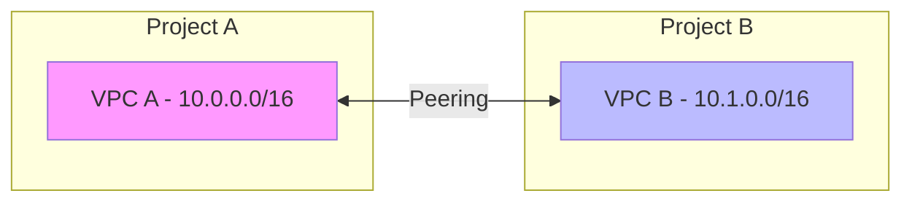

# How to Fix "VPC Network" Configuration Errors in GCP

Author: [nawazdhandala](https://www.github.com/nawazdhandala)

Tags: GCP, VPC, Networking, Firewall, Google Cloud, DevOps, Infrastructure

Description: Learn how to diagnose and fix common VPC network configuration errors in GCP including subnet conflicts, firewall rules, peering issues, and routing problems.

---

VPC network configuration errors can bring your entire GCP infrastructure to a halt. From instances that cannot reach the internet to services that cannot communicate with each other, networking issues are often the most frustrating to debug. This guide covers common VPC errors and their solutions.

## VPC Architecture Overview

```mermaid
flowchart TB
    subgraph VPC Network
        subgraph us-central1
            S1[Subnet 10.0.1.0/24]
            VM1[VM Instance]
            VM1 --> S1
        end

        subgraph us-east1
            S2[Subnet 10.0.2.0/24]
            VM2[VM Instance]
            VM2 --> S2
        end

        R[Cloud Router]
        S1 --> R
        S2 --> R
    end

    subgraph External
        IGW[Internet Gateway]
        VPN[Cloud VPN]
        PEER[VPC Peering]
    end

    R --> IGW
    R --> VPN
    VPC Network --> PEER
```

## Common Error: "Subnetwork CIDR Range Conflicts"

This error occurs when you try to create a subnet with an IP range that overlaps with an existing subnet.

### Diagnosis

```bash
# List all subnets in the project
gcloud compute networks subnets list

# Check specific network's subnets
gcloud compute networks subnets list \
    --network=my-vpc \
    --format="table(name,region,ipCidrRange)"

# Check for IP range conflicts
gcloud compute networks subnets list \
    --format="table(name,ipCidrRange,secondaryIpRanges.rangeName,secondaryIpRanges.ipCidrRange)"
```

### Solution

```bash
# Choose a non-overlapping CIDR range
# Current: 10.0.0.0/24 (10.0.0.0 - 10.0.0.255)
# New subnet should use: 10.0.1.0/24 or 10.1.0.0/24

# Create subnet with valid CIDR
gcloud compute networks subnets create my-new-subnet \
    --network=my-vpc \
    --region=us-central1 \
    --range=10.0.1.0/24

# If you need to expand an existing subnet (only increasing is allowed)
gcloud compute networks subnets expand-ip-range my-subnet \
    --region=us-central1 \
    --prefix-length=23
```

### Terraform Fix

```hcl
# main.tf - Proper subnet planning

locals {
  # Define non-overlapping CIDR blocks
  subnets = {
    "us-central1" = "10.0.0.0/20"   # 10.0.0.0 - 10.0.15.255
    "us-east1"    = "10.0.16.0/20"  # 10.0.16.0 - 10.0.31.255
    "us-west1"    = "10.0.32.0/20"  # 10.0.32.0 - 10.0.47.255
    "europe-west1" = "10.0.48.0/20" # 10.0.48.0 - 10.0.63.255
  }
}

resource "google_compute_network" "vpc" {
  name                    = "my-vpc"
  auto_create_subnetworks = false
  routing_mode            = "GLOBAL"
}

resource "google_compute_subnetwork" "subnets" {
  for_each = local.subnets

  name          = "subnet-${each.key}"
  ip_cidr_range = each.value
  region        = each.key
  network       = google_compute_network.vpc.id

  # Secondary ranges for GKE
  secondary_ip_range {
    range_name    = "pods"
    ip_cidr_range = cidrsubnet(each.value, 4, 1)
  }

  secondary_ip_range {
    range_name    = "services"
    ip_cidr_range = cidrsubnet(each.value, 4, 2)
  }
}
```

## Common Error: "Firewall Rule Blocking Traffic"

Instances cannot communicate despite being in the same VPC.

### Diagnosis

```bash
# List all firewall rules
gcloud compute firewall-rules list

# Check firewall rules for a specific network
gcloud compute firewall-rules list \
    --filter="network:my-vpc" \
    --format="table(name,direction,priority,sourceRanges.list():label=SRC,allowed[].map().firewall_rule().list():label=ALLOW)"

# Check if there's a deny rule blocking traffic
gcloud compute firewall-rules list \
    --filter="network:my-vpc AND denied:*" \
    --format="table(name,priority,denied)"

# Use connectivity tests to diagnose
gcloud network-management connectivity-tests create test-web \
    --source-instance=projects/my-project/zones/us-central1-a/instances/vm1 \
    --destination-instance=projects/my-project/zones/us-central1-a/instances/vm2 \
    --destination-port=80 \
    --protocol=TCP
```

### Solution

```bash
# Create allow rule for internal traffic
gcloud compute firewall-rules create allow-internal \
    --network=my-vpc \
    --direction=INGRESS \
    --priority=1000 \
    --action=ALLOW \
    --rules=all \
    --source-ranges=10.0.0.0/8

# Create allow rule for specific ports
gcloud compute firewall-rules create allow-http-https \
    --network=my-vpc \
    --direction=INGRESS \
    --priority=1000 \
    --action=ALLOW \
    --rules=tcp:80,tcp:443 \
    --source-ranges=0.0.0.0/0 \
    --target-tags=web-server

# Create allow rule for health checks
gcloud compute firewall-rules create allow-health-checks \
    --network=my-vpc \
    --direction=INGRESS \
    --priority=1000 \
    --action=ALLOW \
    --rules=tcp \
    --source-ranges=130.211.0.0/22,35.191.0.0/16 \
    --target-tags=allow-health-check
```

### Terraform Firewall Configuration

```hcl
# Firewall rules with proper structure

resource "google_compute_firewall" "allow_internal" {
  name    = "allow-internal"
  network = google_compute_network.vpc.name

  allow {
    protocol = "icmp"
  }

  allow {
    protocol = "tcp"
    ports    = ["0-65535"]
  }

  allow {
    protocol = "udp"
    ports    = ["0-65535"]
  }

  source_ranges = ["10.0.0.0/8"]
  priority      = 1000
}

resource "google_compute_firewall" "allow_ssh" {
  name    = "allow-ssh"
  network = google_compute_network.vpc.name

  allow {
    protocol = "tcp"
    ports    = ["22"]
  }

  # Only allow from IAP ranges
  source_ranges = ["35.235.240.0/20"]
  target_tags   = ["allow-ssh"]
  priority      = 1000
}

resource "google_compute_firewall" "deny_all_ingress" {
  name    = "deny-all-ingress"
  network = google_compute_network.vpc.name

  deny {
    protocol = "all"
  }

  source_ranges = ["0.0.0.0/0"]
  priority      = 65534
}
```

## Common Error: "No Route to Host"

Instances cannot reach external services or the internet.

### Diagnosis

```bash
# List routes in the VPC
gcloud compute routes list \
    --filter="network:my-vpc" \
    --format="table(name,network,destRange,nextHopGateway,nextHopInstance,priority)"

# Check if default internet route exists
gcloud compute routes list \
    --filter="network:my-vpc AND destRange=0.0.0.0/0"

# Check Cloud NAT configuration (for private instances)
gcloud compute routers nats list --router=my-router --region=us-central1

# Test connectivity from an instance
gcloud compute ssh my-vm --zone=us-central1-a --command="curl -I https://google.com"
```

### Solution

```bash
# Create default route to internet gateway (if missing)
gcloud compute routes create default-internet-route \
    --network=my-vpc \
    --destination-range=0.0.0.0/0 \
    --next-hop-gateway=default-internet-gateway \
    --priority=1000

# For private instances, set up Cloud NAT
# First, create a Cloud Router
gcloud compute routers create my-router \
    --network=my-vpc \
    --region=us-central1

# Then create Cloud NAT
gcloud compute routers nats create my-nat \
    --router=my-router \
    --region=us-central1 \
    --auto-allocate-nat-external-ips \
    --nat-all-subnet-ip-ranges
```

### Terraform NAT Configuration

```hcl
resource "google_compute_router" "router" {
  name    = "my-router"
  region  = "us-central1"
  network = google_compute_network.vpc.id
}

resource "google_compute_router_nat" "nat" {
  name   = "my-nat"
  router = google_compute_router.router.name
  region = google_compute_router.router.region

  nat_ip_allocate_option             = "AUTO_ONLY"
  source_subnetwork_ip_ranges_to_nat = "ALL_SUBNETWORKS_ALL_IP_RANGES"

  log_config {
    enable = true
    filter = "ERRORS_ONLY"
  }
}
```

## Common Error: "VPC Peering Connection Failed"

Cannot establish VPC peering between networks.



### Diagnosis

```bash
# List existing peering connections
gcloud compute networks peerings list

# Check peering status
gcloud compute networks peerings list \
    --network=my-vpc \
    --format="table(name,network,state,stateDetails)"

# Common issues:
# - Overlapping CIDR ranges
# - Peering not configured on both sides
# - Exceeded peering limits (25 per VPC)
```

### Solution

```bash
# Create peering from VPC A to VPC B
gcloud compute networks peerings create peer-a-to-b \
    --network=vpc-a \
    --peer-project=project-b \
    --peer-network=vpc-b \
    --export-custom-routes \
    --import-custom-routes

# Create peering from VPC B to VPC A (must be done in project-b)
gcloud compute networks peerings create peer-b-to-a \
    --network=vpc-b \
    --peer-project=project-a \
    --peer-network=vpc-a \
    --export-custom-routes \
    --import-custom-routes

# Update peering to exchange routes
gcloud compute networks peerings update peer-a-to-b \
    --network=vpc-a \
    --export-custom-routes \
    --import-custom-routes
```

### Terraform Peering Configuration

```hcl
# Peering from VPC A to VPC B
resource "google_compute_network_peering" "peer_a_to_b" {
  name         = "peer-a-to-b"
  network      = google_compute_network.vpc_a.self_link
  peer_network = google_compute_network.vpc_b.self_link

  export_custom_routes = true
  import_custom_routes = true
}

# Peering from VPC B to VPC A
resource "google_compute_network_peering" "peer_b_to_a" {
  name         = "peer-b-to-a"
  network      = google_compute_network.vpc_b.self_link
  peer_network = google_compute_network.vpc_a.self_link

  export_custom_routes = true
  import_custom_routes = true
}
```

## Common Error: "Private Google Access Not Working"

Instances without external IPs cannot reach Google APIs.

### Diagnosis

```bash
# Check if Private Google Access is enabled
gcloud compute networks subnets describe my-subnet \
    --region=us-central1 \
    --format="get(privateIpGoogleAccess)"

# Check DNS configuration
gcloud compute networks describe my-vpc \
    --format="get(name,autoCreateSubnetworks)"
```

### Solution

```bash
# Enable Private Google Access on subnet
gcloud compute networks subnets update my-subnet \
    --region=us-central1 \
    --enable-private-ip-google-access

# For restricted.googleapis.com (VPC Service Controls)
# Create DNS zone for Private Google Access
gcloud dns managed-zones create google-apis \
    --dns-name="googleapis.com." \
    --visibility=private \
    --networks=my-vpc \
    --description="Private Google Access"

# Add A record
gcloud dns record-sets create googleapis.com. \
    --zone=google-apis \
    --type=A \
    --ttl=300 \
    --rrdatas="199.36.153.8,199.36.153.9,199.36.153.10,199.36.153.11"

# Add CNAME wildcard
gcloud dns record-sets create "*.googleapis.com." \
    --zone=google-apis \
    --type=CNAME \
    --ttl=300 \
    --rrdatas="googleapis.com."
```

## Debugging VPC Connectivity

### VPC Flow Logs

```bash
# Enable VPC Flow Logs
gcloud compute networks subnets update my-subnet \
    --region=us-central1 \
    --enable-flow-logs \
    --logging-aggregation-interval=interval-5-sec \
    --logging-flow-sampling=0.5 \
    --logging-metadata=include-all

# Query flow logs
gcloud logging read 'resource.type="gce_subnetwork" AND logName="projects/my-project/logs/compute.googleapis.com%2Fvpc_flows"' \
    --limit=20 \
    --format=json
```

### Connectivity Tests

```bash
# Create a connectivity test
gcloud network-management connectivity-tests create my-test \
    --source-instance=projects/my-project/zones/us-central1-a/instances/source-vm \
    --destination-instance=projects/my-project/zones/us-central1-a/instances/dest-vm \
    --destination-port=443 \
    --protocol=TCP

# Run the test
gcloud network-management connectivity-tests rerun my-test

# View results
gcloud network-management connectivity-tests describe my-test
```

### Debugging Script

```bash
#!/bin/bash
# vpc-debug.sh - Diagnose VPC connectivity issues

NETWORK=${1:-"default"}
PROJECT=$(gcloud config get-value project)

echo "=== VPC Debug for: $NETWORK ==="
echo "Project: $PROJECT"
echo ""

echo "=== Subnets ==="
gcloud compute networks subnets list \
    --network=$NETWORK \
    --format="table(name,region,ipCidrRange,privateIpGoogleAccess)"

echo ""
echo "=== Firewall Rules ==="
gcloud compute firewall-rules list \
    --filter="network:$NETWORK" \
    --format="table(name,direction,priority,allowed[].map().firewall_rule().list():label=ALLOW,denied[].map().firewall_rule().list():label=DENY)"

echo ""
echo "=== Routes ==="
gcloud compute routes list \
    --filter="network:$NETWORK" \
    --format="table(name,destRange,nextHopGateway,nextHopInstance,priority)"

echo ""
echo "=== Peering Connections ==="
gcloud compute networks peerings list --network=$NETWORK

echo ""
echo "=== Cloud NAT (all regions) ==="
for region in $(gcloud compute regions list --format="value(name)"); do
    gcloud compute routers nats list --router-region=$region 2>/dev/null
done
```

## Best Practices

1. **Plan IP addressing** - Use a clear CIDR allocation strategy to avoid conflicts
2. **Use network tags** - Apply firewall rules to specific instances using tags
3. **Enable flow logs** - For debugging and security monitoring
4. **Implement least privilege** - Create specific firewall rules instead of broad allows
5. **Use connectivity tests** - Proactively test network paths
6. **Document your network** - Maintain diagrams and IP allocation tables
7. **Use Shared VPC** - For multi-project environments to centralize network management

---

VPC configuration errors often stem from overlapping IP ranges, missing firewall rules, or incomplete peering setups. By systematically checking subnets, routes, and firewall rules, you can quickly identify and resolve most networking issues. Enable VPC flow logs and use connectivity tests for ongoing monitoring and proactive troubleshooting.
