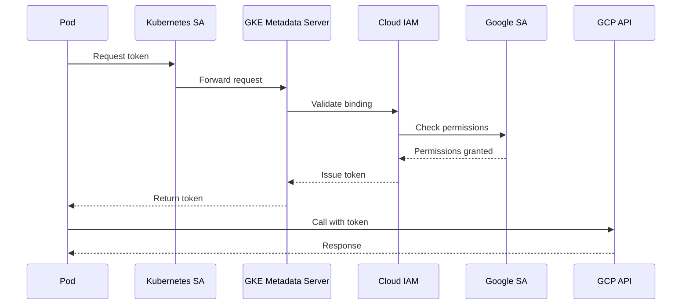

# How to Fix 'Workload Identity' Errors

Author: [nawazdhandala](https://www.github.com/nawazdhandala)

Tags: GCP, Google Cloud, Kubernetes, GKE, Workload Identity, IAM, Security, Troubleshooting

Description: A practical troubleshooting guide for fixing Workload Identity errors in Google Kubernetes Engine, covering common misconfigurations and their solutions.

---

Workload Identity is the recommended way for GKE workloads to access Google Cloud APIs. It eliminates the need for service account keys by letting Kubernetes service accounts impersonate IAM service accounts. However, the configuration involves multiple components that must align perfectly. When something goes wrong, the error messages can be cryptic. This guide covers the most common Workload Identity errors and how to fix them.

## How Workload Identity Works

Understanding the flow helps diagnose issues faster:



## Error: "Error retrieving credentials from the metadata server"

This is the most common error when Workload Identity is not properly configured.

### Check GKE Metadata Server Status

```bash
# Verify Workload Identity is enabled on the cluster
gcloud container clusters describe my-cluster \
    --zone us-central1-a \
    --format="value(workloadIdentityConfig.workloadPool)"

# Expected output: my-project.svc.id.goog
# If empty, Workload Identity is not enabled
```

### Enable Workload Identity on the Cluster

```bash
# Enable on existing cluster
gcloud container clusters update my-cluster \
    --zone us-central1-a \
    --workload-pool=my-project.svc.id.goog

# This requires node pool recreation to take effect
```

### Check Node Pool Configuration

```bash
# Verify node pool has Workload Identity enabled
gcloud container node-pools describe default-pool \
    --cluster my-cluster \
    --zone us-central1-a \
    --format="value(config.workloadMetadataConfig.mode)"

# Expected output: GKE_METADATA
# If empty or "GCE_METADATA", nodes use legacy metadata
```

### Update Node Pool

```bash
# Update existing node pool (causes rolling restart)
gcloud container node-pools update default-pool \
    --cluster my-cluster \
    --zone us-central1-a \
    --workload-metadata=GKE_METADATA
```

## Error: "Permission 'iam.serviceAccounts.getAccessToken' denied"

This means the IAM binding between Kubernetes and Google service accounts is missing or incorrect.

### Verify the IAM Binding

```bash
# Check if the binding exists
gcloud iam service-accounts get-iam-policy my-gsa@my-project.iam.gserviceaccount.com \
    --format=json | jq '.bindings[] | select(.role=="roles/iam.workloadIdentityUser")'
```

### Create the Correct Binding

```bash
# Create IAM binding
# Format: serviceAccount:PROJECT_ID.svc.id.goog[NAMESPACE/KSA_NAME]
gcloud iam service-accounts add-iam-policy-binding my-gsa@my-project.iam.gserviceaccount.com \
    --role roles/iam.workloadIdentityUser \
    --member "serviceAccount:my-project.svc.id.goog[my-namespace/my-ksa]"
```

### Common Binding Mistakes

```bash
# Wrong: Missing brackets around namespace/ksa
--member "serviceAccount:my-project.svc.id.goog/my-namespace/my-ksa"

# Wrong: Using GKE cluster name instead of project
--member "serviceAccount:my-cluster.svc.id.goog[my-namespace/my-ksa]"

# Wrong: Namespace doesn't match pod's namespace
--member "serviceAccount:my-project.svc.id.goog[default/my-ksa]"
# But pod runs in "production" namespace

# Correct format
--member "serviceAccount:PROJECT_ID.svc.id.goog[NAMESPACE/KSA_NAME]"
```

## Error: "Kubernetes service account not found"

The Kubernetes service account either doesn't exist or isn't annotated correctly.

### Create and Annotate the Service Account

```yaml
# ksa.yaml
apiVersion: v1
kind: ServiceAccount
metadata:
  name: my-ksa
  namespace: my-namespace
  annotations:
    # This annotation is REQUIRED
    iam.gke.io/gcp-service-account: my-gsa@my-project.iam.gserviceaccount.com
```

```bash
# Apply the configuration
kubectl apply -f ksa.yaml

# Verify the annotation
kubectl get serviceaccount my-ksa -n my-namespace -o yaml
```

### Check Pod Uses the Correct Service Account

```yaml
# deployment.yaml
apiVersion: apps/v1
kind: Deployment
metadata:
  name: my-app
  namespace: my-namespace
spec:
  template:
    spec:
      # Must match the annotated KSA name
      serviceAccountName: my-ksa
      containers:
        - name: app
          image: my-app:latest
```

## Error: "Token request failed with status code 404"

The GKE metadata server isn't reachable, often due to network policies or node configuration.

### Test Metadata Server Connectivity

```bash
# Exec into the pod
kubectl exec -it my-pod -n my-namespace -- /bin/sh

# Test metadata server connectivity
curl -H "Metadata-Flavor: Google" \
    http://169.254.169.254/computeMetadata/v1/instance/service-accounts/

# Test Workload Identity endpoint
curl -H "Metadata-Flavor: Google" \
    http://169.254.169.254/computeMetadata/v1/instance/service-accounts/default/identity?audience=test
```

### Check Network Policy

If you have network policies, ensure GKE metadata traffic is allowed:

```yaml
# network-policy.yaml
apiVersion: networking.k8s.io/v1
kind: NetworkPolicy
metadata:
  name: allow-gke-metadata
  namespace: my-namespace
spec:
  podSelector: {}
  policyTypes:
    - Egress
  egress:
    # Allow GKE metadata server
    - to:
        - ipBlock:
            cidr: 169.254.169.254/32
      ports:
        - protocol: TCP
          port: 80
        - protocol: TCP
          port: 988
```

## Error: "The caller does not have permission" on GCP API Calls

Workload Identity is working, but the Google service account lacks API permissions.

### Check Google Service Account Permissions

```bash
# List roles assigned to the service account
gcloud projects get-iam-policy my-project \
    --flatten="bindings[].members" \
    --filter="bindings.members:my-gsa@my-project.iam.gserviceaccount.com" \
    --format="table(bindings.role)"
```

### Grant Required Permissions

```bash
# Example: Grant Storage access
gcloud projects add-iam-policy-binding my-project \
    --member="serviceAccount:my-gsa@my-project.iam.gserviceaccount.com" \
    --role="roles/storage.objectViewer"

# Example: Grant Pub/Sub access
gcloud projects add-iam-policy-binding my-project \
    --member="serviceAccount:my-gsa@my-project.iam.gserviceaccount.com" \
    --role="roles/pubsub.publisher"
```

## Complete Debugging Workflow

Here's a systematic approach to debugging Workload Identity:

```bash
#!/bin/bash
# workload-identity-debug.sh

PROJECT_ID="my-project"
CLUSTER="my-cluster"
ZONE="us-central1-a"
NAMESPACE="my-namespace"
KSA="my-ksa"
GSA="my-gsa@${PROJECT_ID}.iam.gserviceaccount.com"

echo "=== Step 1: Check cluster Workload Identity ==="
WORKLOAD_POOL=$(gcloud container clusters describe $CLUSTER \
    --zone $ZONE \
    --format="value(workloadIdentityConfig.workloadPool)")

if [ -z "$WORKLOAD_POOL" ]; then
    echo "ERROR: Workload Identity not enabled on cluster"
    exit 1
fi
echo "Workload pool: $WORKLOAD_POOL"

echo -e "\n=== Step 2: Check node pool configuration ==="
NODE_POOL_MODE=$(gcloud container node-pools describe default-pool \
    --cluster $CLUSTER \
    --zone $ZONE \
    --format="value(config.workloadMetadataConfig.mode)")

if [ "$NODE_POOL_MODE" != "GKE_METADATA" ]; then
    echo "ERROR: Node pool not configured for Workload Identity"
    echo "Current mode: $NODE_POOL_MODE"
    exit 1
fi
echo "Node pool mode: $NODE_POOL_MODE"

echo -e "\n=== Step 3: Check Kubernetes service account ==="
KSA_ANNOTATION=$(kubectl get serviceaccount $KSA -n $NAMESPACE \
    -o jsonpath='{.metadata.annotations.iam\.gke\.io/gcp-service-account}' 2>/dev/null)

if [ -z "$KSA_ANNOTATION" ]; then
    echo "ERROR: KSA missing annotation or doesn't exist"
    exit 1
fi
echo "KSA annotation: $KSA_ANNOTATION"

echo -e "\n=== Step 4: Check IAM binding ==="
BINDING=$(gcloud iam service-accounts get-iam-policy $GSA \
    --format=json 2>/dev/null | \
    jq -r ".bindings[] | select(.role==\"roles/iam.workloadIdentityUser\") | .members[]" | \
    grep "${PROJECT_ID}.svc.id.goog\[${NAMESPACE}/${KSA}\]")

if [ -z "$BINDING" ]; then
    echo "ERROR: IAM binding not found"
    echo "Expected: serviceAccount:${PROJECT_ID}.svc.id.goog[${NAMESPACE}/${KSA}]"
    exit 1
fi
echo "IAM binding: $BINDING"

echo -e "\n=== Step 5: Check GSA permissions ==="
gcloud projects get-iam-policy $PROJECT_ID \
    --flatten="bindings[].members" \
    --filter="bindings.members:$GSA" \
    --format="table(bindings.role)"

echo -e "\n=== All checks passed ==="
```

## Testing Workload Identity from a Pod

Deploy a test pod to verify the configuration:

```yaml
# test-workload-identity.yaml
apiVersion: v1
kind: Pod
metadata:
  name: workload-identity-test
  namespace: my-namespace
spec:
  serviceAccountName: my-ksa
  containers:
    - name: test
      image: google/cloud-sdk:slim
      command: ["sleep", "infinity"]
```

```bash
# Deploy test pod
kubectl apply -f test-workload-identity.yaml

# Wait for pod to be ready
kubectl wait --for=condition=Ready pod/workload-identity-test -n my-namespace

# Test authentication
kubectl exec -it workload-identity-test -n my-namespace -- gcloud auth list

# Test API access (example: list storage buckets)
kubectl exec -it workload-identity-test -n my-namespace -- gsutil ls

# Clean up
kubectl delete pod workload-identity-test -n my-namespace
```

## Common Pitfalls to Avoid

**Using the default service account**: The default KSA in each namespace doesn't have Workload Identity configured. Always create a dedicated KSA.

**Forgetting to restart pods**: After fixing configuration, pods using cached credentials need to restart.

**Cross-project access**: If accessing resources in a different project, the GSA needs permissions in that project, not just the cluster's project.

**Regional vs zonal clusters**: Use the correct flag (`--region` or `--zone`) when running gcloud commands.

---

Workload Identity eliminates the security risks of service account keys, but its multi-component configuration can be tricky. When troubleshooting, work through each layer systematically: cluster configuration, node pool settings, KSA annotation, IAM binding, and finally GSA permissions. Once properly configured, Workload Identity provides seamless and secure access to GCP APIs from your Kubernetes workloads.
