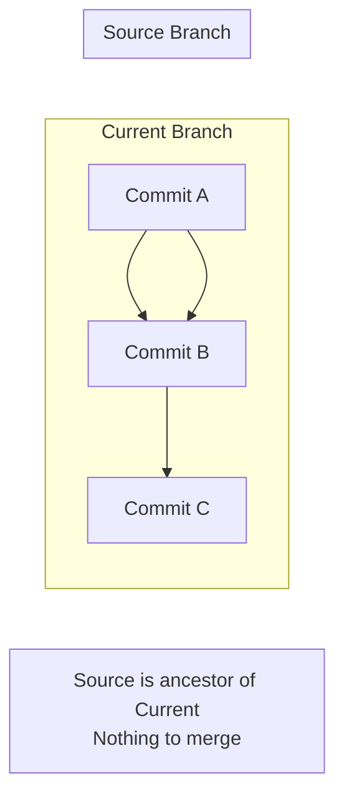
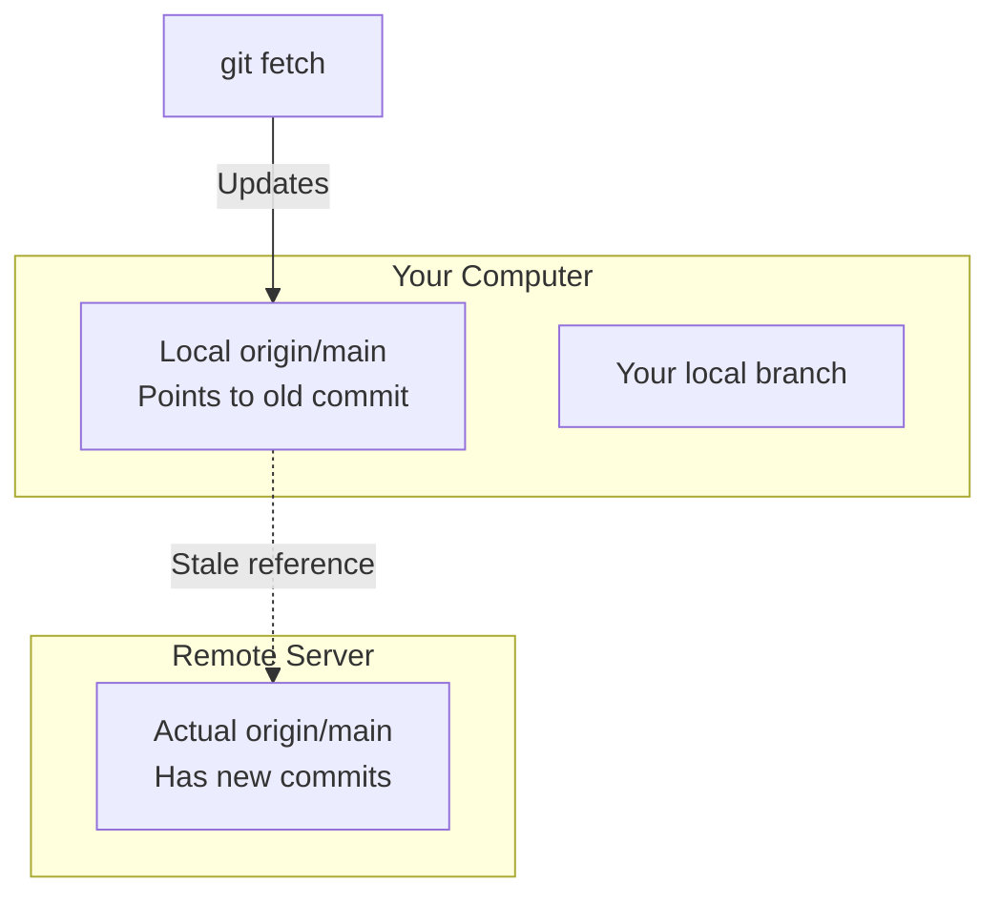
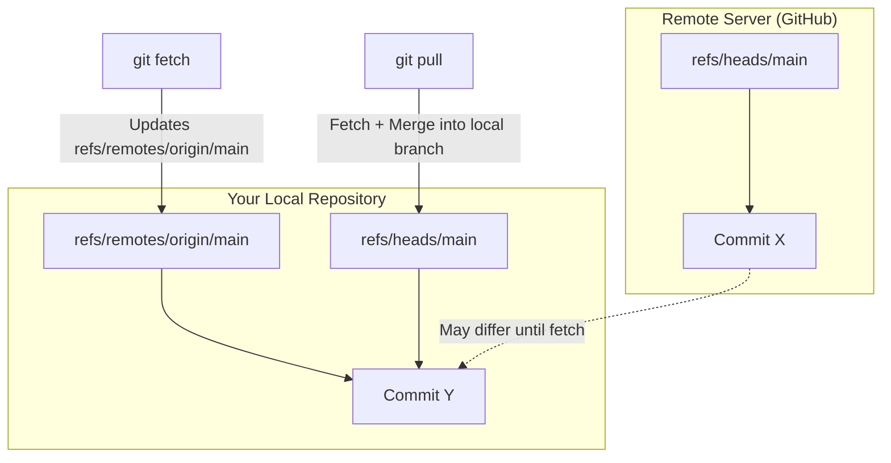

# How to Fix 'Already Up to Date' but Changes Missing

Author: [nawazdhandala](https://www.github.com/nawazdhandala)

Tags: Git, Version Control, Troubleshooting, DevOps, Merge, Branch Management

Description: Learn how to diagnose and fix the confusing situation where Git says your branch is up to date but expected changes are missing.

---

You run `git pull` or `git merge` and Git reports "Already up to date" but the changes you expected are nowhere to be found. This frustrating situation usually means you are not on the branch you think you are, or you are comparing against the wrong remote. This guide walks through the common causes and how to fix them.

## Understanding "Already Up to Date"

When Git says "Already up to date," it means your current branch already contains all commits from the branch you are trying to merge or pull from. This happens because:



Git sees that your current branch (with commit C) already includes all commits from the source branch (A and B). There is nothing new to add.

## Common Cause 1: Wrong Branch

The most common cause is being on the wrong branch:

```bash
# Check which branch you are on
git branch

# Output shows current branch with asterisk
  main
  develop
* feature/old-branch  # You are here, not where you think

# Switch to the correct branch
git checkout develop
git pull
```

Always verify your branch before pulling:

```bash
# Full status including branch info
git status

# Output:
On branch feature/old-branch
Your branch is up to date with 'origin/feature/old-branch'.
```

## Common Cause 2: Pulling from Wrong Remote Branch

You might be pulling from a different remote branch than you expect:

```bash
# See what remote branch your local branch tracks
git branch -vv

# Output:
  main           abc1234 [origin/main] Latest commit message
  develop        def5678 [origin/develop] Another commit
* feature/login  111aaaa [origin/feature/login] My commit  # Tracking this

# The changes you want might be on a different branch
git fetch origin
git log origin/main --oneline -5  # Check commits on main
```

If you need changes from a different branch:

```bash
# Merge from a specific remote branch
git merge origin/main

# Or rebase onto it
git rebase origin/main
```

## Common Cause 3: Stale Remote References

Your local Git might have outdated information about the remote:

```bash
# Fetch latest information from remote
git fetch origin

# Now check the difference
git log HEAD..origin/main --oneline

# If there are commits, merge them
git merge origin/main
```

The problem explained visually:



After `git fetch`, your local reference to `origin/main` gets updated.

## Common Cause 4: Changes Are on a Different Remote

If your repository has multiple remotes:

```bash
# List all remotes
git remote -v

# Output:
origin    https://github.com/company/repo.git (fetch)
origin    https://github.com/company/repo.git (push)
upstream  https://github.com/original/repo.git (fetch)
upstream  https://github.com/original/repo.git (push)

# Fetch from all remotes
git fetch --all

# Check if changes are on the other remote
git log HEAD..upstream/main --oneline

# Merge from the correct remote
git merge upstream/main
```

## Common Cause 5: Merge Already Happened

The changes might already be in your branch through a previous merge:

```bash
# Check if the commit you are looking for exists in your branch
git log --oneline | grep "commit message keywords"

# Or check if a specific commit is an ancestor
git merge-base --is-ancestor abc1234 HEAD && echo "Commit is in your branch"

# View the merge history
git log --oneline --merges
```

## Diagnostic Commands

Run these commands to understand the situation:

```bash
# 1. What branch am I on?
git branch --show-current

# 2. What is the tracking relationship?
git branch -vv

# 3. What does the remote actually have?
git fetch origin
git log origin/main --oneline -10

# 4. What commits are on remote but not local?
git log HEAD..origin/main --oneline

# 5. What commits are local but not on remote?
git log origin/main..HEAD --oneline

# 6. Visual comparison
git log --oneline --graph --all -20
```

## Step-by-Step Troubleshooting

Follow this systematic approach:

```bash
# Step 1: Verify your current branch
git status
# Note the branch name shown

# Step 2: Fetch latest from remote
git fetch origin

# Step 3: Compare your branch with remote
git log HEAD..origin/main --oneline
# If this shows commits, you need them

# Step 4: Check if you should be on a different branch
git branch -a
# Look for the branch that has your expected changes

# Step 5: If changes are on origin/main but you are on feature branch
# Option A: Merge main into your branch
git merge origin/main

# Option B: Rebase onto main
git rebase origin/main

# Option C: Switch to main first
git checkout main
git pull
```

## Fixing the Issue

Once you identify the problem, here are the fixes:

**Fix for wrong branch:**

```bash
git checkout correct-branch
git pull
```

**Fix for stale remote:**

```bash
git fetch origin
git merge origin/branch-name
```

**Fix for wrong tracking branch:**

```bash
# Set up correct tracking
git branch --set-upstream-to=origin/correct-branch

# Now pull works as expected
git pull
```

**Fix for needing changes from different branch:**

```bash
# Merge approach
git fetch origin
git merge origin/source-branch

# Rebase approach
git fetch origin
git rebase origin/source-branch
```

## Verifying the Changes Arrived

After your fix, verify the changes are present:

```bash
# Check for specific file changes
git log --oneline -- path/to/file.txt

# Check if specific commit is now in your branch
git log --oneline | grep "expected commit message"

# Compare with remote
git diff HEAD origin/main
# Empty output means branches are identical

# Check branch status
git status
# Should show no difference with tracking branch
```

## Prevention Tips

Avoid this confusion in the future:

**1. Always check your branch first:**

```bash
# Add to your workflow
git status && git pull
```

**2. Use verbose commands:**

```bash
# See more information during pull
git pull -v

# Shows which branch and what commits are being fetched
```

**3. Fetch before merge or pull:**

```bash
# Fetch first, then examine, then merge
git fetch origin
git log HEAD..origin/main --oneline
# Now you know what you are about to merge
git merge origin/main
```

**4. Set up useful aliases:**

```bash
# Add to your git config
git config --global alias.sync '!git fetch origin && git status'
git config --global alias.compare 'log --oneline HEAD..origin/main'

# Usage
git sync    # Fetch and show status
git compare # Show commits you are missing
```

## Quick Reference

| Symptom | Likely Cause | Fix |
|---------|-------------|-----|
| Pull says up to date, changes exist on GitHub | Stale local remote ref | `git fetch origin && git merge origin/main` |
| Cannot see colleague's commits | Wrong branch | `git checkout correct-branch && git pull` |
| Pull from fork shows nothing | Wrong remote | `git fetch upstream && git merge upstream/main` |
| Just merged but changes missing | Merged wrong branch | Check branch name in merge command |

## Understanding Git References

This diagram shows how local and remote references work:



When Git says "Already up to date," it is comparing your local branch with `refs/remotes/origin/main`, which might be outdated until you run `git fetch`.

The "Already up to date" message is technically correct but often misleading. Git is telling you the truth about what it knows locally. The key is making sure your local knowledge matches reality by fetching before comparing or merging.
