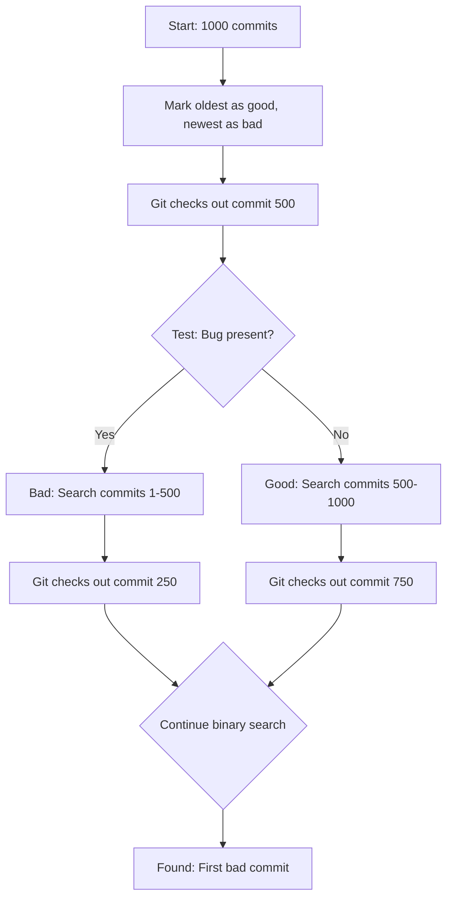
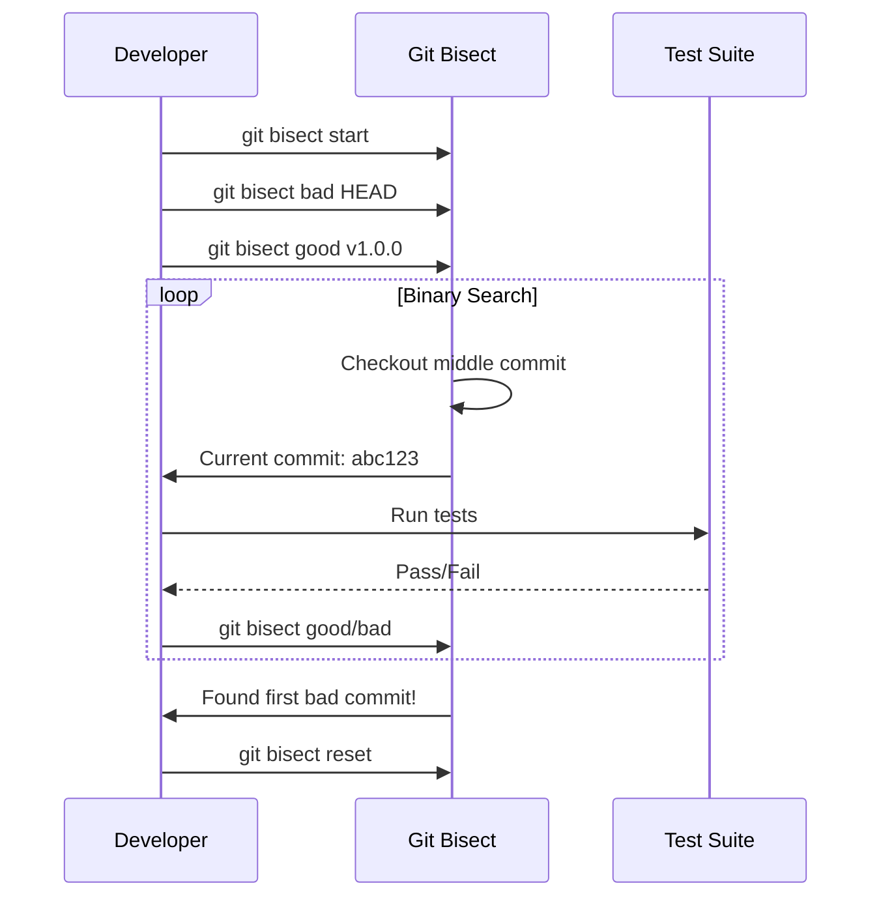

# How to Handle Git Bisect for Bug Finding

Author: [nawazdhandala](https://www.github.com/nawazdhandala)

Tags: Git, Debugging, Bisect, Version Control, Bug Tracking, DevOps

Description: Master Git bisect to efficiently find the exact commit that introduced a bug using binary search through your commit history.

---

When a bug appears in your codebase and you are not sure when it was introduced, manually checking commits can take hours. Git bisect uses binary search to find the problematic commit in logarithmic time. With 1000 commits, you can find the bug in about 10 steps instead of 500.

## How Git Bisect Works

Git bisect performs a binary search through your commit history. You mark one commit as "good" (bug-free) and one as "bad" (has the bug). Git then checks out the middle commit for you to test. Based on your feedback, it eliminates half the remaining commits and repeats until it finds the first bad commit.



## Basic Git Bisect Workflow

### Step 1: Start Bisect Session

```bash
# Start the bisect session
git bisect start

# Mark the current commit as bad (has the bug)
git bisect bad

# Mark a known good commit (before the bug existed)
# This can be a commit hash, tag, or branch
git bisect good v1.0.0

# Or use a commit hash
git bisect good abc123
```

### Step 2: Test Each Commit

Git automatically checks out the middle commit. Test it and report the result.

```bash
# After testing, mark as good or bad
git bisect good  # Bug is not present
# or
git bisect bad   # Bug is present

# Git will checkout the next commit to test
# Repeat until Git finds the culprit
```

### Step 3: Find the Result

```bash
# Git will eventually output something like:
# abc123def456 is the first bad commit
# commit abc123def456
# Author: Developer <dev@example.com>
# Date:   Mon Jan 15 10:30:00 2026 +0000
#
#     Add new feature that accidentally broke login

# End the bisect session
git bisect reset
```

## Automating Bisect with Scripts

Instead of manually testing each commit, you can automate the process with a test script.

### Using a Test Command

```bash
# Start bisect
git bisect start
git bisect bad HEAD
git bisect good v1.0.0

# Run automated bisect
# Script should exit 0 for good, 1-124 or 126-127 for bad, 125 to skip
git bisect run npm test

# Or with a custom script
git bisect run ./test-for-bug.sh
```

### Writing a Test Script

```bash
#!/bin/bash
# test-for-bug.sh

# Build the project
npm install
npm run build

# Run specific test that catches the bug
npm test -- --grep "login should work"

# Exit code determines good/bad
# 0 = good (test passes)
# 1-124, 126-127 = bad (test fails)
# 125 = skip (cannot test this commit)
```

### Handling Build Failures

Some commits might not compile. Use exit code 125 to skip them.

```bash
#!/bin/bash
# test-for-bug.sh with build handling

# Try to build
if ! npm run build 2>/dev/null; then
    # Cannot build this commit, skip it
    exit 125
fi

# Run the test
npm test -- --grep "specific bug test"
```

## Advanced Bisect Techniques

### Bisecting a Specific Path

If you know the bug is in a specific directory or file:

```bash
git bisect start -- src/auth/
# This limits the commits considered to those touching src/auth/
```

### Skipping Untestable Commits

```bash
# If a commit cannot be tested (won't build, etc.)
git bisect skip

# Skip a range of commits
git bisect skip v1.2.0..v1.3.0
```

### Viewing Bisect Log

```bash
# See the bisect history
git bisect log

# Save the log to replay later
git bisect log > bisect.log

# Replay a saved bisect session
git bisect replay bisect.log
```

### Visualizing the Search

```bash
# See remaining suspects
git bisect visualize

# Or with gitk
git bisect visualize --all
```

## Practical Examples

### Example 1: Finding a Performance Regression

```bash
#!/bin/bash
# perf-test.sh

npm install --silent
npm run build --silent

# Run performance benchmark
START=$(date +%s%N)
node dist/benchmark.js
END=$(date +%s%N)

# Calculate duration in milliseconds
DURATION=$(( ($END - $START) / 1000000 ))

# If slower than 500ms, it's bad
if [ $DURATION -gt 500 ]; then
    echo "Performance regression: ${DURATION}ms"
    exit 1
fi

echo "Performance OK: ${DURATION}ms"
exit 0
```

```bash
# Run bisect
git bisect start
git bisect bad HEAD
git bisect good v1.0.0
git bisect run ./perf-test.sh
```

### Example 2: Finding When a Test Started Failing

```bash
git bisect start
git bisect bad HEAD  # Tests fail now
git bisect good abc123  # Tests passed at this commit

# Run specific test file
git bisect run pytest tests/test_auth.py -x

# -x stops at first failure, making it faster
```

### Example 3: Finding a Visual Regression

For bugs that require visual inspection, use a semi-automated approach:

```bash
git bisect start
git bisect bad HEAD
git bisect good v2.0.0

# At each step, Git checks out a commit
# You manually test and report
git bisect good  # or git bisect bad
```

### Example 4: Complex Test with Multiple Conditions

```bash
#!/bin/bash
# complex-test.sh

set -e

# Skip if essential file doesn't exist
if [ ! -f "src/main.js" ]; then
    exit 125
fi

# Build
npm ci || exit 125
npm run build || exit 125

# Test 1: API endpoint returns 200
RESPONSE=$(curl -s -o /dev/null -w "%{http_code}" http://localhost:3000/api/health)
if [ "$RESPONSE" != "200" ]; then
    exit 1
fi

# Test 2: Specific feature works
node -e "require('./dist/feature').test()" || exit 1

# All tests pass
exit 0
```

## Bisect with Merge Commits

Bisect works with merge commits, but sometimes you want to avoid them:

```bash
# Start bisect on first-parent commits only
git bisect start --first-parent
git bisect bad HEAD
git bisect good origin/main~100
```

This follows only the main line of history, ignoring commits from merged branches.

## Common Pitfalls and Solutions

### Pitfall 1: Starting with Wrong Boundaries

```bash
# If you accidentally marked wrong, reset and start over
git bisect reset
git bisect start
git bisect bad <correct-bad-commit>
git bisect good <correct-good-commit>
```

### Pitfall 2: Inconsistent Test Environment

```bash
#!/bin/bash
# Ensure clean environment each time
git clean -fdx  # Remove untracked files
npm ci          # Fresh install (not npm install)
npm run build
npm test
```

### Pitfall 3: Flaky Tests

```bash
#!/bin/bash
# Run test multiple times to handle flakiness
for i in {1..3}; do
    if npm test; then
        exit 0
    fi
    sleep 1
done
exit 1  # Failed 3 times, mark as bad
```

## Bisect Workflow Diagram



## Best Practices

1. **Write reproducible tests** - The test must give consistent results for the same commit
2. **Use automation when possible** - `git bisect run` is faster and less error-prone
3. **Handle build failures** - Use exit code 125 to skip untestable commits
4. **Document your bisect scripts** - Future you will thank you
5. **Clean state between tests** - Ensure no artifacts from previous builds affect results
6. **Keep the search focused** - Use path limiting when you know where the bug likely is

## Quick Reference

```bash
# Basic commands
git bisect start                    # Start bisect
git bisect bad [commit]             # Mark as bad
git bisect good [commit]            # Mark as good
git bisect skip                     # Skip current commit
git bisect reset                    # End bisect, return to original HEAD

# Automation
git bisect run <script>             # Automated testing
git bisect run npm test             # Run npm test at each step

# Information
git bisect log                      # Show bisect history
git bisect visualize                # GUI visualization

# Options
git bisect start -- path/           # Limit to specific path
git bisect start --first-parent     # Follow first parent only
```

---

Git bisect is one of the most powerful debugging tools in a developer's arsenal. It transforms the tedious task of finding when a bug was introduced from a linear search into an efficient binary search. Whether you are tracking down a regression in a small project or hunting bugs across thousands of commits, mastering bisect will save you countless hours of debugging time.
