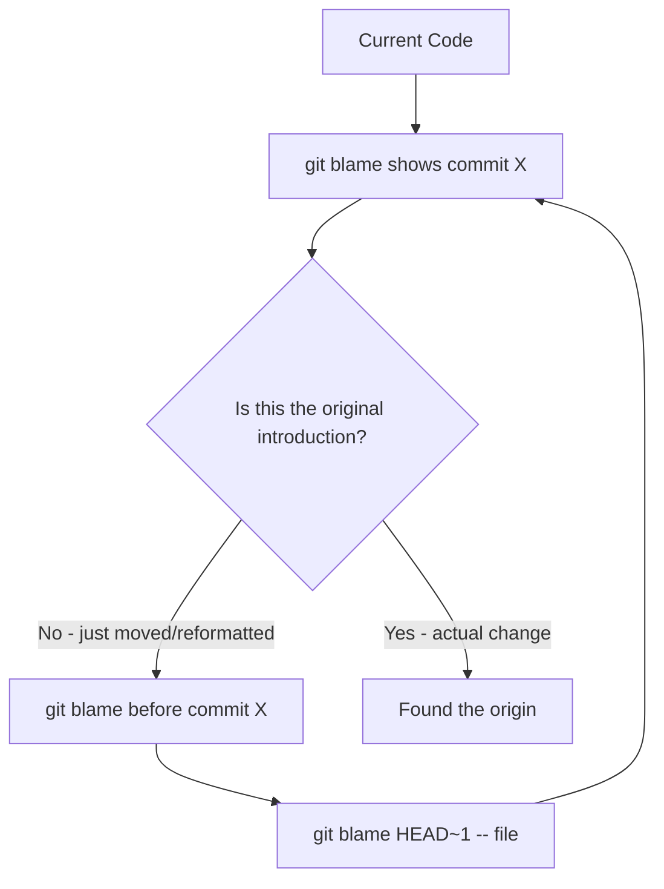

# How to Handle Git Blame Effectively

Author: [nawazdhandala](https://www.github.com/nawazdhandala)

Tags: Git, Git Blame, Code Review, Debugging, Version Control, DevOps

Description: Master git blame to trace code changes, understand context, and debug issues effectively while navigating through refactoring commits.

---

Git blame shows who last modified each line of a file and when. While the name sounds accusatory, it's actually one of the most useful tools for understanding code history. This guide covers practical techniques for using git blame effectively, including how to see through refactoring commits to find meaningful changes.

---

## Basic Git Blame Usage

The simplest form shows the last commit that modified each line:

```bash
# Basic blame output
git blame src/server.js

# Output format:
# abc12345 (John Doe 2024-06-15 10:30:00 +0000  1) const express = require('express');
# def67890 (Jane Smith 2024-07-20 14:45:00 +0000  2) const app = express();
# abc12345 (John Doe 2024-06-15 10:30:00 +0000  3)
# ghi11111 (Bob Wilson 2024-08-01 09:00:00 +0000  4) app.use(cors());
```

Each line shows: commit hash, author, timestamp, line number, and line content.

---

## Useful Blame Options

Customize the output for different use cases:

```bash
# Show only the commit hash (shorter output)
git blame -s src/server.js
# abc12345  1) const express = require('express');

# Show email instead of name
git blame -e src/server.js
# abc12345 (<john@company.com> 2024-06-15  1) const express...

# Blame specific line range (lines 10-20)
git blame -L 10,20 src/server.js

# Blame from a function name to end of function
git blame -L '/function handleRequest/,/^}/' src/server.js

# Show the commit message for each line
git blame -c src/server.js

# Suppress author name (useful for scripting)
git blame --porcelain src/server.js
```

---

## Ignoring Whitespace and Formatting Changes

Bulk formatting commits pollute blame history. Skip them:

```bash
# Ignore whitespace changes
git blame -w src/server.js

# Ignore moved or copied lines within the file
git blame -M src/server.js

# Ignore moved or copied lines from other files
git blame -C src/server.js

# Combine options for thorough history
# -w: ignore whitespace
# -M: detect moved lines in same file
# -C: detect copied lines from other files
git blame -w -M -C src/server.js

# Even more aggressive copy detection (slower but thorough)
git blame -w -C -C -C src/server.js
```

---

## The .git-blame-ignore-revs File

Git 2.23 introduced a way to permanently ignore formatting commits:

```bash
# Create a file listing commits to ignore
# .git-blame-ignore-revs

# Prettier formatting migration - 2024-03-15
abc123def456789012345678901234567890abcd

# ESLint autofix across codebase - 2024-05-20
def456789012345678901234567890abcdef12

# Renamed all files to kebab-case - 2024-06-01
789012345678901234567890abcdef1234567890
```

Configure Git to use this file:

```bash
# Configure locally
git config blame.ignoreRevsFile .git-blame-ignore-revs

# Or configure globally
git config --global blame.ignoreRevsFile .git-blame-ignore-revs

# Now git blame automatically ignores those commits
git blame src/server.js
# Shows the meaningful change, not the formatting commit

# Temporarily disable ignore file
git blame --ignore-revs-file="" src/server.js
```

Add this file to your repository so all team members benefit:

```bash
# Commit the ignore file
git add .git-blame-ignore-revs
git commit -m "Add git-blame-ignore-revs for formatting commits"
```

---

## Tracing Code Through History

Find when and why a line was introduced:



```bash
# If blame shows a refactoring commit, look further back
# First, note the commit hash from blame output
git blame src/server.js
# Shows: abc123 reformatted code

# Blame before that commit
git blame abc123^ -- src/server.js

# Or blame at a specific date
git blame --since="2024-01-01" src/server.js

# Keep going back until you find the meaningful change
git blame abc123^^ -- src/server.js
```

---

## Interactive Blame with Git Log

Sometimes you need more context than blame provides:

```bash
# Find all commits that touched a file
git log --oneline -- src/server.js

# Find commits that touched specific lines
git log -L 10,20:src/server.js

# Show the actual diff for line range changes
git log -p -L 10,20:src/server.js

# Find when a specific function was added or modified
git log -L '/function handleRequest/,/^}/':src/server.js

# Search for when a specific string was added
git log -S "TODO: fix this" -- src/server.js
```

---

## Using Blame for Debugging

Track down when a bug was introduced:

```bash
# Find who last touched the buggy code
git blame -L 145,150 src/auth.js

# Get the full commit message for context
git show abc123 --stat

# See what else changed in that commit
git show abc123

# Find related commits by the same author around that time
git log --author="John" --after="2024-06-01" --before="2024-06-30" --oneline
```

Create an alias for quick debugging:

```bash
# Add to ~/.gitconfig
[alias]
    # Show blame with commit messages
    praise = blame -c

    # Blame ignoring whitespace and moves
    smart-blame = blame -w -M -C

    # Quick blame for specific line
    who = "!f() { git blame -L $2,$2 $1; }; f"
    # Usage: git who src/server.js 42
```

---

## Blame in Pull Request Reviews

Use blame to understand context during code review:

```bash
# Before reviewing a change, understand the history
git blame origin/main -- path/to/changed/file.js

# Compare blame before and after the PR
git blame HEAD -- file.js > blame-new.txt
git blame HEAD~5 -- file.js > blame-old.txt
diff blame-old.txt blame-new.txt

# Find if the author has touched this code before
git log --author="PR Author" -- path/to/file.js
```

---

## Blame Output Formats

Different formats for different needs:

```bash
# Default format (human readable)
git blame file.js
# abc12345 (John Doe 2024-06-15 10:30:00 +0000 1) code here

# Porcelain format (machine readable)
git blame --porcelain file.js
# abc123def456789012345678901234567890abcd 1 1 3
# author John Doe
# author-mail <john@company.com>
# author-time 1718447400
# ...

# Line porcelain (one entry per line, easier to parse)
git blame --line-porcelain file.js

# Parse porcelain output for custom reports
git blame --line-porcelain file.js | grep "^author " | sort | uniq -c | sort -rn
#   45 author John Doe
#   32 author Jane Smith
#   18 author Bob Wilson
```

---

## Blame Statistics and Reports

Generate useful reports from blame data:

```bash
#!/bin/bash
# blame-stats.sh - Generate blame statistics for a file

FILE=$1

echo "Blame statistics for: $FILE"
echo "================================"

echo ""
echo "Lines per author:"
git blame --line-porcelain "$FILE" | \
    grep "^author " | \
    sed 's/author //' | \
    sort | uniq -c | sort -rn

echo ""
echo "Lines per time period:"
git blame "$FILE" | \
    awk '{print $4}' | \
    cut -d'-' -f1,2 | \
    sort | uniq -c | sort -rn

echo ""
echo "Oldest lines:"
git blame "$FILE" | \
    sort -k4 | head -5
```

```bash
# Make it executable and run
chmod +x blame-stats.sh
./blame-stats.sh src/server.js

# Output:
# Lines per author:
#   145 John Doe
#    89 Jane Smith
#    34 Bob Wilson
#
# Lines per time period:
#    89 2024-06
#    67 2024-07
#    45 2024-05
```

---

## Blame with GUI Tools

Command line alternatives that visualize blame:

```bash
# Git's built-in GUI blame
git gui blame src/server.js

# Tig - terminal UI for Git
tig blame src/server.js
# Use arrow keys to navigate, Enter to see commit details

# GitK for graphical history with blame
gitk -- src/server.js
```

Most IDEs have integrated blame views:

- VS Code: GitLens extension shows inline blame
- IntelliJ: Right-click > Git > Annotate
- Sublime: GitSavvy or Sublime Merge

---

## Advanced: Blame Across Renames

Track blame through file renames:

```bash
# Follow renames automatically
git blame -C -C -C src/newname.js

# Show the original filename for moved code
git blame -C -C --line-porcelain src/newname.js | grep "^filename"

# Find when a file was renamed
git log --follow --diff-filter=R --summary -- src/newname.js

# Blame a file at its old location
git blame HEAD~50 -- src/oldname.js
```

---

## Blame vs Log for Different Questions

Choose the right tool:

| Question | Tool |
|----------|------|
| Who last changed line 42? | `git blame -L 42,42 file` |
| When was this function added? | `git log -L '/function name/,/^}/':file` |
| What commits touched this file? | `git log --oneline -- file` |
| Why was this line changed? | `git blame` then `git show <commit>` |
| How has this code evolved? | `git log -p -- file` |

---

## Summary

Git blame is essential for understanding code history and debugging issues:

1. Use `-w -M -C` to see through whitespace and refactoring changes
2. Create a `.git-blame-ignore-revs` file for bulk formatting commits
3. Use `-L` to focus on specific line ranges or functions
4. Combine blame with `git log -L` for full change history
5. Use porcelain output for scripts and statistics
6. Follow renames with `-C -C -C` for thorough history

The goal of blame is not to find fault but to find context. Understanding who made a change and why helps you make better decisions about the code today.
