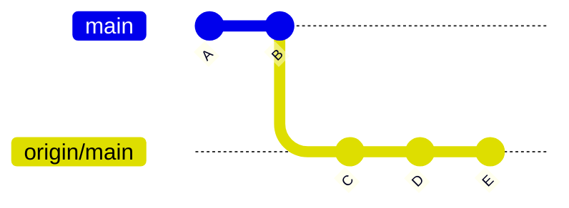
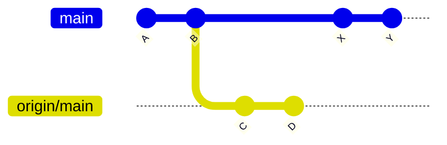
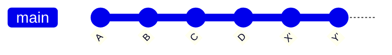

# How to Fix 'Your Branch Is Behind' Pull Errors

Author: [nawazdhandala](https://www.github.com/nawazdhandala)

Tags: Git, Version Control, Troubleshooting, Pull Errors, DevOps

Description: Learn how to diagnose and fix Git pull errors when your branch is behind the remote, including merge conflicts and diverged branches.

---

The "Your branch is behind" message is one of the most common Git situations developers encounter. While usually straightforward to resolve, it can become complicated when combined with local changes, merge conflicts, or diverged histories. This guide covers all scenarios and their solutions.

## Understanding the Error

When Git says your branch is behind, it means the remote branch has commits that your local branch does not have.

```bash
# Typical message after git fetch or git status
Your branch is behind 'origin/main' by 3 commits, and can be fast-forwarded.
  (use "git pull" to update your local branch)
```



In this diagram, your local branch is at commit B, while the remote has moved to E.

## Scenario 1: Simple Fast-Forward (No Local Changes)

The easiest case - you have no local changes and just need to catch up.

```bash
# Check your status first
git status
# On branch main
# Your branch is behind 'origin/main' by 3 commits, and can be fast-forwarded.

# Simply pull to fast-forward
git pull

# Or be explicit about the merge strategy
git pull --ff-only
```

The `--ff-only` flag ensures Git only does a fast-forward. If the branches have diverged, it will fail instead of creating a merge commit, giving you a chance to decide how to proceed.

## Scenario 2: Behind with Uncommitted Local Changes

You have uncommitted work but need to pull remote changes.

```bash
# Check status
git status
# On branch main
# Your branch is behind 'origin/main' by 3 commits.
# Changes not staged for commit:
#   modified: src/app.js

# Option 1: Stash, pull, then apply
git stash
git pull
git stash pop

# Option 2: Commit your changes first
git add .
git commit -m "WIP: work in progress"
git pull
# This may create a merge commit

# Option 3: Use pull with rebase and autostash
git pull --rebase --autostash
# Git automatically stashes, pulls, rebases, and pops
```

The `--autostash` option is particularly useful as it handles the stash/pop cycle automatically.

## Scenario 3: Diverged Branches

Your local branch has commits that the remote does not have, and vice versa.

```bash
# Status shows divergence
git status
# On branch main
# Your branch and 'origin/main' have diverged,
# and have 2 and 3 different commits each, respectively.
```



### Option A: Merge (Creates a Merge Commit)

```bash
# Standard pull creates a merge commit
git pull

# Or explicitly
git fetch
git merge origin/main
```

Result: Creates a merge commit combining both histories.

### Option B: Rebase (Linear History)

```bash
# Rebase your commits on top of remote
git pull --rebase

# Or step by step
git fetch
git rebase origin/main
```

Result: Your local commits are replayed on top of the remote commits, creating a linear history.



### When to Use Which?

| Situation | Recommended Approach |
|-----------|---------------------|
| Feature branch, not shared | Rebase |
| Shared branch with others | Merge |
| Main/master branch | Usually merge |
| Clean linear history needed | Rebase |
| Preserving exact commit history | Merge |

## Scenario 4: Pull Fails Due to Conflicts

When the same files were changed locally and remotely.

```bash
# Attempt to pull
git pull
# Auto-merging src/config.js
# CONFLICT (content): Merge conflict in src/config.js
# Automatic merge failed; fix conflicts and then commit the result.

# Or with rebase
git pull --rebase
# Auto-merging src/config.js
# CONFLICT (content): Merge conflict in src/config.js
# error: could not apply abc1234... Your commit message
```

### Resolving Merge Conflicts

```bash
# See which files have conflicts
git status

# Open conflicted files and resolve
# Look for conflict markers:
# <<<<<<< HEAD
# your changes
# =======
# their changes
# >>>>>>> origin/main

# After resolving, mark as resolved
git add src/config.js

# Complete the merge
git commit

# Or if rebasing
git rebase --continue
```

### Using a Merge Tool

```bash
# Configure your preferred merge tool
git config --global merge.tool vimdiff

# Or use VS Code
git config --global merge.tool vscode
git config --global mergetool.vscode.cmd 'code --wait $MERGED'

# Launch the merge tool
git mergetool
```

## Scenario 5: Forcing Local State to Match Remote

Sometimes you want to discard all local changes and match the remote exactly.

```bash
# WARNING: This discards all local commits and changes!

# Fetch the latest
git fetch origin

# Hard reset to remote
git reset --hard origin/main

# Clean untracked files if needed
git clean -fd
```

Use this only when you are certain you want to lose local work, such as when experimenting or when local changes are no longer needed.

## Prevention and Best Practices

### 1. Pull Before Starting Work

```bash
# Always start your day with
git fetch --all
git status

# Pull if behind
git pull
```

### 2. Configure Pull Behavior

```bash
# Set default pull behavior to rebase
git config --global pull.rebase true

# Or set it to only allow fast-forward
git config --global pull.ff only

# Enable autostash for pull --rebase
git config --global rebase.autoStash true
```

### 3. Use Tracking Branches Correctly

```bash
# Check tracking configuration
git branch -vv
# * main abc1234 [origin/main: behind 3] Latest commit message

# Set up tracking if missing
git branch --set-upstream-to=origin/main main
```

### 4. Integrate CI/CD Checks

```yaml
# .github/workflows/branch-check.yml
name: Branch Status Check
on: [pull_request]
jobs:
  check-branch:
    runs-on: ubuntu-latest
    steps:
      - uses: actions/checkout@v4
        with:
          fetch-depth: 0
      - name: Check if branch is up to date
        run: |
          git fetch origin main
          if ! git merge-base --is-ancestor origin/main HEAD; then
            echo "Branch is not up to date with main"
            exit 1
          fi
```

## Advanced Troubleshooting

### Check Actual Commit Difference

```bash
# See commits you're behind
git log HEAD..origin/main --oneline

# See commits you're ahead
git log origin/main..HEAD --oneline

# See both (diverged commits)
git log --left-right --oneline HEAD...origin/main
```

### Visualize the Divergence

```bash
# Graphical view of divergence
git log --graph --oneline --all

# Just the relevant branches
git log --graph --oneline main origin/main
```

### Handling Submodules

```bash
# If submodules are also behind
git pull --recurse-submodules

# Or update submodules separately
git submodule update --init --recursive
```

## Quick Reference

```bash
# Simple behind, no local changes
git pull

# Behind with uncommitted changes
git pull --rebase --autostash

# Diverged, want linear history
git pull --rebase

# Diverged, want merge commit
git pull

# Completely reset to remote (destructive!)
git fetch && git reset --hard origin/main

# Check how far behind/ahead
git rev-list --left-right --count HEAD...origin/main
# Output: 2    3  (2 ahead, 3 behind)
```

---

The "branch is behind" message is Git's way of telling you that collaboration is happening. Understanding the different scenarios and their solutions will help you navigate team development smoothly. When in doubt, use `git fetch` and `git status` to understand the situation before taking action. This gives you time to decide whether to merge, rebase, or take a different approach based on your specific situation.
