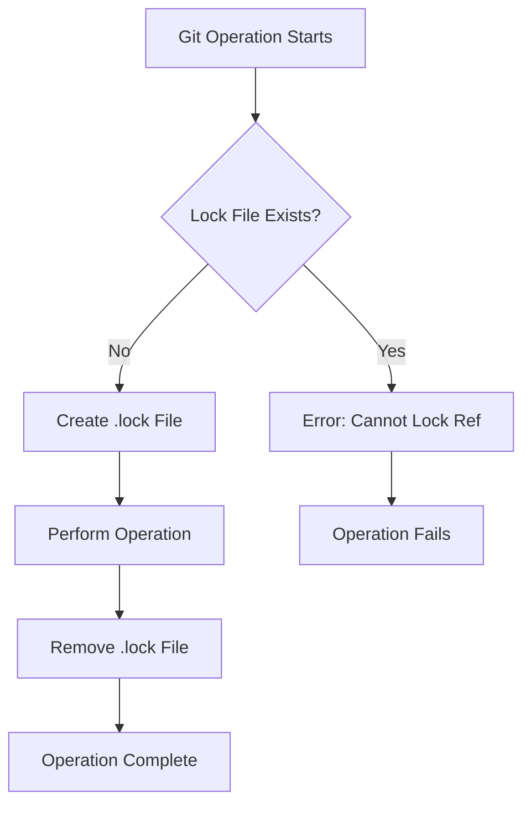
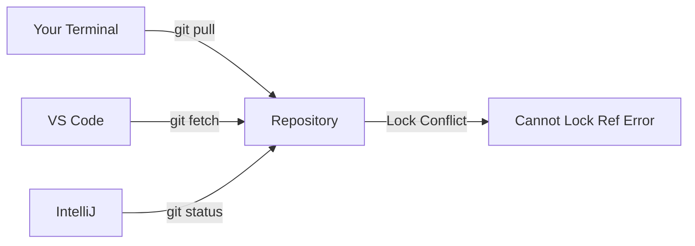

# How to Fix "Cannot Lock Ref" Errors in Git

Author: [nawazdhandala](https://www.github.com/nawazdhandala)

Tags: Git, Version Control, Troubleshooting, DevOps, Error Handling

Description: Learn how to diagnose and resolve git "cannot lock ref" errors caused by stale lock files, concurrent operations, and filesystem issues.

---

You run `git pull` and suddenly get an error: "cannot lock ref 'refs/heads/main': Unable to create lock file". This cryptic message stops your workflow cold. The good news is that this error usually has a straightforward fix once you understand what causes it.

## Understanding the Lock Mechanism

Git uses lock files to prevent concurrent operations from corrupting your repository. When git modifies a reference (like a branch or tag), it creates a temporary `.lock` file. If that lock file already exists from a previous operation that did not clean up properly, git refuses to proceed.



The lock file acts as a mutex. When git operations are interrupted by crashes, network failures, or forced terminations, these lock files can remain behind.

---

## Common Error Messages

Here are the variations of this error you might encounter.

```bash
# Branch reference lock error
error: cannot lock ref 'refs/heads/main': Unable to create '/path/to/repo/.git/refs/heads/main.lock': File exists.

# Remote tracking branch lock error
error: cannot lock ref 'refs/remotes/origin/main': Unable to create '/path/to/repo/.git/refs/remotes/origin/main.lock': File exists.

# Packed refs lock error
fatal: Unable to create '/path/to/repo/.git/packed-refs.lock': File exists.

# HEAD lock error
fatal: Unable to create '/path/to/repo/.git/HEAD.lock': File exists.
```

Each variation points to a specific lock file that needs attention.

---

## Quick Fix: Remove the Lock File

The most direct solution is to remove the stale lock file manually.

```bash
# Find the lock file mentioned in the error
# Example error mentions: .git/refs/heads/main.lock

# Remove the specific lock file
rm -f .git/refs/heads/main.lock

# For remote tracking branches
rm -f .git/refs/remotes/origin/main.lock

# For packed-refs
rm -f .git/packed-refs.lock

# For HEAD
rm -f .git/HEAD.lock
```

Before removing a lock file, make sure no other git process is actually running. Removing an active lock can cause repository corruption.

```bash
# Check for running git processes on Linux/macOS
ps aux | grep git

# On Windows
tasklist | findstr git
```

If no git processes are running, it is safe to remove the lock file.

---

## Comprehensive Lock File Cleanup

If you are unsure which lock file is causing the problem, or you have multiple stale locks, clean them all at once.

```bash
# Find all lock files in the repository
find .git -name "*.lock" -type f

# Output might show:
# .git/refs/heads/feature.lock
# .git/refs/remotes/origin/main.lock
# .git/packed-refs.lock

# Remove all lock files (use only when no git processes are running)
find .git -name "*.lock" -type f -delete

# Verify they are gone
find .git -name "*.lock" -type f
# (should show no output)
```

This approach is safe when you are certain no git operations are in progress.

---

## Root Causes and Specific Solutions

### Interrupted Git Operations

The most common cause is a git operation that was interrupted.

```bash
# Scenario: git pull was interrupted by Ctrl+C or a crash
git pull
# ^C (user presses Ctrl+C)
# Lock file left behind

# Later attempt fails
git pull
# error: cannot lock ref 'refs/remotes/origin/main'

# Solution: remove the lock and retry
rm -f .git/refs/remotes/origin/main.lock
git pull
```

### Concurrent Git Operations

Running multiple git commands simultaneously can cause lock conflicts.

```bash
# Terminal 1
git fetch --all &

# Terminal 2 (immediately after)
git pull
# error: cannot lock ref

# Solution: wait for the first operation to complete
# or check running processes
ps aux | grep git
```

Avoid running git commands in parallel, especially operations that modify the same references.

### Network-Mounted Repositories

Repositories on NFS or other network filesystems have additional locking challenges.

```bash
# NFS lock file issues
error: cannot lock ref 'refs/heads/main': Unable to create lock file

# Check for NFS stale file handles
ls -la .git/refs/heads/

# Force remove stale NFS locks
rm -f .git/refs/heads/main.lock

# If problems persist, clone fresh
cd ..
mv problematic-repo problematic-repo.bak
git clone <remote-url>
```

Network filesystems sometimes have caching issues that make lock files appear to exist when they do not. A fresh clone often resolves persistent NFS-related lock problems.

### IDE and Editor Git Integration

IDEs like VS Code, IntelliJ, and others often run git commands in the background.



```bash
# Problem: IDE running git operations conflicts with terminal commands
# VS Code is fetching in the background while you try to pull

# Solutions:
# 1. Disable auto-fetch in your IDE
# 2. Wait a moment and retry
# 3. Close IDE before running critical git operations
```

To disable VS Code auto-fetch, add this to your settings:

```json
{
  "git.autofetch": false,
  "git.autoRefresh": false
}
```

### Ref Directory vs File Conflicts

Git stores refs either as individual files or packed in a single file. Conflicts can occur when both exist.

```bash
# Error indicating ref/directory conflict
error: cannot lock ref 'refs/heads/feature/login': 'refs/heads/feature' exists

# This happens when you have both:
# - A branch named 'feature'
# - A branch named 'feature/login'

# Git cannot have both because one is a directory, one is a file

# Check what exists
ls -la .git/refs/heads/feature

# Solution: rename or delete the conflicting branch
git branch -d feature
# or
git branch -m feature feature-old
```

This is a naming conflict rather than a true lock issue. Choose branch naming conventions that avoid parent-child conflicts.

---

## Using Git GC and Prune

Sometimes garbage collection resolves lock issues by cleaning up stale references.

```bash
# Run garbage collection
git gc

# If gc itself fails due to locks, remove locks first
find .git -name "*.lock" -type f -delete
git gc

# More aggressive cleanup
git gc --prune=now --aggressive

# Remove unreachable objects
git prune
```

Garbage collection repacks loose objects and can resolve inconsistencies that lead to lock problems.

---

## Verifying Repository Integrity

After fixing lock issues, verify your repository is in a good state.

```bash
# Check repository integrity
git fsck --full

# Output shows any problems:
# Checking object directories: 100%
# Checking objects: 100%
# dangling commit abc123...
# dangling blob def456...

# Dangling objects are normal - they are unreferenced commits
# Errors like "broken link" or "missing object" indicate corruption

# If corruption is found, consider re-cloning
cd ..
git clone <remote-url> fresh-repo
```

The `git fsck` command checks object connectivity and validity. Running it after lock file cleanup ensures your repository is not corrupted.

---

## Prevention Strategies

### Wait for Operations to Complete

Always let git operations finish before starting new ones.

```bash
# Bad: running commands without waiting
git fetch & git pull  # Can cause lock conflicts

# Good: wait for each operation
git fetch && git pull  # Sequential execution
```

### Use Proper Interruption

If you must interrupt a git operation, try to do it gracefully.

```bash
# Sending SIGTERM (Ctrl+C) usually allows cleanup
# Git catches this and removes lock files

# Avoid SIGKILL (kill -9) when possible
# This does not allow cleanup and leaves lock files
```

### Disable IDE Auto-Operations

When doing complex git operations, disable IDE automation.

```bash
# Before complex operations
# 1. Close your IDE, or
# 2. Disable git integration temporarily

# Example: rebasing with potential conflicts
# Close VS Code first to avoid interference
git rebase -i HEAD~5
```

### Use Git Worktrees for Parallel Work

Instead of running parallel operations on the same repository, use worktrees.

```bash
# Create a worktree for parallel development
git worktree add ../repo-feature-branch feature-branch

# Now you have two directories, each with its own working copy
# No lock conflicts between them
ls ../
# repo/
# repo-feature-branch/

# Remove worktree when done
git worktree remove ../repo-feature-branch
```

Worktrees let you work on multiple branches simultaneously without lock conflicts.

---

## Scripted Recovery

For automated environments, create a script to handle lock issues.

```bash
#!/bin/bash
# git-unlock.sh - Remove stale git lock files

REPO_PATH="${1:-.}"

# Check for running git processes
if pgrep -x "git" > /dev/null; then
    echo "Warning: git process is running. Aborting."
    exit 1
fi

# Find and remove lock files
LOCKS=$(find "$REPO_PATH/.git" -name "*.lock" -type f 2>/dev/null)

if [ -z "$LOCKS" ]; then
    echo "No lock files found."
    exit 0
fi

echo "Found lock files:"
echo "$LOCKS"
echo ""
read -p "Remove all lock files? (y/N) " -n 1 -r
echo ""

if [[ $REPLY =~ ^[Yy]$ ]]; then
    find "$REPO_PATH/.git" -name "*.lock" -type f -delete
    echo "Lock files removed."

    # Verify repository
    cd "$REPO_PATH"
    git fsck --quiet && echo "Repository integrity verified."
fi
```

This script checks for running processes before removing locks, which prevents accidental corruption.

---

## Quick Reference

```bash
# Find lock files
find .git -name "*.lock" -type f

# Remove specific lock file
rm -f .git/refs/heads/branch-name.lock

# Remove all lock files
find .git -name "*.lock" -type f -delete

# Check for git processes
ps aux | grep git

# Verify repository
git fsck --full

# Run garbage collection
git gc --prune=now
```

---

## Summary

The "cannot lock ref" error occurs when stale lock files remain from interrupted or concurrent git operations. The fix is usually simple: verify no git processes are running, then remove the lock file mentioned in the error. For persistent issues, check for IDE interference, NFS problems, or branch naming conflicts. Always verify repository integrity after removing locks with `git fsck`. Prevention is better than cure, so avoid parallel git operations and let commands complete before starting new ones.
