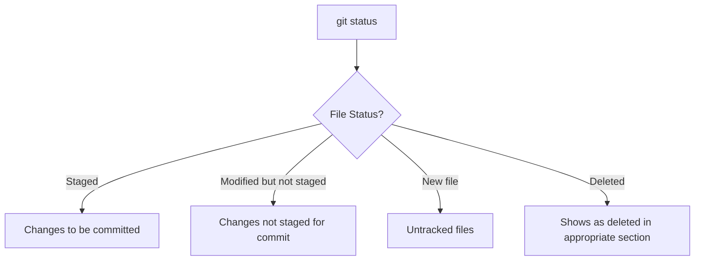
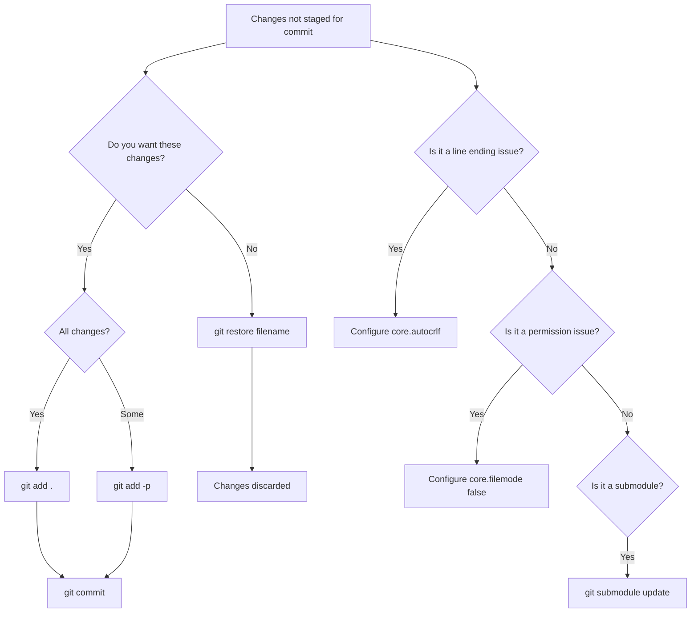

# How to Fix "Changes Not Staged for Commit" Issues

Author: [nawazdhandala](https://www.github.com/nawazdhandala)

Tags: Git, Version Control, Troubleshooting, DevOps, Git Staging

Description: Learn how to understand and resolve the "Changes not staged for commit" message in Git, including common causes and best practices for managing your staging area.

---

The "Changes not staged for commit" message is one of the most common Git notifications developers encounter. While not technically an error, understanding this message is essential for effective version control. This guide explains what it means and how to work with it properly.

## Understanding Git's Three States

Before diving into solutions, you need to understand how Git tracks files through three distinct areas.


### The Three Areas

1. **Working Directory**: Where you edit files on your filesystem
2. **Staging Area (Index)**: A preparation zone for your next commit
3. **Repository**: The committed history stored in `.git`

When Git says "Changes not staged for commit", it means you have modified files in your working directory that have not been added to the staging area.

## Diagnosing the Issue

### Check Your Status

```bash
# See the full status
git status

# Output example:
# On branch main
# Changes not staged for commit:
#   (use "git add <file>..." to update what will be committed)
#   (use "git restore <file>..." to discard changes in working directory)
#
#         modified:   src/app.js
#         modified:   config/settings.json
#
# Untracked files:
#   (use "git add <file>..." to include in what will be committed)
#
#         src/newfile.js
```

### Understanding the Output



## Common Scenarios and Solutions

### Scenario 1: You Want to Commit the Changes

The most common case is when you want to include these changes in your next commit.

```bash
# Stage a specific file
git add src/app.js

# Stage multiple files
git add src/app.js config/settings.json

# Stage all modified files (not untracked)
git add -u

# Stage everything including untracked files
git add .

# Stage all files matching a pattern
git add "*.js"
```

After staging, verify with `git status`:

```bash
git status
# Changes to be committed:
#   (use "git restore --staged <file>..." to unstage)
#
#         modified:   src/app.js
```

### Scenario 2: You Want to Discard the Changes

If the changes were accidental or you want to revert to the last committed version:

```bash
# Discard changes in a specific file
git restore src/app.js

# Discard changes in multiple files
git restore src/app.js config/settings.json

# Discard all unstaged changes (be careful!)
git restore .

# Old syntax (still works)
git checkout -- src/app.js
```

**Warning**: Discarding changes is permanent. Git cannot recover uncommitted work that has been discarded.

### Scenario 3: You Want to Stash the Changes

If you need to switch branches but want to keep your changes for later:

```bash
# Stash all changes including staged
git stash

# Stash with a descriptive message
git stash push -m "Work in progress on feature X"

# Stash only specific files
git stash push -m "Partial work" src/app.js

# Later, restore the stashed changes
git stash pop

# Or apply without removing from stash
git stash apply
```

### Scenario 4: Line Ending Issues (Windows/Unix)

A common cause of unexpected "not staged" files is line ending differences.

```bash
# Check current autocrlf setting
git config core.autocrlf

# For Windows (converts LF to CRLF on checkout)
git config --global core.autocrlf true

# For Linux/Mac (converts CRLF to LF on commit)
git config --global core.autocrlf input

# To fix files already in the repo
git rm --cached -r .
git reset --hard
```

Create a `.gitattributes` file for consistent handling:

```
# Set default behavior
* text=auto

# Explicitly declare text files
*.js text
*.css text
*.html text

# Declare binary files
*.png binary
*.jpg binary
```

### Scenario 5: File Permission Changes

On Unix systems, Git tracks file permissions. Mode changes show as modifications.

```bash
# Check if it is a permission change
git diff src/app.js
# diff --git a/src/app.js b/src/app.js
# old mode 100644
# new mode 100755

# Ignore file mode changes globally
git config --global core.filemode false

# Or per repository
git config core.filemode false

# Revert the permission change
git checkout src/app.js
```

### Scenario 6: Submodule Changes

Submodules can show as modified even when you did not touch them directly.

```bash
# Check submodule status
git submodule status

# Update submodules to expected commits
git submodule update --init --recursive

# If you intentionally updated a submodule
git add path/to/submodule
git commit -m "Update submodule to latest version"
```

## Interactive Staging

For fine-grained control over what gets staged, use interactive mode:

```bash
# Interactive add
git add -i

# Patch mode - stage parts of files
git add -p src/app.js
```

In patch mode, you will see each change hunk and can choose:

```
Stage this hunk [y,n,q,a,d,s,e,?]?
```

- `y` - stage this hunk
- `n` - skip this hunk
- `s` - split into smaller hunks
- `e` - manually edit the hunk
- `q` - quit, do not stage remaining hunks

## Best Practices

### 1. Review Before Staging

Always review changes before staging:

```bash
# See unstaged changes
git diff

# See what would be staged
git diff --cached

# See both staged and unstaged
git diff HEAD
```

### 2. Use Meaningful Commits

Stage related changes together for atomic commits:

```bash
# Stage related files for one commit
git add src/feature.js tests/feature.test.js
git commit -m "Add user authentication feature"

# Stage other changes separately
git add docs/authentication.md
git commit -m "Document authentication feature"
```

### 3. Set Up Git Aliases

Create shortcuts for common operations:

```bash
# Add useful aliases
git config --global alias.st "status -sb"
git config --global alias.unstage "restore --staged"
git config --global alias.discard "restore"

# Usage
git st          # Short status
git unstage .   # Unstage all files
git discard .   # Discard all changes
```

### 4. Use a .gitignore File

Prevent unwanted files from showing up:

```bash
# Common .gitignore entries
node_modules/
*.log
.env
.DS_Store
*.pyc
__pycache__/
dist/
build/
```

## Troubleshooting Workflow



## Quick Reference

| Command | Purpose |
|---------|---------|
| `git add <file>` | Stage specific file |
| `git add .` | Stage all changes |
| `git add -u` | Stage modified/deleted (not new) |
| `git add -p` | Interactive partial staging |
| `git restore <file>` | Discard changes |
| `git restore --staged <file>` | Unstage file |
| `git stash` | Temporarily save changes |
| `git diff` | View unstaged changes |

## Prevention Tips

1. **Commit frequently** - Smaller, focused commits are easier to manage
2. **Use branches** - Keep experimental work isolated
3. **Review before committing** - Run `git diff` before `git add`
4. **Configure line endings** - Set up `.gitattributes` early in your project
5. **Use `.gitignore`** - Keep generated files out of version control

---

The "Changes not staged for commit" message is Git telling you that it sees modifications but will not include them in your next commit until you explicitly stage them. This two-step process (modify, then stage, then commit) gives you fine-grained control over your commit history. Understanding this flow is fundamental to mastering Git.
