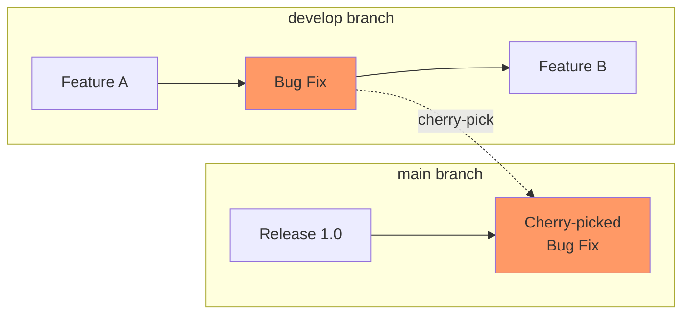
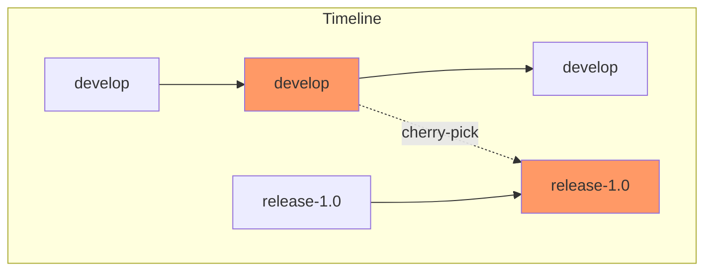
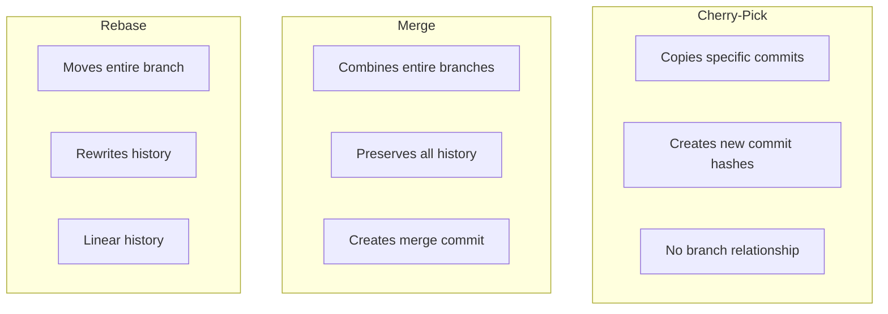

# How to Handle Git Cherry-Pick

Author: [nawazdhandala](https://www.github.com/nawazdhandala)

Tags: Git, Version Control, Cherry-Pick, DevOps, Workflow

Description: Learn how to use git cherry-pick to selectively apply commits from one branch to another, handle conflicts, and understand when cherry-picking is the right approach.

---

A critical bug fix was committed to the development branch, but production needs it now. You cannot merge the entire branch because it contains unfinished features. Git cherry-pick lets you select specific commits and apply them to any branch, giving you surgical precision over what changes go where.

## What Is Cherry-Pick?

Cherry-pick takes one or more commits from anywhere in your repository and applies them to your current branch. Unlike merge, which brings entire branch histories together, cherry-pick copies individual commits.



The bug fix commit is copied to main without bringing Feature A or Feature B along.

---

## Basic Cherry-Pick Usage

### Cherry-Picking a Single Commit

Find the commit hash and apply it to your current branch.

```bash
# View commits on another branch
git log develop --oneline
# abc1234 Add feature B
# def5678 Fix critical login bug   <-- this one
# ghi9012 Add feature A

# Switch to the target branch
git checkout main

# Cherry-pick the specific commit
git cherry-pick def5678

# Output:
# [main xyz7890] Fix critical login bug
#  Date: Mon Jan 24 10:30:00 2026 +0000
#  1 file changed, 5 insertions(+), 2 deletions(-)
```

The commit is applied to main with a new commit hash but the same message and changes.

### Cherry-Picking Multiple Commits

Apply several commits at once by listing their hashes.

```bash
# Cherry-pick multiple specific commits
git cherry-pick abc1234 def5678 ghi9012

# Cherry-pick a range of commits (exclusive of first commit)
git cherry-pick abc1234..ghi9012

# Cherry-pick a range including the first commit
git cherry-pick abc1234^..ghi9012
```

When using ranges, commits are applied in chronological order (oldest first).

---

## Handling Cherry-Pick Conflicts

Conflicts occur when the commit you are cherry-picking touches code that has changed differently on your current branch.

```bash
git cherry-pick def5678
# error: could not apply def5678... Fix critical login bug
# hint: after resolving the conflicts, mark the corrected paths
# hint: with 'git add <paths>' or 'git rm <paths>'
# hint: and commit the result with 'git commit'
```

Resolve conflicts the same way you would for a merge.

```bash
# Check which files have conflicts
git status
# Unmerged paths:
#   both modified:   src/auth.js

# Open the file and resolve conflicts
vim src/auth.js

# The conflict markers show both versions
<<<<<<< HEAD
function login(user, pass) {
    return authenticate(user, pass);
=======
function login(user, password) {
    return authenticateUser(user, password);
>>>>>>> def5678 (Fix critical login bug)
}

# After resolving, stage the file
git add src/auth.js

# Continue the cherry-pick
git cherry-pick --continue
```

### Aborting a Cherry-Pick

If conflicts are too complex or you picked the wrong commit, abort.

```bash
# Cancel the in-progress cherry-pick
git cherry-pick --abort

# Working directory returns to state before cherry-pick
```

### Skipping a Commit in a Sequence

When cherry-picking multiple commits and one causes problems.

```bash
# Cherry-picking a range
git cherry-pick abc1234^..ghi9012

# First commit applies fine
# Second commit has conflicts you cannot resolve

# Skip the problematic commit and continue with the rest
git cherry-pick --skip
```

---

## Cherry-Pick Options

### Keep Original Author

By default, cherry-pick preserves the original author. The committer (you) is recorded separately.

```bash
# View the cherry-picked commit
git log -1
# Author: original-author <original@email.com>
# Commit: you <you@email.com>
```

### Change Author to Yourself

To reset authorship to yourself.

```bash
git cherry-pick --reset-author def5678
```

### Edit Commit Message

Modify the commit message during cherry-pick.

```bash
# Open editor to modify message
git cherry-pick -e def5678

# Or provide a new message directly
git cherry-pick def5678
git commit --amend -m "Backport: Fix critical login bug"
```

### No Commit (Stage Only)

Apply changes without committing, useful for combining multiple cherry-picks into one commit.

```bash
# Apply changes but do not commit
git cherry-pick -n def5678
git cherry-pick -n abc1234

# Now stage has changes from both commits
git status
# Changes to be staged:
#   modified: file1.js
#   modified: file2.js

# Commit all changes together
git commit -m "Backport security fixes from develop"
```

### Append Cherry-Pick Source

Add a reference to the original commit in the message.

```bash
git cherry-pick -x def5678

# Commit message includes:
# Fix critical login bug
#
# (cherry picked from commit def5678...)
```

This helps track where backported commits came from.

---

## Cherry-Pick Strategies

### Backporting Fixes to Release Branches

Apply bug fixes from development to stable release branches.



```bash
# On develop, a bug fix was made
git log develop --oneline --grep="fix"
# def5678 Fix null pointer in user service

# Apply to release branch
git checkout release-1.0
git cherry-pick -x def5678

# Push the backport
git push origin release-1.0
```

### Forward-Porting Features

Sometimes you need to bring a commit from an older branch to a newer one.

```bash
# Feature was committed to release-1.0 but also needed in develop
git checkout develop
git cherry-pick abc1234

# develop now has the feature
```

### Creating a Hotfix Branch

Apply urgent fixes to production while keeping development separate.

```bash
# Create hotfix branch from production
git checkout -b hotfix/login-fix production

# Cherry-pick the fix from develop
git cherry-pick def5678

# Test, then merge to production
git checkout production
git merge hotfix/login-fix

# Also apply to develop if not already there
git checkout develop
git merge hotfix/login-fix
```

---

## When to Use Cherry-Pick

### Good Use Cases

**Backporting fixes**: Security patches or critical bugs need to go to stable releases.

```bash
# Security fix on main needs to go to v1.x and v2.x
git checkout release/v1.x
git cherry-pick security-fix-commit

git checkout release/v2.x
git cherry-pick security-fix-commit
```

**Recovering lost commits**: A commit was accidentally removed and needs restoration.

```bash
# Find the lost commit in reflog
git reflog
# abc1234 HEAD@{5}: commit: Important feature

# Cherry-pick it back
git cherry-pick abc1234
```

**Partial branch integration**: You need some commits from a feature branch but not all.

```bash
# Feature branch has 10 commits, you only need 3 specific ones
git cherry-pick commit1 commit2 commit3
```

### When to Avoid Cherry-Pick

**Regular feature integration**: Use merge or rebase instead to maintain proper history.

```bash
# Instead of cherry-picking all commits from feature branch
# Just merge the branch
git merge feature-branch
```

**Frequently moving the same commits**: If you are constantly cherry-picking between branches, consider restructuring your workflow.

---

## Cherry-Pick vs Merge vs Rebase



| Aspect | Cherry-Pick | Merge | Rebase |
|--------|-------------|-------|--------|
| Scope | Specific commits | Entire branch | Entire branch |
| History | Duplicates commits | Preserves all | Rewrites |
| Use case | Backporting | Integration | Clean history |

---

## Troubleshooting

### Empty Cherry-Pick

When the commit is already present or has no effect.

```bash
git cherry-pick def5678
# The previous cherry-pick is now empty, possibly due to conflict resolution.
# If you wish to commit it anyway, use:
#     git commit --allow-empty
# Otherwise, please use 'git cherry-pick --skip'

# Usually just skip it
git cherry-pick --skip
```

### Cherry-Pick Introduces Bugs

If the cherry-picked commit depends on other commits that were not included.

```bash
# Commit B depends on changes from Commit A
# Cherry-picking only B will cause issues

# Solution: cherry-pick both
git cherry-pick commitA commitB

# Or investigate dependencies first
git log --oneline --ancestry-path commitA..commitB
```

### Finding the Original Commit

When a cherry-picked commit needs to be traced back.

```bash
# If cherry-picked with -x, check the message
git log -1 --format="%B" abc1234
# (cherry picked from commit def5678...)

# Search for similar commits by message
git log --all --oneline --grep="Fix critical login bug"
```

---

## Quick Reference

```bash
# Basic cherry-pick
git cherry-pick <commit>                    # Apply single commit
git cherry-pick <commit1> <commit2>         # Apply multiple commits
git cherry-pick <start>..<end>              # Apply range (exclusive)
git cherry-pick <start>^..<end>             # Apply range (inclusive)

# Options
git cherry-pick -n <commit>                 # Stage only, no commit
git cherry-pick -e <commit>                 # Edit commit message
git cherry-pick -x <commit>                 # Add source reference
git cherry-pick --reset-author <commit>     # Use your authorship

# Conflict handling
git cherry-pick --continue                  # After resolving conflicts
git cherry-pick --abort                     # Cancel cherry-pick
git cherry-pick --skip                      # Skip current commit

# Find commits to cherry-pick
git log --oneline other-branch              # List commits
git log --oneline --grep="bug"              # Search by message
git log --oneline --author="name"           # Search by author
```

---

## Summary

Git cherry-pick gives you precise control over which commits to apply to your current branch. Use it for backporting fixes, recovering lost commits, or selectively integrating changes. Handle conflicts the same way you would during a merge, using `--continue`, `--abort`, or `--skip` as needed. Add `-x` to track where cherry-picked commits originated. While powerful, cherry-pick should not replace proper branch management. For regular feature integration, merge or rebase are usually better choices. Cherry-pick shines when you need surgical precision over what changes land where.
