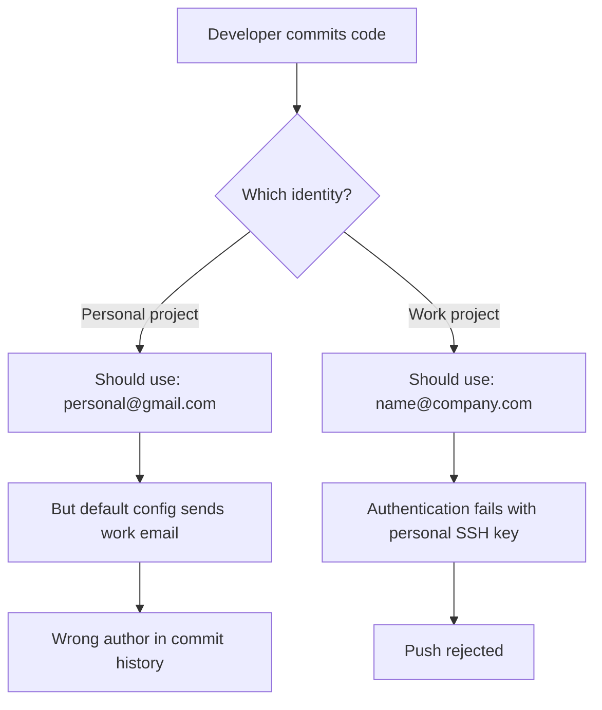

# How to Configure Git Config for Multiple Accounts

Author: [nawazdhandala](https://www.github.com/nawazdhandala)

Tags: Git, Configuration, SSH, Multiple Accounts, DevOps, Version Control

Description: Learn how to configure Git to work seamlessly with multiple accounts using SSH keys, conditional includes, and repository-specific settings.

---

Managing multiple Git accounts is a common challenge for developers who work with both personal projects and company repositories. You might have a GitHub account for open source contributions and a GitLab account for work. Without proper configuration, commits end up with the wrong email address, and authentication becomes a mess.

This guide walks through the complete setup for managing multiple Git identities cleanly and efficiently.

---

## Understanding Git Configuration Levels

Git configuration exists at three levels, each with different scope and priority:

```bash
# System level - applies to all users on the machine
# Located at /etc/gitconfig
git config --system user.name "Default Name"

# Global level - applies to the current user
# Located at ~/.gitconfig or ~/.config/git/config
git config --global user.name "Your Name"

# Local level - applies only to the current repository
# Located at .git/config in the repository
git config --local user.name "Work Name"
```

Local settings override global, and global overrides system. This hierarchy forms the foundation for managing multiple accounts.

---

## The Multiple Account Problem

Here's what typically goes wrong without proper setup:



The solution involves three parts: organizing SSH keys, setting up conditional Git configuration, and configuring SSH host aliases.

---

## Setting Up Multiple SSH Keys

First, generate separate SSH keys for each account:

```bash
# Generate SSH key for personal GitHub account
# The -C flag adds a comment to identify the key
ssh-keygen -t ed25519 -C "personal@gmail.com" -f ~/.ssh/id_ed25519_personal

# Generate SSH key for work GitLab account
ssh-keygen -t ed25519 -C "name@company.com" -f ~/.ssh/id_ed25519_work

# List your SSH keys to verify
ls -la ~/.ssh/
# Output should show:
# id_ed25519_personal
# id_ed25519_personal.pub
# id_ed25519_work
# id_ed25519_work.pub
```

Add each public key to the corresponding Git hosting service:

```bash
# Copy personal key to clipboard (macOS)
pbcopy < ~/.ssh/id_ed25519_personal.pub

# Copy personal key to clipboard (Linux with xclip)
xclip -selection clipboard < ~/.ssh/id_ed25519_personal.pub

# Then paste in GitHub Settings > SSH Keys > New SSH Key
```

---

## Configuring SSH Host Aliases

The SSH config file lets you define aliases that use different keys:

```bash
# Create or edit ~/.ssh/config
# Host aliases allow using different keys for the same server

# Personal GitHub account
Host github.com-personal
    HostName github.com
    User git
    IdentityFile ~/.ssh/id_ed25519_personal
    IdentitiesOnly yes

# Work GitHub account
Host github.com-work
    HostName github.com
    User git
    IdentityFile ~/.ssh/id_ed25519_work
    IdentitiesOnly yes

# Work GitLab account
Host gitlab.company.com
    HostName gitlab.company.com
    User git
    IdentityFile ~/.ssh/id_ed25519_work
    IdentitiesOnly yes
```

The `IdentitiesOnly yes` setting prevents SSH from trying other keys, which avoids authentication failures when you have multiple keys loaded.

---

## Using Host Aliases for Repository URLs

When cloning repositories, use the host alias instead of the actual hostname:

```bash
# Clone personal repository using the personal host alias
git clone git@github.com-personal:username/personal-project.git

# Clone work repository using the work host alias
git clone git@github.com-work:company/work-project.git

# For existing repositories, update the remote URL
cd ~/projects/personal-project
git remote set-url origin git@github.com-personal:username/personal-project.git

# Verify the remote URL
git remote -v
# origin  git@github.com-personal:username/personal-project.git (fetch)
# origin  git@github.com-personal:username/personal-project.git (push)
```

---

## Conditional Git Configuration

Git 2.13 introduced conditional includes, which automatically apply different configurations based on the repository path. This is the cleanest approach for managing identities.

```bash
# ~/.gitconfig - Global configuration with conditional includes

[user]
    # Default identity (used when no condition matches)
    name = Your Name
    email = personal@gmail.com

[includeIf "gitdir:~/work/"]
    # Include work config for repositories under ~/work/
    path = ~/.gitconfig-work

[includeIf "gitdir:~/projects/company/"]
    # Include work config for another work directory
    path = ~/.gitconfig-work

[includeIf "gitdir:~/opensource/"]
    # Include personal config explicitly for open source work
    path = ~/.gitconfig-personal

[core]
    editor = vim
    autocrlf = input

[init]
    defaultBranch = main
```

Create the work-specific configuration file:

```bash
# ~/.gitconfig-work - Work-specific configuration

[user]
    name = Your Full Name
    email = name@company.com
    signingkey = WORK_GPG_KEY_ID

[commit]
    gpgsign = true

[core]
    # Work might require different line endings
    autocrlf = true
```

Create the personal configuration file:

```bash
# ~/.gitconfig-personal - Personal configuration

[user]
    name = Your Name
    email = personal@gmail.com

[commit]
    gpgsign = false

[github]
    user = your-github-username
```

---

## Verifying Your Configuration

Always verify the active configuration before making commits:

```bash
# Check which email will be used for commits in current directory
git config user.email
# Output: name@company.com (if in a work directory)

# Check all active configuration values and their sources
git config --list --show-origin
# Output shows each setting and which file it comes from:
# file:/home/user/.gitconfig       user.name=Your Name
# file:/home/user/.gitconfig-work  user.email=name@company.com

# Check a specific repository's effective configuration
cd ~/work/project
git config --list --local
# Shows only repository-level overrides
```

---

## Directory Structure Best Practice

Organizing your projects by account makes conditional includes work seamlessly:

```
~/
├── personal/           # Personal projects
│   ├── blog/
│   ├── dotfiles/
│   └── side-project/
├── work/               # Work projects
│   ├── main-app/
│   ├── microservice-a/
│   └── infrastructure/
├── opensource/         # Open source contributions
│   ├── kubernetes/
│   └── terraform/
└── freelance/          # Freelance work (might need separate config)
    └── client-project/
```

This structure maps cleanly to conditional includes:

```bash
# Add to ~/.gitconfig
[includeIf "gitdir:~/personal/"]
    path = ~/.gitconfig-personal

[includeIf "gitdir:~/work/"]
    path = ~/.gitconfig-work

[includeIf "gitdir:~/freelance/"]
    path = ~/.gitconfig-freelance
```

---

## Handling GPG Signing with Multiple Keys

If your work requires signed commits, configure GPG keys per account:

```bash
# List your GPG keys
gpg --list-secret-keys --keyid-format=long

# Output shows key IDs:
# sec   ed25519/PERSONAL_KEY_ID 2024-01-01
# sec   ed25519/WORK_KEY_ID 2024-06-01

# Configure signing key in work config
# ~/.gitconfig-work
[user]
    signingkey = WORK_KEY_ID

[commit]
    gpgsign = true

# Configure signing key in personal config
# ~/.gitconfig-personal
[user]
    signingkey = PERSONAL_KEY_ID

[commit]
    gpgsign = false  # Optional for personal projects
```

---

## Troubleshooting Common Issues

### Wrong Email in Commits

```bash
# Check the email that will be used
git config user.email

# If wrong, check which file is setting it
git config --show-origin user.email

# Override for just this repository
git config --local user.email "correct@email.com"
```

### SSH Key Not Being Used

```bash
# Test SSH connection with verbose output
ssh -vT git@github.com-personal

# Look for lines like:
# debug1: Offering public key: /home/user/.ssh/id_ed25519_personal
# debug1: Server accepts key: /home/user/.ssh/id_ed25519_personal

# If wrong key is offered, check ~/.ssh/config syntax
# Ensure IdentitiesOnly yes is set
```

### Permission Denied Errors

```bash
# Verify the SSH agent has your keys loaded
ssh-add -l

# If empty, add your keys
ssh-add ~/.ssh/id_ed25519_personal
ssh-add ~/.ssh/id_ed25519_work

# For persistent key loading, add to ~/.bashrc or ~/.zshrc
eval "$(ssh-agent -s)"
ssh-add ~/.ssh/id_ed25519_personal
ssh-add ~/.ssh/id_ed25519_work
```

---

## Quick Reference Script

Create a helper script to verify your current Git identity:

```bash
#!/bin/bash
# Save as ~/bin/git-whoami

echo "Current Git Identity:"
echo "====================="
echo "Name:  $(git config user.name)"
echo "Email: $(git config user.email)"
echo ""
echo "SSH Key Test:"
echo "============="
# Extract host from remote URL
REMOTE=$(git remote get-url origin 2>/dev/null)
if [ -n "$REMOTE" ]; then
    HOST=$(echo "$REMOTE" | sed -E 's/.*@([^:]+):.*/\1/')
    echo "Testing connection to: $HOST"
    ssh -T "git@$HOST" 2>&1 | head -1
else
    echo "No remote configured"
fi
```

---

## Summary

Managing multiple Git accounts requires coordination between SSH keys, SSH configuration, and Git configuration:

1. Generate separate SSH keys for each account
2. Configure SSH host aliases in `~/.ssh/config` with `IdentitiesOnly yes`
3. Use conditional includes in `~/.gitconfig` based on directory paths
4. Organize projects into directories that match your conditional includes
5. Use host aliases when cloning repositories
6. Verify your configuration before committing with `git config user.email`

With this setup, Git automatically uses the correct identity and SSH key based on where your repository lives, eliminating the need to manually switch contexts or fix commit authors after the fact.
