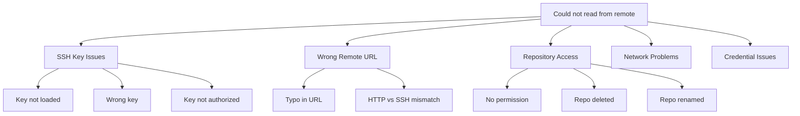
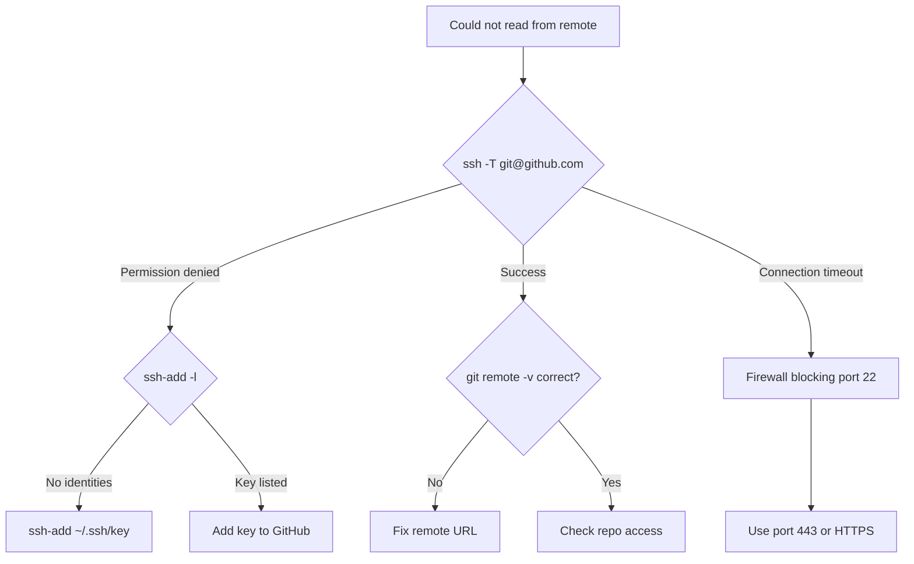

# How to Fix 'Could Not Read from Remote' Errors

Author: [nawazdhandala](https://www.github.com/nawazdhandala)

Tags: Git, Version Control, Troubleshooting, SSH, Authentication, DevOps, GitHub

Description: Learn how to diagnose and fix Git remote repository connection errors including SSH key issues, URL problems, and authentication failures.

---

The "Could not read from remote repository" error stops you from pushing, pulling, or fetching from your Git remote. This error has several causes ranging from SSH key problems to network issues. This guide walks through systematic troubleshooting to get your connection working again.

## Understanding the Error

The full error message looks like this:

```
fatal: Could not read from remote repository.

Please make sure you have the correct access rights
and the repository exists.
```

This generic message covers multiple underlying problems:



## Quick Diagnostic Commands

Start by running these commands to understand your situation:

```bash
# Check your remote URL
git remote -v

# Test SSH connection to GitHub
ssh -T git@github.com

# Test SSH connection to GitLab
ssh -T git@gitlab.com

# Check if SSH agent has your key
ssh-add -l

# View detailed SSH connection info
ssh -vT git@github.com
```

## Fix 1: SSH Key Not Loaded

The most common cause is your SSH key not being available to the SSH agent.

**Check if your key is loaded:**

```bash
ssh-add -l

# If output is "The agent has no identities" your key is not loaded
```

**Add your SSH key:**

```bash
# Start the ssh-agent
eval "$(ssh-agent -s)"

# Add your default key
ssh-add ~/.ssh/id_rsa

# Or add a specific key
ssh-add ~/.ssh/id_ed25519

# On macOS, add to keychain
ssh-add --apple-use-keychain ~/.ssh/id_ed25519
```

**Make it persistent (macOS):**

Create or edit `~/.ssh/config`:

```
Host github.com
    AddKeysToAgent yes
    UseKeychain yes
    IdentityFile ~/.ssh/id_ed25519

Host gitlab.com
    AddKeysToAgent yes
    UseKeychain yes
    IdentityFile ~/.ssh/id_ed25519
```

**Make it persistent (Linux):**

Add to your `~/.bashrc` or `~/.zshrc`:

```bash
# Auto-start ssh-agent
if [ -z "$SSH_AUTH_SOCK" ]; then
    eval "$(ssh-agent -s)"
    ssh-add ~/.ssh/id_ed25519
fi
```

## Fix 2: SSH Key Not Added to GitHub/GitLab

Your key exists locally but is not authorized on the remote.

**Get your public key:**

```bash
# View your public key
cat ~/.ssh/id_ed25519.pub

# Or for RSA keys
cat ~/.ssh/id_rsa.pub
```

**Add to GitHub:**

1. Go to GitHub Settings > SSH and GPG keys
2. Click "New SSH key"
3. Paste your public key
4. Save

**Add via command line (GitHub CLI):**

```bash
# Using GitHub CLI
gh ssh-key add ~/.ssh/id_ed25519.pub --title "My laptop"

# List your keys
gh ssh-key list
```

**Verify the key works:**

```bash
ssh -T git@github.com
# Should show: Hi username! You have successfully authenticated
```

## Fix 3: Wrong Remote URL

Your remote URL might be incorrect or using the wrong protocol.

**Check current remote:**

```bash
git remote -v
# origin  git@github.com:user/repo.git (fetch)
# origin  git@github.com:user/repo.git (push)
```

**Common URL issues:**

```bash
# Typo in repository name
git@github.com:user/reop.git  # Should be 'repo' not 'reop'

# Wrong organization/user
git@github.com:wronguser/repo.git

# Using HTTPS when SSH is set up
https://github.com/user/repo.git
```

**Fix the remote URL:**

```bash
# Update to correct SSH URL
git remote set-url origin git@github.com:correct-user/correct-repo.git

# Or switch from HTTPS to SSH
git remote set-url origin git@github.com:user/repo.git

# Or switch from SSH to HTTPS
git remote set-url origin https://github.com/user/repo.git

# Verify the change
git remote -v
```

## Fix 4: HTTPS Authentication Issues

If using HTTPS instead of SSH:

**For GitHub (personal access token required):**

```bash
# GitHub no longer accepts password authentication
# Create a personal access token at: GitHub Settings > Developer settings > Personal access tokens

# Clear cached credentials
git credential-cache exit

# Or on macOS
git credential-osxkeychain erase
host=github.com
protocol=https
# Press Enter twice

# Next push will prompt for credentials
# Use your token as the password
```

**Cache credentials (optional):**

```bash
# Cache for 1 hour
git config --global credential.helper 'cache --timeout=3600'

# On macOS, use keychain
git config --global credential.helper osxkeychain

# On Windows, use credential manager
git config --global credential.helper manager-core
```

## Fix 5: Repository Access Denied

You might not have permission to access the repository.

**Check if you have access:**

```bash
# Try cloning the repository fresh
git clone git@github.com:org/repo.git /tmp/test-repo

# If this fails, you do not have access
```

**Common access issues:**

1. You were removed from the repository or organization
2. The repository was made private
3. Your organization requires SSO authentication

**For GitHub SSO:**

```bash
# Your SSH key needs to be authorized for SSO
# Go to: GitHub Settings > SSH keys > Configure SSO
# Authorize your key for the organization
```

## Fix 6: Repository Moved or Deleted

The repository might no longer exist at that URL.

**Check if repository exists:**

```bash
# Using GitHub CLI
gh repo view user/repo

# Or check via API
curl -s https://api.github.com/repos/user/repo | jq '.message'
```

**If repository was renamed:**

```bash
# Update your remote URL to the new name
git remote set-url origin git@github.com:user/new-repo-name.git
```

## Fix 7: Network and Firewall Issues

Corporate firewalls often block SSH port 22.

**Test if SSH is blocked:**

```bash
# Try connecting on port 22
ssh -T git@github.com

# If timeout, try port 443
ssh -T -p 443 git@ssh.github.com
```

**Configure SSH to use port 443:**

Add to `~/.ssh/config`:

```
Host github.com
    Hostname ssh.github.com
    Port 443
    User git
    IdentityFile ~/.ssh/id_ed25519
```

**Switch to HTTPS if SSH is blocked:**

```bash
git remote set-url origin https://github.com/user/repo.git
```

## Fix 8: Multiple GitHub Accounts

If you have multiple GitHub accounts, configure separate keys.

**Create separate keys:**

```bash
# Key for personal account
ssh-keygen -t ed25519 -f ~/.ssh/id_ed25519_personal -C "personal@email.com"

# Key for work account
ssh-keygen -t ed25519 -f ~/.ssh/id_ed25519_work -C "work@email.com"
```

**Configure SSH for both:**

Edit `~/.ssh/config`:

```
# Personal GitHub account
Host github.com-personal
    HostName github.com
    User git
    IdentityFile ~/.ssh/id_ed25519_personal

# Work GitHub account
Host github.com-work
    HostName github.com
    User git
    IdentityFile ~/.ssh/id_ed25519_work
```

**Clone using the correct host alias:**

```bash
# Personal repos
git clone git@github.com-personal:personal-user/repo.git

# Work repos
git clone git@github.com-work:work-org/repo.git
```

**Update existing repos:**

```bash
git remote set-url origin git@github.com-work:work-org/repo.git
```

## Debugging SSH Connections

When the problem is not obvious, use verbose SSH output:

```bash
# Verbose connection attempt
ssh -vT git@github.com

# Look for:
# - Which key files are tried
# - Authentication methods attempted
# - Any permission denied errors
```

**Common debug output patterns:**

```bash
# Key being offered
debug1: Offering public key: /home/user/.ssh/id_ed25519

# Key accepted
debug1: Authentication succeeded (publickey)

# Key rejected
debug1: Authentications that can continue: publickey
# No matching key found

# Permission issue
debug1: Could not open /home/user/.ssh/id_ed25519: Permission denied
```

**Fix key permissions:**

```bash
# SSH is strict about permissions
chmod 700 ~/.ssh
chmod 600 ~/.ssh/id_ed25519
chmod 644 ~/.ssh/id_ed25519.pub
chmod 600 ~/.ssh/config
```

## Quick Troubleshooting Flowchart



## Quick Reference

| Problem | Solution |
|---------|----------|
| Agent has no identities | `ssh-add ~/.ssh/id_ed25519` |
| Key not on GitHub | Add public key to GitHub SSH settings |
| Wrong remote URL | `git remote set-url origin <correct-url>` |
| Port 22 blocked | Configure SSH to use port 443 |
| HTTPS auth failed | Use personal access token |
| SSO not authorized | Authorize SSH key for SSO in GitHub settings |
| Permission denied on key file | `chmod 600 ~/.ssh/id_ed25519` |

Most "could not read from remote" errors come down to SSH key configuration. Work through the diagnostic steps to identify whether it is a key loading issue, authorization issue, or URL issue, then apply the appropriate fix.
