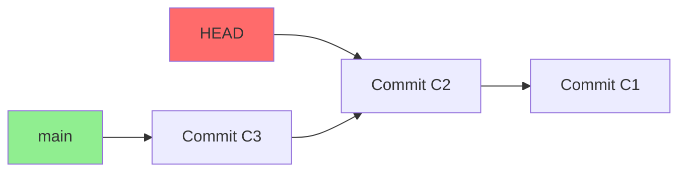
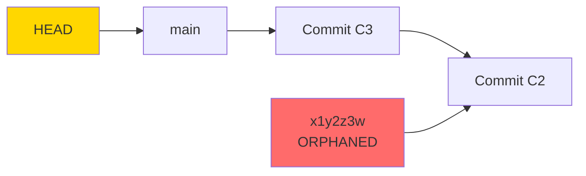

# How to Fix "Detached HEAD" State in Git

Author: [nawazdhandala](https://github.com/nawazdhandala)

Tags: Git, Version Control, DevOps, Troubleshooting, Debugging

Description: Understand what Git's detached HEAD state means, why it happens, and how to safely recover your work or use it intentionally.

---

You run a Git command and suddenly see a warning about "detached HEAD state." It sounds alarming, but this state is both common and useful once you understand it. This guide explains what detached HEAD means, when it happens, and how to handle it properly.

## What is HEAD in Git?

In Git, HEAD is a pointer that tells Git which commit you are currently working on. Normally, HEAD points to a branch name, which in turn points to a commit.


```bash
# Normal state: HEAD points to a branch
cat .git/HEAD
# ref: refs/heads/main

# The branch points to a commit
cat .git/refs/heads/main
# a1b2c3d4e5f6g7h8i9j0k1l2m3n4o5p6q7r8s9t0
```

## What is Detached HEAD?

When HEAD points directly to a commit instead of a branch, you are in "detached HEAD" state. Any commits you make will not belong to any branch.



```bash
# Detached state: HEAD points directly to a commit
cat .git/HEAD
# a1b2c3d4e5f6g7h8i9j0k1l2m3n4o5p6q7r8s9t0

# Git warns you about this
git status
# HEAD detached at a1b2c3d
```

## Common Causes of Detached HEAD

### Checking Out a Specific Commit

```bash
# Checkout a commit by hash
git checkout a1b2c3d

# Git shows the detached HEAD warning
Note: switching to 'a1b2c3d'.

You are in 'detached HEAD' state. You can look around, make experimental
changes and commit them, and you can discard any commits you make in this
state without impacting any branches by switching back to a branch.
```

### Checking Out a Tag

```bash
# Checkout a release tag
git checkout v2.0.0

# Tags point to commits, not branches
# Result: detached HEAD at the tagged commit
```

### Checking Out a Remote Branch Directly

```bash
# This detaches HEAD
git checkout origin/main

# Instead of this, create a local tracking branch
git checkout -b main origin/main
# or
git switch main
```

### Interactive Rebase Operations

```bash
# During rebase, HEAD is temporarily detached
git rebase -i HEAD~3

# Git moves HEAD to each commit being replayed
# After rebase completes, HEAD reattaches
```

## The Danger: Losing Commits

The main risk of detached HEAD is making commits that become "orphaned" when you switch branches.

```bash
# You're in detached HEAD state
git checkout a1b2c3d

# You make some changes and commit
git commit -m "Important fix"
# New commit: x1y2z3w

# You switch back to main
git checkout main

# The commit x1y2z3w is now orphaned!
# No branch points to it
# Git's garbage collection will eventually delete it
```



## How to Fix Detached HEAD

### Option 1: Simply Return to a Branch

If you did not make any commits in detached state:

```bash
# Return to main branch
git checkout main

# Or any other branch
git checkout feature-branch

# Using the newer switch command
git switch main
```

### Option 2: Create a Branch from Current Position

If you made commits you want to keep:

```bash
# Create a new branch at current position
git checkout -b my-new-branch

# Or with switch
git switch -c my-new-branch

# HEAD is now attached to my-new-branch
# Your commits are safe
```

### Option 3: Recover Orphaned Commits

If you already switched branches and lost commits:

```bash
# Find the lost commit using reflog
git reflog

# Output shows recent HEAD positions
# x1y2z3w HEAD@{1}: commit: Important fix
# a1b2c3d HEAD@{2}: checkout: moving from main to a1b2c3d
# ...

# Create a branch at the lost commit
git branch recovered-work x1y2z3w

# Or checkout directly
git checkout x1y2z3w
git checkout -b recovered-work
```

### Option 4: Cherry-Pick Lost Commits

If you want to apply lost commits to an existing branch:

```bash
# Find the commit hash from reflog
git reflog

# Switch to your target branch
git checkout main

# Apply the lost commit
git cherry-pick x1y2z3w

# The changes are now on main
```

## Intentional Uses of Detached HEAD

Detached HEAD is not always a problem. It has legitimate uses.

### Examining Historical Code

```bash
# Look at code from a specific release
git checkout v1.5.0

# Browse files, run tests, compare behavior
cat src/config.js
npm test

# Return to your branch when done
git checkout main
```

### Creating a Hotfix from a Tag

```bash
# Checkout the production release tag
git checkout v2.0.0

# Create a branch for the hotfix
git checkout -b hotfix/critical-bug

# Now you're on a proper branch
# Make fixes and merge back
```

### Testing a Specific Commit

```bash
# Checkout the commit to test
git checkout a1b2c3d

# Run your test suite
npm test

# Return to your work
git checkout my-feature
```

### Bisecting to Find a Bug

```bash
# Start bisect
git bisect start
git bisect bad        # Current version has bug
git bisect good v1.0  # v1.0 was working

# Git checks out commits in detached HEAD
# Test each one
npm test

# Mark as good or bad
git bisect good  # or git bisect bad

# When done
git bisect reset  # Returns to original branch
```

## Preventing Accidental Detached HEAD

### Use Branch Names Instead of Commit Hashes

```bash
# Instead of this
git checkout a1b2c3d

# Do this when possible
git checkout feature-branch
```

### Use `git switch` Instead of `git checkout`

The newer `git switch` command is designed specifically for switching branches and will warn you more clearly:

```bash
# switch is for branches
git switch main

# To checkout a commit, you must be explicit
git switch --detach a1b2c3d

# This makes detached HEAD intentional, not accidental
```

### Check Your Status Regularly

```bash
# Make it a habit to check status
git status

# In detached HEAD, you'll see:
HEAD detached at a1b2c3d
nothing to commit, working tree clean
```

## Recovery Scenarios

### Scenario 1: Made Changes But Did Not Commit

```bash
# You're in detached HEAD with uncommitted changes
git status
# HEAD detached at a1b2c3d
# Changes not staged for commit:
#   modified: src/app.js

# Stash the changes
git stash

# Return to your branch
git checkout main

# Apply the stashed changes
git stash pop
```

### Scenario 2: Made Commits and Already Switched

```bash
# You made commits in detached HEAD
# Then switched to main without creating a branch
# Your commits seem lost

# Step 1: Find the commits
git reflog
# x1y2z3w HEAD@{1}: commit: Fix bug
# y2z3w4x HEAD@{2}: commit: Add feature
# a1b2c3d HEAD@{3}: checkout: moving from main to a1b2c3d

# Step 2: Create a branch at the most recent commit
git branch recovery x1y2z3w

# Step 3: Merge or cherry-pick to main
git checkout main
git merge recovery
# or
git cherry-pick y2z3w4x x1y2z3w
```

### Scenario 3: Rebase Went Wrong

```bash
# During an interactive rebase, something went wrong
# You're in detached HEAD with conflicts

# Option A: Abort and start over
git rebase --abort

# Option B: If rebase is stuck, reset to original
git reflog
# Find the commit before rebase started
git reset --hard HEAD@{5}
```

## Quick Reference

| Situation | Command |
|-----------|---------|
| Check if HEAD is detached | `git status` |
| Return to a branch | `git checkout main` |
| Create branch at current position | `git checkout -b new-branch` |
| Find lost commits | `git reflog` |
| Recover orphaned commit | `git branch recovery <commit-hash>` |
| Explicitly enter detached HEAD | `git switch --detach <commit>` |
| Stash uncommitted changes | `git stash` |

## Summary

Detached HEAD is not an error but a state where HEAD points directly to a commit rather than a branch. This happens when you checkout a commit hash, tag, or remote branch directly. The main risk is losing commits that are made without a branch to reference them.

To fix detached HEAD:
1. If you have no commits to save, simply `git checkout <branch>`
2. If you have commits to keep, `git checkout -b <new-branch>`
3. If you already lost commits, use `git reflog` to find and recover them

Understanding detached HEAD transforms it from a scary warning into a useful tool for examining history, testing specific versions, and debugging issues.
