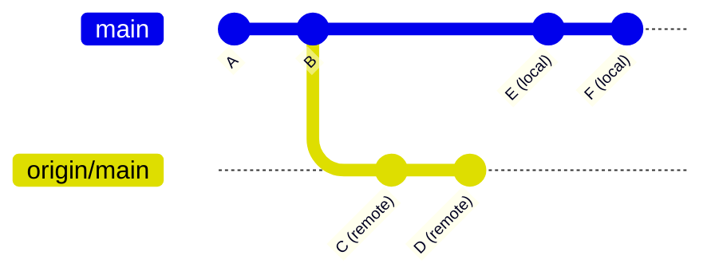
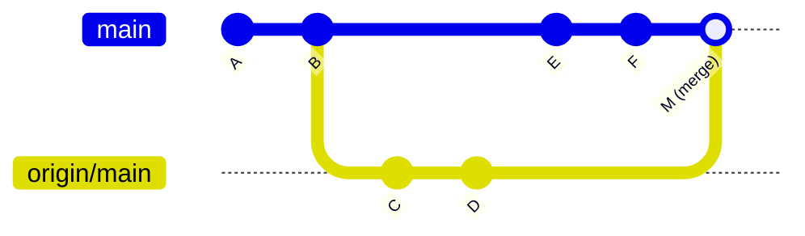
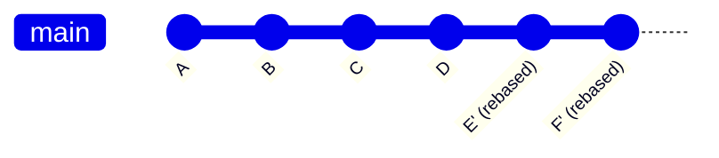
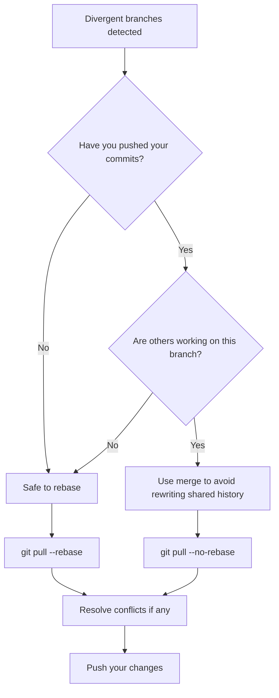

# How to Fix 'You Have Divergent Branches' Errors

Author: [nawazdhandala](https://www.github.com/nawazdhandala)

Tags: Git, Version Control, Troubleshooting, DevOps, Branching, Merge, Rebase

Description: Learn how to resolve Git divergent branches errors when your local and remote branches have diverged and need reconciliation.

---

The "You have divergent branches" error appears when Git cannot automatically reconcile differences between your local branch and its remote counterpart. This happens when both branches have commits that the other does not have. Starting with Git 2.27, this warning became more prominent to help developers understand the situation before blindly running git pull.

This guide explains why divergent branches happen and shows you multiple ways to fix them based on your workflow.

## Understanding Divergent Branches

When branches diverge, your commit history looks something like this:



Your local branch has commits E and F that the remote does not have. The remote has commits C and D that your local branch does not have. Git needs to know how you want to combine these histories.

## The Warning Message

When you run `git pull` with divergent branches, Git shows this message:

```bash
hint: You have divergent branches and need to specify how to reconcile them.
hint: You can do so by running one of the following commands sometime before
hint: your next pull:
hint:
hint:   git config pull.rebase false  # merge
hint:   git config pull.rebase true   # rebase
hint:   git config pull.ff only       # fast-forward only
hint:
hint: You can replace "git config" with "git config --global" to set a default
hint: preference for all repositories. You can also pass --rebase, --no-rebase,
hint: or --ff-only on the command line to override the configured default per
hint: invocation.
fatal: Need to specify how to reconcile divergent branches.
```

## Solution 1: Merge (Default Git Behavior)

Merging combines both histories and creates a merge commit. This preserves the exact history of both branches.

```bash
# Pull with merge strategy
git pull --no-rebase

# Or configure as default for this repo
git config pull.rebase false
```

After merging, your history looks like this:



**When to use merge:**
- You want to preserve the complete history of both branches
- Your team uses merge-based workflows
- You are working on a feature branch that will be squash-merged anyway

```bash
# Perform the merge pull
git pull --no-rebase origin main

# If there are conflicts, resolve them
git status
# Edit conflicting files
git add .
git commit -m "Merge remote changes"
```

## Solution 2: Rebase (Linear History)

Rebasing replays your local commits on top of the remote commits. This creates a linear history without merge commits.

```bash
# Pull with rebase strategy
git pull --rebase

# Or configure as default
git config pull.rebase true
```

After rebasing, your history becomes linear:



**When to use rebase:**
- You want a clean, linear commit history
- Your commits are local only and not shared with others
- You are working on a personal feature branch

```bash
# Rebase your local commits on top of remote
git pull --rebase origin main

# If conflicts occur during rebase
git status
# Fix conflicts in each file
git add <file>
git rebase --continue

# To abort the rebase if something goes wrong
git rebase --abort
```

## Solution 3: Fast-Forward Only (Strict)

Fast-forward only refuses to create any merge commits. It only works when your local branch can be fast-forwarded to match the remote.

```bash
# Only pull if fast-forward is possible
git pull --ff-only

# Configure as default
git config pull.ff only
```

This strategy fails if branches have truly diverged:

```bash
$ git pull --ff-only
fatal: Not possible to fast-forward, aborting.
```

**When to use fast-forward only:**
- You want to be alerted when branches diverge
- You follow a strict no-merge-commits policy
- You want to manually decide how to handle divergence

```bash
# If ff-only fails, you decide what to do
git pull --ff-only origin main
# If it fails, explicitly choose:
git pull --rebase origin main
# or
git pull --no-rebase origin main
```

## Setting a Global Default

To avoid the warning message every time, set a global preference:

```bash
# Option 1: Always merge (traditional default)
git config --global pull.rebase false

# Option 2: Always rebase (cleaner history)
git config --global pull.rebase true

# Option 3: Only fast-forward (strictest)
git config --global pull.ff only
```

Check your current configuration:

```bash
# View pull configuration
git config --get pull.rebase
git config --get pull.ff

# View all related settings
git config --list | grep pull
```

## Handling Conflicts During Resolution

Regardless of which strategy you choose, conflicts can occur.

**During a merge:**

```bash
# Pull triggers merge conflict
git pull --no-rebase

# Check which files have conflicts
git status

# Files marked as "both modified" need manual resolution
# Open each file and look for conflict markers
<<<<<<< HEAD
your local changes
=======
remote changes
>>>>>>> origin/main

# After resolving, stage and commit
git add .
git commit -m "Resolve merge conflicts"
```

**During a rebase:**

```bash
# Pull triggers rebase conflict
git pull --rebase

# Check status
git status

# Resolve conflicts in marked files
# Then continue the rebase
git add <resolved-file>
git rebase --continue

# If you want to skip a problematic commit
git rebase --skip

# To give up and restore original state
git rebase --abort
```

## Investigating the Divergence

Before choosing a strategy, understand what caused the divergence:

```bash
# See commits on remote that you do not have
git log HEAD..origin/main --oneline

# See your local commits not on remote
git log origin/main..HEAD --oneline

# Visual representation of divergence
git log --oneline --graph --all

# Compare the two branches
git diff HEAD...origin/main
```

Example output:

```bash
$ git log HEAD..origin/main --oneline
abc1234 Add CI pipeline configuration
def5678 Update dependencies

$ git log origin/main..HEAD --oneline
111aaaa Fix login bug
222bbbb Add user validation
```

This shows you exactly what commits exist on each side.

## Preventing Divergent Branches

The best fix is prevention. Follow these practices:

**Always pull before starting new work:**

```bash
# Start your day with a fresh pull
git checkout main
git pull
git checkout -b feature/new-work
```

**Push frequently:**

```bash
# Push your work regularly
git push origin feature/my-branch

# Set upstream to simplify future pushes
git push -u origin feature/my-branch
# Now you can just use:
git push
```

**Fetch and check before pulling:**

```bash
# Fetch without merging
git fetch origin

# Check if branches have diverged
git status
# Shows "Your branch and 'origin/main' have diverged"

# Investigate before acting
git log --oneline HEAD...origin/main
```

## Quick Reference Table

| Situation | Recommended Strategy |
|-----------|---------------------|
| Feature branch, not shared | `git pull --rebase` |
| Main branch, team workflow | `git pull --no-rebase` |
| Want to review before acting | `git pull --ff-only` |
| Lots of local commits to preserve | `git pull --no-rebase` |
| Clean up messy local history | `git pull --rebase` |

## Workflow Decision Diagram



## Common Mistakes to Avoid

**Do not rebase commits that have been pushed and shared:**

```bash
# This is dangerous if others have based work on these commits
git pull --rebase  # Rewrites commit hashes

# After rebasing, you might need force push
git push --force-with-lease  # Safer than --force
```

**Do not ignore the warning repeatedly:**

```bash
# Bad: Just setting a config to make the warning go away
# without understanding the implications

# Good: Understand what merge vs rebase means for your workflow
# then set an appropriate default
```

The divergent branches warning exists to help you make informed decisions about your Git history. Choose the strategy that fits your team's workflow and stick with it consistently.
