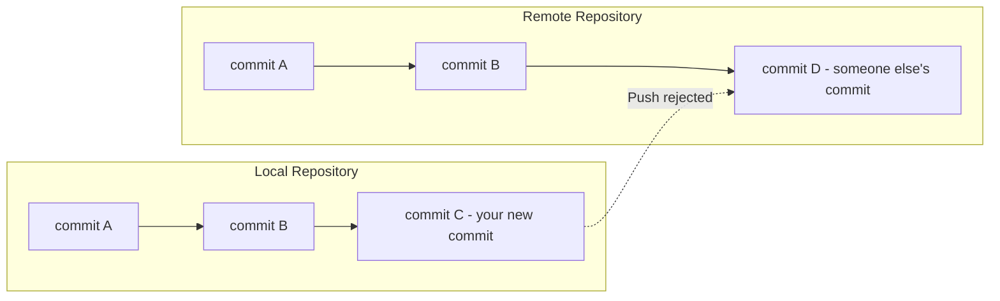
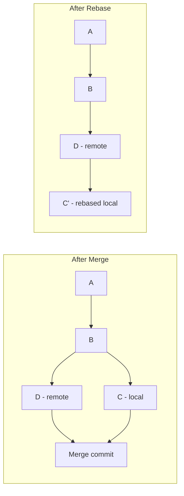

# How to Fix "Failed to Push Some Refs" Errors

Author: [nawazdhandala](https://www.github.com/nawazdhandala)

Tags: Git, Version Control, Troubleshooting, Push Errors, DevOps, Git Commands

Description: Learn how to diagnose and fix Git's "failed to push some refs" error including rejected pushes, divergent branches, and remote conflicts.

---

The error "failed to push some refs to" followed by your repository URL is Git's way of telling you the remote has changes you do not have locally. This is one of the most common Git errors, and understanding why it happens will help you fix it quickly and avoid data loss.

## Understanding the Error

When you push, Git tries to fast-forward the remote branch to include your commits. If the remote has commits that your local branch does not have, Git rejects the push to prevent you from accidentally overwriting someone else's work.



The typical error message looks like this:

```bash
git push origin main
# To https://github.com/user/repo.git
#  ! [rejected]        main -> main (fetch first)
# error: failed to push some refs to 'https://github.com/user/repo.git'
# hint: Updates were rejected because the remote contains work that you do
# hint: not have locally. This is usually caused by another repository pushing
# hint: to the same ref. You may want to first integrate the remote changes
# hint: (e.g., 'git pull ...') before pushing again.
```

## Common Causes and Solutions

### Cause 1: Remote Has New Commits (Most Common)

Someone else pushed commits to the same branch, or you pushed from another machine.

```bash
# First, fetch the remote changes to see what's there
git fetch origin

# View the difference between local and remote
git log HEAD..origin/main --oneline
# d4e5f6g Add documentation
# c3d4e5f Fix bug in auth module

# You have two options: merge or rebase
```

#### Solution A: Pull with Merge

This creates a merge commit combining your work with the remote changes.

```bash
# Pull (fetch + merge) the remote changes
git pull origin main

# Git creates a merge commit if there are divergent changes
# Merge made by the 'ort' strategy.
#  docs/README.md | 10 ++++++++++
#  1 file changed, 10 insertions(+)

# Now push your combined changes
git push origin main
```

#### Solution B: Pull with Rebase

This replays your commits on top of the remote changes, creating a linear history.

```bash
# Pull with rebase instead of merge
git pull --rebase origin main

# Your commits are replayed on top of remote commits
# Successfully rebased and updated refs/heads/main.

# Push the result
git push origin main
```



### Cause 2: Branch Protection Rules

Many repositories protect their main branch from direct pushes.

```bash
git push origin main
# remote: error: GH006: Protected branch update failed
# remote: error: Required status check "ci" is expected.
# To https://github.com/user/repo.git
#  ! [remote rejected] main -> main (protected branch hook declined)
# error: failed to push some refs to 'https://github.com/user/repo.git'
```

Solution: Create a pull request instead of pushing directly.

```bash
# Create a feature branch
git checkout -b feature/my-changes

# Push the feature branch
git push -u origin feature/my-changes

# Create a pull request (using GitHub CLI)
gh pr create --title "My changes" --body "Description of changes"
```

### Cause 3: Force Push Needed After Rewrite

If you amended commits or rebased a branch that was already pushed, the histories diverge.

```bash
git push origin feature-branch
# ! [rejected]        feature-branch -> feature-branch (non-fast-forward)
# error: failed to push some refs to 'origin'
# hint: Updates were rejected because the tip of your current branch is behind
# hint: its remote counterpart.
```

```bash
# If you intentionally rewrote history (amend, rebase, squash)
# Use force-with-lease (safer than --force)
git push --force-with-lease origin feature-branch

# force-with-lease fails if someone else pushed in the meantime
# This prevents accidentally overwriting their work
```

When to use force push:
- After amending commits on your own feature branch
- After interactive rebase to clean up commits
- After squashing commits before merge
- NEVER on shared branches like main without team agreement

### Cause 4: Deleted and Recreated Branch Remotely

If someone deleted and recreated a branch with the same name, the histories won't match.

```bash
# Fetch all changes including deleted/new branches
git fetch --all --prune

# Reset your local branch to match remote
git checkout main
git reset --hard origin/main

# If you have local changes to keep, use rebase instead
git rebase origin/main
```

### Cause 5: Hook Rejections

Pre-receive hooks on the server can reject pushes for various reasons.

```bash
# Common hook rejection messages
# remote: error: commit message must reference an issue
# remote: error: branch name does not match pattern
# remote: error: file size exceeds limit

# Read the error message carefully for specific requirements
git push origin feature-branch
# remote: error: Commit abc1234 does not reference a Jira ticket
# remote: error: Please use format: PROJ-123: description
```

Solution: Fix what the hook is complaining about.

```bash
# Fix commit message format
git commit --amend -m "PROJ-123: Add user authentication"

# Then push (may need force for amended commit)
git push --force-with-lease origin feature-branch
```

### Cause 6: Wrong Remote URL

You might be pushing to the wrong remote or the URL changed.

```bash
# Check your remote configuration
git remote -v
# origin  https://github.com/olduser/repo.git (fetch)
# origin  https://github.com/olduser/repo.git (push)

# Update the remote URL if it changed
git remote set-url origin https://github.com/newuser/repo.git

# Verify the change
git remote -v
```

### Cause 7: Authentication Issues Disguised as Push Errors

Sometimes authentication failures show up as push failures.

```bash
# If you see this
git push origin main
# remote: Permission to user/repo.git denied to other-user.
# fatal: unable to access 'https://github.com/user/repo.git/': The requested URL returned error: 403

# Check your credentials
git config --global credential.helper
# Clear cached credentials if using wrong account
git credential reject << EOF
protocol=https
host=github.com
EOF

# Try pushing again (Git will prompt for credentials)
git push origin main
```

## The Pull-Push Workflow

The safest workflow to avoid push failures:

```bash
# 1. Before starting work, pull latest changes
git pull origin main

# 2. Create a feature branch
git checkout -b feature/my-work

# 3. Make your changes and commit
git add .
git commit -m "Add new feature"

# 4. Before pushing, fetch and rebase onto latest main
git fetch origin
git rebase origin/main

# 5. Push your branch
git push -u origin feature/my-work

# 6. Create PR and merge through the UI
```

## Handling Conflicts During Pull/Rebase

Sometimes pulling creates conflicts you need to resolve.

```bash
git pull origin main
# Auto-merging src/app.js
# CONFLICT (content): Merge conflict in src/app.js
# Automatic merge failed; fix conflicts and then commit the result.

# Edit the conflicting file to resolve
code src/app.js

# The file will have conflict markers like:
# <<<<<<< HEAD
# your changes
# =======
# their changes
# >>>>>>> origin/main

# After resolving, stage and commit
git add src/app.js
git commit -m "Merge remote changes, resolve conflicts"

# Now push succeeds
git push origin main
```

For rebase conflicts:

```bash
git pull --rebase origin main
# CONFLICT (content): Merge conflict in src/app.js
# error: could not apply abc1234... Your commit message

# Resolve the conflict
code src/app.js
git add src/app.js

# Continue the rebase
git rebase --continue

# If you want to abort and go back to before the rebase
git rebase --abort
```

## Preventing Push Failures

### Configure Pull to Rebase by Default

```bash
# Set pull to rebase by default (avoids merge commits)
git config --global pull.rebase true

# Or set it per-repository
git config pull.rebase true
```

### Set Upstream Tracking

```bash
# When pushing a new branch, set upstream tracking
git push -u origin feature-branch

# Future pushes just need
git push
```

### Use Pre-Push Hooks Locally

```bash
# Create .git/hooks/pre-push
#!/bin/bash
# Remind to pull before pushing

BRANCH=$(git rev-parse --abbrev-ref HEAD)
LOCAL=$(git rev-parse @)
REMOTE=$(git rev-parse @{u} 2>/dev/null)

if [ -n "$REMOTE" ] && [ "$LOCAL" != "$REMOTE" ]; then
    echo "Warning: Local and remote have diverged"
    echo "Consider: git pull --rebase origin $BRANCH"
fi
```

## Quick Reference

```bash
# Fetch and see what's different
git fetch origin
git log HEAD..origin/main --oneline

# Pull with merge (creates merge commit)
git pull origin main

# Pull with rebase (linear history)
git pull --rebase origin main

# Force push after intentional rewrite (own branch only!)
git push --force-with-lease origin feature-branch

# Reset local to match remote exactly
git fetch origin
git reset --hard origin/main

# Check remote configuration
git remote -v

# Update remote URL
git remote set-url origin <new-url>

# Resolve conflicts during rebase
git add <resolved-files>
git rebase --continue

# Abort a problematic rebase
git rebase --abort
```

## Summary

The "failed to push some refs" error occurs when your local branch and the remote have diverged. The solution depends on the cause:

1. **Remote has new commits**: Pull (merge or rebase) then push
2. **Branch protection**: Create a PR instead of direct push
3. **History was rewritten**: Use `--force-with-lease` on your own branches
4. **Hook rejections**: Fix what the hook requires
5. **Wrong remote/auth**: Check and fix your remote configuration

The safest approach is to always pull before pushing, use feature branches, and avoid force pushing to shared branches. When in doubt, `git fetch` followed by `git log HEAD..origin/main` shows you exactly what the remote has that you do not.
