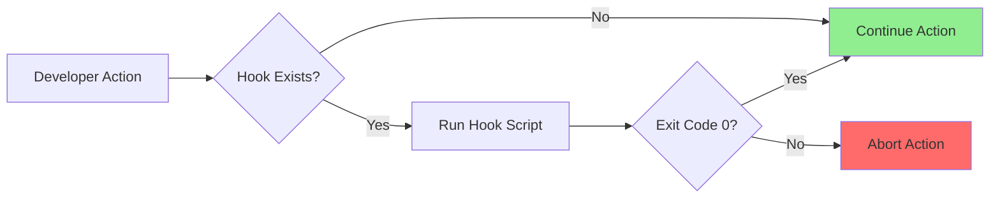

# How to Configure Git Hooks for Automation

Author: [nawazdhandala](https://github.com/nawazdhandala)

Tags: Git, Automation, DevOps, CI/CD, Code Quality, Pre-commit

Description: Learn how to use Git hooks to automate code formatting, testing, commit message validation, and deployment workflows.

---

Git hooks are scripts that run automatically at specific points in your Git workflow. They can prevent bad commits, enforce coding standards, run tests, and automate deployments. This guide covers practical hook configurations that improve code quality and team productivity.

## How Git Hooks Work

Git hooks are executable scripts stored in the `.git/hooks` directory. When Git performs certain actions, it checks for a corresponding hook script and runs it if present.



```bash
# View available hooks (samples)
ls .git/hooks/

# Output:
# applypatch-msg.sample
# commit-msg.sample
# pre-commit.sample
# pre-push.sample
# pre-rebase.sample
# ...
```

## Common Hook Types

| Hook | Trigger | Common Uses |
|------|---------|-------------|
| `pre-commit` | Before commit is created | Lint, format, test |
| `commit-msg` | After message is entered | Validate message format |
| `pre-push` | Before push to remote | Run full test suite |
| `post-commit` | After commit is created | Notifications, logging |
| `post-merge` | After merge completes | Install dependencies |
| `pre-receive` | Server-side, before accepting push | Enforce policies |

## Setting Up Your First Hook

### Pre-Commit Hook: Format and Lint

Create a hook that runs formatters and linters before each commit.

```bash
# Create the hook file
touch .git/hooks/pre-commit
chmod +x .git/hooks/pre-commit
```

```bash
#!/bin/bash
# .git/hooks/pre-commit
# Runs formatting and linting on staged files

echo "Running pre-commit checks..."

# Get list of staged files
STAGED_FILES=$(git diff --cached --name-only --diff-filter=ACMR)

if [ -z "$STAGED_FILES" ]; then
    echo "No files staged for commit"
    exit 0
fi

# Check for JavaScript/TypeScript files
JS_FILES=$(echo "$STAGED_FILES" | grep -E '\.(js|ts|jsx|tsx)$')
if [ -n "$JS_FILES" ]; then
    echo "Running ESLint..."
    npx eslint $JS_FILES --fix

    if [ $? -ne 0 ]; then
        echo "ESLint failed. Please fix errors and try again."
        exit 1
    fi

    # Re-add fixed files
    echo "$JS_FILES" | xargs git add
fi

# Check for Python files
PY_FILES=$(echo "$STAGED_FILES" | grep -E '\.py$')
if [ -n "$PY_FILES" ]; then
    echo "Running Black formatter..."
    black $PY_FILES

    echo "Running Flake8..."
    flake8 $PY_FILES

    if [ $? -ne 0 ]; then
        echo "Flake8 failed. Please fix errors and try again."
        exit 1
    fi

    # Re-add formatted files
    echo "$PY_FILES" | xargs git add
fi

echo "Pre-commit checks passed!"
exit 0
```

### Commit-Msg Hook: Validate Commit Messages

Enforce commit message conventions like Conventional Commits.

```bash
#!/bin/bash
# .git/hooks/commit-msg
# Validates commit message format

COMMIT_MSG_FILE=$1
COMMIT_MSG=$(cat "$COMMIT_MSG_FILE")

# Conventional Commits pattern
# type(scope): description
PATTERN="^(feat|fix|docs|style|refactor|test|chore|perf|ci|build|revert)(\(.+\))?: .{1,50}"

if ! echo "$COMMIT_MSG" | grep -qE "$PATTERN"; then
    echo "ERROR: Invalid commit message format"
    echo ""
    echo "Expected format: type(scope): description"
    echo ""
    echo "Valid types:"
    echo "  feat:     New feature"
    echo "  fix:      Bug fix"
    echo "  docs:     Documentation only"
    echo "  style:    Formatting, no code change"
    echo "  refactor: Code change, no feature/fix"
    echo "  test:     Adding tests"
    echo "  chore:    Maintenance"
    echo "  perf:     Performance improvement"
    echo "  ci:       CI/CD changes"
    echo "  build:    Build system changes"
    echo "  revert:   Revert previous commit"
    echo ""
    echo "Example: feat(auth): add OAuth2 login support"
    echo ""
    echo "Your message: $COMMIT_MSG"
    exit 1
fi

# Check message length
FIRST_LINE=$(echo "$COMMIT_MSG" | head -n1)
if [ ${#FIRST_LINE} -gt 72 ]; then
    echo "ERROR: First line exceeds 72 characters"
    echo "Length: ${#FIRST_LINE}"
    exit 1
fi

echo "Commit message validated"
exit 0
```

### Pre-Push Hook: Run Tests

Run the full test suite before allowing a push.

```bash
#!/bin/bash
# .git/hooks/pre-push
# Runs tests before pushing

BRANCH=$(git rev-parse --abbrev-ref HEAD)

echo "Running tests before push to $BRANCH..."

# Skip tests for certain branches
if [[ "$BRANCH" == "docs/"* ]]; then
    echo "Skipping tests for documentation branch"
    exit 0
fi

# Run test suite
npm test

if [ $? -ne 0 ]; then
    echo ""
    echo "ERROR: Tests failed. Push aborted."
    echo "Fix the failing tests and try again."
    exit 1
fi

# Run type checking for TypeScript projects
if [ -f "tsconfig.json" ]; then
    echo "Running TypeScript type check..."
    npx tsc --noEmit

    if [ $? -ne 0 ]; then
        echo ""
        echo "ERROR: Type check failed. Push aborted."
        exit 1
    fi
fi

echo "All checks passed. Pushing..."
exit 0
```

## Using Pre-Commit Framework

The `pre-commit` framework simplifies hook management and sharing.

```bash
# Install pre-commit
pip install pre-commit

# Or with Homebrew
brew install pre-commit
```

Create a configuration file in your project root:

```yaml
# .pre-commit-config.yaml
repos:
  # General hooks
  - repo: https://github.com/pre-commit/pre-commit-hooks
    rev: v4.5.0
    hooks:
      - id: trailing-whitespace
      - id: end-of-file-fixer
      - id: check-yaml
      - id: check-json
      - id: check-added-large-files
        args: ['--maxkb=1000']
      - id: detect-private-key
      - id: check-merge-conflict

  # JavaScript/TypeScript
  - repo: https://github.com/pre-commit/mirrors-eslint
    rev: v8.56.0
    hooks:
      - id: eslint
        files: \.[jt]sx?$
        types: [file]
        additional_dependencies:
          - eslint@8.56.0
          - eslint-config-prettier@9.1.0

  # Python
  - repo: https://github.com/psf/black
    rev: 24.1.0
    hooks:
      - id: black

  - repo: https://github.com/pycqa/flake8
    rev: 7.0.0
    hooks:
      - id: flake8

  # Commit message
  - repo: https://github.com/compilerla/conventional-pre-commit
    rev: v3.1.0
    hooks:
      - id: conventional-pre-commit
        stages: [commit-msg]

  # Secrets detection
  - repo: https://github.com/Yelp/detect-secrets
    rev: v1.4.0
    hooks:
      - id: detect-secrets
        args: ['--baseline', '.secrets.baseline']
```

```bash
# Install the hooks
pre-commit install
pre-commit install --hook-type commit-msg

# Run on all files (useful for initial setup)
pre-commit run --all-files

# Update hook versions
pre-commit autoupdate
```

## Sharing Hooks with Your Team

Git hooks in `.git/hooks` are not tracked by Git. To share hooks with your team, use one of these approaches.

### Approach 1: Custom Hooks Directory

```bash
# Create a tracked hooks directory
mkdir -p .githooks

# Move hooks there
mv .git/hooks/pre-commit .githooks/

# Configure Git to use this directory
git config core.hooksPath .githooks

# Add setup instructions to README
# Team members run: git config core.hooksPath .githooks
```

### Approach 2: npm/yarn Scripts

For JavaScript projects, use husky:

```bash
# Install husky
npm install husky --save-dev

# Initialize husky
npx husky init

# This creates .husky directory
# Hooks are automatically installed on npm install
```

```bash
#!/bin/bash
# .husky/pre-commit

npm run lint
npm run format:check
```

```json
// package.json
{
  "scripts": {
    "prepare": "husky",
    "lint": "eslint .",
    "format:check": "prettier --check ."
  }
}
```

### Approach 3: Makefile Setup

```makefile
# Makefile
.PHONY: setup hooks

setup: hooks
	npm install

hooks:
	@echo "Installing git hooks..."
	@cp .githooks/* .git/hooks/
	@chmod +x .git/hooks/*
	@echo "Hooks installed"
```

## Advanced Hook Examples

### Post-Merge: Install Dependencies

Automatically install dependencies when they change.

```bash
#!/bin/bash
# .git/hooks/post-merge
# Installs dependencies after merge if package files changed

CHANGED_FILES=$(git diff-tree -r --name-only --no-commit-id ORIG_HEAD HEAD)

# Check for Node.js dependency changes
if echo "$CHANGED_FILES" | grep -qE "package(-lock)?\.json"; then
    echo "package.json changed. Running npm install..."
    npm install
fi

# Check for Python dependency changes
if echo "$CHANGED_FILES" | grep -qE "requirements.*\.txt|Pipfile"; then
    echo "Python dependencies changed. Running pip install..."
    pip install -r requirements.txt
fi

# Check for Go dependency changes
if echo "$CHANGED_FILES" | grep -qE "go\.(mod|sum)"; then
    echo "Go dependencies changed. Running go mod download..."
    go mod download
fi
```

### Pre-Commit: Check for Debug Code

Prevent accidental commit of debug statements.

```bash
#!/bin/bash
# .git/hooks/pre-commit
# Checks for debug code that should not be committed

STAGED_FILES=$(git diff --cached --name-only --diff-filter=ACMR)

# Patterns to check
FORBIDDEN_PATTERNS=(
    "console\.log"
    "debugger"
    "binding\.pry"
    "import pdb"
    "print\("
    "TODO.*FIXME"
    "\.only\("
)

ERRORS_FOUND=0

for pattern in "${FORBIDDEN_PATTERNS[@]}"; do
    MATCHES=$(echo "$STAGED_FILES" | xargs grep -l -E "$pattern" 2>/dev/null)
    if [ -n "$MATCHES" ]; then
        echo "WARNING: Found '$pattern' in:"
        echo "$MATCHES" | sed 's/^/  /'
        ERRORS_FOUND=1
    fi
done

if [ $ERRORS_FOUND -eq 1 ]; then
    echo ""
    echo "Remove debug code before committing."
    echo "Use 'git commit --no-verify' to bypass (not recommended)"
    exit 1
fi

exit 0
```

### Prepare-Commit-Msg: Add Branch Name

Automatically prepend the branch name to commit messages.

```bash
#!/bin/bash
# .git/hooks/prepare-commit-msg
# Adds branch name prefix to commit message

COMMIT_MSG_FILE=$1
COMMIT_SOURCE=$2

# Only modify if this is a regular commit (not merge, squash, etc.)
if [ -z "$COMMIT_SOURCE" ]; then
    BRANCH=$(git rev-parse --abbrev-ref HEAD)

    # Extract ticket number from branch name
    # e.g., feature/JIRA-123-description -> JIRA-123
    TICKET=$(echo "$BRANCH" | grep -oE '[A-Z]+-[0-9]+')

    if [ -n "$TICKET" ]; then
        # Prepend ticket to message
        TEMP=$(mktemp)
        echo "[$TICKET] $(cat $COMMIT_MSG_FILE)" > "$TEMP"
        mv "$TEMP" "$COMMIT_MSG_FILE"
    fi
fi
```

## Server-Side Hooks

Server-side hooks run on the Git server and enforce policies for all pushes.

```bash
#!/bin/bash
# hooks/pre-receive (server-side)
# Enforces branch protection rules

while read OLDREV NEWREV REFNAME; do
    BRANCH=$(echo "$REFNAME" | sed 's|refs/heads/||')

    # Prevent direct pushes to main
    if [ "$BRANCH" == "main" ] || [ "$BRANCH" == "master" ]; then
        # Check if push is from CI/CD or merge
        if [ -z "$GITHUB_ACTIONS" ] && [ -z "$GITLAB_CI" ]; then
            echo "ERROR: Direct push to $BRANCH is not allowed"
            echo "Please create a pull request instead"
            exit 1
        fi
    fi

    # Prevent force pushes
    if [ "$OLDREV" != "0000000000000000000000000000000000000000" ]; then
        MERGE_BASE=$(git merge-base "$OLDREV" "$NEWREV" 2>/dev/null)
        if [ "$MERGE_BASE" != "$OLDREV" ]; then
            echo "ERROR: Force push to $BRANCH is not allowed"
            exit 1
        fi
    fi
done

exit 0
```

## Troubleshooting Hooks

### Hook Not Running

```bash
# Check if hook is executable
ls -la .git/hooks/pre-commit

# Make it executable
chmod +x .git/hooks/pre-commit

# Check hooks path
git config core.hooksPath
```

### Debugging Hook Scripts

```bash
#!/bin/bash
# Add at the top of your hook
set -x  # Print commands as they execute

# Or log to a file
exec > /tmp/hook-debug.log 2>&1
```

### Bypassing Hooks (Emergency Only)

```bash
# Skip pre-commit and commit-msg hooks
git commit --no-verify -m "Emergency fix"

# Skip pre-push hook
git push --no-verify
```

## Summary

| Hook | Purpose | Best Practices |
|------|---------|----------------|
| `pre-commit` | Lint, format, quick tests | Keep fast (under 10 seconds) |
| `commit-msg` | Validate message format | Provide helpful error messages |
| `pre-push` | Full test suite, type checks | Can be slower, runs less often |
| `post-merge` | Install dependencies | Automate common post-merge tasks |
| `prepare-commit-msg` | Add context to messages | Use for ticket numbers, branch names |

Git hooks automate quality checks and enforce team standards. Start with simple hooks and expand as your team's needs grow. The pre-commit framework simplifies management and sharing of hooks across your team.
