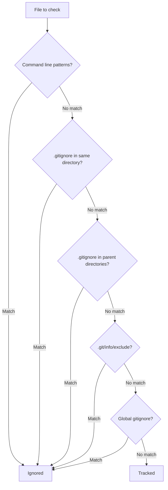

# How to Configure Git Ignore Patterns

Author: [nawazdhandala](https://www.github.com/nawazdhandala)

Tags: Git, Version Control, Configuration, DevOps, Best Practices, Gitignore

Description: Learn how to configure .gitignore patterns to exclude files from version control including syntax, common patterns, and troubleshooting.

---

Git ignore patterns tell Git which files and directories to exclude from version control. Properly configured ignore rules keep your repository clean by excluding build artifacts, dependencies, IDE settings, and sensitive files like credentials. This guide covers the syntax, common patterns, and troubleshooting techniques for .gitignore files.

## How Git Ignore Works

Git checks ignore rules from multiple sources in this order:



Later rules can override earlier ones, and more specific paths take precedence.

## Basic Syntax

Create a `.gitignore` file in your repository root:

```bash
# Create .gitignore file
touch .gitignore
```

**Basic patterns:**

```gitignore
# Ignore a specific file
config.local.json

# Ignore all files with an extension
*.log
*.tmp

# Ignore a directory (trailing slash)
node_modules/
dist/
build/

# Ignore files in any directory with this name
**/cache/

# Ignore files only in root directory
/TODO.txt

# Ignore files in a specific subdirectory
docs/*.pdf
```

**Pattern syntax explained:**

| Pattern | Description |
|---------|-------------|
| `file.txt` | Ignore file.txt anywhere |
| `/file.txt` | Ignore file.txt only in root |
| `dir/` | Ignore directory named dir |
| `*.log` | Ignore all .log files |
| `**/logs` | Ignore logs directory anywhere |
| `**/logs/*.log` | Ignore .log files inside any logs directory |
| `!important.log` | Do not ignore this file (negation) |

## Wildcard Patterns

Git supports several wildcard characters:

```gitignore
# Single asterisk matches within directory
# Matches: log.txt, debug.log, but NOT logs/error.txt
*.txt

# Double asterisk matches across directories
# Matches: a/b/c/file.txt, file.txt, x/file.txt
**/*.txt

# Question mark matches single character
# Matches: file1.txt, file2.txt, but NOT file10.txt
file?.txt

# Square brackets match character sets
# Matches: file1.txt, file2.txt, file3.txt
file[123].txt

# Range of characters
# Matches: filea.txt through filez.txt
file[a-z].txt

# Negation in character class
# Matches anything except file1.txt, file2.txt, file3.txt
file[!123].txt
```

## Negation Patterns

Use exclamation mark to exclude files from being ignored:

```gitignore
# Ignore all log files
*.log

# But keep important.log
!important.log

# Ignore the logs directory
logs/

# But this will NOT work because parent is ignored
!logs/keep-this.log

# To keep files in an ignored directory, do this instead:
logs/*
!logs/keep-this.log
!logs/.gitkeep
```

**Important rule:** You cannot negate a file inside an ignored directory. Ignore the contents instead of the directory.

## Common Patterns by Language

**Node.js / JavaScript:**

```gitignore
# Dependencies
node_modules/
bower_components/

# Build output
dist/
build/
out/

# Environment and secrets
.env
.env.local
.env.*.local

# Logs
npm-debug.log*
yarn-error.log*

# IDE
.idea/
.vscode/
*.swp
*.swo

# OS files
.DS_Store
Thumbs.db

# Test coverage
coverage/
.nyc_output/
```

**Python:**

```gitignore
# Byte-compiled files
__pycache__/
*.py[cod]
*$py.class

# Virtual environments
venv/
env/
.venv/

# Distribution
dist/
build/
*.egg-info/

# IDE
.idea/
.vscode/
*.swp

# Testing
.pytest_cache/
.coverage
htmlcov/

# Environment
.env
*.env
```

**Go:**

```gitignore
# Binaries
*.exe
*.exe~
*.dll
*.so
*.dylib

# Test binary
*.test

# Output
/bin/
/vendor/

# IDE
.idea/
.vscode/

# Go workspace
go.work
```

**Java / Kotlin:**

```gitignore
# Compiled class files
*.class

# Build directories
target/
build/
out/

# IDE
.idea/
*.iml
.gradle/
.settings/
.project
.classpath

# Package files
*.jar
*.war
*.ear

# Logs
*.log
```

## Directory-Specific Gitignore

You can have .gitignore files in subdirectories:

```
project/
├── .gitignore           # Root patterns
├── src/
│   └── .gitignore       # Patterns for src/ only
├── tests/
│   └── .gitignore       # Patterns for tests/ only
└── docs/
    └── .gitignore       # Patterns for docs/ only
```

Patterns in subdirectory .gitignore files apply relative to that directory:

```gitignore
# In tests/.gitignore
# Ignores tests/fixtures/*.json, not src/fixtures/*.json
fixtures/*.json
```

## Global Gitignore

Set up a global gitignore for patterns that apply to all your repositories:

```bash
# Create global gitignore file
touch ~/.gitignore_global

# Configure Git to use it
git config --global core.excludesfile ~/.gitignore_global
```

**Good candidates for global gitignore:**

```gitignore
# Operating system files
.DS_Store
.DS_Store?
._*
.Spotlight-V100
.Trashes
Thumbs.db
ehthumbs.db
Desktop.ini

# IDE and editor files
.idea/
.vscode/
*.swp
*.swo
*~
*.sublime-workspace

# Temporary files
*.tmp
*.temp
*.bak
```

## Repository-Specific Excludes

For patterns you do not want to commit but only apply locally:

```bash
# Edit the local exclude file (not committed)
vim .git/info/exclude
```

Add patterns here that are specific to your setup but should not affect other developers.

## Checking If a File Is Ignored

Use `git check-ignore` to debug ignore patterns:

```bash
# Check if a file is ignored
git check-ignore -v myfile.txt

# Output shows which rule ignores the file
.gitignore:3:*.txt    myfile.txt

# Check multiple files
git check-ignore -v file1.txt file2.log config.json

# Check why a file is NOT ignored (verbose)
git check-ignore -v --no-index file.txt
```

List all ignored files:

```bash
# Show all ignored files in working directory
git status --ignored

# Show ignored files including in subdirectories
git status --ignored --untracked-files=all

# List just the ignored files
git ls-files --ignored --exclude-standard
```

## Ignoring Previously Tracked Files

If a file was already committed before adding it to .gitignore:

```bash
# Remove from tracking but keep the file locally
git rm --cached filename.txt

# Remove entire directory from tracking
git rm -r --cached directory/

# Commit the removal
git commit -m "Stop tracking filename.txt"
```

For sensitive files that were accidentally committed:

```bash
# Remove file from entire history (use with caution)
git filter-branch --force --index-filter \
  "git rm --cached --ignore-unmatch path/to/secret.txt" \
  --prune-empty --tag-name-filter cat -- --all

# Or use the newer git-filter-repo tool
pip install git-filter-repo
git filter-repo --invert-paths --path path/to/secret.txt
```

## Pattern Debugging

When patterns do not work as expected:

```bash
# Test pattern matching
git check-ignore -v path/to/file

# Common issues:

# 1. Pattern has trailing whitespace
*.log   # <- invisible space at end

# 2. Using wrong slash direction (Windows)
path\to\file  # Wrong
path/to/file  # Correct (Git always uses forward slash)

# 3. Negation after parent directory ignored
build/
!build/important.txt  # This will NOT work

# Fix: Ignore contents, not directory
build/*
!build/important.txt  # This works
```

## Template Gitignore Files

Start with templates from gitignore.io or GitHub:

```bash
# Generate gitignore for your stack
curl -sL https://www.toptal.com/developers/gitignore/api/node,react,visualstudiocode > .gitignore

# Or use the gi command line tool
# Install: npm install -g gitignore
gi node,react,vscode > .gitignore
```

GitHub maintains templates: https://github.com/github/gitignore

## Best Practices

**1. Commit .gitignore early:**

```bash
# First commit should include .gitignore
git add .gitignore
git commit -m "Add gitignore configuration"
```

**2. Keep environment files out:**

```gitignore
# Never commit credentials
.env
.env.*
!.env.example

# Create a template for developers
# .env.example contains placeholder values
```

**3. Ignore build outputs:**

```gitignore
# Generated files should not be in version control
dist/
build/
*.min.js
*.min.css
```

**4. Document unusual patterns:**

```gitignore
# Ignore local development database
*.sqlite

# Keep this specific config for CI (override above)
!ci-config.sqlite

# Temporary upload directory (handled by separate backup)
uploads/temp/
```

**5. Review ignored files periodically:**

```bash
# List what is being ignored
git status --ignored

# Make sure important files are not accidentally ignored
```

Git ignore patterns are simple in concept but powerful in practice. Start with a template for your tech stack, add project-specific patterns as needed, and use the debugging tools when something is not working as expected.
