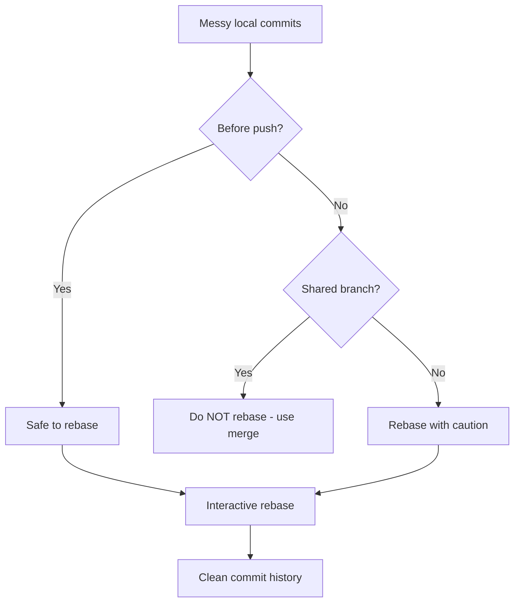
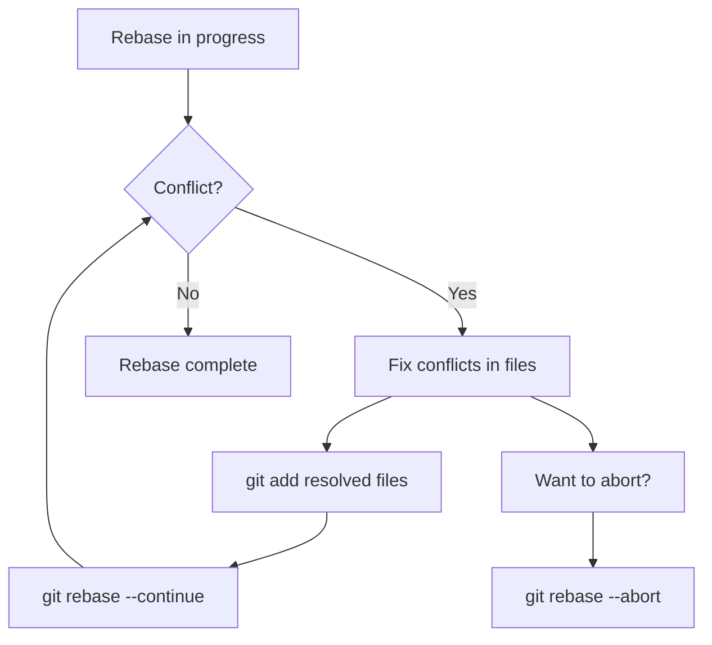

# How to Handle Git Interactive Rebase

Author: [nawazdhandala](https://www.github.com/nawazdhandala)

Tags: Git, Interactive Rebase, Version Control, DevOps, Git History, Code Review

Description: Master Git interactive rebase to clean up commit history, squash commits, reorder changes, and maintain a professional Git log before merging.

---

Interactive rebase is one of Git's most powerful features for crafting clean, meaningful commit history. Instead of merging a messy sequence of "WIP" and "fix typo" commits, you can reshape them into logical, reviewable units. This guide covers everything from basic squashing to advanced history editing.

## When to Use Interactive Rebase



Use interactive rebase when:
- Cleaning up commits before opening a pull request
- Combining multiple small commits into logical units
- Fixing commit messages
- Reordering commits
- Removing accidental commits

Never rebase commits that others have based work on. This rewrites history and causes problems for collaborators.

## Basic Interactive Rebase

### Starting a Rebase

```bash
# Rebase the last N commits
git rebase -i HEAD~5

# Rebase onto a specific branch
git rebase -i main

# Rebase onto a specific commit
git rebase -i abc1234
```

This opens your editor with a list of commits:

```
pick abc1234 Add user model
pick def5678 Add user controller
pick ghi9012 Fix typo in model
pick jkl3456 WIP: more controller work
pick mno7890 Complete user feature

# Rebase abc1234..mno7890 onto xyz0000 (5 commands)
#
# Commands:
# p, pick   = use commit
# r, reword = use commit, but edit the commit message
# e, edit   = use commit, but stop for amending
# s, squash = use commit, but meld into previous commit
# f, fixup  = like "squash", but discard this commit's log message
# d, drop   = remove commit
# x, exec   = run command (the rest of the line) using shell
```

### The Rebase Commands

| Command | Short | Purpose |
|---------|-------|---------|
| pick | p | Keep the commit as-is |
| reword | r | Keep commit, edit message |
| edit | e | Pause to modify commit |
| squash | s | Combine with previous, keep message |
| fixup | f | Combine with previous, discard message |
| drop | d | Delete the commit entirely |
| exec | x | Run a shell command |

## Common Rebase Operations

### Squashing Commits

Combine multiple commits into one:

```bash
git rebase -i HEAD~4
```

Change the file from:
```
pick abc1234 Add login feature
pick def5678 Fix login bug
pick ghi9012 Fix another login bug
pick jkl3456 Add login tests
```

To:
```
pick abc1234 Add login feature
fixup def5678 Fix login bug
fixup ghi9012 Fix another login bug
squash jkl3456 Add login tests
```

Result: Two commits. The bug fixes are absorbed into the first commit. The test commit is squashed but you can edit the combined message.

### Reordering Commits

Simply change the order of lines:

```
pick ghi9012 Add tests        # Moved up
pick abc1234 Add feature
pick def5678 Update docs
```

**Note**: Reordering can cause conflicts if commits depend on each other.

### Editing Commit Messages

Use `reword` to change a message:

```
pick abc1234 Add user feture
reword def5678 Fix teh bug
pick ghi9012 Update docs
```

Git will pause after each `reword` commit and open your editor.

### Splitting a Commit

Use `edit` to split one commit into multiple:

```
edit abc1234 Add feature and tests and docs
pick def5678 Other work
```

When Git pauses at the commit:

```bash
# Undo the commit but keep changes staged
git reset HEAD^

# Now stage and commit separately
git add src/feature.js
git commit -m "Add feature implementation"

git add tests/feature.test.js
git commit -m "Add feature tests"

git add docs/feature.md
git commit -m "Add feature documentation"

# Continue the rebase
git rebase --continue
```

### Dropping Commits

Remove commits entirely:

```
pick abc1234 Good commit
drop def5678 Accidental commit
pick ghi9012 Another good commit
```

Or simply delete the line for the same effect.

## Handling Conflicts During Rebase



When conflicts occur:

```bash
# See which files have conflicts
git status

# Fix conflicts in each file, then:
git add <fixed-file>

# Continue to next commit
git rebase --continue

# Or abort and return to original state
git rebase --abort

# Skip this commit and continue
git rebase --skip
```

## Advanced Techniques

### Autosquash for Fixup Commits

Create commits intended to be squashed later:

```bash
# Create a fixup commit
git commit --fixup=abc1234

# Create a squash commit
git commit --squash=abc1234

# Later, automatically arrange them
git rebase -i --autosquash main
```

The commits will be automatically positioned and marked:

```
pick abc1234 Original commit
fixup def5678 fixup! Original commit
```

### Exec for Running Commands

Run commands between commits:

```
pick abc1234 Add feature
exec npm test
pick def5678 Add another feature
exec npm test
```

Or run tests after every commit:

```bash
git rebase -i --exec "npm test" main
```

### Rebase Onto

Move a branch to a different base:

```bash
# Current situation:
# main:    A--B--C
# feature:      \--D--E--F (based on B)
#
# Goal: Rebase feature onto C

git rebase --onto main B feature

# Result:
# main:    A--B--C
# feature:        \--D'--E'--F'
```

### Preserve Merge Commits

By default, rebase flattens merge commits. To keep them:

```bash
git rebase -i --rebase-merges main
```

## Workflow Example: Cleaning Up Before PR

Here is a realistic workflow:

```bash
# You have these commits on your feature branch:
git log --oneline main..HEAD
# f7e8d9c WIP
# a1b2c3d Fix tests
# e5f6g7h Add validation
# i9j0k1l WIP: start validation
# m2n3o4p Initial feature implementation

# Start interactive rebase
git rebase -i main
```

Edit the todo list:

```
pick m2n3o4p Initial feature implementation
squash i9j0k1l WIP: start validation
squash e5f6g7h Add validation
fixup a1b2c3d Fix tests
fixup f7e8d9c WIP

# This combines everything into one commit
```

Or create logical groupings:

```
pick m2n3o4p Initial feature implementation
fixup f7e8d9c WIP

reword i9j0k1l WIP: start validation
squash e5f6g7h Add validation
fixup a1b2c3d Fix tests
```

Write meaningful commit messages when prompted:

```
Add user input validation

- Validate email format
- Check password strength
- Add server-side validation
- Include unit tests for all validators
```

## Configuration Options

### Set Default Editor

```bash
# Use VS Code
git config --global core.editor "code --wait"

# Use vim
git config --global core.editor "vim"

# Use nano
git config --global core.editor "nano"
```

### Enable Autosquash by Default

```bash
git config --global rebase.autosquash true
```

### Helpful Aliases

```bash
# Interactive rebase shortcuts
git config --global alias.ri "rebase -i"
git config --global alias.rim "rebase -i main"
git config --global alias.rc "rebase --continue"
git config --global alias.ra "rebase --abort"

# Usage
git ri HEAD~5
git rim
git rc
```

## Common Mistakes and Recovery

### Accidentally Completed Wrong Rebase

```bash
# Find the original HEAD before rebase
git reflog
# abc1234 HEAD@{2}: rebase (start): checkout main
# def5678 HEAD@{3}: commit: Last commit before rebase  <- This one

# Reset to before the rebase
git reset --hard def5678
```

### Lost Commits

```bash
# All commits are recoverable via reflog
git reflog

# Find and restore lost commit
git cherry-pick <lost-commit-hash>
```

### Pushed Then Rebased

If you rebased after pushing:

```bash
# Force push (ONLY if no one else uses this branch)
git push --force-with-lease origin feature

# --force-with-lease is safer than --force
# It fails if someone else pushed to the branch
```

## Best Practices

1. **Rebase before pushing** - Never rebase shared commits
2. **Use meaningful messages** - The final commit messages matter
3. **Keep logical commits** - One concept per commit
4. **Test after rebasing** - Conflicts can introduce bugs
5. **Use `--force-with-lease`** - Safer than `--force`
6. **Create backup branches** - `git branch backup-feature` before complex rebases

## Quick Reference

| Task | Command |
|------|---------|
| Rebase last N commits | `git rebase -i HEAD~N` |
| Rebase onto branch | `git rebase -i main` |
| Continue after conflict | `git rebase --continue` |
| Abort rebase | `git rebase --abort` |
| Skip current commit | `git rebase --skip` |
| Create fixup commit | `git commit --fixup=<hash>` |
| Auto-arrange fixups | `git rebase -i --autosquash` |
| Force push safely | `git push --force-with-lease` |

---

Interactive rebase transforms chaotic development history into clean, logical commits. Use it to squash WIP commits, fix typos in messages, and reorder work before sharing with your team. The key rule is simple: only rebase commits that have not been pushed to shared branches. With practice, interactive rebase becomes an essential part of maintaining a professional Git history.
